# SwordOf

## 栈和队列

### [剑指 Offer 09. 用两个栈实现队列](https://leetcode-cn.com/problems/yong-liang-ge-zhan-shi-xian-dui-lie-lcof/)

````text
用两个栈实现一个队列。队列的声明如下，请实现它的两个函数 appendTail 和 deleteHead ，分别完成在队列尾部插入整数和在队列头部删除整数的功能。(若队列中没有元素，deleteHead 操作返回 -1 )


示例 1：


输入：
["CQueue","appendTail","deleteHead","deleteHead"]
[[],[3],[],[]]
输出：[null,null,3,-1]

````

````java
package SwordOf.stackAndQueue;

import java.util.Deque;
import java.util.LinkedList;

public class CQueue {
    Deque<Integer> inStack;
    Deque<Integer> outStack;

    public CQueue() {
        inStack = new LinkedList<Integer>();
        outStack = new LinkedList<Integer>();
    }

    public void appendTail(int value) {
       inStack.push(value);

    }

    public int deleteHead() {
        if(inStack.isEmpty() && outStack.isEmpty()) return -1;

        if (outStack.isEmpty()) {
            while (!inStack.isEmpty()) {
                int val = inStack.pop();
                outStack.push(val);
            }
        }
        return  outStack.pop();
    }
}

/**
 * Your CQueue object will be instantiated and called as such:
 * CQueue obj = new CQueue();
 * obj.appendTail(value);
 * int param_2 = obj.deleteHead();
 */
````

**复杂度**

- **时间复杂度是：$O(1)$**，插入显然是, 对于删除队尾的操作，也是O（1）.**每个元素只需要进入，弹出栈2一次，均摊分析可证**


### [剑指 Offer 30. 包含min函数的栈](https://leetcode-cn.com/problems/bao-han-minhan-shu-de-zhan-lcof/)

````text
定义栈的数据结构，请在该类型中实现一个能够得到栈的最小元素的 min 函数在该栈中，调用 min、push 及 pop 的时间复杂度都是 O(1)。

示例:

MinStack minStack = new MinStack();
minStack.push(-2);
minStack.push(0);
minStack.push(-3);
minStack.min();   --> 返回 -3.
minStack.pop();
minStack.top();      --> 返回 0.
minStack.min();   --> 返回 -2.
 
提示：

各函数的调用总次数不超过 20000 次

````

**思路**

- 用一个辅助栈，存储当前对应于栈的最小元素即可。可见，在栈的题目中，辅助栈经常用

````java
package SwordOf.stackAndQueue;

import java.util.Deque;
import java.util.LinkedList;
import java.util.Stack;

public class MinStack {
    /**
     * initialize your data structure here.
     */
    Deque<Integer> stack;
    Deque<Integer> minStack;

    public MinStack() {
        stack = new LinkedList<Integer>();
        minStack = new LinkedList<Integer>();
    }

    public void push(int x) {
        stack.push(x);
        if(minStack.isEmpty()) minStack.push(x);
        else{
            int com = minStack.peek();
            int val = stack.peek();
            minStack.push(val < com? val: com);
        }
    }

    public void pop() {
        if(!stack.isEmpty()){
            stack.pop();
            minStack.pop();
        }
    }

    public int top() {
        return stack.peek();
    }

    public int min() {

        return minStack.peek();

    }
}
/**
 * Your MinStack object will be instantiated and called as such:
 * MinStack obj = new MinStack();
 * obj.push(x);
 * obj.pop();
 * int param_3 = obj.top();
 * int param_4 = obj.min();
 */

//更高效--辅助栈并不用每次都压，也不用每次都弹
class MinStack {
    Stack<Integer> A, B;
    public MinStack() {
        A = new Stack<>();
        B = new Stack<>();
    }
    public void push(int x) {
        A.add(x);
        if(B.empty() || B.peek() >= x)
            B.add(x);
    }
    public void pop() {
        if(A.pop().equals(B.peek()))
            B.pop();
    }
    public int top() {
        return A.peek();
    }
    public int min() {
        return B.peek();
    }
}


````


### *[剑指 Offer 59 - I. 滑动窗口的最大值（单调队列！）](https://leetcode-cn.com/problems/hua-dong-chuang-kou-de-zui-da-zhi-lcof/)

- 我的解  每次建个k大小的堆          
- $O(n)时间复杂度解法$：
  - 滑动窗口就像一个队列，我们维护以下性质，满足设计的队列是一个滑动窗口的“映射”：1 队列存储的是元素对应在nums数组的下标。且队列最左边对应的元素的值是元素中最大的。2 队列中的元素的值（下标），从小到大。所以这是一个单调队列，它的值是递增的，它的值（指下标）对应的数组元素的值的递减的。
  - 为什么要维护这样一个滑动窗口的映射队列：
    - 滑动窗口每次新进入一个元素。如果两个元素都在滑动窗口内，前面的元素倘若小于后面的元素，那么滑动窗口内的最大的元素永远是后面的那一个，所以小的元素可以永久的删除（从对尾出队）。如果新的元素比队尾元素小，那么需要保留，因为前面的元素在数组左边可能先出队，新元素有可能成为窗口内的最大元素。 所以 为了保持队列的性质，**需要不断地将新的元素与队尾的元素相比较，如果前者大于等于后者，那么队尾的元素就可以被永久地移除，我们将其弹出队列。我们需要不断地进行此项操作，直到队列为空或者新的元素小于队尾的元素**。
  - 单调队列都有一个重要性质：**当一个元素进入队列的时候，它前面所有比它小的元素就不会再对答案产生影响。**
  - 基于上述分析，需要使用的数据结构是双端队列。

````java
public int[] maxSlidingWindow(int[] nums, int k) {
        if (nums.length == 0 || nums == null) return new int[0];
        if (k == 1) return nums;

        int[] res = new int[nums.length-k+1];
        Deque<Integer> deque = new LinkedList<Integer>();
        for(int i=0;i<k;i++){
            while(!deque.isEmpty() && nums[i]>nums[deque.peekLast()]) deque.pollLast();
            deque.offerLast(i);
        }
        res[0] = nums[deque.peekFirst()];
        for(int i=k;i<nums.length;i++){
            while(!deque.isEmpty() && nums[i]>nums[deque.peekLast()]) deque.pollLast();
            deque.offerLast(i);

            while(i-deque.peekFirst()+1>k) deque.pollFirst();

            res[i-k+1] = nums[deque.peekFirst()];
        }
        return res;

    }
````

### *[剑指 Offer 59 - II. 队列的最大值](https://leetcode-cn.com/problems/dui-lie-de-zui-da-zhi-lcof/)

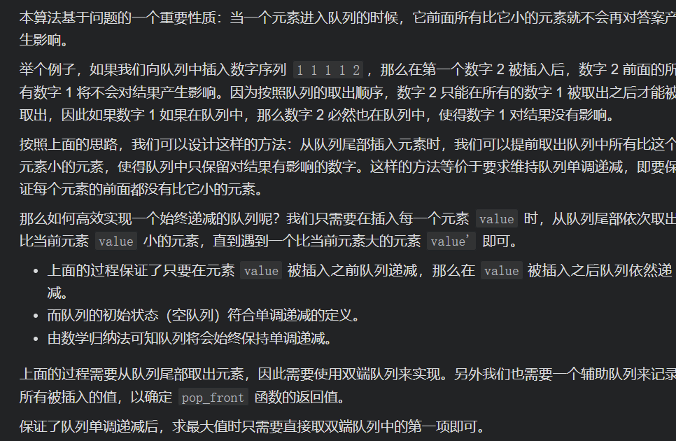

````java
class MaxQueue {
    private Queue<Integer> queue ;
    private Deque<Integer> deque ;


    public MaxQueue() {
        queue = new LinkedList<>();
        deque = new LinkedList<>();
    }
    
    public int max_value() {
        if(!deque.isEmpty()) return deque.peekFirst();
        else return -1;
    }
    
    public void push_back(int value) {
        while(!deque.isEmpty() && value > deque.peekLast()) deque.pollLast();
        deque.offerLast(value);

        queue.offer(value);
    }
    
    public int pop_front() {
        if(!queue.isEmpty()){
            int ans = queue.poll();
            if(ans == deque.peekFirst()) deque.pollFirst();
            return ans;
        }else return -1;
    }
}

/**
 * Your MaxQueue object will be instantiated and called as such:
 * MaxQueue obj = new MaxQueue();
 * int param_1 = obj.max_value();
 * obj.push_back(value);
 * int param_3 = obj.pop_front();
 */
````

### 小结-单调队列

- 主要理解单调队列的思想和实现方式
- 以及应用：实现最大值队列、求滑动窗口最大值
- java队列的使用


## 链表

### [剑指 Offer 06. 从尾到头打印链表](https://leetcode-cn.com/problems/cong-wei-dao-tou-da-yin-lian-biao-lcof/)

````text
输入一个链表的头节点，从尾到头反过来返回每个节点的值（用数组返回）。


示例 1：

输入：head = [1,3,2]
输出：[2,3,1]
 
````

**思路**

- 最直接是用一个栈
- 我的解法是建一个反转链表，都可以

````java
package SwordOf.list;

import SwordOf.domain.ListNode;

import java.util.ArrayList;
import java.util.List;

/**其实用栈就好*/
public class reversePrint {
    public int[] reversePrint(ListNode head) {
        if (head == null) return new int[0];

        ListNode scan = head;
        ListNode reverseHead = new ListNode(-1);

        /*尾插法得到新的反转链表*/
        int len = 0;
        while (scan != null) {
            ListNode node = new ListNode(scan.val);
            node.next = reverseHead.next;
            reverseHead.next = node;
            scan = scan.next;
            len++;
        }
        int[] res = new int[len];
        scan = reverseHead.next;
        for (int i = 0; i < len; i++) {
            if (scan != null) {
                res[i] = scan.val;
                scan = scan.next;
            }
        }
        return res;
    }
}

````


### [剑指 Offer 24. 反转链表](https://leetcode-cn.com/problems/fan-zhuan-lian-biao-lcof/)

````text
定义一个函数，输入一个链表的头节点，反转该链表并输出反转后链表的头节点。

 

示例:

输入: 1->2->3->4->5->NULL
输出: 5->4->3->2->1->NULL
 

限制：

0 <= 节点个数 <= 5000

````

**思路**

- 反转链表的解法如上一题，这里直接在原链表反转即可
- **注意递归解法**-从后往前一个个改
  - 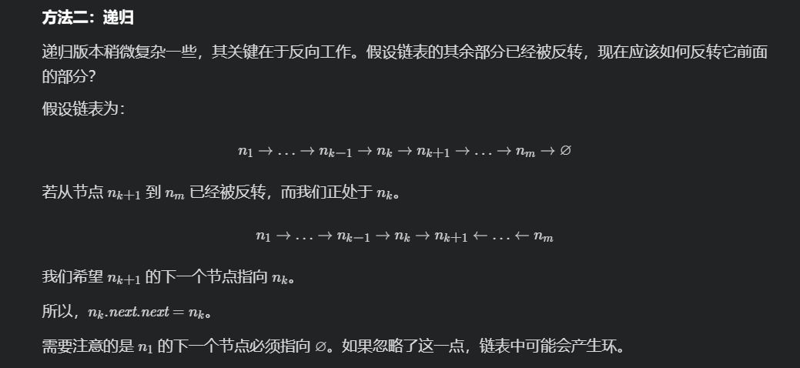
  - 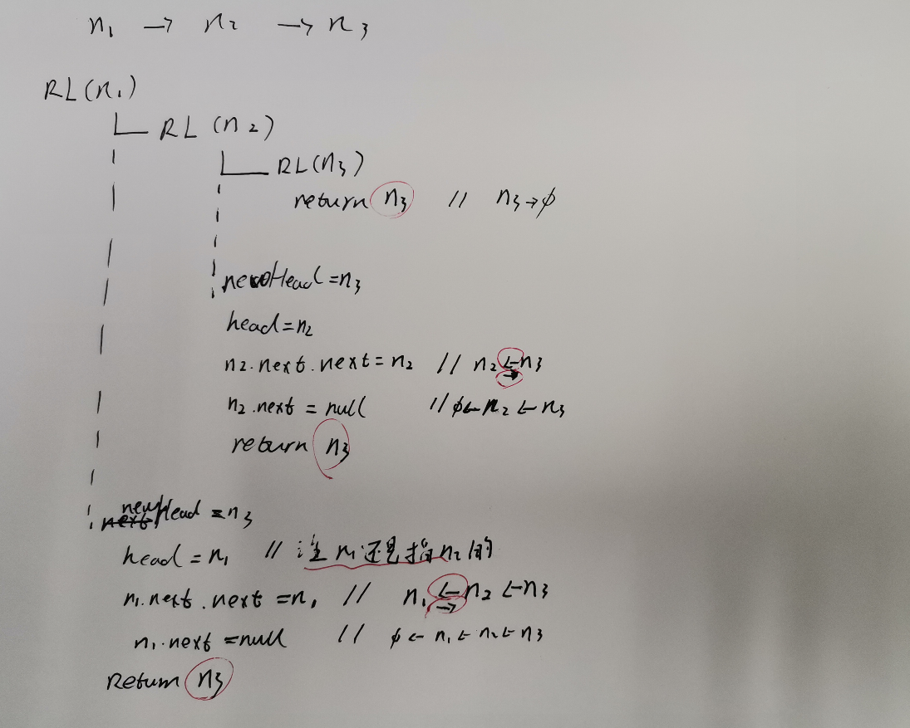

````java
package SwordOf.list;

import SwordOf.domain.ListNode;

public class reverseListSo {
    /**在原来链表的基础上反转就可以了*/
    public ListNode reverseList(ListNode head) {
        ListNode reverseHead = new ListNode(0);
        ListNode scan = head;

        if(head == null) return head;

        while(scan != null){
            ListNode next = scan.next;
            scan.next = reverseHead.next;
            reverseHead.next = scan;
            scan = next;
        }
        return reverseHead.next;

    }
}


/**迭代第二次*/
class Solution {
    //迭代做法，每个都摘下来，以头插的形式插入到新的链表中；
    public ListNode reverseList(ListNode head) {
        if(head == null || head.next == null) return head;

        ListNode scan = head.next;
        ListNode newHead = head;
        newHead.next = null;
        while(scan.next !=null){
             ListNode tem = scan.next;
             scan.next = newHead;
             newHead = scan;
             scan = tem;
        }
        scan.next  = newHead;
        return scan;

    }
    
}

//递归第一次
package SwordOf.list;

import SwordOf.domain.ListNode;
/**递归方法反转链表*/
public class reverseListRecursionSo {

    public ListNode reverseList(ListNode head) {
       if(head ==null || head.next ==null) return head;

       ListNode newHead = reverseList(head.next);
       head.next.next = head; //修改方向
       head.next = null;//为了避免成环；不用担心丢失连接信息；对于前面原序的链表，前面node的next还指向该head

        return  newHead;

    }
}


/**递归做法第二次*/
class Solution {
    ListNode newHead;
    public ListNode reverseList(ListNode head) {
        if(head ==null || head.next == null) return head;
        recurReverse(head,head.next);
        head.next = null;
        return newHead;
    
    }
    public void recurReverse(ListNode pre,ListNode cur){
        if(cur.next !=null){
            recurReverse(cur,cur.next);
            cur.next = pre;

        }else{
            newHead = cur;
            cur.next = pre;
        }
    }
}
````

### *[剑指 Offer 35. 复杂链表的复制](https://leetcode-cn.com/problems/fu-za-lian-biao-de-fu-zhi-lcof/)

````text
请实现 copyRandomList 函数，复制一个复杂链表。在复杂链表中，每个节点除了有一个 next 指针指向下一个节点，还有一个 random 指针指向链表中的任意节点或者 null。

来源：力扣（LeetCode）
链接：https://leetcode-cn.com/problems/fu-za-lian-biao-de-fu-zhi-lcof
著作权归领扣网络所有。商业转载请联系官方授权，非商业转载请注明出处。
````

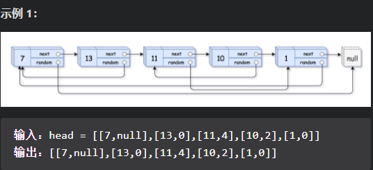


题目的关键是如何copy random指针，因为random指针是随机的

- 我的解法，两个HashMap<Node,id> Hash<id,Node>来维护这个关系，$O(n),O(n)$ ,比较常规的思路
  - 等价于HashMap<Node,Node>，搞复杂了
- 参考解1：显然适合用回溯（递归）做，到最深处时，所有的结点都已经被复制出来的；整个过程，将next节点和random节点的拷贝操作相互独立。用hashmap<Node,Node>维护原节点和copy节点的关系；$O(n),O()$
- 参考解2：巧妙的解法$O(n),O(1)$
  - 参考解1需要使用哈希表记录每一个节点对应新节点的创建情况，可以使用一个小技巧来省去哈希表的空间

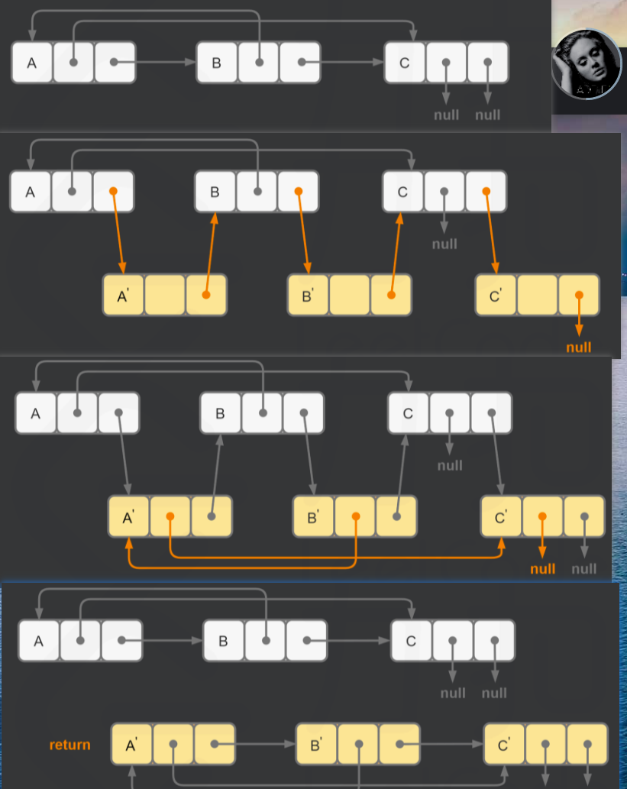

````java
package SwordOf.list;

import SwordOf.domain.Node;
import org.junit.Test;

import java.util.HashMap;

/*public class Node {
    int val;
    SwordOf.domain.Node next;
    SwordOf.domain.Node random;

    public Node(int val) {
        this.val = val;
        this.next = null;
        this.random = null;
    }

}*/

public class RopyRandomList {
    public Node copyRandomList(Node head) {

        Node scan1 = head;
        Node copyDumpHead = new Node(-1);
        Node scan2 = copyDumpHead;
        HashMap<Node, Integer> nodeMap1 = new HashMap<>();
        HashMap<Integer, Node> nodeMap2 = new HashMap<>();
        int id = 0;
        nodeMap1.put(null,id);//<null,0>的情况
        nodeMap2.put(id,null);
        while (scan1 != null) {
            id++;
            nodeMap1.put(scan1,id);
            Node newNode = new Node(scan1.val);
            scan1 = scan1.next;
            scan2.next = newNode;
            scan2 = scan2.next;
            nodeMap2.put(id,scan2);
        }
        scan1 = head;
        scan2 = copyDumpHead.next;
        while(scan1!=null){
            Node randomNodeInList1 = scan1.random;
            int randomId = nodeMap1.get(randomNodeInList1);
            Node randomNodeInCopyList = nodeMap2.get(randomId);
            scan2.random = randomNodeInCopyList;
            scan1 = scan1.next;
            scan2 = scan2.next;
        }
        return copyDumpHead.next;
    }


    /*[[7,null],[13,0],[11,4],[10,2],[1,0]]*/
    @Test
    public void test(){
        Node node1 = new Node(7);
        Node node2 = new Node(13);
        Node node3 = new Node(11);
        Node node4 = new Node(10);
        Node node5 = new Node(1);
        /*---*/
        node1.next = node2;node1.random = null;
        node2.next = node3;node2.random = node1;
        node3.next = node4;node3.random = node5;
        node4.next = node5;node4.random = node3;
        node5.next = null;node5.random = node1;

        Node copy = copyRandomList(node1);
        System.out.println("--");

    }
}

class Solution {
    Map<Node, Node> cachedNode = new HashMap<Node, Node>();

    public Node copyRandomList(Node head) {
        if (head == null) {
            return null;
        }
        if (!cachedNode.containsKey(head)) {
            Node headNew = new Node(head.val);
            cachedNode.put(head, headNew);
            headNew.next = copyRandomList(head.next);
            headNew.random = copyRandomList(head.random);
        }
        return cachedNode.get(head);
    }
}

作者：LeetCode-Solution
链接：https://leetcode-cn.com/problems/fu-za-lian-biao-de-fu-zhi-lcof/solution/fu-za-lian-biao-de-fu-zhi-by-leetcode-so-9ik5/
来源：力扣（LeetCode）
著作权归作者所有。商业转载请联系作者获得授权，非商业转载请注明出处。
    
    class Solution {
    public Node copyRandomList(Node head) {
        if (head == null) {
            return null;
        }
        for (Node node = head; node != null; node = node.next.next) {
            Node nodeNew = new Node(node.val);
            nodeNew.next = node.next;
            node.next = nodeNew;
        }
        for (Node node = head; node != null; node = node.next.next) {
            Node nodeNew = node.next;
            nodeNew.random = (node.random != null) ? node.random.next : null;
        }
        Node headNew = head.next;
        for (Node node = head; node != null; node = node.next) {
            Node nodeNew = node.next;
            node.next = node.next.next;
            nodeNew.next = (nodeNew.next != null) ? nodeNew.next.next : null;
        }
        return headNew;
    }
}

作者：LeetCode-Solution
链接：https://leetcode-cn.com/problems/fu-za-lian-biao-de-fu-zhi-lcof/solution/fu-za-lian-biao-de-fu-zhi-by-leetcode-so-9ik5/
来源：力扣（LeetCode）
著作权归作者所有。商业转载请联系作者获得授权，非商业转载请注明出处。
````

````java
/*
// Definition for a Node.
class Node {
    int val;
    Node next;
    Node random;

    public Node(int val) {
        this.val = val;
        this.next = null;
        this.random = null;
    }
}
*/
//用一个HasmMap存每个结点本身<node.val,node>
class Solution {
    public Node copyRandomList(Node head) {
        if(head == null ) return null;
        HashMap<Node,Node> map = new HashMap<>();
        Node scan = head;
        while(scan !=null){
            Node cur = new Node(scan.val);
            map.put(scan,cur);
            scan = scan.next;
        }
        scan = head;
        while(scan!=null){
            Node mapNode = map.get(scan);
            mapNode.next = map.get(scan.next);
            mapNode.random = map.get(scan.random);
            scan = scan.next;
        }
        return map.get(head);

    }
}
````


### [剑指 Offery6 18. 删除链表的节点](https://leetcode-cn.com/problems/shan-chu-lian-biao-de-jie-dian-lcof/)

如果有结点的指针，如何实现$O(1)$的删除？


### [剑指 Offer 22. 链表中倒数第k个节点](https://leetcode-cn.com/problems/lian-biao-zhong-dao-shu-di-kge-jie-dian-lcof/)

- easy done


### *[剑指 Offer 25. 合并两个排序的链表](https://leetcode-cn.com/problems/he-bing-liang-ge-pai-xu-de-lian-biao-lcof/)

````java
package SwordOf.list;

import SwordOf.domain.ListNode;

public class MergeTwoLists {
    /*两条链；当前的比你小，且下一个比你大，才修改*/
    public ListNode mergeTwoLists(ListNode l1, ListNode l2) {
        if(l1 == null) return  l2;
        if(l2 == null) return  l1;

        ListNode newHead;
        if(l1.val <=  l2.val){
            newHead = l1;
            newHead.next = mergeTwoLists(l1.next,l2);
        }else{
            newHead = l2;
            newHead.next = mergeTwoLists(l1,l2.next);
        }
        return newHead;

    }
    /*非递归代码*/
   /* class Solution {
        public ListNode mergeTwoLists(ListNode l1, ListNode l2) {
            ListNode dum = new ListNode(0), cur = dum;
            while(l1 != null && l2 != null) {
                if(l1.val < l2.val) {
                    cur.next = l1;
                    l1 = l1.next;
                }
                else {
                    cur.next = l2;
                    l2 = l2.next;
                }
                cur = cur.next;
            }
            cur.next = l1 != null ? l1 : l2;
            return dum.next;
        }
    }
*/

}

````


### [剑指 Offer 52. 两个链表的第一个公共节点](https://leetcode-cn.com/problems/liang-ge-lian-biao-de-di-yi-ge-gong-gong-jie-dian-lcof/)

- done

## 字符串

### [剑指 Offer 05. 替换空格](https://leetcode-cn.com/problems/ti-huan-kong-ge-lcof/)

````text
请实现一个函数，把字符串 s 中的每个空格替换成"%20"。

示例 1：

输入：s = "We are happy."
输出："We%20are%20happy."

````

**思路**

- 有很多方式
- 题解有一种是：创建一个3倍长的字符数组来逐个复制。

`````java
package SwordOf.String;

import org.junit.Test;

/*请实现一个函数，把字符串 s 中的每个空格替换成"%20"。*/
public class ReplaceSpace {
    public String replaceSpace(String s) {
        StringBuilder sb =  new StringBuilder();
        for(int i =0;i<s.length();i++){
            char ch = s.charAt(i);
            if(ch ==' '){
                sb.append("%20");
            }else sb.append(ch);
        }
        return  sb.toString();
    }

    @Test
    public void test(){
        String str = "we are happy.";
        String s = replaceSpace(str);
        System.out.println(s);
    }
}

`````

### [剑指 Offer 58 - II. 左旋转字符串](https://leetcode-cn.com/problems/zuo-xuan-zhuan-zi-fu-chuan-lcof/)

````text
字符串的左旋转操作是把字符串前面的若干个字符转移到字符串的尾部。请定义一个函数实现字符串左旋转操作的功能。比如，输入字符串"abcdefg"和数字2，该函数将返回左旋转两位得到的结果"cdefgab"。

 

示例 1：

输入: s = "abcdefg", k = 2
输出: "cdefgab"

````

````java
package SwordOf.String;

/**第 n-1个 应该在 s.length-n的位置处*/
public class ReverseLeftWords {
    public String reverseLeftWords(String s, int n) {
        int len = s.length();
        char[] arr = new char[len];
        for(int i =0;i<len;i++){
            if(i<n){
                arr[i+(len-n)] = s.charAt(i);
            }else{
                arr[i-n]=s.charAt(i);
            }
        }
        return new String(arr);
    }
}

class Solution {
    public String reverseLeftWords(String s, int n) {
        String res = "";
        for(int i = n; i < n + s.length(); i++)
            res += s.charAt(i % s.length());
        return res;
    }
}

作者：jyd
链接：https://leetcode-cn.com/problems/zuo-xuan-zhuan-zi-fu-chuan-lcof/solution/mian-shi-ti-58-ii-zuo-xuan-zhuan-zi-fu-chuan-qie-p/
来源：力扣（LeetCode）
著作权归作者所有。商业转载请联系作者获得授权，非商业转载请注明出处。
    
    class Solution {
    public String reverseLeftWords(String s, int n) {
        return s.substring(n, s.length()) + s.substring(0, n);
    }
}

作者：jyd
链接：https://leetcode-cn.com/problems/zuo-xuan-zhuan-zi-fu-chuan-lcof/solution/mian-shi-ti-58-ii-zuo-xuan-zhuan-zi-fu-chuan-qie-p/
来源：力扣（LeetCode）
著作权归作者所有。商业转载请联系作者获得授权，非商业转载请注明出处。
````

## 查找算法

### *[剑指 Offer 03. 数组中重复的数字](https://leetcode-cn.com/problems/shu-zu-zhong-zhong-fu-de-shu-zi-lcof/)

````text
找出数组中重复的数字。


在一个长度为 n 的数组 nums 里的所有数字都在 0～n-1 的范围内。数组中某些数字是重复的，但不知道有几个数字重复了，也不知道每个数字重复了几次。请找出数组中任意一个重复的数字。

示例 1：

输入：
[2, 3, 1, 0, 2, 5, 3]
输出：2 或 3 

````

**思路**

- 我的就是用set ， 空间复杂度是O（1）
- 用循环移位，可以实现O(1)的空间复杂度，需要修改原来数组。一次循环移位流程结束后，会将若干个数归位到正确位置上，后续再访问到该位置时，直接跳过，因此每个位置访问次数最多两次，故时间复杂度$O(n)$

````java
package SwordOf.Array;

import java.util.HashSet;

public class FindRepeatNumber {
    /*循环移位做法*/
    public int findRepeatNumber(int[] nums) {
        int ans = 0;
        for (int i = 0; i < nums.length; i++) {
            if (nums[i] == i) continue;
            else if (nums[nums[i]] == nums[i]) {
                ans = nums[i];
                break;
            } else {
                /*这里必须要用while循环，想想为什么？
                如果目的躺着的不是正确的函数，就一直发送给它;做法是和当前i位置的数交换
                * 终止挑战是 nums[i] = i ; nums[nums[i]] = nums[i]
                * for循环进入下一步*/
                while (nums[nums[i]] != nums[i]) {
                    int changeEle = nums[nums[i]];
                    nums[nums[i]] = nums[i];
                    nums[i] = changeEle;
                }
            }

        }
        return ans;
    }

    /*[2, 3, 1, 0, 2, 5, 3]*/
    /*Out：0 , Correct :2*/
    /*set做法*/
    /*public int findRepeatNumber(int[] nums) {
        HashSet<Integer> set = new HashSet<>();
        for(int e:nums){
            if(set.contains(e)){
                return e;
            }else set.add(e);
        }
    return 0;
    }*/
}

````

### [剑指 Offer 53 - I. 在排序数组中查找数字 I](https://leetcode-cn.com/problems/zai-pai-xu-shu-zu-zhong-cha-zhao-shu-zi-lcof/)

- 普通二分，找到返回，再向两边探增
- 最左或者最右二分，找到一边，再想另一个方向线性探增
- 上面两个思路最坏情况时间复杂度都是 O（n）
- 同时使用最左最右二分，O（1）得出个数， O(logN)
- 最左二分和最右二分的相同点
  - 一样的思想，找到target时，不急着返回
  - 出循环时，都是left = right
- 最左二分和最右二分的不同点
  - while中对于Mid的求解，最右二分要+1;(往右嘛)

所有方法的代码

````java
package SwordOf.Array;

import org.junit.Test;

public class SearchSortCount {
    /*统计一个数字在排序数组中出现的次数。*/

    /*3-方法2在最坏情况还是可能是O（n）
     * 最优解就是 用一次最左二分+一次最右二分*/
    public int search(int[] nums, int target) {
        int leftBound = leftMaxBinarySearch(nums,target);
        int rightBound = rightMaxBinarySearch(nums,target);
        if(leftBound == -1 || rightBound == -1) return 0;
        return rightBound-leftBound+1;
    }

    public int rightMaxBinarySearch(int[] nums, int target) {
        if (nums.length == 0) return -1;
        int left = 0, right = nums.length - 1, mid = -1;
        while (left < right) {
            mid = (left + right) / 2 + 1;//eg， left=3,right=4,nums[3] = target的情况
            if (nums[mid] == target) {
                left = mid;//为了尽可能向右
            } else if (nums[mid] < target) {
                left = mid + 1;
            } else {
                right = mid - 1;
            }
        }
        //不管while有没有进去，这里都符合
        mid = (left + right) / 2;//实际上，nums[left] = nums[right],因为出循环 left =right
        return nums[mid] == target ? mid : -1;

    }

    /*返回index*/
    public int leftMaxBinarySearch(int[] nums, int target) {
        if (nums.length == 0) return -1;
        int left = 0, right = nums.length - 1, mid = 0;
        while (left < right) { //eg， left=3,right=4,nums[3] = target的情况
            mid = (left + right) / 2;
            if (nums[mid] == target) {
                right = mid;//是right = mid ,为了尽可能向左
            } else if (nums[mid] < target) {
                left = mid + 1;
            } else {
                right = mid - 1;
            }
        }
        //不管while有没有进去，这里都符合
        mid = (left + right) / 2;//实际上，nums[left] = nums[right],因为出循环 left =right
        return nums[mid] == target ? mid : -1;//在接收端通过mid是不是-1来判断是否有没有target元素

    }

    /*2-最左二分,修改条件，不要一找到就返回*//*

    public int search(int[] nums, int target) {
        if(nums.length ==0) return 0;

        int left = 0,right = nums.length-1;
        int mid = 0 ;
        while(left<right){
            mid = (left+right)/2;//寻找最左目标，向下取整；寻找最右目标，要向上取整；
            if(target == nums[mid]){
                right = mid;
            }else if(target < nums[mid]){
                right = mid-1;
            }else{
                left = mid+1;
            }
        }
        */
    /*经过while有哪些情况呢？
     * 有target，找到最左元素
     * 有target,但没进入过while，数组只有1个元素时
     * 无target,但没进入过while*//*

        //以上2种可以统一得到mid下班
        mid = (left+right)/2;
        int cou=0;
        while(mid+cou<nums.length &&nums[mid+cou] == target){
            cou++;
        }
        return  cou;

    }
*/

    /*1-基本二分*/
   /* public int search(int[] nums, int target) {
        int left = 0, right = nums.length - 1;
        int index = -1;
        while (left <= right) {
            int mid = (left + right) / 2;

            if (target == nums[mid]) {
                index = mid;
                break;
            } else if (target < nums[mid]) {
                right = mid - 1;
            } else {
                left = mid + 1;
            }
        }

        if(index == -1) return  0 ;//找不到

        int total = 1;
        int stepLen = 1;
        while (index - stepLen >= 0 || index + stepLen < nums.length) {
            if (index + stepLen < nums.length && nums[index + stepLen] == nums[index])
                total++;
            if (index - stepLen >= 0  && nums[index - stepLen] == nums[index])
                total++;

            stepLen++;
        }
        return total;
    }*/

    @Test
    public void test() {
        int[] arr = new int[]{1, 2, 3, 3, 3, 4, 5};
        int res1 = leftMaxBinarySearch(arr, 3);
        System.out.println(res1);
        int res2 = rightMaxBinarySearch(arr, 3);
        System.out.println(res2);
    }
}

````

````java
class Solution {
    //最左二分加最右二分
    public int search(int[] nums, int target) {
        
        if(nums.length==0) return 0 ;
        int r = rightMaxSearch(nums,target,0,nums.length-1);
        int l = leftMaxSearch(nums,target,0,nums.length-1);
        if(r==-1 || l ==-1) return 0 ;
        else return r-l+1;

    }
    public int leftMaxSearch(int[] nums,int target,int start,int end){
        if(start>end) return -1;

        int mid = (start+end)/2;
        if(nums[mid]<target){
            return leftMaxSearch(nums,target,mid+1,end);
        }else if(nums[mid]>target){ //>
            return leftMaxSearch(nums,target,start,mid-1);
        }else{
            int test = leftMaxSearch(nums,target,start,mid-1);
            if( test != -1){
                return test;
            }else{
                return mid;
            }
        }

    }
    public int rightMaxSearch(int[] nums, int target,int start,int end){
        if(start>end) return -1;
 
    
        int mid = (start+end)/2;
        if(nums[mid] < target){
            return rightMaxSearch(nums,target,mid+1,end);
        }else if(nums[mid] > target){
            return rightMaxSearch(nums,target,start,mid-1);   
        }else{
            int test = rightMaxSearch(nums,target,mid+1,end);
             if( test != -1){
                return test;
            }else{
                return mid;
            }
        }


    }
}
````

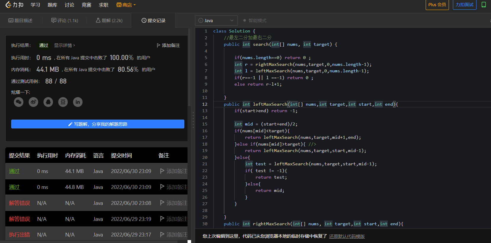

### *[剑指 Offer 53 - II. 0～n-1中缺失的数字](https://leetcode-cn.com/problems/que-shi-de-shu-zi-lcof/)

````text
一个长度为n-1的递增排序数组中的所有数字都是唯一的，并且每个数字都在范围0～n-1之内。在范围0～n-1内的n个数字中有且只有一个数字不在该数组中，请找出这个数字。

 

示例 1:

输入: [0,1,3]
输出: 2

来源：力扣（LeetCode）
链接：https://leetcode-cn.com/problems/que-shi-de-shu-zi-lcof
著作权归领扣网络所有。商业转载请联系官方授权，非商业转载请注明出处。
````

思路

- 我也想到了二分，也想到了通过元素下标与值的关系，不断二分缩小查找区间，但是代码没有一个大佬写的整洁
- 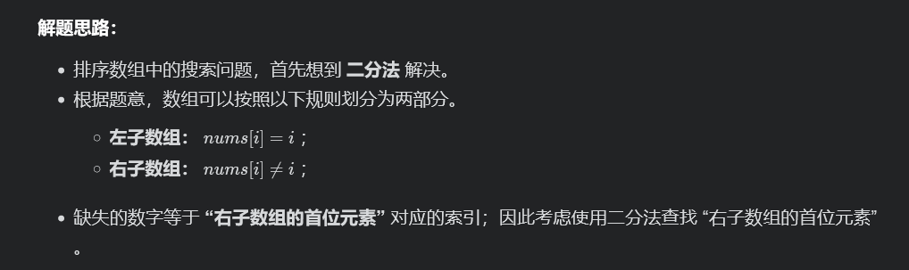

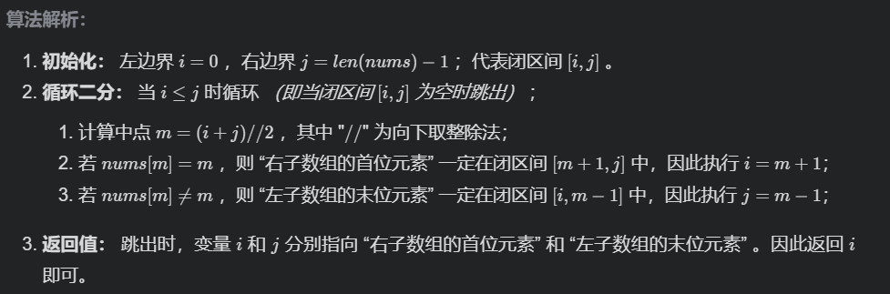

````java
package SwordOf.Search.Array;

public class MissingNumber {
    /*依题意，数组长度至少是1*/
    public int missingNumber(int[] nums) {
        if(nums.length == 1) return nums[0]==0 ? 1 :0;
        int left = 0,right = nums.length-1,mid = 0;
        while(left<=right){
             mid = (left+right)/2;

            if(mid == right && left == nums.length-1){//来到数组最右边，前面都符合 nums[mid] = mid
                return nums[mid]+1;
            }else if(mid == left && right == 0){//来到数组最左边，前面都符合 nums[mid] = mid+1
                return 0;
            }else if(nums[mid]==mid && nums[mid+1]==mid+2){
                break;
            }else if(nums[mid] ==mid && nums[mid+1] == mid+1){
                left = mid+1;
            }
            else{//(nums[mid] == mid+1 && nums[mid+1]==mid+2)
                right = mid;//right = mid 不是 mid+1
            }
        }
         return nums[mid]+1;

    }
}
/*------------------------------------------------------------*/
class Solution {
    public int missingNumber(int[] nums) {
        int i = 0, j = nums.length - 1;
        while(i <= j) {
            int m = (i + j) / 2;
            if(nums[m] == m) i = m + 1;
            else j = m - 1;
        }
        return i;
    }
}
````


### [剑指 Offer 04. 二维数组中的查找](https://leetcode-cn.com/problems/er-wei-shu-zu-zhong-de-cha-zhao-lcof/)

**思路**

- 由于做过，说说一些新的感触
- 这种二维数组搜索利用了二叉排序树的思想，仅仅是思想。为什么这么说呢？二叉排序树左边都是小于当前元素，右边都是大于当前元素。
- 对于二维数组，通过比较每次可以确定一个分叉是不符合的（比如$$matrix[i][j]<target$, 同行右边都不符合）。另外的部分，其实是不确定都是小的。但移动到 $matrix[i-1][j] $时，通过和taget的比较，又可以这样排除掉一行或者一列。


### [剑指 Offer 11. 旋转数组的最小数字](https://leetcode-cn.com/problems/xuan-zhuan-shu-zu-de-zui-xiao-shu-zi-lcof/)

````text
把一个数组最开始的若干个元素搬到数组的末尾，我们称之为数组的旋转。输入一个递增排序的数组的一个旋转，输出旋转数组的最小元素。例如，数组 [3,4,5,1,2] 为 [1,2,3,4,5] 的一个旋转，该数组的最小值为1。  

示例 1：

输入：[3,4,5,1,2]
输出：1
示例 2：

输入：[2,2,2,0,1]
输出：0

来源：力扣（LeetCode）
链接：https://leetcode-cn.com/problems/xuan-zhuan-shu-zu-de-zui-xiao-shu-zi-lcof
著作权归领扣网络所有。商业转载请联系官方授权，非商业转载请注明出处。
````

**思路**

**leetcode的解**

- 更好！下次用leetcode的思路code

**剑指的解**

- 对于排序数组，我们会使用二分查找
- 本题是变形题，也能使用二分查找。**整个数组，是由两个排序子数组组成。而我们要查找的元素，是第二个排序子数组的第一个元素。每次二分判断，可以知道要找的元素，在哪一个半边。**每一次缩小查找范围后，新的范围依旧是由两个有序子数组组成！
- 代码实现要考虑一些特例
  - 旋转0元素，那么整个数组就是一个有序数组
  - 上面讲了，这里二分的思想，是每次判断目标元素在哪一个半边。当遇到[0，1，1，1，1，1]这种数组时，会出现 num[left]= num[right]=num[mid]的情况([1，0，1，1，1] 或者[1，1，1，0，1])。我们无法知道要找的元素在哪一个半边，也因此无法使用二分了。此时就用线性探测。
  - 很细节，上面这种特殊特殊情况的判断，要放在正常二分判断的前面；不然，不就人为的先缩小搜索区间了吗？而我们说了，上面的情况不能确定怎么缩小，所以会得到错误答案。
  - 另外一个小细节，在线性探测时，代码的实现要考虑到数组长度为1的情况。

````java
package SwordOf.Search.Array;

public class minRotateArray {
    public int minArray(int[] numbers) {
        int left = 0,right = numbers.length-1;
        int mid = left;//初始化为left,可以适应特例：当旋转0个元素，即旋转后数组整个有序时的情况；不会进入while循环

        while(numbers[left]>=numbers[right]){

            //这部分放最后面或者最前面都可以。但似乎放最前面，逻辑更清晰
            if(right == left+1){
                mid = right;
                break;
            }

            mid = (left+right)/2;//加一是不对的

            if(numbers[mid] == numbers[left] && numbers[mid]==numbers[right]){//第二个特例，无法确定目标元素是在第一个排序子数组，还是第二个排序子数组中，只能用线性探测了；e.g.原数组[0,1,1,1,1,1]
                /*这么写考虑不到只有一个元素的情况；因为不会进入循环*/
                /*for(int i = left;i<right;i++){
                    if(numbers[i]>numbers[i+1]) return numbers[i+1];
                }*/
                /*这么写*/
                int result = numbers[left];
                for(int i = left;i<right;i++){
                    if(numbers[i]<result) {
                        result = numbers[i];
                        break;
                    }
                }
                return result;
            }
            //这部分必须放在  numbers[mid] == numbers[left] && numbers[mid]==numbers[right] 的情况后面
            if(numbers[mid]>=numbers[left]){//要带=号，数组元素可重复
                //目标元素在第二个有序子数组
                left = mid;
            }else if(numbers[mid]<=numbers[right]){
                //目标元素在第一个有序子数组
                right = mid;
            }


        }

        return numbers[mid];

    }
}

````

### [剑指 Offer 50. 第一个只出现一次的字符](https://leetcode-cn.com/problems/di-yi-ge-zhi-chu-xian-yi-ci-de-zi-fu-lcof/)

- easy done


### *[剑指 Offer 57. 和为s的两个数字](https://leetcode-cn.com/problems/he-wei-sde-liang-ge-shu-zi-lcof/)

对撞双指针

````text
输入一个递增排序的数组和一个数字s，在数组中查找两个数，使得它们的和正好是s。如果有多对数字的和等于s，则输出任意一对即可。

 

示例 1：

输入：nums = [2,7,11,15], target = 9
输出：[2,7] 或者 [7,2]

来源：力扣（LeetCode）
链接：https://leetcode-cn.com/problems/he-wei-sde-liang-ge-shu-zi-lcof
著作权归领扣网络所有。商业转载请联系官方授权，非商业转载请注明出处。
````

- 双指针，肯定是''同时''移动''才叫

````java
package SwordOf.Search.Array;

import org.junit.Test;

import java.util.Arrays;

public class TwoSum {
    public int[] twoSum(int[] nums, int target) {
        if (nums.length == 0) return null;

        int left = 0, right = nums.length - 1;
        int[] res = new int[2];
        while (left < right) {
            if (nums[left] + nums[right] == target) {
                res[0] = nums[left];
                res[1] = nums[right];
                break;
                //                return res;
            } else if (nums[left] + nums[right] < target) {
                left++;
            } else {
                right--;
            }
        }
        return res;
    }

    @Test
    public void test(){
        int[] arr = new int[]{2,7,11,15};
        int[] res =twoSum(arr,9);
        System.out.println(Arrays.toString(res));
    }
}

````


### [剑指 Offer 58 - I. 翻转单词顺序](https://leetcode-cn.com/problems/fan-zhuan-dan-ci-shun-xu-lcof/)

- done.

### 查找-回溯

### [剑指 Offer 12. 矩阵中的路径](https://leetcode-cn.com/problems/ju-zhen-zhong-de-lu-jing-lcof/)

- 搜索回溯

````text
给定一个 m x n 二维字符网格 board 和一个字符串单词 word 。如果 word 存在于网格中，返回 true ；否则，返回 false 。

单词必须按照字母顺序，通过相邻的单元格内的字母构成，其中“相邻”单元格是那些水平相邻或垂直相邻的单元格。同一个单元格内的字母不允许被重复使用。

 

例如，在下面的 3×4 的矩阵中包含单词 "ABCCED"（单词中的字母已标出）。

````

````java
package SwordOf.Search.Recurse;

import org.junit.Test;

import java.util.HashMap;
import java.util.Iterator;
import java.util.TreeMap;

public class Exist {
    boolean res = false;

    public boolean exist(char[][] board, String word) {

        boolean[][] visited = new boolean[board.length][board[0].length];
        for(int i=0;i<board.length;i++){
            for(int j=0;j<board[0].length;j++){
                exist(board, visited, i, j, word, 0);
                if(res == true) break;
            }
            if(res == true) break;
        }

        return res;
    }

    public void exist(char[][] board, boolean[][] visited, int row, int col, String word, int index) {

        char ch = board[row][col];

        if (ch == word.charAt(index)) {
            visited[row][col] = true;
            index++;
            if(index == word.length()){
                res = true;
                return;
            }

            //从这一步递归
            if (row > 0 && visited[row - 1][col] == false && res == false)
                exist(board, visited, row - 1, col, word, index );
            if (row < visited.length - 1 && visited[row + 1][col] == false && res == false)
                exist(board, visited, row + 1, col, word, index);
            if (col > 0 && visited[row][col - 1] == false && res == false)
                exist(board, visited, row, col - 1, word, index);
            if (col < visited[0].length - 1 && visited[row][col + 1] == false && res == false)
                exist(board, visited, row, col + 1, word, index);

            index--;
            visited[row][col] = false;

        }

    }


    @Test
    public void test() {
        char[][] board = new char[][]{{'a', 'b'}, {'c', 'd'}};
        String str = "abcd";
        boolean res = exist(board, str);
    }

}


````


### [剑指 Offer 13. 机器人的运动范围](https://leetcode-cn.com/problems/ji-qi-ren-de-yun-dong-fan-wei-lcof/)

- done

````java
package SwordOf.Search.Recurse;

public class MovingCount {

    public int movingCount(int m, int n, int k) {
        int finalCou = 0;
        boolean[][] visited = new boolean[m][n];
        boolean[][] canReach = new boolean[m][n];
        search(m,n,k,0,0,visited,canReach);

        for(int i=0;i<m;i++){
            for(int j=0;j<n;j++){
                if(canReach[i][j]==true) finalCou++;
            }
        }
        return finalCou;
    }
    public void search(int m ,int n , int k ,int row,int col,  boolean[][] visited,boolean[][] canReach){
        if(canReach[row][col]==false && checkReach(row,col,k)){
            visited[row][col] = true;
            canReach[row][col] = true;

            if(row>0 && visited[row-1][col]==false ) search(m,n,k,row-1,col,visited,canReach);
            if(row<m-1 && visited[row+1][col]==false ) search(m,n,k,row+1,col,visited,canReach);
            if(col>0 && visited[row][col-1]==false ) search(m,n,k,row,col-1,visited,canReach);
            if(col<n-1 && visited[row][col+1]==false ) search(m,n,k,row,col+1,visited,canReach);

            visited[row][col] = false;
        }

    }
    public boolean checkReach(int row,int col,int k){
        int x=0;
        while(row!=0 || col!=0){
            x+=row%10;
            x+=col%10;
            row/=10;
            col/=10;
        }
        if(x<=k) return true;
        else return false;

    }
}

````

第二次做（0701）：

- visited 数据记录走过没走过，为了避免重复走

- check 检查的是能不能走，不一样

````java
class Solution {
    /**暴搜判断 
    * visited 数据记录走过没走过，为了避免重复走
    * check 检查的是能不能走，不一样
    * cou 全局记数变量
    */
    int cou = 0;
    public int movingCount(int m, int n, int k) {
        boolean[][] visited = new boolean[m][n];
        search(0,0,m,n,k,visited);
        return cou;

    }
    public boolean check(int x,int y,int m,int n,int k,boolean[][] visited){
        if(x<0 || y<0 || x>=m || y>=n ||visited[x][y]==true ) return false;
        int sum = 0;
        while(x!=0){
            sum += x%10;
            x /= 10;
        }
        while(y!=0){
            sum += y%10;
            y /= 10;
        }
        return sum<=k ? true : false;

    }
    public void search(int x, int y,int m, int n,int k,boolean[][] visited){
        if(!check(x,y,m,n,k,visited)){
            return ;
        }
        visited[x][y] = true;
        cou++;
        search(x+1,y,m,n,k,visited);
        search(x-1,y,m,n,k,visited);
        search(x,y+1,m,n,k,visited);
        search(x,y-1,m,n,k,visited);
    }
}
````


### *[剑指 Offer 64. 求1+2+…+n](https://leetcode-cn.com/problems/qiu-12n-lcof/)

````text
求 1+2+...+n ，要求不能使用乘除法、for、while、if、else、switch、case等关键字及条件判断语句（A?B:C）。

 
````


- 所以，精髓就是，通过递归替代循环。
- 通过短路运算符来替代条件判断

````java
class Solution {
    public int sumNums(int n) {
        boolean flag = n > 0 && (n += sumNums(n - 1)) > 0;
        return n;
    }
}

作者：LeetCode-Solution
链接：https://leetcode-cn.com/problems/qiu-12n-lcof/solution/qiu-12n-by-leetcode-solution/
来源：力扣（LeetCode）
著作权归作者所有。商业转载请联系作者获得授权，非商业转载请注明出处。
````


### *[剑指 Offer 38. 字符串的排列](https://leetcode-cn.com/problems/zi-fu-chuan-de-pai-lie-lcof/)

好题(思想和代码的锻炼价值都很高)，本题的最优解基于掌握：「[31. 下一个排列的官方题解](https://leetcode-cn.com/problems/next-permutation/solution/xia-yi-ge-pai-lie-by-leetcode-solution/)」

- 复习时把代码每一行都弄清楚

为了穷举所有排列，每次都通过nextPermutation来判断是否存在下一个排列（时间复杂度O（n））, 全部排列由$n！$可能，所以这是最快的解法，时间复杂度 $O(n*(n!))$.代码的关键在于nextPermutation。简单回顾一下

- 因为要穷举全部，初始状态对序列数组排序，呈升序状态。

- 寻找符合要求的a[i], 再寻找符合要求的a[j]
  
  - 能找到i, 说明至少存在nextPermutation，否则return false
  
- 找到a[i],a[j]后交换，此时a[i+1]....a[len-1] **一定是降序的**

- 利用a[i+1]....a[len-1] **是降序**的性质，再O（n）内将其排序为升序。得到想要的nextPermutation状态。

- 寻找a[i]a[j]过程中high level 层面的思想就是，找到两个数，一个在左边一个在右边，右边的数比左边的数大，交换他们得到的新序列比原来更大。我们希望还变大的幅度尽可能小。这就要求
  - 左边的数尽可能靠右
  - 右边的数尽可能小

  补充2022.1.23：

  - 

````java
package SwordOf.Search.Recurse;

import org.junit.Test;

import java.util.ArrayList;
import java.util.Arrays;
import java.util.List;

public class Permutation {
    public String[] permutation(String s) {
        char[] chArr = s.toCharArray();
        List<String> res = new ArrayList<>();
        Arrays.sort(chArr);
        res.add(String.valueOf(chArr));
        while (nextPermutation(chArr)) {
            res.add(String.valueOf(chArr));
        }
        return res.toArray(new String[res.size()]);
    }

    boolean nextPermutation(char[] arr) {
        boolean findRes = false;
        //找a[i]
        int i = arr.length - 2;
        while (i >= 0) {
            if (arr[i] < arr[i + 1]) {
                findRes = true;
                break;
            }
            i--;
        }
        if (findRes) {
            int j = arr.length - 1;
            //上面保证了这里至少能找到一个j
            while (j > i) {
                if (arr[j] > arr[i]) break;
                j--;
            }
            swap(arr, i, j);
            //将a[i+1],...,a[len-1]这一段重排是升序。由于当前状态是降序，直接做交换可以在O(n)时间内完成
            reverse(arr, i + 1, arr.length - 1);
        }
        return findRes;
    }

    private void swap(char[] arr, int left, int right) {
        char temp = arr[left];
        arr[left] = arr[right];
        arr[right] = temp;
    }

    private void reverse(char[] arr, int start, int end) {
        while (end > start) {
            swap(arr, start, end);
            start ++;
            end --;
        }
    }
    @Test
    public void test(){
        String s = "mdpesmo";
        String [] res = permutation(s);
        System.out.println(Arrays.toString(res));
    }
}

````

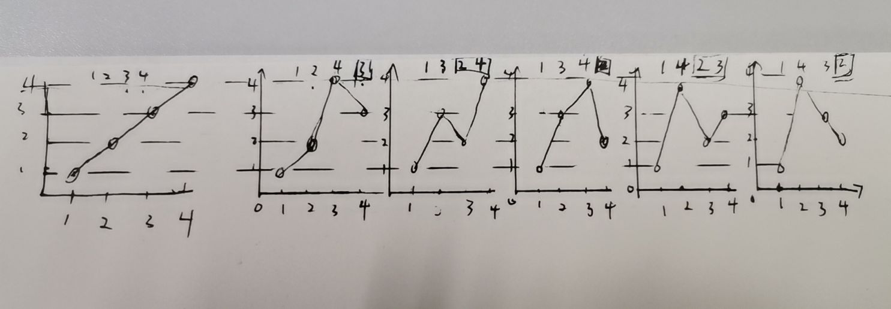

比较一般的做法是用回溯，使用标记数组一个个填空。

但是该递归函数并没有满足「全排列不重复」的要求，**在重复的字符较多的情况下，该递归函数会生成大量重复的排列**。对于任意一个空位，如果存在重复的字符，该递归函数会将它们重复填上去并继续尝试导致最后答案的重复。

解决该问题的一种较为直观的思路是，我们首先生成所有的排列，然后进行去重。而另一种思路是我们通过修改递归函数，使得该递归函数只会生成不重复的序列。

具体地，我们只要在递归函数中设定一个规则，保证在填每一个空位的时候重复字符只会被填入一次。**具体地，我们首先对原字符串排序，保证相同的字符都相邻，在递归函数中，我们限制每次填入的字符一定是这个字符所在重复字符集合中「从左往右第一个未被填入的字符**」，即如下的判断条件：

if (vis[j] || (j > 0 && !vis[j - 1] && s[j - 1] == s[j])) {
    continue;
}
这个限制条件保证了对于重复的字符，我们一定是从左往右依次填入的空位中的。


### 二叉树

### *[剑指 Offer 68 - I. 二叉搜索树的最近公共祖先](https://leetcode-cn.com/problems/er-cha-sou-suo-shu-de-zui-jin-gong-gong-zu-xian-lcof/)

**分析：**

- 对于搜索二叉树，pq分别位列与最近公共祖先。利用搜索二叉树的性质，很容易判断一个节点是不是最近公共祖先，并往下处理-code1
- 如果普通树，因为没有搜索二叉树的性质，很难直接判断。借鉴的做法是，对每个结点，分别得到其左子树全部结点集，右子树全部结点集，看pq是不是分别在两个集合中。但这样会做很多重复的搜索。
  - 如果子树有指向父节点的指针，那么问题可以转换成求两个链表的最近公共结点（方向：从不一样的部分到最后一样-即**叶子到根**）。每次叶子到根，都形成一条链表-code2
  - 如果子树没有指向父节点的指针，那么可以建立从**根开始到p，q的链表**。得到这两个链表后，寻找最后一个相同的公共结点，即解。问题的关键，变成了在遍历过程，如何建立根到某个结点的路径(链表)-code3

**扩展和联系：**

- 二叉搜索树
- 二叉树\普通树（方法1-转链表 方法2-递归巧判断）[236. 二叉树的最近公共祖先](https://leetcode.cn/problems/lowest-common-ancestor-of-a-binary-tree/)
  - 有指向父节点的指针
  - 没有指向父节点的指针

````java
package SwordOf.Search.Tree;

import Hot100.Medium.TreeNode;

public class LowestCommonAncestor {
    TreeNode res;
    public TreeNode lowestCommonAncestor(TreeNode root, TreeNode p, TreeNode q) {
        if(p.val==q.val) return p;
        search(root,p,q);
        return res;

    }
    private void search(TreeNode root,TreeNode p,TreeNode q){
        if(root.val >p.val && root.val>q.val){
            search(root.left,p,q);
        }else if(root.val < p.val && root.val <q.val){
            search(root.right,p,q);
        }else{
            res = root;
            return;
        }
    }
}
/****************************************************/
package SwordOf.Search.Tree;

import Hot100.Medium.TreeNode;
import org.junit.Test;
import sun.security.krb5.internal.PAData;

import java.util.ArrayList;
import java.util.Iterator;
import java.util.List;

/**
 * 如果子树没有指向父节点的指针，那么可以建立从**根开始到p，q的链表**。得到这两个链表后，寻找最后一个相同的公共结点，即解。
 * 问题的关键，变成了在遍历过程，如何建立根到某个结点的路径(链表)-code3
 */
public class LowestCommonAncestor3 {
    TreeNode res;

    public TreeNode lowestCommonAncestor(TreeNode root, TreeNode p, TreeNode q) {
        List<TreeNode> pathListOfp = new ArrayList<>();
        List<TreeNode> pathListOfq = new ArrayList<>();
        getNodeListFromRoot(root, p, pathListOfp);
        getNodeListFromRoot(root, q, pathListOfq);
        Iterator<TreeNode> iteratorP = pathListOfp.iterator();
        Iterator<TreeNode> iteratorQ = pathListOfq.iterator();
        TreeNode res = root;
        while (iteratorP.hasNext() && iteratorQ.hasNext()) {
            TreeNode pListNode = iteratorP.next();
            TreeNode qListNode = iteratorQ.next();
            if (pListNode.val == qListNode.val) res = pListNode;
        }
        return res;
    }

    public boolean getNodeListFromRoot(TreeNode root, TreeNode target, List<TreeNode> pathlist) {
        //找到了就不用一直遍历了，且能保存当前的pathList
        boolean haveFind=false;
        pathlist.add(root);
        if (root.val == target.val) return true;
        else{
            if (root.left != null && !haveFind){
                haveFind = getNodeListFromRoot(root.left, target, pathlist);
            }
            if (root.right != null && !haveFind){
                haveFind =  getNodeListFromRoot(root.right, target, pathlist);
            }
            if(!haveFind) pathlist.remove(pathlist.size()-1);
        }
        return haveFind;
    }

    @Test
public void test(){
        TreeNode root = new TreeNode(10);
        TreeNode node1 = new TreeNode(9);
        TreeNode node2 = new TreeNode(8);
        TreeNode node3 = new TreeNode(1);
        TreeNode node4 = new TreeNode(20);
        TreeNode node5 = new TreeNode(7);
        TreeNode node6 = new TreeNode(2);
        TreeNode node7 = new TreeNode(4);

        root.left = node1;
        root.right = node2;
        node2.left = node5;
        node1.left = node3;
        node1.right = node4;
        node3.left = node6;
        node4.right = node7;

        TreeNode res = lowestCommonAncestor(root,node6,node7);
        System.out.println(res.val);

    }
}

````

````java
class Solution {
    TreeNode ans ;
    public TreeNode lowestCommonAncestor(TreeNode root, TreeNode p, TreeNode q) {
        contains(root,p,q);
        return ans;
        
        
    }
    //root下面包含p或q， 返回true
    public boolean contains(TreeNode root,TreeNode p,TreeNode q){
        if(root == null) return false;

        boolean lson = contains(root.left,p,q);
        boolean rson = contains(root.right,p,q);
        //满足条件，意味找到了解
        if( (lson && rson) ||  ( (root.val==p.val ||root.val == q.val))&&(lson||rson) ){
            ans = root;
        }
        return lson||rson || root.val==p.val || root.val == q.val;
        

    }
}
````


### [剑指 Offer 34. 二叉树中和为某一值的路径](https://leetcode-cn.com/problems/er-cha-shu-zhong-he-wei-mou-yi-zhi-de-lu-jing-lcof/)

- 优化：用一个栈替代oneList ， 可省去 index

````java
package SwordOf.Search.Tree;

import Hot100.Medium.TreeNode;

import java.util.ArrayList;
import java.util.List;

/*到叶子的时候判断当前和就Ok了*/
public class PathSum {

    public List<List<Integer>> pathSum(TreeNode root, int target) {
        List<List<Integer>> resList = new ArrayList<>();

        pathSumSearch(root, target, new ArrayList<Integer>(), resList, 0,0);
        return resList;


    }

    public void pathSumSearch(TreeNode root, int target, List<Integer> oneRes, List<List<Integer>> resList, int pathSum,int index) {
        if (root == null) return;

        pathSum += root.val;
        oneRes.add(root.val);
        //是叶子，且是目标解
        if (root.left == null && root.right == null) {
            if (pathSum == target) {
                resList.add(new ArrayList<>(oneRes));
            }
        }
        if(root.left!=null){
            pathSumSearch(root.left,target,oneRes,resList,pathSum,index+1);
        }
        if(root.right!=null){
            pathSumSearch(root.right,target,oneRes,resList,pathSum,index+1);
        }
        pathSum-=root.val;
        oneRes.remove(index);

    }
}

````


### **[剑指 Offer 36. 二叉搜索树与双向链表](https://leetcode-cn.com/problems/er-cha-sou-suo-shu-yu-shuang-xiang-lian-biao-lcof/)

- 输入一棵二叉搜索树，将该二叉搜索树转换成一个排序的循环双向链表。要求不能创建任何新的节点，只能调整树中节点指针的指向。

**思路**‘

- 使用全局变量比较好做

- 不使用全局变量（make it）-小结（解题思路在代码注释中）

  - 思路清晰
  - 代码执行的结构
  - 变量引用是否被修改
  - 递归的终止条件

  ````java
  
  /*官方解更好*/
  
  /*
  // Definition for a Node.
  class Node {
      public int val;
      public Node left;
      public Node right;
  
      public Node() {}
  
      public Node(int _val) {
          val = _val;
      }
  
      public Node(int _val,Node _left,Node _right) {
          val = _val;
          left = _left;
          right = _right;
      }
  };
  */
  class Solution {
      Node head, pre;
  
      public Node treeToDoublyList(Node root) {
          if(root == null) return null;
          inOrderDfs(root);
          head.left = pre;
          pre.right = head;
          return head;
  
      }
      private void inOrderDfs(Node cur){
          if(cur == null) return;
          if(cur.left!=null) inOrderDfs(cur.left);
          if(pre!=null) pre.right = cur;
          else head = cur;
          cur.left = pre;
          pre = cur;
          if(cur.right!=null) inOrderDfs(cur.right);
  
      }
     
  }
  
  
  package SwordOf.Search.Tree;
  
  
  import org.junit.Test;
  
  /*return 的是head
   * 每次处理分root（root即current结点）的左边，root的右边；每一种情况又分两种情况，即空和不空，所以递归代码中，有4种情况需要考虑
   * 4种情况，处理的逻辑都是一致的，不同的情况具体操作不同而已；细节容易出错。。
   * root的左边：
   *  1-不空时：将root加到左边链表的尾部；修改相应的前驱和后继关系(左链的tail和root,root和左链的head)
   *  2-空时： 将root设置为pHead,修改相应的前驱和后继关系；
   * root的右边：
   *  1-不空时:获得右链的头尾；修改相应的前驱和后继关系(右链的head和root,右链的tail和左链的head)
   *  2-空时:do nothing. 我们对当前结点处理已经归并在处理root左边的情况中了
   * */
  public class TreeToDoublyList {
  
      public Node treeToDoublyList(Node root) {
          if(root == null) return null;
  
          Node pHead;
          Node rootOriginRight = root.right;//因为处理左链时会修改当前root的右指针，需要先保存其右链引用；
          //必须先处理左边
          if(root.left!=null){
              pHead = treeToDoublyList(root.left);
              pHead.left.right = root;
            root.left = pHead.left;
              root.right = pHead;
              pHead.left = root;
          }else{
              pHead = root;
              pHead.left = root ;
              pHead.right = root;
          }
  
          Node rightHead;
          Node rightTail;
          //处理右边
          if(rootOriginRight != null){ //note(*)
              rightHead = treeToDoublyList(rootOriginRight);
              rightTail = rightHead.left;
              //将右链的尾部和左链头连接
              rightTail.right = pHead;
              pHead.left = rightTail;
              //将右链的头部和左链尾部连接；注root是左链的尾部
              root.right = rightHead;
              rightHead.left = root;
          }else{
              //do nothing
          }
          return pHead;
  
      }
      @Test
      /*[4,2,5,1,3]*/
      public void test(){
          Node root = new Node(4);
          Node node1 = new Node(2);
          Node node2 = new Node(5);
          Node node3 = new Node(1);
          Node node4 = new Node(3);
          root.left = node1;
          root.right = node2;
          node1.left = node3;
          node1.right = node4;
  
          Node head = treeToDoublyList(root);
  
      }
  
  
  }
  
  ````
  
  

### [剑指 Offer 55 - I. 二叉树的深度](https://leetcode-cn.com/problems/er-cha-shu-de-shen-du-lcof/)

- easy done

### *[剑指 Offer 55 - II. 平衡二叉树](https://leetcode-cn.com/problems/ping-heng-er-cha-shu-lcof/)

- 注意平衡的定义
- 为了提高时间复杂度，自底向上判定如何实现？

````java
package SwordOf.Search.Tree;

import Hot100.Medium.TreeNode;

public class IsBalanced {
    /**自底向上*/
    public boolean isBalanced(TreeNode root){
        if(root == null) return true;
        int high  = height(root);
        if(high>0) return true;
        else return false;
    }
    /**是平衡树则返回该树高度，否则放回-1*/
    public int height(TreeNode root){
        if(root == null) return 0;
        int leftDeep = height(root.left);
        int rightDeep = height(root.right);
        if(Math.abs((leftDeep-rightDeep))<=1 && leftDeep!=-1 && rightDeep!=-1){
            return Math.max(leftDeep,rightDeep)+1;
        }else{
            return -1;
        }
    }

    /*第二遍也是自定向上，但是代码不够美*/
    class Solution {
    boolean res = true;
    public boolean isBalanced(TreeNode root) {
        depthDfs(root);
        return res;
    }
    public int depthDfs(TreeNode root){
        int lDepth = 0,rDepth =0;
        if(root == null) return 0;
        if(root.left !=null ) lDepth =  depthDfs(root.left);
        if(root.right!= null) rDepth = depthDfs(root.right);

        if(Math.abs( lDepth-rDepth )>1){
            res = false;
        }
        return Math.max(lDepth,rDepth)+1;
    }
}
    /*
    自顶向下，复杂度更高
    public boolean isBalanced(TreeNode root) {
        if(root == null) return true;

        boolean childValid = isBalanced(root.left) && isBalanced(root.right);
        if(childValid){
            int leftDepth = treeDepth(root.left);
            int rightDepth = treeDepth(root.right);
            if(Math.abs(leftDepth-rightDepth)>1) return false;
            else return true;
        }else  return false;
    }
    public int treeDepth(TreeNode node){

        if(node == null) return 0;
        int leftDeep = treeDepth(node.left);
        int rightDeep = treeDepth(node.right);
        int deep =  Math.max(leftDeep,rightDeep)+1;
        return deep;
    }*/

}

````


### *[剑指 Offer 37. 序列化二叉树](https://leetcode-cn.com/problems/xu-lie-hua-er-cha-shu-lcof/)

````text
请实现两个函数，分别用来序列化和反序列化二叉树。

你需要设计一个算法来实现二叉树的序列化与反序列化。这里不限定你的序列 / 反序列化算法执行逻辑，你只需要保证一个二叉树可以被序列化为一个字符串并且将这个字符串反序列化为原始的树结构。

提示：输入输出格式与 LeetCode 目前使用的方式一致，详情请参阅 LeetCode 序列化二叉树的格式。你并非必须采取这种方式，你也可以采用其他的方法解决这个问题。

 

来源：力扣（LeetCode）
链接：https://leetcode-cn.com/problems/xu-lie-hua-er-cha-shu-lcof
著作权归领扣网络所有。商业转载请联系官方授权，非商业转载请注明出处。
````


**此题大致思路和细节**

- 对于空孩子，用一个标识符来标识，比如"$", 这样只需要对树做一次遍历就可以缺定树的构成（满二叉树，一个萝卜一个坑）。
- 每个结点值可能是负数，以及几位数不缺定，因为要序列化为字符串，所以每个值都需要加入一个分隔标识符，方便后面的反序列化，比如“，”
- 还有个小细节，序列化字符串最后是以“，”结尾，用split分割后String数组最后应该有一个空元素“”, 这里不用管。因为在遇到之前，递归建树已经终止了。
- 字符串比较内容 equals ！

````java
package SwordOf.Search.Recurse;

import Hot100.Medium.TreeNode;
import org.junit.Test;
import sun.reflect.generics.tree.Tree;

/**
 * Definition for a binary tree node.
 * public class TreeNode {
 * int val;
 * TreeNode left;
 * TreeNode right;
 * TreeNode(int x) { val = x; }
 * }
 */
public class Codec {
    private int pos = -1;

    // Encodes a tree to a single st5ring.
    public String serialize(TreeNode root) {
        String serializeOrder = "";
        if (root == null) {
            serializeOrder += "$,";
            return serializeOrder;
        }
        serializeOrder += root.val+",";
        serializeOrder += serialize(root.left);
        serializeOrder += serialize(root.right);
        return serializeOrder;

    }

    // Decodes your encoded data to tree.
    public TreeNode deserialize(String data) {
        String[] strArr = data.split(",");
        return deserializeSup(strArr);
    }
    public TreeNode deserializeSup(String[] dataArr) {
        pos++;
        String cur = dataArr[pos];

        TreeNode node;
        if (!cur.equals("$")){
            node = new TreeNode(Integer.valueOf(cur));
            node.left = deserializeSup(dataArr);
            node.right = deserializeSup(dataArr);
        }else return null;

        return node;
    }
}
// Your Codec object will be instantiated and called as such:
// Codec codec = new Codec();
// codec.deserialize(codec.serialize(root));
````

### *[剑指 Offer 38. 字符串的排列](https://leetcode-cn.com/problems/zi-fu-chuan-de-pai-lie-lcof/)

- 基础:[下一个排列的官方题解](https://leetcode-cn.com/problems/next-permutation/solution/xia-yi-ge-pai-lie-by-leetcode-solution/)


## 排序


### [剑指 Offer 21. 调整数组顺序使奇数位于偶数前面](https://leetcode-cn.com/problems/diao-zheng-shu-zu-shun-xu-shi-qi-shu-wei-yu-ou-shu-qian-mian-lcof/)

注意里面wihle循环要加上 left<right的限定

本题是快排思想一种简单运用

````java
package SwordOf.Search.Array;

public class Exchange {
    public int[] exchange(int[] nums) {
        if(nums ==null) return null;
        int left  = 0;
        int right = nums.length -1;
        while(left<right){
            //寻找当前最左偶数
            while(left<right && nums[left]%2!=0) left++;
            //寻找当前最右奇数
            while(left<right && nums[right]%2!=1) right--;
            //交换当前left和right所指的数
            int temp = nums[left];
            nums[left] = nums[right];
            nums[right] = temp;
        }
        return nums;

    }

}

````

### *[剑指 Offer 45. 把数组排成最小/的数](https://leetcode-cn.com/problems/ba-shu-zu-pai-cheng-zui-xiao-de-shu-lcof/)

- done, but not the best way
- “统一的比较规则”
- 快速排序

### *[剑指 Offer 61. 扑克牌中的顺子](https://leetcode-cn.com/problems/bu-ke-pai-zhong-de-shun-zi-lcof/)

- 成为顺子的充分条件是什么?
  - 无重复
  - maxCard-minCard<5

### [剑指 Offer 41. 数据流中的中位数](https://leetcode-cn.com/problems/shu-ju-liu-zhong-de-zhong-wei-shu-lcof/)

````text
如何得到一个数据流中的中位数？如果从数据流中读出奇数个数值，那么中位数就是所有数值排序之后位于中间的数值。如果从数据流中读出偶数个数值，那么中位数就是所有数值排序之后中间两个数的平均值。

例如，

[2,3,4] 的中位数是 3

[2,3] 的中位数是 (2 + 3) / 2 = 2.5

设计一个支持以下两种操作的数据结构：

void addNum(int num) - 从数据流中添加一个整数到数据结构中。
double findMedian() - 返回目前所有元素的中位数。

来源：力扣（LeetCode）
链接：https://leetcode-cn.com/problems/shu-ju-liu-zhong-de-zhong-wei-shu-lcof
著作权归领扣网络所有。商业转载请联系官方授权，非商业转载请注明出处。
````

**思路**

- 用二分查找每次寻找插入位置。$查找插入位置O(logn),插入O(n)，所以插入数字O(N),找中位数O（1）$
  - 如果查找过程找到数值相同数: 返回位置
  - 如果查找过程找不到数值相同数，最后left = right, mid = (left+right)/2=left=right, 需要判断mid位置的数比插入的数大还是小，插入位置为mid 或者 mid+1

````java
class MedianFinder {
    private ArrayList<Double> array ;

    /** initialize your data structure here. */
    public MedianFinder() {
        array = new ArrayList<Double>();

    }
    
    /**先find pos */
    public void addNum(int num) {
        int pos = findInsertPos(num);
        array.add(pos,num);
    }
    
    public double findMedian() {
        int length = array.size();
        if(length%2 ==0) return (array.get(length/2)+array.get(length/2 -1))/2;
        else return array.get(length/2);

    }
    private int findInsertPos(int num){
        if(array.size() ==0) return 0;
        int left = 0,right = array.size()-1;
        int mid=0;
        while(left<right){
            mid = (left+right)/2;
            int midNum = array.get(mid);
            if(num == midNum) return mid;
            if(num < midNum) {
                right = mid -1;
            }else{
                left = mid+1;
            }
        }
        /**出循环时，left = riht，要考虑2个特殊的情况
        mid= left = right = 0 ； 且 addnum > array[0]，插入位置应该是 1, 即mid+1
        mid = left = right = size-1; 且 addnum >array[size-1],插入位置应该是 size ，即mid+1
         */
         mid = (left+right)/2;
         if(mid == 0 && num > array.get(0)) return mid+1;
         if(mid == array.size()-1 && num > array.get(array.size()-1)) return mid+1;
        
        return left;
    }
}

````

- 用最大堆+最小堆解$查找O(1)，插入数字Olog（n）$

- 本思路其实来源于用 AVL树实现，但很多语言没有实现AVL树；故用最大堆保存较小的一半数字，最小堆保存较大的一半数字。注意维持两个堆的大小不相差超过1

  ````java
  package SwordOf.sort;
  
  import java.util.PriorityQueue;
  import java.util.Queue;
  
  /**保持平衡，规定：偶数个元素，插入minHeap(大的一半),奇数个元素，插入maxHeap（小的一半）
   * minHeap,保存较大的一半，小顶堆保存较小的一半*/
  public class MedianFinder {
      Queue<Integer> minHeap,maxHeap;
      /** initialize your data structure here. */
      public MedianFinder() {
          minHeap = new PriorityQueue<Integer>();
          maxHeap = new PriorityQueue<Integer>((x,y)->(y-x));
      }
  
      /**先find pos */
      public void addNum(int num) {
          int size = minHeap.size()+maxHeap.size();
          if(size%2==0){
              maxHeap.add(num);
              minHeap.add(maxHeap.poll());
          }else{
              minHeap.add(num);
              maxHeap.add(minHeap.poll());
          }
      }
  
      public double findMedian() {
          int size = minHeap.size()+maxHeap.size();
          if(size%2==0){
              return (double)(minHeap.peek()+maxHeap.peek())/2;//peek,不是poll
          }else return (double)minHeap.peek();
      }
  }
  /**
   * Your MedianFinder object will be instantiated and called as such:
   * MedianFinder obj = new MedianFinder();
   * obj.addNum(num);
   * double param_2 = obj.findMedian();
   */
  
  ````

  


## 树

### [剑指 Offer 32 - I. 从上到下打印二叉树](https://leetcode-cn.com/problems/cong-shang-dao-xia-da-yin-er-cha-shu-lcof/)

- easy done

### [剑指 Offer 32 - II. 从上到下打印二叉树 II](https://leetcode-cn.com/problems/cong-shang-dao-xia-da-yin-er-cha-shu-ii-lcof/)

- 要求按分层

**思路**

- 我的做法是插入一个标记结点.需要注意标记结点出栈判断栈空跳出循环的情况，避免死循环
- 另外一种做法是for循环从高到低输出一层的节点数，也很巧妙

````java
 public List<List<Integer>> levelOrder(TreeNode root) {
        List<List<Integer>> resList = new ArrayList<>();
        List<Integer> oneRowList = new ArrayList<>();

        if (root == null) return resList;

        Queue<TreeNode> que = new LinkedList();

        que.offer(root);
        que.offer(new TreeNode(Integer.MIN_VALUE));
        while (!que.isEmpty()) {
            TreeNode cur = que.poll();
            if (cur.val == Integer.MIN_VALUE) {
                resList.add(new ArrayList<>(oneRowList));
                oneRowList.clear();

                if(que.isEmpty()) break; //避免死循环
                else que.offer(new TreeNode(Integer.MIN_VALUE));
            } else {
                oneRowList.add(cur.val);
                if (cur.left != null) que.add(cur.left);
                if (cur.right != null) que.add(cur.right);
            }
        }

        return resList;
    }

class Solution {
    public List<List<Integer>> levelOrder(TreeNode root) {
        Queue<TreeNode> queue = new LinkedList<>();
        List<List<Integer>> res = new ArrayList<>();
        if(root != null) queue.add(root);
        while(!queue.isEmpty()) {
            List<Integer> tmp = new ArrayList<>();
            for(int i = queue.size(); i > 0; i--) {
                TreeNode node = queue.poll();
                tmp.add(node.val);
                if(node.left != null) queue.add(node.left);
                if(node.right != null) queue.add(node.right);
            }
            res.add(tmp);
        }
        return res;
    }
}

作者：jyd
链接：https://leetcode-cn.com/problems/cong-shang-dao-xia-da-yin-er-cha-shu-ii-lcof/solution/mian-shi-ti-32-ii-cong-shang-dao-xia-da-yin-er-c-5/
来源：力扣（LeetCode）
著作权归作者所有。商业转载请联系作者获得授权，非商业转载请注明出处。
    
    
````


### [剑指 Offer 32 - III. 从上到下打印二叉树 III](https://leetcode-cn.com/problems/cong-shang-dao-xia-da-yin-er-cha-shu-iii-lcof/)

**思路**

- 我的是用一个标志变量，不断变化插入顺序
- 标志变量起判奇偶层的作用。判断奇偶层还有很多方法，比如$resList.size()%2==0?$
- LinkedList 有addFirst 和 addLast 方法。当然用add(index,ele)也可以

````java
 public List<List<Integer>> levelOrder(TreeNode root) {
        List<List<Integer>> resList = new ArrayList<>();
        List<Integer> oneRowList = new ArrayList<>();

        if (root == null) return resList;

        Queue<TreeNode> que = new LinkedList();
        que.offer(root);

        boolean leftOrRight = true;//左到右
        while (!que.isEmpty()) {
            for(int i=que.size();i>0;i--){
                TreeNode cur = que.poll();
                if(leftOrRight)  oneRowList.add(cur.val);
                else oneRowList.add(0,cur.val);

                if (cur.left != null) que.add(cur.left);
                if (cur.right != null) que.add(cur.right);
            }
            leftOrRight = !leftOrRight;
            resList.add(new ArrayList(oneRowList));
            oneRowList.clear();
        }

        return resList;
    }
````

### [剑指 Offer 26. 树的子结构](https://leetcode-cn.com/problems/shu-de-zi-jie-gou-lcof/)

````text
输入两棵二叉树A和B，判断B是不是A的子结构。(约定空树不是任意一个树的子结构)

B是A的子结构， 即 A中有出现和B相同的结构和节点值。

例如:
给定的树 A:

     3
    / \
   4   5
  / \
 1   2
给定的树 B：

   4 
  /
 1
返回 true，因为 B 与 A 的一个子树拥有相同的结构和节点值。

示例 1：

输入：A = [1,2,3], B = [3,1]
输出：false

来源：力扣（LeetCode）
链接：https://leetcode-cn.com/problems/shu-de-zi-jie-gou-lcof
著作权归领扣网络所有。商业转载请联系官方授权，非商业转载请注明出处。
````

**思路**

- 遍历树判断就可以了
  - 当前结点值不等，往下判断
  - 当前节点值相等，定义一个相等判断函数
- 注意空指针的情况，避免异常
- 关于书中提示的，关于浮点值的判断，无法用==，因为double 和 float 都是有精度缺失。了解一下

````java
//SECOND
/**
 * Definition for a binary tree node.
 * public class TreeNode {
 *     int val;
 *     TreeNode left;
 *     TreeNode right;
 *     TreeNode(int x) { val = x; }
 * }
 */
class Solution {
    //遍历A 将A中有Broot值的结点，加入一个待判定检验列表； 因为题目没有说明节点值是否可能相同
    boolean res;
    public boolean isSubStructure(TreeNode A, TreeNode B) {
        if(B == null) return false;

        res = false;
        dfs(A,B);
        return res;


    }
    private void dfs(TreeNode root,TreeNode compareNode ){
        if(root == null) return ;
        if(root.val == compareNode.val) res = res || checkProcess(root,compareNode);
        
        //如果找到了子结果，提前结束递归
        if(!res){
            dfs(root.left,compareNode);
            dfs(root.right,compareNode);
        }
        
    }
    private boolean checkProcess(TreeNode A,TreeNode B){
        if(B == null) return true;
        if(A == null) return false;
        
        boolean res = false;
        if(A.val == B.val){
            res = checkProcess(A.left,B.left) && checkProcess(A.right,B.right);
        }else return false;

        return res;
    }
}


//FIRST
package SwordOf.Tree.order;

import Hot100.Medium.TreeNode;
import org.junit.Test;

import javax.xml.bind.annotation.XmlInlineBinaryData;

public class IsSubStructure {

    public boolean isSubStructure(TreeNode A, TreeNode B) {
        if(B == null || A == null) return false;

        boolean result = false;
        if(A.val == B.val){
            result = isSameStructure(A,B);
        }

        return result||isSubStructure(A.left,B) || isSubStructure(A.right,B);

    }
    public boolean isSameStructure(TreeNode A,TreeNode B){
        if(B == null) return true;
        if(A == null) return false;
        if(A.val!=B.val) return false;

       return isSameStructure(A.left,B.left) && isSameStructure(A.right,B.right);

    }
    @Test
    public void test(){
        TreeNode A1 = new TreeNode(4);
        TreeNode A2 = new TreeNode(2);
        TreeNode A3 = new TreeNode(3);
        TreeNode A4 = new TreeNode(4);
        TreeNode A5 = new TreeNode(5);
        TreeNode A6 = new TreeNode(6);
        TreeNode A7 = new TreeNode(7);
        TreeNode A8 = new TreeNode(8);
        TreeNode A9 = new TreeNode(9);
        A1.left = A2;
        A1.right = A3;
        A2.left= A4;
        A2.right = A5;
        A3.left = A6;
        A3.right = A7;
        A4.left = A8;
        A4.right = A9;

        TreeNode B1 = new TreeNode(4);
        TreeNode B2 = new TreeNode(8);
        TreeNode B3 = new TreeNode(9);
        B1.left = B2;
        B1.right = B3;

        System.out.println(isSubStructure(A1,B1));

    }
}
````


### [剑指 Offer 28. 对称的二叉树](https://leetcode-cn.com/problems/dui-cheng-de-er-cha-shu-lcof/)

请实现一个函数，用来判断一棵二叉树是不是对称的。如果一棵二叉树和它的镜像一样，那么它是对称的。

例如，二叉树 [1,2,2,3,4,4,3] 是对称的。

    1
   / \
  2   2
 / \ / \
3  4 4  3
但是下面这个 [1,2,2,null,3,null,3] 则不是镜像对称的:

    1
   / \
  2   2
   \   \
   3    3

**思路**

- 递归的思想

````java

/**
**此代码是构造一颗镜像树的代码，而不是判断一个数是否是镜像树**
*/
public TreeNode mirrorTree(TreeNode root) {
        if(root == null) return null;
        TreeNode mirrorRoot = new TreeNode(root.val);

        if (root.left != null) mirrorRoot.right = mirrorTree(root.left);
        if (root.right != null) mirrorRoot.left = mirrorTree(root.right);

        return mirrorRoot;


    }
````


## 动态规划

### [剑指 Offer 10- I. 斐波那契数列](https://leetcode-cn.com/problems/fei-bo-na-qi-shu-lie-lcof/)

**思路**

- 递归$O(n)$记得保存搜索结果，否则会超时
- 矩阵快速幂乘

下面讲讲什么是矩阵幂乘，其实就是pow函数。**矩阵幂乘和两个数的幂乘算法 本质是一模一样的！** 将k次缩减为$O(logk)$次；

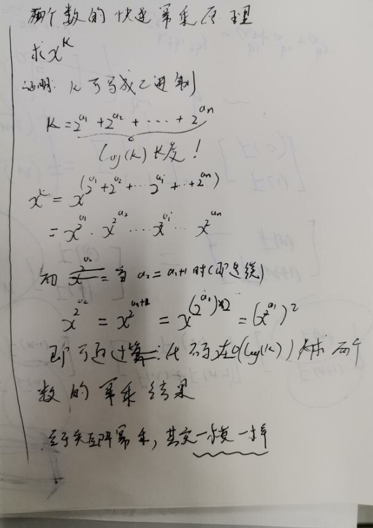

- 在知道了快速乘法之后，想要用其解决这道题，还有1个难点，就是知道其递推公式
- 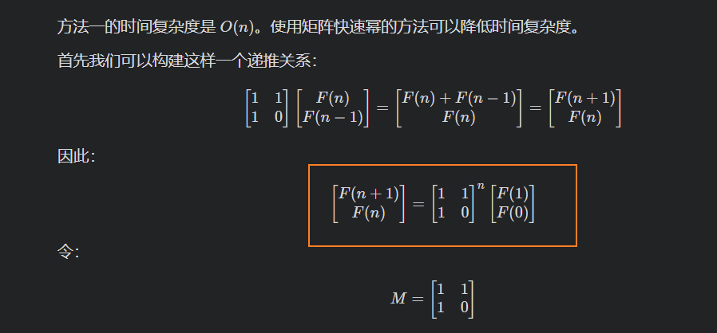
- 推导这个递推公式的思想：https://www.cnblogs.com/SYCstudio/p/7211050.html

````java

/**
常规做法，用这个就好
**/
class Solution {
   int p = 1000000007;
    public int fib(int n) {
        if(n == 0) return 0;
        if(n == 1) return 1;

        int pre1 = 0;
        int pre2 = 1;
        int res = 0;
        for(int i=2;i<=n;i++){
            res = (pre1 + pre2)%p;;
            pre1 = pre2;
            pre2 = res;
        }
        return res;
    }
   
}

/*********/

package SwordOf.dynamicPro;

import org.junit.Test;

import java.util.Arrays;

public class FibFast {
    int MOD = 1000000007;

    public int fib(int n) {
        if (n == 0) return 0;
        if (n == 1) return 1;

        int[][] start = new int[][]{{1}, {0}};
        int[][] matrix = new int[][]{{1, 1}, {1, 0}};
        matrix = powMatrix(matrix, n - 1);
        int[][] res = matrixMultiply(matrix, start);

        return res[0][0];
    }

    //矩阵的幂乘
    public int[][] powMatrix(int[][] A, int k) {

        int[][] eachMultiply = A;
        int[][] res = new int[A.length][A.length];
        for (int i = 0; i < res.length; i++) res[i][i] = 1;

        while (k > 0) {
            if ((k & 1) == 1) {
                res = matrixMultiply(res, eachMultiply);
            }
            eachMultiply = matrixMultiply(eachMultiply, eachMultiply);
            k = k >> 1;
        }
        return res;
    }


    //两个矩阵相乘
    /*A(m*n) , B(n*t)*/
    public int[][] matrixMultiply(int[][] A, int[][] B) {
        if (A.length == 0 || A == null || B.length == 0 || B.length == 0) return null;
        if (A[0].length != B.length) return null;
        int m = A.length;
        int n = A[0].length;
        int t = B[0].length;
        int[][] res = new int[m][t];
        for (int i = 0; i < m; i++) {
            for (int j = 0; j < t; j++) {
                int oneEle = 0;
                for (int k = 0; k < n; k++) {
                    oneEle += 1l*A[i][k] * B[k][j] % MOD;
                }
                res[i][j] = oneEle;
            }
        }
        return res;
    }

    //两个数的快速幂乘算法
    public long myPower(int x, long k) {
        int check = 1;
        int eachMultiply = x;
        int res = 1;
        while (k > 0) {
            if ((k & check) == 1) {
                res *= eachMultiply;
            }
            eachMultiply *= eachMultiply;
            k = k >> 1;
        }
        return res;
    }


    @Test
    public void test2(){
        int res = fib(2);
        System.out.println(res);
    }

    @Test
    public void test() {
        int mod1 = (int) 1e9;
        double mod2 = 1e9;
        System.out.println(mod1);
        System.out.println(mod2);
    }
}

````

### [剑指 Offer 63. 股票的最大利润](https://leetcode-cn.com/problems/gu-piao-de-zui-da-li-run-lcof/)

````text
假设把某股票的价格按照时间先后顺序存储在数组中，请问买卖该股票一次可能获得的最大利润是多少？

示例 1:

输入: [7,1,5,3,6,4]
输出: 5
解释: 在第 2 天（股票价格 = 1）的时候买入，在第 5 天（股票价格 = 6）的时候卖出，最大利润 = 6-1 = 5 。
     注意利润不能是 7-1 = 6, 因为卖出价格需要大于买入价格。
示例 2:

输入: [7,6,4,3,1]
输出: 0
解释: 在这种情况下, 没有交易完成, 所以最大利润为 0。
 
````

**思路及代码**

````java
package SwordOf.dynamicPro;


/*动态规划：
* max[i]：表示前[i]能得到的最大利润
* minValue：表示前面股票出现的最低价格
* 动态转移方程： max[i] = 今天价格-前面的最低价格 是否大于 前i-1可以求得的最大利润？ */
public class MaxProfit {
    public int maxProfit(int[] prices) {
        if(prices.length ==0 || prices == null) return 0;

        int[] max = new int[prices.length];
        max[0]=0;
        int minValue= prices[0];

        for(int i=1;i<prices.length;i++){
            if(prices[i]<minValue) minValue = prices[i];

            max[i] = prices[i] - minValue > max[i-1] ? prices[i] - minValue : max[i-1];
        }
        return max[prices.length-1];
    }
}

````

### [剑指 Offer 42. 连续子数组的最大和](https://leetcode-cn.com/problems/lian-xu-zi-shu-zu-de-zui-da-he-lcof/)

- easy done

### [剑指 Offer 47. 礼物的最大价值](https://leetcode-cn.com/problems/li-wu-de-zui-da-jie-zhi-lcof/)

- easy done ，用滚动数组优化

- ````java
  package SwordOf.dynamicPro;
  
  public class maxGifValue {
      /*用滚动数组优化框架复杂度*/
      public int maxValue(int[][] grid) {
          if(grid.length==0) return 0;
  
          int[] upMax = new int[grid[0].length];
          upMax[0] = grid[0][0];
          for(int i=1;i<upMax.length;i++){
              upMax[i] = upMax[i-1]+grid[0][i];
          }
  
          for(int j=1;j<grid.length;j++){
             upMax[0] = grid[j][0]+upMax[0];
              for(int i=1;i<upMax.length;i++){
                  upMax[i] =  Math.max(upMax[i-1],upMax[i])+grid[j][i];
              }
          }
          return upMax[upMax.length-1];
  
      }
  }
  
  ````

###  *[剑指 Offer 46. 把数字翻译成字符串](https://leetcode-cn.com/problems/ba-shu-zi-fan-yi-cheng-zi-fu-chuan-lcof/)

````text
给定一个数字，我们按照如下规则把它翻译为字符串：0 翻译成 “a” ，1 翻译成 “b”，……，11 翻译成 “l”，……，25 翻译成 “z”。一个数字可能有多个翻译。请编程实现一个函数，用来计算一个数字有多少种不同的翻译方法。

 

示例 1:

输入: 12258
输出: 5
解释: 12258有5种不同的翻译，分别是"bccfi", "bwfi", "bczi", "mcfi"和"mzi"

来源：力扣（LeetCode）
链接：https://leetcode-cn.com/problems/ba-shu-zi-fan-yi-cheng-zi-fu-chuan-lcof
著作权归领扣网络所有。商业转载请联系官方授权，非商业转载请注明出处。
````

**思路**

- 有些动态规划题，可能一开始不一定会觉得就是用动态规划的解法，而是想着用递归，回溯。确定用动态规划的技巧是，看用递归求解时，是否有很多重复的子问题。另外，满足最优子结构；
- 本题可以从左到右动态规划，也可以从右往左
  - $f(i)= f(i-1)+f(i-2)*isMeet(g(i,i-1))$//左往右
  - $f(i)=f(i+1)+f(i+2)*isMeet(g(i,i+1))$//右往左
  - isMeet() 返回${0,1}$，注意 0+* 的情况，虽然小于25但是不能看作符合两位数的情况
- String.valueof():..

````java
//second
class Solution {
    public int translateNum(int num) {
        String numStr = String.valueOf(num);
        char[] numArr = numStr.toCharArray();
        int len = numArr.length;
        int[] dp = new int[len];
        dp[0] = 1;
        for(int i=1; i<len; i++){

            if(numArr[i-1]=='0'||numArr[i-1]>'2' || ( numArr[i-1] == '2' && numArr[i]>'5')) dp[i] = dp[i-1];
            else if(i<=1){
                dp[i] = 2;
            }else{
                dp[i] = dp[i-1]+dp[i-2];
            }

        }
        return dp[len-1];
    }
}

//first
public int translateNum(int num) {
        /*返回 int参数的字符串 int形式。 */
        String str = String.valueOf(num);
        int res[] = new int[str.length()];
        res[0] = 1;

        for (int i = 1; i < str.length(); i++) {

            res[i] = res[i - 1] + (i == 1 ? isMeet(str, i) : res[i - 2] * isMeet(str, i));

        }
        return res[str.length() - 1];

    }

    public int isMeet(String str, int curIndex) {
        char sec = str.charAt(curIndex);
        char fir = str.charAt(curIndex - 1);
        //符合条件的范围是 >=10 <=25
        if((fir - '0')==0 ||(fir - '0')>=3 ) return 0;
        else if (((sec - '0') + (fir - '0') * 10) <= 25) return 1;
        else return 0;
    }

````


### *[剑指 Offer 48. 最长不含重复字符的子字符串](https://leetcode-cn.com/problems/zui-chang-bu-han-zhong-fu-zi-fu-de-zi-zi-fu-chuan-lcof/)

````text
请从字符串中找出一个最长的不包含重复字符的子字符串，计算该最长子字符串的长度。

 

示例 1:

输入: "abcabcbb"
输出: 3 
解释: 因为无重复字符的最长子串是 "abc"，所以其长度为 3。
示例 2:

输入: "bbbbb"
输出: 1
解释: 因为无重复字符的最长子串是 "b"，所以其长度为 1。

注：此题字符串中的字符没有说就是小写字母

来源：力扣（LeetCode）
链接：https://leetcode-cn.com/problems/zui-chang-bu-han-zhong-fu-zi-fu-de-zi-zi-fu-chuan-lcof
著作权归领扣网络所有。商业转载请联系官方授权，非商业转载请注明出处。
````

**思路**

- 用动态规划是最快的，结合滑动窗口，达到$O(n),O(1)$,基本思路就是
- $f(i)：$表示以第i个字符结尾的最长无重复字符的子串长度
- 在确定状态转移方程时，有一个关键的变量，**d: 当前字符与上一次该字符出现的距离** 
  - if 未出现过， $f(i)=f(i-1)+1$
  - $d<=f(i-1):f(i)=d$
  - $d>f(i-1):f(i)=f(i-1)+1$

````java
//second

class Solution {
    /**
    dp[i]：以arr[i]结尾的最长不包含重复字符的子字符串长度
    set: */
    public int lengthOfLongestSubstring(String s) {
        if(s==null||s.length()==0) return 0;
        
        char[] arr = s.toCharArray();
        int[] dp = new int[arr.length];
        dp[0]=1;
        HashMap<Character,Integer> map = new HashMap<>();
        map.put(arr[0],0);
        int res = 1;
        for(int i=1;i<arr.length;i++){
            if(!map.containsKey(arr[i])){
                dp[i] = dp[i-1]+1;
               
            }else{
                int prePos = map.get(arr[i]);
                int len = i-prePos;
                if(len>dp[i-1]+1) dp[i] = dp[i-1]+1;
                else dp[i] = len; 
            }
            //更新位置 
            map.put(arr[i],i);
            if(dp[i]>res) res = dp[i];
           
        }
        return res;
    }
}

//first
package SwordOf.dynamicPro;

import org.junit.Test;

import java.util.HashMap;
import java.util.HashSet;

public class LengthOfLongestSubstring {
    /*剑指上s的值只是小写字母，但leetcode则没有这一限制；
    所以不能用一个小数组来记录下标了，需要用HashMap<字符，上一次出现的值>*/
    public int lengthOfLongestSubstring(String s) {

        if (s.length() == 0) return 0;

      /*  int[] preAppearPosition = new int[26];
        for (int i = 0; i < 26; i++) {
            preAppearPosition[i] = -1;
        }*/
        HashMap<Character, Integer> map = new HashMap<>();

        int maxLen = Integer.MIN_VALUE;
        int len = 0;//len表示当前字符到到上一次该字符出现的情况；len>=1, 1就是相邻aa的情况;
        int fPre = 0;
        for (int i = 0; i < s.length(); i++) {
            char ch = s.charAt(i);
            //该字符从未出现过

            if (!map.containsKey(ch)) {
//                fPre = fPre++;
                fPre++;
                map.put(ch, i);

            } else { //该字符出现过
                //先求两个该字符间的距离，再分两种情况处理
                len = i - map.get(ch);
                map.put(ch,i);

                if (len <= fPre) fPre = len;
                else {
                    //fPre = fPre++;什么玩意
                    fPre++;
                }
            }

            if (fPre > maxLen) maxLen = fPre;
        }
        return maxLen;
    }

    @Test
    public void test() {
        String s = "abcabcbb";
        int len = lengthOfLongestSubstring(s);
        System.out.println(len);

    }

    @Test
    public void test2() {
        int i = 0;
        for (int j = 0; j < 2; j++) {
            i=++i;
//            i=i++;
        }
        System.out.println(i);
    }
}

````


### [剑指 Offer 14- I. 剪绳子](https://leetcode-cn.com/problems/jian-sheng-zi-lcof/)

````text
给你一根长度为 n 的绳子，请把绳子剪成整数长度的 m 段（m、n都是整数，n>1并且m>1），每段绳子的长度记为 k[0],k[1]...k[m-1] 。请问 k[0]*k[1]*...*k[m-1] 可能的最大乘积是多少？例如，当绳子的长度是8时，我们把它剪成长度分别为2、3、3的三段，此时得到的最大乘积是18。

示例 1：

输入: 2
输出: 1
解释: 2 = 1 + 1, 1 × 1 = 1
示例 2:

输入: 10
输出: 36
解释: 10 = 3 + 3 + 4, 3 × 3 × 4 = 36
提示：

2 <= n <= 58

来源：力扣（LeetCode）
链接：https://leetcode-cn.com/problems/jian-sheng-zi-lcof
著作权归领扣网络所有。商业转载请联系官方授权，非商业转载请注明出处。


````

- 可用动态规划做
- 也可以用数学的方法做，贪心算法

````java
//自底向上动态规划
class Solution {
    /**
    1.尽可能分成3的段
    2.len = 4时，分成2*2；此时2*2 > 1*3
    -----
    dp[i]:长度为i的绳子剪后的可能最大乘积
    dp[i] = max{dp[]*dp[]}
    可以自底向上求解
     */
    public int cuttingRope(int n) {
        if(n==2) return 1;
        if(n==3) return 2;
        if(n==4) return 4;

        int[] dp = new int[n+1];
        dp[1] = 1;       
        dp[2] = 2;
        dp[3] = 3;
    
        for(int i=4;i<=n;i++){
            int max = Integer.MIN_VALUE;
            for(int j=1;j<=i/2;j++){
                int tem = dp[j]*dp[i-j];
                if(tem>max) max = tem;
            }
            dp[i] = max;
        }
    return dp[n];
    }
}
````


### *[剑指 Offer 14- II. 剪绳子 II](https://leetcode-cn.com/problems/jian-sheng-zi-ii-lcof/)

本题和剪绳子I一样，但是考虑了大数情况，要求对结果取余。

变相考核的是 “快速幂求余”。

题解给出了一种快速幂降幂方法：$(x^a)\%p=((x^2)\%p)^{a/2}$，算法实现比较不容易理解

快速幂还可以这么降：$x^a\%p=(x^{a/2}\%p)*(x^{a/2}\%p)$，算法实现更容易理解

注意rem, reminder返回值要用Long型作为过渡

- 因为返回类似是int, 中间可能超过int 可表达最大值
- 如果不取余，此题输入规模连 long型都会溢出

````java
//second done
class Solution {
     /**
    不能用动态规划了
    因为中间过程的解去模，无法用与后续的大小判断
    此时，应该从数学的角度入手，直入主题
    n%3 = { 0,1,2} 
     */
    public int cuttingRope(int n) {
        if(n==2) return 1;
        if(n==3) return 2;
        if(n==4) return 4;

        int[] dp = new int[n+1];
        dp[1] = 1;       
        dp[2] = 2;
        dp[3] = 3;

        return (int)recurCut(n);
    
    }
    private long recurCut(int n){
        int p = 1000000007;
        long res=0;
        if(n ==0) return 1L;
        if(n%3==0){
            res = (3*recurCut(n-3))%p;

        }else if(n%3 == 1){
            res = (4*recurCut(n-4))%p;
        }else{
            res = (2*recurCut(n-2))%p;
        }

        return res;
    }
}


//第一种
public int cuttingRope(int n) {
        if (n <= 3) return n - 1;

        long rem = 1;
        long x = 3;
        int b = n % 3;
        int p = 1000000007;
        for (int a = n / 3 - 1; a > 0; a /= 2) {
            if (a % 2 == 1) rem = (rem * x) % p;
            x = (x * x) % p;
        }
        if (b == 0) return (int)((rem * 3) % p);
        if (b == 1) return (int)((rem * 4) % p);

        return (int)((rem * 6) % p);

    }
//第二种
 public int cuttingRope(int n) {
        if (n <= 3) return n-1;


        int b = n / 3;
        int p = 1000000007;

        long res=0;
        if (n % 3 == 0) {
            res = reminder(3, b, p);
        } else if(n%3 ==1){
            res = (4*reminder(3, b-1, p))%p;
        }else{
            res = (2*reminder(3, b, p))%p;
        }
        return (int)res;
    }

    private long reminder(int x, int a, int p) {

        if(a==0) return 1;
        if (a == 1) return x;
        long res = reminder(x, a / 2, p);
        if (a % 2 == 0) {
            res = (res*res) % p;
        } else {
            res = ((res * res)%p * x) % p;
        }
        return res;
    }
````

快速幂第一种降幂方式解析：

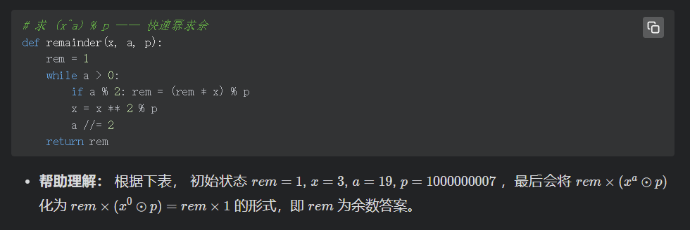

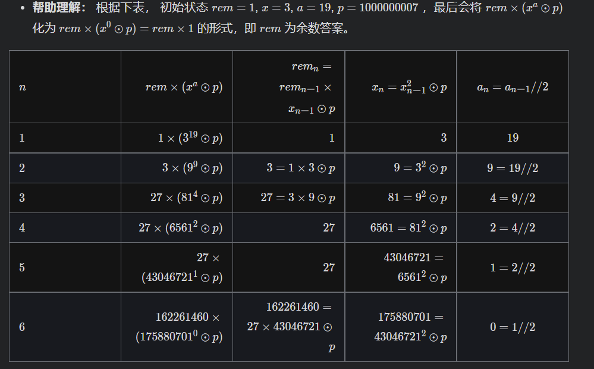


**动态规划解**

这道题在解的时候，容易陷入剪几段没说明，要列举很多情况的误区。实际上，外面定义f[m] 为长度为m下，剪成符合题意的段数下的最优解。动态转移方程，$f[m]=Max_{1<=i<=m/2}(f[i],f[m-i])$可以包含全部“剪法的情况”。**剪成任意多段（>2），肯定第一刀是剪成2段, 或者说剪得再碎，也能拼成两段**。所以这就是一个常见的dp问题。小细节是,因为至少要剪一刀,注意f[ ]的初始条件和特殊情况下的直接返回值，并不是对应的。


//下面这是剪绳子I的：

**贪心解**

- 尽可能分成长为3的段，其次是分成长度为2的段。注意剩下长度是4时，不再优秀剪成3的段，因为2x2>1x3

- 具体分析可以看剑指offer，这里就不赘述了，后贴代码。因为有点巧妙，大多数人只有做过才知道吧。

  

****

````java
//动态规划解
class Solution {
    /**定义f[i] 为把长度为i的绳子剪成若干段后（可不剪即1段）的符合题意乘积最大值 */
    public int cuttingRope(int n) {
        int[] f = new int[n+1];
        if(n<2) return 0;
        if(n==2) return 1;
        if(n==3) return 2;
        if(n==4) return 4;

        f[0] = 0;
        f[1] = 1;
        f[2] = 2;
        f[3] = 3;

        for(int i=4;i<=n;i++){
            int product=0;
            int max = Integer.MIN_VALUE;
            for(int j=2;j<=i/2;j++){
                product = f[j]*f[i-j];
                if(product > max) max = product;
            }
            f[i] = max;
        }
        return f[n];
    }
}

//贪心解
class Solution {
    
    public int cuttingRope(int n) {
        if(n==2) return 1;
        if(n==3) return 2;
        

      int timesOf3 = n/3;
      if(n%3 == 1) timesOf3 -= 1;
      int timesOf2 = (n - timesOf3*3)/2;
      return (int) (Math.pow(3,timesOf3)*Math.pow(2,timesOf2));

    }
}
````

### *[剑指 Offer 19. 正则表达式匹配](https://leetcode-cn.com/problems/zheng-ze-biao-da-shi-pi-pei-lcof/)

````text
请实现一个函数用来匹配包含'. '和'*'的正则表达式。模式中的字符'.'表示任意一个字符，而'*'表示它前面的字符可以出现任意次（含0次）。在本题中，匹配是指字符串的所有字符匹配整个模式。例如，字符串"aaa"与模式"a.a"和"ab*ac*a"匹配，但与"aa.a"和"ab*a"均不匹配。
````


````java
package SwordOf.dynamicPro;

public class IsMatch {

    public boolean isMatch(String s, String p) {
        char[] sArr = s.toCharArray();
        char[] pArr = p.toCharArray();
        return matchSup(sArr, pArr, sArr.length - 1, pArr.length - 1);
    }

    public boolean matchSup(char[] sArr, char[] pArr, int sIndex, int pIndex) {
        //全部匹配完
        if (sIndex == -1 && pIndex == -1) return true;
        if (sIndex >= 0 && pIndex < 0) return false;
        if (sIndex < 0 && pIndex >= 0) {
            if (pArr[pIndex] == '*' && pIndex>=1)
                return matchSup(sArr, pArr, sIndex, pIndex - 2);
            else return false;
        }
        //匹配状态转移方程
        if (pArr[pIndex] == '*') {
            boolean state1 = false, state2 = false;
            if (isMatchChar(sArr[sIndex], pArr[pIndex - 1]))
                state1 = matchSup(sArr, pArr, sIndex - 1, pIndex - 2) || matchSup(sArr, pArr, sIndex - 1, pIndex)||matchSup(sArr, pArr, sIndex, pIndex-2);
            else state2 = matchSup(sArr, pArr, sIndex, pIndex - 2);

            return state1 || state2;
            //简化代码可以这么写--错的，不能等价
//            return matchSup(sArr,pArr,sIndex-1,pIndex-2)||matchSup(sArr,pArr,sIndex-1,pIndex)matchSup(sArr,pArr,sIndex,pIndex-2);

        } else {
            if (isMatchChar(sArr[sIndex], pArr[pIndex])) return matchSup(sArr, pArr, sIndex - 1, pIndex - 1);
            else return false;
        }


    }

    public boolean isMatchChar(char sch, char pch) {
        if (pch == '.') return true;
        if (pch == sch) return true;
        else return false;
    }
}

````

//再一次

````java
class Solution {
    /**
    boolean f[i,j] 表示 s前i个字符 和 p前j个字符是否匹配
    when p(j) !='*'
        when p(j) no match s(i),  f[i,j] = false
        when p(j) match s(i) f[i,j] = f[i-1,j-1]
    when p(j) == '*'
        f[i,j] = f[i,j-2] || f[i-1,j]  

     */
    public boolean isMatch(String s, String p) {
        boolean f[][] = new boolean [s.length()+1][p.length()+1];
        f[0][0] = true;
        //状态一个都不能少
        for(int j=1;j<=p.length();j++){
            if(p.charAt(j-1)!='*') f[0][j] = false;
            else{
                if(j-2>=0) f[0][j] = f[0][j-2];
                else f[0][j] = false;
            } 
        }
        

        for(int i=1;i<=s.length();i++){
            for(int j=1;j<=p.length();j++){
                if(p.charAt(j-1)!='*'){
                    if(p.charAt(j-1) == s.charAt(i-1)|| p.charAt(j-1)=='.'){
                        f[i][j] = f[i-1][j-1];
                    }else f[i][j] = false;
                }else{
                    if(s.charAt(i-1)==p.charAt(j-2) || p.charAt(j-2)=='.') f[i][j] = f[i][j-2] || f[i-1][j];
                    else f[i][j] = f[i][j-2];
                }

            }
        }
        return f[s.length()][p.length()];
        
    }

     

}
````


### *[剑指 Offer 49. 丑数](https://leetcode-cn.com/problems/chou-shu-lcof/)

````text
我们把只包含质因子 2、3 和 5 的数称作丑数（Ugly Number）。求按从小到大的顺序的第 n 个丑数。


示例:

输入: n = 10
输出: 12
解释: 1, 2, 3, 4, 5, 6, 8, 9, 10, 12 是前 10 个丑数。
说明:  

1 是丑数。
n 不超过1690。
注意：本题与主站 264 题相同：

````

**思路**

- 每个丑数一定可以由较小的丑数x2，或者x3，或者x5得到。
- 如果我们求的是无穷多个丑数，那么每个丑数，都会生成3个对应较大的丑数，每个丑数都有3次机会
- 我们用3个指针表示每个丑数生成较大丑数的机会。ptrI 表示当前 用自身值乘以I生成新丑数的丑数下标。显然，3个指针都是从1开始递增，每个生成丑数都有3次机会
- 做题的话理解到上面就可以了，但深究还有1个细节：2，3，5是互质的。所以每个数乘以2，乘以3，乘以5，得到的数不会相同。并且，对于任意的$x,y,z \in N+, 2^x,3^y,5^z$两两之间不可能相等，易证。


```java
class Solution {
   public int nthUglyNumber(int n) {
       int [] dp = new int[n+1];
       dp[1]=1;
       //ptrI表示上一个还未使用质因子I求新丑数的下标
       int ptr2=1, ptr3=1,ptr5=1;
       for(int i=2;i<=n;i++){
           dp[i] = minOf3(dp[ptr2]*2,dp[ptr3]*3,dp[ptr5]*5);
           if(dp[i]==dp[ptr2]*2) ptr2++;
           if(dp[i]==dp[ptr3]*3) ptr3++;
           if(dp[i]==dp[ptr5]*5) ptr5++;
       }
       return dp[n];

    }
    private int minOf3(int a,int b, int c){
        return Math.min(Math.min(a,b),c);
    }
   
}
```


### *[剑指 Offer 60. n个骰子的点数](https://leetcode-cn.com/problems/nge-tou-zi-de-dian-shu-lcof/)

````text
把n个骰子扔在地上，所有骰子朝上一面的点数之和为s。输入n，打印出s的所有可能的值出现的概率。

你需要用一个浮点数数组返回答案，其中第 i 个元素代表这 n 个骰子所能掷出的点数集合中第 i 小的那个的概率。

示例 1:

输入: 1
输出: [0.16667,0.16667,0.16667,0.16667,0.16667,0.16667]
示例 2:

````

````java
class Solution {
 private int MAX_VALUE = 6;
    public double[] dicesProbability(int n) {
        if(n <1) return null;

        int[][] count = new int[2][MAX_VALUE*n+1];

        int flag=0;//flag 用来控制 交替读写 点数统计数组count
        //抛第一个筛子
        for(int i=1;i<=MAX_VALUE;i++) count[0][i] = 1;

        //抛剩下的骰子
        for(int k=2;k<=n;k++){
            for(int i=0;i<k;i++) count[1-flag][i]=0;//待写数组清0

            for(int i=k;i<=MAX_VALUE*k;i++){ //rang(i):本轮摇完色子需更新的点数范围；
                count[1-flag][i]=0; //同样是为了待写数组清0；
                for(int j=1;j<=i && j<=MAX_VALUE;j++){ //j<=i 做越界控制
                    count[1-flag][i] += count[flag][i-j];//点数和x出现的次数等于上一轮x-1，x-2,..,x-j,...,x-6出现的点数之和
                }
            }
            flag = 1-flag;
        }
        //用古典概型求概率，先计算抛n个骰子共多少种排列(可以理解为共多少种可能情况，count最后的结果可以看作是某种可能次数)
        double total = Math.pow(MAX_VALUE,n);
        double[] res = new double[(MAX_VALUE-1)*n+1];
        for(int i=n;i<count[flag].length;i++){
            res[i-n] = count[flag][i]/total;
        }
        return res;

    }
}
````


## 递归和分治算法

### *[剑指 Offer 07. 重建二叉树](https://leetcode-cn.com/problems/zhong-jian-er-cha-shu-lcof/)

- done

### [剑指 Offer 16. 数值的整数次方](https://leetcode-cn.com/problems/shu-zhi-de-zheng-shu-ci-fang-lcof/)

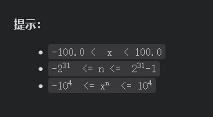

- 题目给点数值范围具有迷惑性，实际会溢出。

- 注意n是负数的处理，转为正数情况最后再求倒数
- 最小负数转正数会溢出，用Long过度
- 用快速二分时，可以用位运算优化除2，求余判断
  - $>>2$
  - $n\&1$

````java
class Solution {
    public double myPow(double x, int n) {
        if(x == 0) return 0;
        long b = n;
        double res = 1.0;
        if(b < 0) {
            x = 1 / x;
            b = -b;
        }
        while(b > 0) {
            if((b & 1) == 1) res *= x;
            x *= x;
            b >>= 1;
        }
        return res;
    }
}

作者：jyd
链接：https://leetcode-cn.com/problems/shu-zhi-de-zheng-shu-ci-fang-lcof/solution/mian-shi-ti-16-shu-zhi-de-zheng-shu-ci-fang-kuai-s/
来源：力扣（LeetCode）
著作权归作者所有。商业转载请联系作者获得授权，非商业转载请注明出处。
    
   // my second
    
 class Solution {
    public double myPow(double x, int n) {
        if(x==1) return x ;
        if(x==0) return 0;
        if(n == 1) return x;
        if(n== -1) return 1.0/x;
        if(n==0) return 1;

       
        if(n%2 ==0){
            double tem =  myPow(x,n/2);
            return tem*tem;
        }else{
            if(n<0){
                double tem2 = myPow(x,(n+1)/2);
                 return tem2 * tem2*(1.0/x);
            }else{
                double tem2 = myPow(x,(n-1)/2);
                return tem2*tem2*x;
            }    
        }
        
    }
}
````


### [剑指 Offer 33. 二叉搜索树的后序遍历序列](https://leetcode-cn.com/problems/er-cha-sou-suo-shu-de-hou-xu-bian-li-xu-lie-lcof/)

- done

### *[剑指 Offer 17. 打印从1到最大的n位数](https://leetcode-cn.com/problems/da-yin-cong-1dao-zui-da-de-nwei-shu-lcof/)

- 考虑大数

  - 用字符数组存储
  - 方法一：在数组上模拟加法
  - 方法二：看作求全排列，递归求解
  - 两个细节
    - 因为用数组模拟，取结果时去掉前导无效‘0’
    - 用方法一，如何快速O(1)内，判断加法结束，e.g., n=3,加法后得数1000时结束。

  ````java
  package SwordOf.DivideAndConquerAlgorithm;
  
  import org.junit.Test;
  
  import javax.print.attribute.standard.NumberUp;
  
  public class PrintNumbers {
      /*考虑大数的情况*/
      /*方法1：字符串模拟加法的做法*/
      /*方法2：转换成全排列来做*/
      /*因为考虑大数的情况，将数字转化在字符串数组,所以打印/存储的时候，需要去掉前导0*/
      private String[] res;
      private int cou = 0;
  
      public String[] printNumbers(int n) {
          char[] number = new char[n];
          res = new String[(int) Math.pow(10, n) - 1];
          allPermutation(number, 0, n);
          return res;
  
      }
  
      private void allPermutation(char[] number, int index, int n) {
          if (index == n) {
              printNum(number);
              return;
          }
          for (int i = 0; i < 10; i++) {
              number[index] = (char) (i + '0');
              allPermutation(number, index + 1, n);
          }
      }
  
      private void printNum(char[] number) {
          StringBuilder sb = new StringBuilder();
          boolean allZero = true;
          boolean invalidZeroIgnore = true;
          for (int i = 0; i < number.length; i++) {
              if (invalidZeroIgnore && number[i] != '0') {
                  invalidZeroIgnore = false;
                  sb.append(number[i]);
                  allZero = false;
                  continue;
              }
              if(!invalidZeroIgnore)  sb.append(number[i]);
          }
          if (allZero == false) {
              res[cou] = sb.toString();
              cou++;
          }else return;
      }
  
      @Test
      public void test() {
          int n = 2;
          String[] res = printNumbers(n);
          for (String e : res
               ) {
              System.out.println(e);
          }
      }
  
  }
  
  ````

### *[剑指 Offer 51. 数组中的逆序对](https://leetcode-cn.com/problems/shu-zu-zhong-de-ni-xu-dui-lcof/)

思路一：两层循环，$O(logN)$

思路二：基于归并排序的过程，累加逆序对数量

- 理解归并过程中，逆序对贡献度的计算方法
- 归并算法

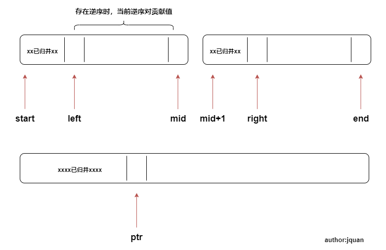

````java
package SwordOf.DivideAndConquerAlgorithm;

import org.junit.Test;


public class ReversePairs {

    public int reversePairs(int[] nums) {
        if(nums.length==0 || nums==null) return 0;
        return reverseProcess(nums,0,nums.length-1);
    }

    private int reverseProcess(int[] nums,int start,int end){
        if(start == end) return 0;
        int mid = (start+end)/2;
        int left = start,right=mid+1;//分为[left,mid][mid+1,end]
        int res = reverseProcess(nums,start,mid)+reverseProcess(nums,mid+1,end);

        int[] temArr = new int[end-start+1];
        int ptr=0,reverseContribute=0;
        while(left<=mid && right<=end){
            if(nums[right]<nums[left]){
                reverseContribute = mid-left+1;
                res+= reverseContribute;
                temArr[ptr++] = nums[right++];
            }else if(nums[right]>nums[left]){
                temArr[ptr++] = nums[left++];
            }else{
                temArr[ptr++] = nums[left++];
            }
        }
        while(left <= mid) temArr[ptr++] = nums[left++];
        while(right<= end) temArr[ptr++] = nums[right++];
        for(int i=start;i<=end;i++){
            nums[i] = temArr[i-start];
        }
        return res;

    }

    @Test
    public void test(){
        int[] nums = new int[]{7,6,5,4};
        int res = reversePairs(nums);
        System.out.println(res);
    }
}

````


## 位运算

### *[剑指 Offer 15. 二进制中1的个数](https://leetcode-cn.com/problems/er-jin-zhi-zhong-1de-ge-shu-lcof/)

- 循环检测有多少个1，$O(32),O(1)$

  ````java
  public class Solution {
      public int hammingWeight(int n) {
          int ret = 0;
          for (int i = 0; i < 32; i++) {
              if ((n & (1 << i)) != 0) {
                  ret++;
              }
          }
          return ret;
      }
  }
  
  作者：LeetCode-Solution
  链接：https://leetcode-cn.com/problems/er-jin-zhi-zhong-1de-ge-shu-lcof/solution/er-jin-zhi-zhong-1de-ge-shu-by-leetcode-50bb1/
  来源：力扣（LeetCode）
  著作权归作者所有。商业转载请联系作者获得授权，非商业转载请注明出处。
  ````

  

  - 利用 n&(n-1)会将**n最低位的1变为0**，循环的次数说明有多少个1，$O(K),O(1),K是n中1个个数$

    ````java
    public class Solution {
        public int hammingWeight(int n) {
            int ret = 0;
            while (n != 0) {
                n &= n - 1;
                ret++;
            }
            return ret;
        }
    }
    
    作者：LeetCode-Solution
    链接：https://leetcode-cn.com/problems/er-jin-zhi-zhong-1de-ge-shu-lcof/solution/er-jin-zhi-zhong-1de-ge-shu-by-leetcode-50bb1/
    来源：力扣（LeetCode）
    著作权归作者所有。商业转载请联系作者获得授权，非商业转载请注明出处。
    ````


### *[剑指 Offer 65. 不用加减乘除做加法](https://leetcode-cn.com/problems/bu-yong-jia-jian-cheng-chu-zuo-jia-fa-lcof/)

- 从十进制的加法过程3步骤分析：先不考虑进位的加法，再考虑产生进位的值，再把两者相加
- 二进制也是。同时，二进制运算有如下性质
  - 加法，异或运算
  - 进位：（与运算）<<1 

````java
class Solution {
    public int add(int a, int b) {
        int sum,carry;
        do{
            sum = a^b; //符号位参与吗
            carry = (a&b)<<1; 
            a = sum;
            b = carry;
        }while(carry!=0);
        return sum;
    }
}
````

- JAVA中，负数用补码的形式表示，所以加法和减法的处理是统一的；对负数的处理也是统一的。


### *[剑指 Offer 56 - I. 数组中数字出现的次数](https://leetcode-cn.com/problems/shu-zu-zhong-shu-zi-chu-xian-de-ci-shu-lcof/)

````text
一个整型数组 nums 里除两个数字之外，其他数字都出现了两次。请写程序找出这两个只出现一次的数字。要求时间复杂度是O(n)，空间复杂度是O(1)。 

示例 1：

输入：nums = [4,1,4,6]
输出：[1,6] 或 [6,1]
示例 2：
输入：nums = [1,2,10,4,1,4,3,3]
输出：[2,10] 或 [10,2]
 
限制：

2 <= nums.length <= 10000


来源：力扣（LeetCode）
链接：https://leetcode-cn.com/problems/shu-zu-zhong-shu-zi-chu-xian-de-ci-shu-lcof
著作权归领扣网络所有。商业转载请联系官方授权，非商业转载请注明出处。
````

**思路**

- 利用异或的性质。如果题目改为，数组中只有1个数字不同，那么我们对数组中的数字累积异或，结果就是那个唯一不同的数。对于此题，题目变成了有两个异或的数。如果我们能够将他们分别分开，将原数组分成2个子数组，并且每个子数组中包含一个不同的数，以及两两相同的数，那么分别对子数组累计异或，就能找到这两个数了。
- 我们可以对原数组累计异或，得到结果tem。 观察tem,寻找第一个不为0的二进制位（从右往左更方便，从左往右也可以）。
- **相同的两个数，该位一定是相同的。**一定会被分在同一边（*但相同的数不是平均分配到两个“逻辑子数组”的，要注意；既逻辑子数组长度不同。取决这个数字该到底是0还是1*。但是两个相同数总是分在同一边，相与为0）。对于两个不同的数，因为该位结果为1，所以那两个不同的数，该位也是不同的。
- **相同的两个数，该位一定是相同的, 与tem相与，会有一样的结果**。我们可以借此特征将两个相同的数据分流到同一个逻辑子数组中。而两个不同的数，该位一定是不同的，于tem相与，会有不同的结果。我们可以借此特征将两个不相同的数据分流到不同的逻辑子数组中。
- 所以，我们根据这个特点，逻辑上就可以把数组中的数全部按我们想要的分成两组了。该位为0的数，以及该位为1的数。

````java
class Solution {
    public int[] singleNumbers(int[] nums) {
        int tem = nums[0];
        for(int i=1;i<nums.length;i++){
            tem = tem ^ nums[i];
        }
        //寻找结果的二进制表示第一个不为0的位置,从右边开始更方便；
        int findSup = 1;
        while((tem & findSup) == 0){
            findSup = findSup<<1;
        }
        int subNumRes1=0,subNumRes2=0;
        for(int i=0;i<nums.length;i++){
            /**
            if((nums[i]&findSup) == 0 ) subNumRes1 ^= nums[i];
            if((nums[i]&findSup) == 1 ) subNumRes2 ^= nums[i];
            */
            //注意(nums[i]&findSup) != 0的反面，是那一位为1，不是整个数值为1，所以上面注释的写法得到的结果是不一定对的
            if((nums[i]&findSup) != 0 ) subNumRes1 ^= nums[i];
            else subNumRes2 ^= nums[i];
        }
        return new int[]{subNumRes1,subNumRes2};

    }
}
````

### *[剑指 Offer 56 - II. 数组中数字出现的次数 II](https://leetcode-cn.com/problems/shu-zu-zhong-shu-zi-chu-xian-de-ci-shu-ii-lcof/)

````text
在一个数组 nums 中除一个数字只出现一次之外，其他数字都出现了三次。请找出那个只出现一次的数字。
示例 1：

输入：nums = [3,4,3,3]
输出：4

示例 2：

输入：nums = [9,1,7,9,7,9,7]
输出：1
````

**note:**实际上，只需要修改求余数值 mmm ，即可实现解决 **除了一个数字以外，其余数字都出现 mmm 次** 的通用问题。

**思路**

- 如果一个数字出现3次，那么**他的二进制表示的每一位也都出现3次**。
- 把每一位的数字和加起来，如果每一位的和都能被3整除，那么那个只出现一次的数字在该位的二进制数是0，反之是1 。
- 注意：一个for循环的次数如果是固定的，那么它是 $O(1)$的
- 二进制的加权运算和十进制一样：result = (result<<1)+bit //乘2累加，注意移位运算符的时间复杂度很低

````java
//second
class Solution {
    /**
    注意 nums[i]是正数 */
    public int singleNumber(int[] nums) {
        int[] bitcou = new int[32];
        for(int i=0;i<nums.length;i++){
            int check = 1;
            for(int j=0;j<31;j++){ //实际符号位不表示；
                if( (nums[i] & check) !=0 ) bitcou[j]++; // 判断条件是 !=0 而非 == 1 ****!
                check = check << 1;
            }
        }
        int factor = 1;
        int res=0;
        for(int i=0;i<31;i++){
            if(i!=0) factor*=2;
            if(bitcou[i] %3 == 1) res = res+factor;
        }
        return res;
    }
}
//first
class Solution {
    public int singleNumber(int[] nums) {
        
        int[] bitCou = new int[32];
       
        for(int i=0;i<nums.length;i++){
            int bitMask = 1;
            //第二个for循环的时间复杂度是 O（1）
            for(int j=31;j>=0;j--){
                int bit = nums[i] & bitMask;
                if(bit != 0) bitCou[j]+=1;
                bitMask = bitMask<<1;
            }
        }

        int result = 0;
        for(int j=0;j<32;j++){
            int bit = bitCou[j]%3;
            result = (result<<1)+bit;//*2+该位； 注意移位运算符的优先级非常地，比==还低，(result<<1)+bit 不加括号就错了 
        }
        return result;

    }

}
````

## 数学

### *[剑指 Offer 39. 数组中出现次数超过一半的数字](https://leetcode-cn.com/problems/shu-zu-zhong-chu-xian-ci-shu-chao-guo-yi-ban-de-shu-zi-lcof/)

- 方法一：快速选择中位数
- **方法二：巧妙的统计**

````java
package SwordOf.math;

import org.junit.Test;

import java.util.Random;

public class MajorityElement2 {

    public int majorityElement(int[] nums) {
        int compareCurNum = nums[0];
        int curNumCou = 1;
        for(int i=1;i<nums.length;i++){
            if(curNumCou == 0){
                compareCurNum = nums[i];
                curNumCou++;
            }else{
                if(nums[i]==compareCurNum) curNumCou++;
                else{
                    curNumCou--;
                }
            }

        }
        return compareCurNum;
    }

    @Test
    public void test(){
        int[] nums = new int[]{3,2,3};
        int res = majorityElement(nums);
        System.out.println(res);
    }
    @Test public void test2(){
        Random random = new Random();
        for(int i =0;i<20;i++){
            int pos = 0+random.nextInt(2-0+1);
            System.out.println(pos);
        }


    }
}
/***************方法二***************/
package SwordOf.math;

import org.junit.Test;

import java.util.Random;

public class MajorityElement {

    public int majorityElement(int[] nums) {
        //解法一 用基于快排的随机快速选择，选择中位数
        int k = nums.length/2;
        return quickSelectKpos(nums,0,nums.length-1,k);


    }
    public int quickSelectKpos(int[]nums,int start,int end,int k){
        int partiPos = randomPartition(nums,start,end);
        if(partiPos == k) return nums[k];
        else if(partiPos <k ){
            return quickSelectKpos(nums,partiPos+1,end,k);
        }else return quickSelectKpos(nums,start,partiPos-1,k);
    }
    public int randomPartition(int[] nums,int start,int end){
        if(start>=end) return start;

        Random random = new Random();
        int exchangePos = start + random.nextInt(end-start+1);
        int sentinel = nums[exchangePos];
        int tem = nums[start];
        nums[start] = nums[exchangePos];
        nums[exchangePos] = tem;

        int left = start;
        int right = end;
        while(left<right){
            while(nums[right]>=sentinel && left<right) right--;
            nums[left] = nums[right];
            while(nums[left]<= sentinel && left<right) left++;
            nums[right] = nums[left];
        }
        //最后这里忘记放置哨兵了
        nums[left] = sentinel;
        return left;
    }
    @Test
    public void test(){
        int[] nums = new int[]{3,2,3};
        int res = majorityElement(nums);
        System.out.println(res);
    }
    @Test public void test2(){
        Random random = new Random();
        for(int i =0;i<20;i++){
            int pos = 0+random.nextInt(2-0+1);
            System.out.println(pos);
        }


    }
}


````


### [剑指 Offer 66. 构建乘积数组](https://leetcode-cn.com/problems/gou-jian-cheng-ji-shu-zu-lcof/)

- 动态规划

- 数学

  - 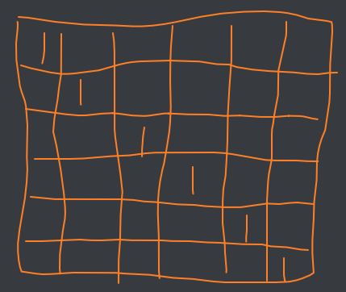
  - 对角线元素填充一，把要求解的res[i] 看作左右两边的乘积
  - 利用动态规划节约空间复杂度

  ````java
  //second
  class Solution {
      public int[] constructArr(int[] a) {
          int [] leftCur = new int [a.length];
          int factor=1;
          for(int i=0;i<a.length;i++){
              factor *= a[i];
              leftCur[i] = factor;
          }
          factor = 1;
          for(int i=a.length-1;i>=0;i--){
              if(i == a.length -1){
                  leftCur[i] =  leftCur[i-1];
                  
              }else if( i == 0 ){
                  leftCur[i] = factor;
                  continue;
              }else{
                  leftCur[i] = leftCur[i-1]*factor;
              }
              factor *= a[i];
          }
        return leftCur;
  
      }
  }
  
  //first
  class Solution {
      public int[] constructArr(int[] a) {
          if(a.length ==0) return new int[0];
  
          int len = a.length;
          int[] res = new int[len];
          res[0]=1;
  
          //先求左边乘积
          for(int i=0;i<len-1;i++){
              res[i+1] = res[i]*a[i];
          }
  
          int temRight = a[len-1];
          for(int i=len-2;i>=0;i--){
             res[i] = res[i]*temRight;
             temRight *= a[i];
          }
          return res;
      }
  }
  ````
  
  ### [剑指 Offer 57 - II. 和为s的连续正数序列](https://leetcode-cn.com/problems/he-wei-sde-lian-xu-zheng-shu-xu-lie-lcof/)
  
  - done
  - java返回 int[][]注意一下

### *[剑指 Offer 62. 圆圈中最后剩下的数字-与瑟夫环问题](https://leetcode-cn.com/problems/yuan-quan-zhong-zui-hou-sheng-xia-de-shu-zi-lcof/)

- 推导
- 
- 剑指的分析
- 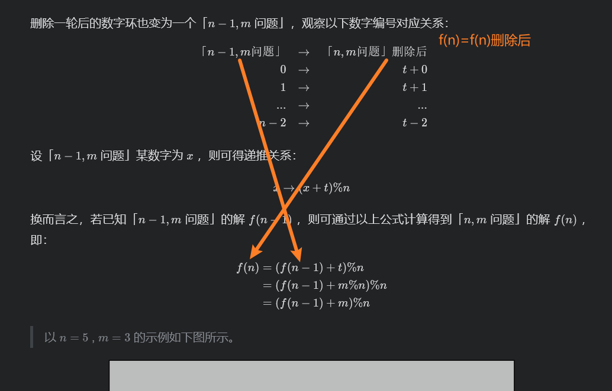
- 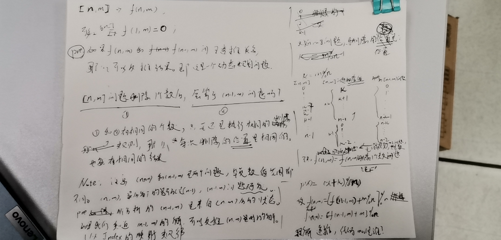

````java
class Solution {
    public int lastRemaining(int n, int m) {
        int f = 0;
        for (int i = 2; i != n + 1; ++i) {
            f = (m + f) % i;
        }
        return f;
    }
}

作者：LeetCode-Solution
链接：https://leetcode-cn.com/problems/yuan-quan-zhong-zui-hou-sheng-xia-de-shu-zi-lcof/solution/yuan-quan-zhong-zui-hou-sheng-xia-de-shu-zi-by-lee/
来源：力扣（LeetCode）
著作权归作者所有。商业转载请联系作者获得授权，非商业转载请注明出处。
    
    class Solution {
    public int lastRemaining(int n, int m) {
        return f(n, m);
    }

    public int f(int n, int m) {
        if (n == 1) {
            return 0;
        }
        int x = f(n - 1, m);
        return (m + x) % n;
    }
}

作者：LeetCode-Solution
链接：https://leetcode-cn.com/problems/yuan-quan-zhong-zui-hou-sheng-xia-de-shu-zi-lcof/solution/yuan-quan-zhong-zui-hou-sheng-xia-de-shu-zi-by-lee/
来源：力扣（LeetCode）
著作权归作者所有。商业转载请联系作者获得授权，非商业转载请注明出处。
    
````

### *[剑指 Offer 43. 1～n 整数中 1 出现的次数](https://leetcode-cn.com/problems/1nzheng-shu-zhong-1chu-xian-de-ci-shu-lcof/)

````java
输入一个整数 n ，求1～n这n个整数的十进制表示中1出现的次数。

例如，输入12，1～12这些整数中包含1 的数字有1、10、11和12，1一共出现了5次。
````

- 推导出每一数位1出现的次数计算公式 

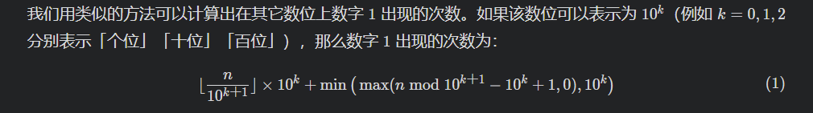

````java
//mys:
public int countDigitOne(int n) {
        int k = 0;
        int res = 0;

        while(Math.pow(10.0,k)<=n){
            res+=Math.floor(n/Math.pow(10,k+1))*Math.pow(10,k);//完整循环部分;一定要用floor函数，因为结果在中间过程会被转换为double
            res+=Math.min(Math.max(n%Math.pow(10.0,k+1)-Math.pow(10.0,k)+1,0),Math.pow(10.0,k));//不完整循环部分
            k++;
        }
//        res+=Math.min(Math.max(n%Math.pow(10.0,k+1)-Math.pow(10.0,k)+1,0),Math.pow(10.0,k));
        return res;

    }

class Solution {
    public int countDigitOne(int n) {
        // mulk 表示 10^k
        // 在下面的代码中，可以发现 k 并没有被直接使用到（都是使用 10^k）
        // 但为了让代码看起来更加直观，这里保留了 k
        long mulk = 1;
        int ans = 0;
        for (int k = 0; n >= mulk; ++k) {
            ans += (n / (mulk * 10)) * mulk + Math.min(Math.max(n % (mulk * 10) - mulk + 1, 0), mulk);
            mulk *= 10;
        }
        return ans;
    }
}

作者：LeetCode-Solution
链接：https://leetcode-cn.com/problems/1nzheng-shu-zhong-1chu-xian-de-ci-shu-lcof/solution/1n-zheng-shu-zhong-1-chu-xian-de-ci-shu-umaj8/
来源：力扣（LeetCode）
著作权归作者所有。商业转载请联系作者获得授权，非商业转载请注明出处。
````

### [剑指 Offer 44. 数字序列中某一位的数字](https://leetcode-cn.com/problems/shu-zi-xu-lie-zhong-mou-yi-wei-de-shu-zi-lcof/)

- done

  ````text
  数字以0123456789101112131415…的格式序列化到一个字符序列中。在这个序列中，第5位（从下标0开始计数）是5，第13位是1，第19位是4，等等。
  
  请写一个函数，求任意第n位对应的数字。
  
  来源：力扣（LeetCode）
  链接：https://leetcode-cn.com/problems/shu-zi-xu-lie-zhong-mou-yi-wei-de-shu-zi-lcof
  著作权归领扣网络所有。商业转载请联系官方授权，非商业转载请注明出处。
  ````

  ​	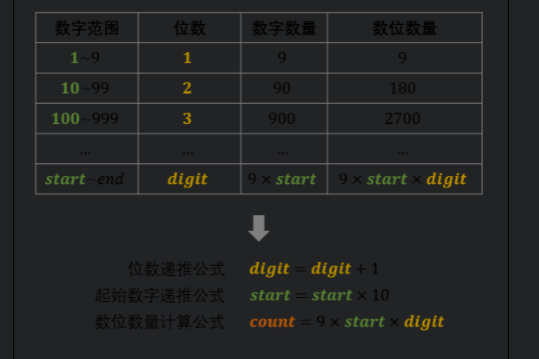

  ````java
  package SwordOf.math;
  
  import org.junit.Test;
  
  public class FindNthDigit {
      public int findNthDigit(int n) {
          int k=1,record = n;
          int resNum=0,resDigit = 0;
  
  
          while(Math.pow(10,k)*k<=n){
               n-=(Math.pow(10,k)- (k-1==0?0:Math.pow(10,k-1)))*k;
              k++;
          }
          int couDigit = n%k;
          int couNum = n/k;
          int base = k==1?0:(int)Math.pow(10,k-1);
          resNum = base+couNum;
          String resNumStr = String.valueOf(resNum);
          resDigit = resNumStr.charAt(couDigit)-'0';
          return resDigit;
      }
      @Test
      public void test(){
          int n=1000;
          int res = findNthDigit(n);
          System.out.println(res);
      }
  }
  //2
  class Solution {
      public int findNthDigit(int n) {
          int digit = 1;
          long start = 1;
          long count = 9;
          while (n > count) { // 1.
              n -= count;
              digit += 1;
              start *= 10;
              count = digit * start * 9;
          }
          long num = start + (n - 1) / digit; // 2.
          return Long.toString(num).charAt((n - 1) % digit) - '0'; // 3.
      }
  }
  
  作者：jyd
  链接：https://leetcode-cn.com/problems/shu-zi-xu-lie-zhong-mou-yi-wei-de-shu-zi-lcof/solution/mian-shi-ti-44-shu-zi-xu-lie-zhong-mou-yi-wei-de-6/
  来源：力扣（LeetCode）
  著作权归作者所有。商业转载请联系作者获得授权，非商业转载请注明出处。
  ````

  


## 模拟

### [剑指 Offer 29. 顺时针打印矩阵](https://leetcode-cn.com/problems/shun-shi-zhen-da-yin-ju-zhen-lcof/)

- done


### *[剑指 Offer 31. 栈的压入、弹出序列](https://leetcode-cn.com/problems/zhan-de-ya-ru-dan-chu-xu-lie-lcof/)

- 算法-没想到

- 实现代码-做的不好；

- 小结：模拟就是还原这个过程

  

````java
class Solution {
    public boolean validateStackSequences(int[] pushed, int[] popped) {

        Stack<Integer> stack = new Stack<>(); 

        int i=0;
        //不管成不成功，都是要全部入栈的
        for(int num : pushed){
            stack.push(num);
            while(!stack.isEmpty() && stack.peek()==popped[i]){
                stack.pop();
                i++;
            }
        }
        if(stack.isEmpty()) return true;
        else return false;       
        
    }
}
````

### [剑指 Offer 67. 把字符串转换成整数](https://leetcode-cn.com/problems/ba-zi-fu-chuan-zhuan-huan-cheng-zheng-shu-lcof/)

- hard done ； 这种题要怎么做才好
  - 除了把大问题切分成几个部分做判断，每个细分部分，又会有很多细节
- Good 方法和逻辑（参考题解）


````java

class Solution {
    public int strToInt(String str) {
        char[] c = str.trim().toCharArray();
        if(c.length == 0) return 0;
        int res = 0, bndry = Integer.MAX_VALUE / 10;
        int i = 1, sign = 1;
        if(c[0] == '-') sign = -1;
        else if(c[0] != '+') i = 0;
        for(int j = i; j < c.length; j++) {
            if(c[j] < '0' || c[j] > '9') break;
            if(res > bndry || res == bndry && c[j] > '7') return sign == 1 ? Integer.MAX_VALUE : Integer.MIN_VALUE;
            res = res * 10 + (c[j] - '0');
        }
        return sign * res;
    }
}

作者：jyd
链接：https://leetcode-cn.com/problems/ba-zi-fu-chuan-zhuan-huan-cheng-zheng-shu-lcof/solution/mian-shi-ti-67-ba-zi-fu-chuan-zhuan-huan-cheng-z-4/
来源：力扣（LeetCode）
著作权归作者所有。商业转载请联系作者获得授权，非商业转载请注明出处。
/******************************************/
package SwordOf.simulation;

import org.junit.Test;

public class StrtoInt {
    public int strToInt(String str) {
        long res = 0;
        boolean sym = true;
        boolean symHaveCheck =false;
        boolean checkRes = true;

        boolean haveMeetFirstLeagal = false;

        for(int i=0;i<str.length();i++){
            char ch = str.charAt(i);
            if(haveMeetFirstLeagal==false &&( ch=='+'||ch=='-'||(ch>='0' && ch<='9'))){
                haveMeetFirstLeagal = true;
            }
            //如果前导无效字符判定还没结束，且前导字符不合法，返回0
            if(haveMeetFirstLeagal==false){
                if(!preLegalChar(ch)) return 0;

            }else{
                if(symHaveCheck==false && (ch>='0'&&ch<='9')){
                    symHaveCheck = true;
                }
                if((ch=='+'||ch=='-') && symHaveCheck == false){
                    symHaveCheck = true;
                    if(ch=='-') sym = false;
                    continue;
                }
                if(ch>='0'&&ch<='9'){
                    res = res*10+ch-'0';
                    if(res>Integer.MAX_VALUE) break;
                }else{
                    break;
                }
            }

        }
        if(sym){
            if(res>Integer.MAX_VALUE) return Integer.MAX_VALUE;
            return (int)res;
        }else{
            res = -res;
            if(res<Integer.MIN_VALUE) return Integer.MIN_VALUE;
            else return (int)(res);
        }
    }


    private boolean preLegalChar(char ch){
        if(ch==' ') return true;
        else return false;
    }
    @Test
    public void test(){
        String str = "9223372036854775808";//-9,223,372,036,854,775,808 ~9,223,372,036,854,775,807
        int res = strToInt(str);
        System.out.println(res);
    }
}

````


# 背包九讲

https://www.acwing.com/problem/

## 01 背包问题

问题描述，表示

基本思路

可优化的时间复杂度

**初始化细节**

- 有的题目则并没有要求必须把背包装满
  - F[0...V] 均为0 //<u>F[ v ] 的含义知道</u>
- 有的要求“恰好装满背包”时的最优解
  -  **除了** F[0]为0，其余F[1...V] **均为负无穷**
  - 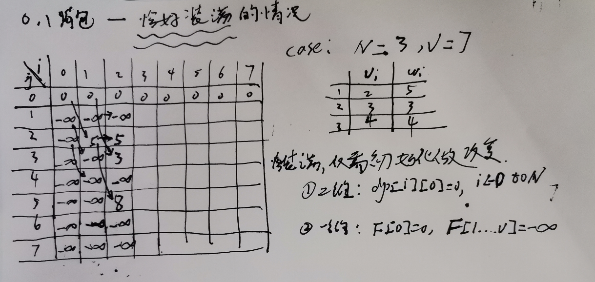

二维，01背包，不要求装满 和 要求恰好装满

````java
import java.util.*;

class Main{
    
    public static void main(String[] args){
        Scanner sc = new Scanner(System.in);
        int N = sc.nextInt();   //物品数量
        int V= sc.nextInt();    //背包体积
        int[][] arr = new int[N+1][2];
        for(int i=1;i<=N;i++){
            arr[i][0] = sc.nextInt();//vi 体积
            arr[i][1] = sc.nextInt(); //wi 价值
            if(i!=N) sc.nextLine();
        }
        
    //dp[i][j]: 考虑0-i 个物品，背包容量为j 时的最大收益
    //dp[i][j]: dp[i][j] = max{dp[i-1][j],dp[i-1][j-ci]+wi}
        int[][] dp = new int[N+1][V+1];
        
    //非要求恰好装满背包的初始化：
        for(int j=0;j<=V;j++){
            dp[0][j] = 0; //考虑0件物品的状态
        }
        for(int i=0;i<=N;i++){
            dp[i][0] = 0; // 容量为0背包，最大收益始终是0
        }
        
    //**如果要求恰好装满背包的最大值；除了F[0] = 0; 其余F[1...V]均初始化为负无穷
    //二维的话 dp[i][0] = 0, i:0 to N ; dp[0][v] = min, v:1 to V
    /*
        for(int j=1;j<=V;j++){
            dp[0][j] = min;
        }
        for(int i=0;i<=N;i++){
            dp[i][0] = 0; // 容量为0背包，最大收益始终是0
        }
    */
    
    //dp 求解
        for(int i=1;i<=N;i++){
            for(int j=1;j<=V;j++){
                if(j>=arr[i][0]){
                  dp[i][j] = Math.max(dp[i-1][j],dp[i-1][j-arr[i][0]]+arr[i][1]);  
                }else{
                    dp[i][j] = dp[i-1][j];
                }
                
            }
        }
        System.out.println(dp[N][V]);
    
        
    }
}
````

一维，01背包，不要求装满 和 要求恰好装满

````java
import java.util.*;

class Main{
    
    public static void main(String[] args){
        Scanner sc = new Scanner(System.in);
        int N = sc.nextInt();   //物品数量
        int V= sc.nextInt();    //背包体积
        int[][] arr = new int[N+1][2];
        for(int i=1;i<=N;i++){
            arr[i][0] = sc.nextInt();//vi 体积
            arr[i][1] = sc.nextInt(); //wi 价值
            if(i!=N) sc.nextLine();
        }
        
    //优化空间复杂度
    int[] F = new int[V+1];
    //不要求装满
    for(int i=0;i<=V;i++) F[i]=0;
    /*要求恰好装满
    for(int i=0;i<=V;i++){
        if(i==0) F[i]=0;
        else F[i] = min;
    }
    */
    for(int i=1;i<=N;i++){
        for(int j=V;j>=0;j--){ //记住需要V往下更新
            if(j >= arr[i][0]) F[j] = Math.max(F[j],F[j-arr[i][0]]+arr[i][1]);
            else F[j] = F[j];
        }
    }
    System.out.println(F[V]);
        
    }
}
````

````text
关于要求恰好装满情况的理解：
初始化的dp 数组事实上就是在没有任何物品可以放入背包时的合法状态。如果要求背包恰好装满，那么此时只有容量为0的背包可以在什么也不装的状态下被 “恰好装满” ，此时背包价值为0。其他容量的背包均没有合法的解，属于未定义的状态，所以都应该被赋值为 −∞ 。当前的合法解，一定是从之前的合法状态推得的

如果背包并非必须被装满，那么任何容量的背包都有一个合法解 “什么也不装”，这个解的价值为0,所以初始化时状态的值也就全部为0了
````


## 完全背包问题

**一、朴素二维解法**考虑每件物品可能是件数

$F[i,v] = max{F[i-1,v],F[i-1,v-k*ci]+k*wi}$

上述转移方程用代码表示：

```java
  dp[i][j] =  Math.max(dp[i][j],dp[i-1][j-k*arr[i][0]]+k*arr[i][1]);
 //Math.max 的右边包含了全部情况，即F[i-1,v]的情况,Math.max左边相当于记录最优解
```

全部代码

````java
package codefortopic.PackPro;

import java.util.Scanner;

/** 完全背包问题：每件物品有无限件 二维朴素做法 */
public class CompletePack01 {
  public static void main(String[] args) {
    Scanner sc = new Scanner(System.in);
    int N = sc.nextInt();
    int V = sc.nextInt();
    int[][] arr = new int[N + 1][2];
    for (int i = 1; i <= N; i++) {
      arr[i][0] = sc.nextInt();//vi 体积
      arr[i][1] = sc.nextInt(); //wi 价值
      if (i != N) sc.nextLine();
    }

    int[][] dp = new int[N + 1][V + 1];
    //初始化为0，都不用初始化了

    for (int i = 1; i <= N; i++) {
      for (int j = 1; j <= V; j++) {
        //该物品可能拿的件数
        for (int k = 0; k <= j / arr[i][0]; k++) {
          //体现的正是：F[i,v] = max{F[i-1,v-kCi]+kWi}
          //Math.max 的右边包含了全部情况，Math.max左边相当于记录最优解
          dp[i][j] = Math.max(dp[i][j], dp[i - 1][j - k * arr[i][0]] + k * arr[i][1]);
        }
      }
    }
    System.out.println(dp[N][V]);
  }
}

````

二、 一维DP

为什么这个算法就可行呢？首先想想为什么 01 背包中要按照 v 递减的次序来循环。 让 v 递减是为了保证第 i 次循环中的状态 F[i, v] 是由状态 F[i − 1, v − Ci] 递推而来。 换句话说，这正是为了保证每件物品只选一次，<u>保证在考虑 “选入第 i 件物品”  这件策 略时，依据的是一个绝无已经选入第 i 件物品的子结果 F[i − 1, v −Ci]</u>。而现在完全背 包的特点恰是每种物品可选无限件，<u>所以在考虑“加选一件第 i 种物品”这种策略时， 却正需要一个可能已选入第 i 种物品的子结果 F[i, v −Ci]</u>，所以就可以并且必须采用 v 递增的顺序循环。这就是这个简单的程序为何成立的道理。

$F[i,v]=max(F[i-1,v],F[i,v-Ci]+wi)$

从代码上实现就是：

```
for(int i=1;i<=N;i++){
    //理解此题解最重要的是理解：为什么v正向递增就可以
    //01背包一维，v递减是为了保证，每次状态更新是从拿了 1 件该物品来的，在完全背包问题，没有件数的限制
    for(int j=1;j<=V;j++){
        if(j-arr[i][0]>=0){
            F[j] = Math.max(F[j],F[j-arr[i][0]]+arr[i][1]);
        }
    }
}
```

完整代码

````java
package codefortopic.PackPro;

import java.util.Scanner;

/** 完全背包问题：每件物品有无限件  一维做法 */
public class CompletePack02 {
  public static void main(String[] args) {
    Scanner sc = new Scanner(System.in);
    int N = sc.nextInt();
    int V = sc.nextInt();
    int[][] arr = new int[N + 1][2];
    for (int i = 1; i <= N; i++) {
      arr[i][0] = sc.nextInt();//vi 体积
      arr[i][1] = sc.nextInt(); //wi 价值
      if (i != N) sc.nextLine();
    }

    int[] F = new int[V + 1];
    //初始化为0，都不用初始化了

    for (int i = 1; i <= N; i++) {
      //理解此题解最重要的是理解：为什么v正向递增就可以
      //01背包一维，v递减是为了保证，每次状态更新是从拿了 1 件该物品来的，在完全背包问题，没有件数的限制
      for (int j = 1; j <= V; j++) {
        if (j - arr[i][0] >= 0) {
          F[j] = Math.max(F[j], F[j - arr[i][0]] + arr[i][1]);
        }
      }
    }
    System.out.println(F[V]);
  }
}

````

**NOTE:** 

- 完全背包可以转为多重背包，再转为0 1 背包


## 多重背包问题

即 每件物品有一定是数量。朴素解法就和完全背包问题一样，注意物品数量上限就好

````java
package codefortopic.PackPro;

import java.util.Scanner;

/**有 N 种物品和一个容量是 V 的背包。

 第 i 种物品最多有 si 件，每件体积是 vi，价值是 wi。

 求解将哪些物品装入背包，可使物品体积总和不超过背包容量，且价值总和最大。
 输出最大价值。

 朴素解法， 和朴素完全背包问题一样，注意物品数量上界 */
public class MultiPack01 {
  public static void main(String[] args) {
    Scanner sc = new Scanner(System.in);
    int N = sc.nextInt();
    int V = sc.nextInt();
    int[][] arr = new int[N + 1][3];
    for (int i = 1; i <= N; i++) {
      arr[i][0] = sc.nextInt();//vi 体积
      arr[i][1] = sc.nextInt(); //wi 价值
      arr[i][2] = sc.nextInt(); // si 数量
      if (i != N) sc.nextLine();
    }
    int[][] dp = new int[N + 1][V + 1];
    for (int i = 1; i <= N; i++) {
      for (int j = 1; j <= V; j++) {
        for (int k = 0; k <= arr[i][2]; k++) {
          if (j >= k * arr[i][0]) dp[i][j] = Math.max(dp[i][j], dp[i - 1][j - k * arr[i][0]] + k * arr[i][1]);
        }
      }
    }
    System.out.println(dp[N][V]);

  }
}

````

**优化1: 使用二进制转为 01 背包**

**优化时间复杂度为$O(V \sum{M_i})$ , 原来是 $O(V\sum{M_i})$, $M_i 表示第i种物品的数量$**

理解：将多件同种物品抽象为多件不同物品的01问题, 于是问题就转为 0 1背包问题

````TEXT
二进制思想：

假设有 1000 个苹果，现在要取n个苹果，如何取？朴素的做法应该是将苹果一个一个拿出来，直到n个苹果被取出来。
再假设有 1000 个苹果和10只箱子，利用箱子进行某些预工作，然后如何快速的取出n个苹果呢？So..可以在每个箱子中放 2^i (i<=0<=n)个苹果，也就是 1、2、4、8、16、32、64、128、256、489（n减完之前的数之后不足 2^i，取最后剩余的数），相当于把十进制的数用二进制来表示，取任意n个苹果时，只要推出几只箱子就可以了。

再次分析：

只看上面是不好理解的，比如：7的二进制 7 = 111, 它可以分解成 001, 010, 100. 这三个数可以组合成任意小于等于 7 的数，而且每种组合都会得到不同的数。再比如，13 = 1101, 则分解为 0001, 0010, 0100, 0110. 前三个数字可以组合成 7 以内任意一个数，每个数再加上0110(= 6) 之后可以组合成任意一个大于等于 6 小于等于 13 的数，所以依然能组成任意小于等于 13 的数，很明显 6,7 会多重复 1 次，但对于求解背包问题是没有影响的，基于这种思想把一种多件物品转换为，多件一种物品，然后用01背包求解即可。
下面证明一下为什么有重复没有影响的正确性：
不正确可能产生的原因就是将重复的多加一次，比如 7+7=14 就可能造成错误，但是分析一下其实是不可能出现的，因为假如第一个 7 是由 0001+0010+0100 得到的，那么第二个 7 就需要用到 0110+0001，但 0001 只能出现一次嘛，所以不会形成这种错误的，其它的可能错误操作也能由这种解释进行否定，从而验证了正确性。
````

代码：很多细节比较巧妙 开一个够大的数组，转化后的新件数用cnt计数； 用的是一维dp， F[V] 还是这么大；

````java
package codefortopic.PackPro;

import java.util.Scanner;

/**有 N 种物品和一个容量是 V 的背包。

 第 i 种物品最多有 si 件，每件体积是 vi，价值是 wi。

 求解将哪些物品装入背包，可使物品体积总和不超过背包容量，且价值总和最大。
 输出最大价值。

 二进制优化算法  转为 01 背包问题*/

public class MultiPack02 {
  public static void main(String[] args) {
    Scanner sc = new Scanner(System.in);
    int N = sc.nextInt();
    int V = sc.nextInt();
    int[][] arr = new int[12010][2];
    int cnt = 1;//计数转为 0 1背包的index
    for (int i = 1; i <= N; i++) {
      int v = sc.nextInt();
      int w = sc.nextInt();
      int s = sc.nextInt();
      for (int k = 1; k <= s; k <<= 1) { // k<<1 不对，要赋值
        arr[cnt][0] = k * v;//vi 体积
        arr[cnt][1] = k * w; //wi 价值
        s -= k; // 是 s-k ! 并且，为什么s-k 是正确的?因为 2^k 大于 2^0 +..+2^k-1 之和
        cnt++;
      }
      //s 恰好为0 也没关系，容许一些冗余状态
      arr[cnt][0] = s * v;//vi 体积
      arr[cnt][1] = s * w; //wi 价值
      cnt++;//注意这里要 cnt++
      if (i != N) sc.nextLine();
    }
    int[] F = new int[V + 1];

    // 一维 0 1 背包
    for (int i = 1; i < cnt; i++) {
      for (int j = V; j >= arr[i][0]; j--) {
        F[j] = Math.max(F[j], F[j - arr[i][0]] + arr[i][1]);
      }
    }

    System.out.println(F[V]);
  }
}
package codefortopic.PackPro;

        import java.util.Scanner;

/**有 N 种物品和一个容量是 V 的背包。

 第 i 种物品最多有 si 件，每件体积是 vi，价值是 wi。

 求解将哪些物品装入背包，可使物品体积总和不超过背包容量，且价值总和最大。
 输出最大价值。

 二进制优化算法  转为 01 背包问题*/

public class MultiPack02 {
  public static void main(String[] args) {
    Scanner sc = new Scanner(System.in);
    int N = sc.nextInt();
    int V = sc.nextInt();
    int[][] arr = new int[12010][2];
    int cnt = 1;//计数转为 0 1背包的index
    for (int i = 1; i <= N; i++) {
      int v = sc.nextInt();
      int w = sc.nextInt();
      int s = sc.nextInt();
      for (int k = 1; k <= s; k <<= 1) { // k<<1 不对，要赋值
        arr[cnt][0] = k * v;//vi 体积
        arr[cnt][1] = k * w; //wi 价值
        s -= k; // 是 s-k ! 并且，为什么s-k 是正确的?因为 2^k 大于 2^0 +..+2^k-1 之和
        cnt++;
      }
      //s 恰好为0 也没关系，容许一些冗余状态
      arr[cnt][0] = s * v;//vi 体积
      arr[cnt][1] = s * w; //wi 价值
      cnt++;//注意这里要 cnt++
      if (i != N) sc.nextLine();
    }
    int[] F = new int[V + 1];

    // 一维 0 1 背包
    for (int i = 1; i < cnt; i++) {
      for (int j = V; j >= arr[i][0]; j--) {
        F[j] = Math.max(F[j], F[j - arr[i][0]] + arr[i][1]);
      }
    }

    System.out.println(F[V]);
  }
}

````


**优化2**-- 有时间再了解

- 优先队列(https://www.acwing.com/solution/content/5672/)


## 混合背包问题

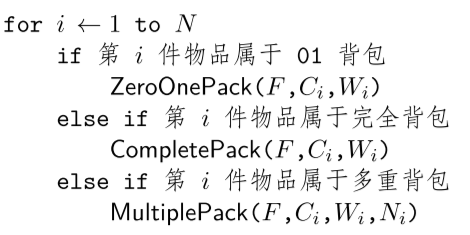

**朴素解法**

````java
package codefortopic.PackPro;

import java.util.Scanner;

/** 混合背包问题 朴素解法 */
public class MixPack01 {
  public static void main(String[] args) {
    Scanner sc = new Scanner(System.in);
    int N = sc.nextInt();
    int V = sc.nextInt();
    int[][] arr = new int[N + 1][3];
    for (int i = 1; i <= N; i++) {
      arr[i][0] = sc.nextInt();//vi 体积
      arr[i][1] = sc.nextInt(); //wi 价值
      arr[i][2] = sc.nextInt(); // si 数量： -1 表示0-1 ；0 表示无限 ；>0：表示该使用上限次数
      if (i != N) sc.nextLine();
    }
    int[][] dp = new int[N + 1][V + 1];

    for (int i = 1; i <= N; i++) {
      for (int j = 1; j <= V; j++) {
        if (arr[i][2] == -1) {
          if (j >= arr[i][0]) dp[i][j] = Math.max(dp[i - 1][j], dp[i - 1][j - arr[i][0]] + arr[i][1]);
          else dp[i][j] = dp[i - 1][j];

        } else if (arr[i][2] == 0) {
          for (int k = 0; k <= j / arr[i][0]; k++) {
            dp[i][j] = Math.max(dp[i][j], dp[i - 1][j - k * arr[i][0]] + k * arr[i][1]);
          }
        } else {
          for (int k = 0; k <= arr[i][2]; k++) {
            if (j >= k * arr[i][0])
              dp[i][j] = Math.max(dp[i][j], dp[i - 1][j - k * arr[i][0]] + k * arr[i][1]);
          }
        }
      }
    }
    System.out.println(dp[N][V]);
  }
}
````

### **一维DP解法**

- 完全转多重转01
- 多重转01

````java
package codefortopic.PackPro;

import java.util.Scanner;

/**
 * 混合背包问题  一维dp 解法
 */
public class MixPack02 {
  public static void main(String[] args) {
    Scanner sc = new Scanner(System.in);
    int N = sc.nextInt();
    int V = sc.nextInt();
    int[][] arr = new int[100000][3];
    int cnt = 1;
    for (int i = 1; i <= N; i++) {
      int v = sc.nextInt();
      int w = sc.nextInt();
      int s = sc.nextInt();
      if (s == -1) {
        arr[cnt][0] = v;
        arr[cnt][1] = w;
        arr[cnt][2] = s;//-1  01 背包
        cnt++;
      }
      if (s == 0) { // 0  完全背包
        s = V / v; //把完整背包转多重，统一到下面转成0 1
      }
      if (s > 0) { // >0 多重背包 要转 0 1 背包
        for (int k = 1; k <= s; k <<= 1) {
          arr[cnt][0] = v * k;
          arr[cnt][1] = w * k;
          arr[cnt][2] = -1;
          s -= k;
          cnt++;
        }
        if (s > 0) {
          arr[cnt][0] = v * s;
          arr[cnt][1] = w * s;
          arr[cnt][2] = -1;
          cnt++;
        }

      }

      if (i != N) sc.nextLine();
    }
    int[] F = new int[V + 1];
    for (int i = 1; i < cnt; i++) {

      // 0 1 pack
      for (int j = V; j >= 1; j--) {
        if (j >= arr[i][0])
          F[j] = Math.max(F[j], F[j - arr[i][0]] + arr[i][1]);
        else F[j] = F[j];
      }

    }
    System.out.println(F[V]);

  }
}

````

- 完全按完全算
- 多重转01

````java
package codefortopic.PackPro;

import java.util.Scanner;

/**
 * 混合背包问题  一维dp 解法
 */
public class MixPack03 {
  public static void main(String[] args) {
    Scanner sc = new Scanner(System.in);
    int N = sc.nextInt();
    int V = sc.nextInt();
    int[][] arr = new int[100000][3];
    int cnt = 1;
    for (int i = 1; i <= N; i++) {
      int v = sc.nextInt();
      int w = sc.nextInt();
      int s = sc.nextInt();
      if (s == -1) {
        arr[cnt][0] = v;
        arr[cnt][1] = w;
        arr[cnt][2] = 1;//-1 改1 表示  01 背包
        cnt++;
      }
      if (s == 0) { // 0  完全背包
        arr[cnt][0] = v;
        arr[cnt][1] = w;
        arr[cnt][2] = 0;//0
        cnt++;
      }
      if (s > 0) { // >0 多重背包 要转 0 1 背包
        for (int k = 1; k <= s; k <<= 1) { // 乘以2 是<<1 , 不是<<2
          arr[cnt][0] = v * k;
          arr[cnt][1] = w * k;
          arr[cnt][2] = 1;
          s -= k;
          cnt++;
        }
        if (s > 0) {
          arr[cnt][0] = v * s;
          arr[cnt][1] = w * s;
          arr[cnt][2] = 1;
          cnt++;
        }

      }

      if (i != N) sc.nextLine();
    }
    int[] F = new int[V + 1];

    for (int i = 1; i < cnt; i++) {
      // 0 1 pack
      if (arr[i][2] == 1) {
        for (int j = V; j >= 1; j--) {
          if (j >= arr[i][0])
            F[j] = Math.max(F[j], F[j - arr[i][0]] + arr[i][1]);

        }

      } else { // 完全pack

        for (int j = 1; j <= V; j++) {
          if (j >= arr[i][0])
            F[j] = Math.max(F[j], F[j - arr[i][0]] + arr[i][1]);

        }
      }
    }
    System.out.println(F[V]);

  }
}

````


## 二维背包费用问题

0 1 背包，除了容量，再加一个 重量；正常做加一个维度就好了

````java
package codefortopic.PackPro;

import java.util.Scanner;

/**0 1 背包问题 除了容量， 增加了体积这一维度*/
public class TwoDPack {

  public static void main(String[] args) {
    Scanner sc = new Scanner(System.in);
    int N = sc.nextInt();
    int V = sc.nextInt();
    int M = sc.nextInt();

    int[][] F = new int[V + 1][M + 1];
    int[] v_arr = new int[N + 1];
    int[] m_arr = new int[N + 1];
    int[] w_arr = new int[N + 1];
    for (int i = 1; i <= N; i++) {
      v_arr[i] = sc.nextInt();
      m_arr[i] = sc.nextInt();
      w_arr[i] = sc.nextInt();
    }
    for (int i = 1; i <= N; i++) {
      for (int j = V; j >= v_arr[i]; j--) {
        for (int t = M; t >= m_arr[i]; t--) {
          F[j][t] = Math.max(F[j][t], F[j - v_arr[i]][t - m_arr[i]] + w_arr[i]);
        }
      }
    }
    System.out.println(F[V][M]);
  }
}

````


## 分组背包问题

01 背包， 分组 ，每组只能选一个

````java
package codefortopic.PackPro;

import java.util.Scanner;

/**分组背包问题 ： 01 背包  每组有多个物品，每组可以取一个*/
public class GroupPack {
  public static void main(String[] args) {
    Scanner sc = new Scanner(System.in);
    int N = sc.nextInt();
    int V = sc.nextInt();
    sc.nextLine();
    int[][][] arr = new int[N + 1][][];
    for (int i = 1; i <= N; i++) {
      int aGroupNum = sc.nextInt();
      sc.nextLine();
      arr[i] = new int[aGroupNum + 1][2];
      for (int j = 1; j <= aGroupNum; j++) {
        arr[i][j][0] = sc.nextInt();
        arr[i][j][1] = sc.nextInt();
      }
      if (i != N) sc.nextLine();
    }
    int[] F = new int[V + 1];
    for (int i = 1; i <= N; i++) {
      for (int j = V; j >= 1; j--) {

        for (int t = 1; t < arr[i].length; t++) { // < 不是 <= 哦
          if (j >= arr[i][t][0])
            F[j] = Math.max(F[j], F[j - arr[i][t][0]] + arr[i][t][1]);
        }
      }
    }
    System.out.println(F[V]);
  }
}

````

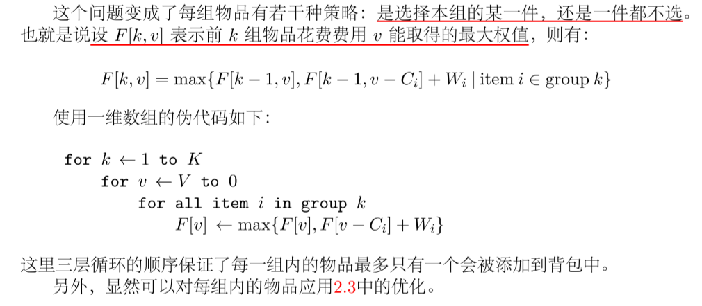


## 扩展

### 有依赖的背包问题

思路：将主件和附件集转换为 物品组  


### 泛化物品

### *背包问题问法的变化

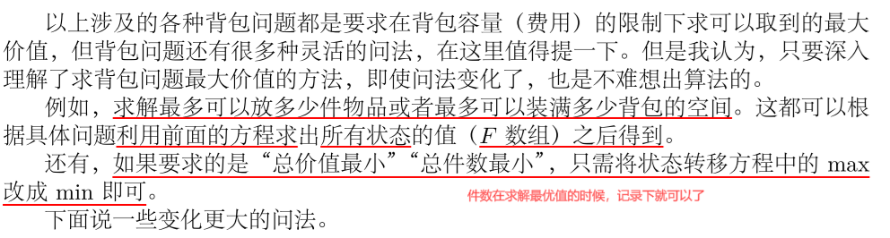

可以用 G[i，v]  记录，=0表示从状态转移方程的第一项转移来，=1表示从第二项转移来；

### *输出最优方案&输出字典序最小最优方案

**重点**

- 背包DP的时候，状态转移时有两种选择，组合起来看，在分析一个best[i] [j]的解时，最大可能有3种情况
- 第i个物品选
- 第i个物品不选
- 第i个物品选或不选都可以

**再回到这道题**

- 如果是传统的做法，最后求出的最优解在 best[N] [V] ，回溯时，无法优先选择编号小的物品（因为是不确定的情况，编号大的物品能选也能不选时，没有确定的规则该选还是不该选，能够推到最后选到小的物品，此时就应该保存全部的选择，再选字典序小的）
- 如果DP时是考虑编号N，N-1，....，1个物品，最后求出的最优解在best[1] [V] (=best[N] [V] ); 在回朔时，我们在编号小的物品能选也能不选时，贪心的选择就好了。这就是为什么这一题要倒着做DP的根本原因

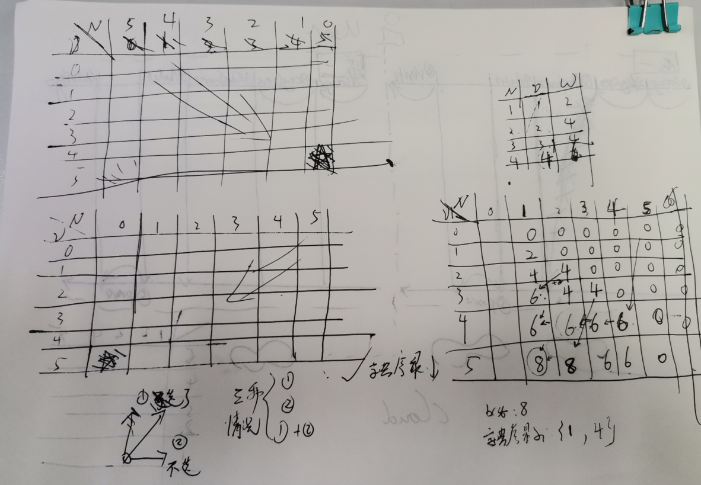 

````java
package codefortopic.PackPro;

import java.util.ArrayList;
import java.util.List;
import java.util.Scanner;

public class PackSpecificScheme {
    public static void main(String[] args) {

        Scanner in = new Scanner(System.in);
        int N = in.nextInt();
        int V = in.nextInt();
        int[][] best = new int[N + 2][V + 1];
        int[] v = new int[N + 2];
        int[] w = new int[N + 2];
        for (int i = 1; i <= N; i++) {
            v[i] = in.nextInt();
            w[i] = in.nextInt();
            if (i != N) in.nextLine();
        }
        for (int i = N; i >= 1; i--) {
            for (int j = 0; j <= V; j++) {
                if (j >= v[i]) //开始粗心写成 >了
                    best[i][j] = Math.max(best[i + 1][j], best[i + 1][j - v[i]] + w[i]);
                else best[i][j] = best[i + 1][j];
            }
        }
        //best解在 best[1][V]中
        List<Integer> ans = new ArrayList<>();
        int resV = V;
        //这个找答案也很巧妙，需要依次枚举的是N，而v是跳跃的，这样完成了对二位结果数据的查找
        for (int i = 1; i <= N; i++) {

            if ( resV-v[i]>=0 && best[i][resV] == best[i + 1][resV - v[i]] + w[i]) {
                ans.add(i);
                resV -= v[i];
            }
        }
        for (int i = 0; i < ans.size(); i++) {
            System.out.print(ans.get(i));
            if(i != ans.size()) System.out.print(" ");
        }
        System.out.println();
    }


}


````


### *求方案总数(不是最优方案数，什么都不选也是一个方案)

- 对于这类改变问法的问题，**一般只需将状态转移方程中的 max 改成 sum 即可**
  - 因为每一个转移都代表一种解；

- 初始条件是 F[0, 0] = 1
- 事实上，这样做可行的原因在于状态转移方程已经考察了所有可能的背包组成 方案

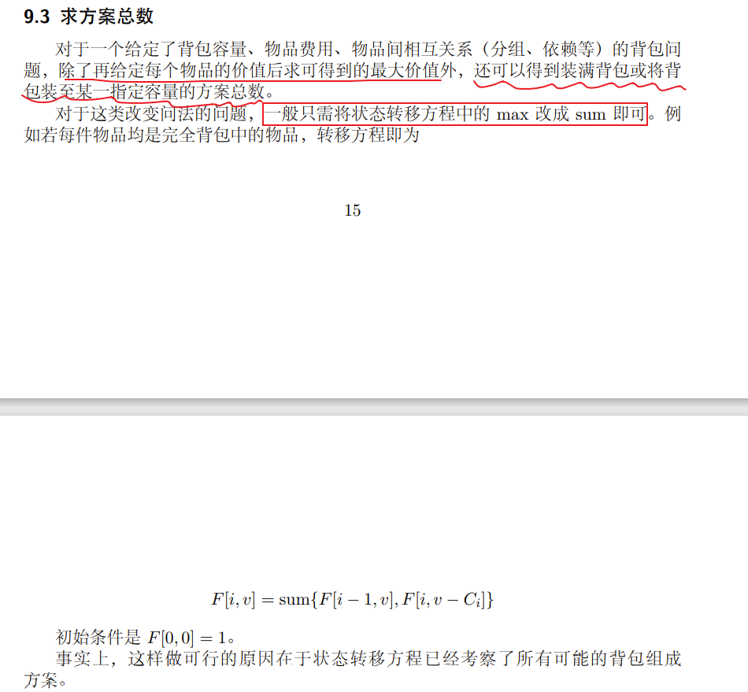

一道好题求方案数的好题目

[腾讯2018春编程题](https://www.nowcoder.com/question/next?pid=10611931&qid=161631&tid=56660735)

小Q有X首长度为A的不同的歌和Y首长度为B的不同的歌，现在小Q想用这些歌组成一个总长度正好为K的歌单，每首歌最多只能在歌单中出现一次，在不考虑歌单内歌曲的先后顺序的情况下，请问有多少种组成歌单的方法。


##### **输入描述:**

```
每个输入包含一个测试用例。
每个测试用例的第一行包含一个整数，表示歌单的总长度K(1<=K<=1000)。
接下来的一行包含四个正整数，分别表示歌的第一种长度A(A<=10)和数量X(X<=100)以及歌的第二种长度B(B<=10)和数量Y(Y<=100)。保证A不等于B。
```

##### **输出描述:**

```
输出一个整数,表示组成歌单的方法取模。因为答案可能会很大,输出对1000000007取模的结果。
```

##### **输入例子1:**

```
5
2 3 3 3
```

##### **输出例子1:**

```
9
```

下面用2种方法求解该题，分别是1）背包问题求（恰好）装满背包的方案数，2）数学解法（怎么计算杨辉三角并用来计算组合数）

**方法1-  01 背包**

这道题第一个迷惑点，就是x个长度为a的歌，和y个长度为b歌，可以看作（x+y）种物品；需要对01背包理解很透彻才行

第二，知道01背包求 **恰好装满**的过程解法；如果题目稍微改为选择歌曲组成的歌单总长不超过K的方案数，只需要修改初始化条件就行了；

```java
package codefortopic.PackPro;

import com.sun.org.apache.xerces.internal.util.SynchronizedSymbolTable;

import java.util.Scanner;


public class SchemeNum {
    public static void main(String[] args) {
        Scanner sc = new Scanner(System.in);
        int K = sc.nextInt();
        sc.nextLine();
        int a = sc.nextInt();
        int x = sc.nextInt();
        int b = sc.nextInt();
        int y = sc.nextInt();
        sc.nextLine();
        int modV = (int)1e9+7;

        long[] f = new long[K+1];
        f[0] = 1;

        for(int i=0;i<x;i++){
            for(int j=K;j>=a;j--){
                f[j] = (f[j] + f[j-a])%modV;
            }
        }
        for(int i=0;i<y;i++){
            for(int j=K;j>=b;j--){
                f[j] = (f[j]+f[j-b])%modV;
            }
        }
        System.out.println(f[K]);

    }
}
```

**方法二：用数学方法**

```
链接：https://www.nowcoder.com/questionTerminal/f3ab6fe72af34b71a2fd1d83304cbbb3
来源：牛客网
//我来解释一下介个吧，自己理解的。
//对于K，如果从X个A中取出i个A之后的差刚好能够除以B，并且（K-A*i）/B结果小于B的个数Y的话，
  ``// 那么就可以取。结果的个数为：组合C(X,i)*C(Y,（K-A*i）/B)
  ``//此时算的C就是杨辉三角的计算方法。对于每一行n和每一列m来说，就是从n个中取出m个的组合个数。
```

很多代码细节，真是腾讯的特色

````java
package codefortopic.PackPro;


import java.util.Scanner;


public class SchemeNum {
  
    public static void main(String[] args) {
        Scanner sc = new Scanner(System.in);
        int K = sc.nextInt();
        sc.nextLine();
        int a = sc.nextInt();
        int x = sc.nextInt();
        int b = sc.nextInt();
        int y = sc.nextInt();
        sc.nextLine();
        int modV = (int)1e9+7;

        //先计算杨辉三角
        long[][] C_mn = new long[105][105];//第m行n列的值（m，n从0开始）!!! 题目给了上界 ; 要是long， 不然就只过60%
//        for(int i=0;i<=x;i++) C_mn[i][0] = 1;

        C_mn[0][0] = 1;
        for(int i=1;i<105;i++){
            C_mn[i][0] = 1;
            for(int j=1;j<105;j++){
                C_mn[i][j] = (C_mn[i-1][j-1]+C_mn[i-1][j])%modV;
            }
        }
        long sum =0;
        for(int i=0;i<=x;i++){
            if( i*a<=K && (K-i*a)%b==0 && (K-i*a)/b <=y){ //不要忘了这两个个约束 i*a<=K && (K-i*a)/b <=y
//                sum += (C_mn[x][i] * C_mn[y][(K-i*a)/b])%modV; //错的只过60% , 少了1次求模
                sum = (sum + (C_mn[x][i] * C_mn[y][(K-i*a)/b])%modV)%modV;
            }
        }
        System.out.println(sum);


    }

}

````


### *[最优方案的总数](https://www.acwing.com/problem/content/description/11/)

````text
有 N 件物品和一个容量是 V 的背包。每件物品只能使用一次。

第 i 件物品的体积是 vi，价值是 wi。

求解将哪些物品装入背包，可使这些物品的总体积不超过背包容量，且总价值最大。

输出 最优选法的方案数。注意答案可能很大，请输出答案模 109+7 的结果。

输入格式
第一行两个整数，N，V，用空格隔开，分别表示物品数量和背包容积。

接下来有 N 行，每行两个整数 vi,wi，用空格隔开，分别表示第 i 件物品的体积和价值。

输出格式
输出一个整数，表示 方案数 模 109+7 的结果。

数据范围
0<N,V≤1000
0<vi,wi≤1000
输入样例
4 5
1 2
2 4
3 4
4 6
输出样例：
2
````

分析：

- 本题核心和易错的点在于，关于状态的定义，导致初始化得不同，以及求解的不同：
- 一)算法一
- 定义
  - best[i] [j]: 表示从前i个物品中选择，**<u>体积就是</u>**j的价值
  - scheme[i] [j] 表示表示从前i个物品种选择**<u>体积就是</u>**j的最大价值对应方案数
- 初始化：
  - best[0] [0]=0 其他，其他 i,j, best[i] [j] = - INF ; 
  - scheme[0] [0] = 1; // 这也就解释了，为什么图1scheme中那么多中间非法状态
  - 只能是scheme[0] [0]=1 ，scheme[0] [1-V]=0或者负无穷； 其他状态要和 best 状态保持一致，是非法的，因为是best的约束是恰好填满，其他是非法状态~
- 求最后解时
  - **累加** scheme[N] [0->V] 

- 二)算法二
- 定义
  - best[i] [j]: 表示从前i个物品中选择，体积**<u>不大于</u>**j的价值
  - scheme[i] [j] 表示表示从前i个物品种选择<u>**体积不大于**</u>j的最大价值对应方案数
- 初始化：
  - best[i] [j]=0 ,i , j 任意 ; 
  - 必须scheme[0] [0-V] = 1; // （都必须填1）
  - scheme[0-N] [0] = 1; // 可以不显示初始化，只要保证scheme[0] [0]=1, scheme[0-N] [0]在代码中会被填为1；
- 求最后解时
  - **直接输出** scheme[N] [V] , 所有状态的解已经递推并保存在这里

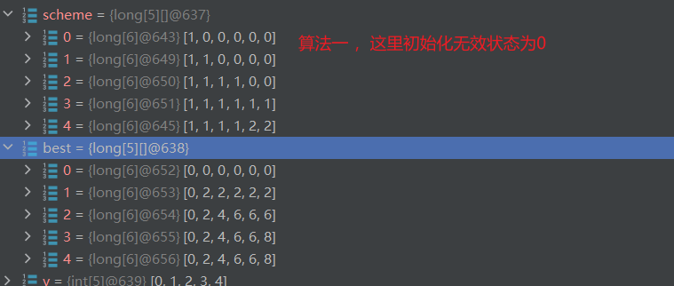

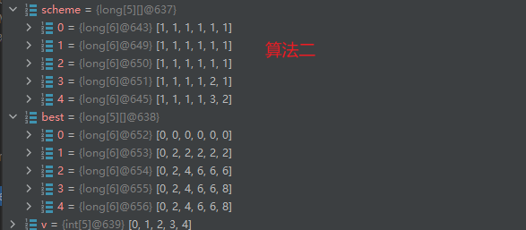

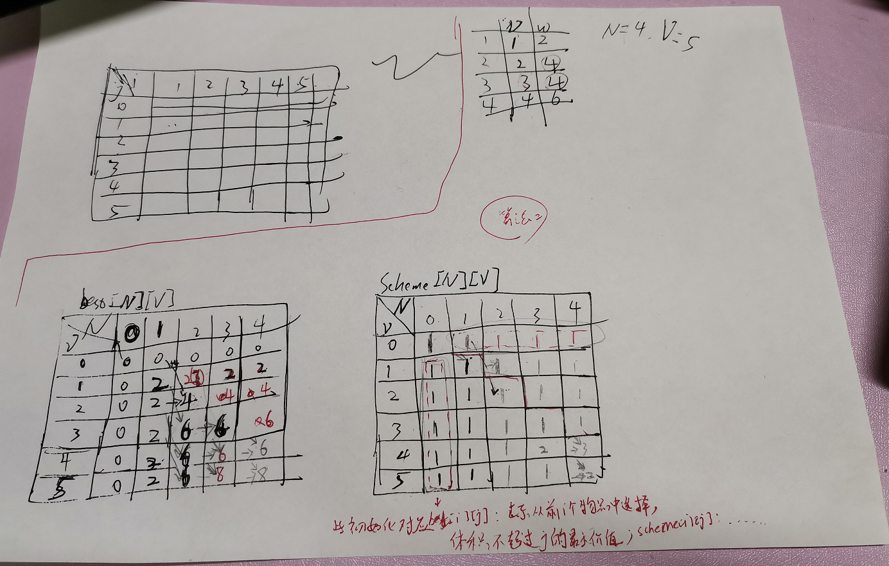

````java
package codefortopic.PackPro;

import java.lang.reflect.Array;
import java.util.Arrays;
import java.util.Scanner;

public class SchemeNum {
    public static void main(String[] args) {
        Scanner sc = new Scanner(System.in);
        int N = sc.nextInt();
        int V = sc.nextInt();
        sc.nextLine();
        long[][] scheme = new long[N+1][V+1];
        long[][] best = new long[N+1][V+1];
        int[] v = new int[N+1];
        int[] w = new int[N+1];
        int P = (int) (1e9+7);

        for(int i=1;i<=N;i++){
            v[i] = sc.nextInt();
            w[i] = sc.nextInt();
            if(i!=N)
            sc.nextLine();
        }
        //初始化一 算法一
        /*for(int i=0;i<=N;i++){
            scheme[i][0] = 1; //当v为0，不管考虑几件物品，best的解是什么都不选，所以scheme解为1
        }*/
       /* //初始化二 算法一
        scheme[0][0] = 1;*/


        //初始化三 算法二
        for(int j=0;j<=V;j++){
            scheme[0][j] = 1;
        }
        for(int i=0;i<=N;i++){ //当v为0，不管考虑几件物品，best的解是什么都不选，所以scheme解为1
            scheme[i][0] = 1;
        }

        for(int i=1;i<=N;i++){
            for(int j = 0; j<=V; j++){
                if(j>=v[i])
                    best[i][j] = Math.max(best[i-1][j],best[i-1][j-v[i]]+w[i]);
                else best[i][j] = best[i-1][j];

                scheme[i][j] = 0;
                if(best[i][j] == best[i-1][j]){
                    scheme[i][j] = scheme[i-1][j];
                }
                if(j>=v[i] && best[i][j] == best[i-1][j-v[i]]+w[i]){
                    scheme[i][j] += scheme[i-1][j-v[i]];
                }
                if(scheme[i][j]>=P) scheme[i][j] %= P;
            }
        }


        //算法一需要累加
     /*   long ans = 0;
        for(int j=0;j<=V;j++){ //枚举的是v， 而不能是物品件数
            if(best[N][j] == best[N][V]){
                ans += scheme[N][j];
                if(ans>P) ans %=P;
            }
        }
*/

        //算法一
//        System.out.println(ans);
        //算法二
        System.out.println(scheme[N][V]);
    }
}

````


# DP

##树状DP

面试真题-美团-蚂蚁上树


## 逆向DP

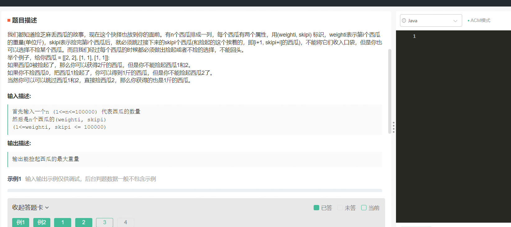

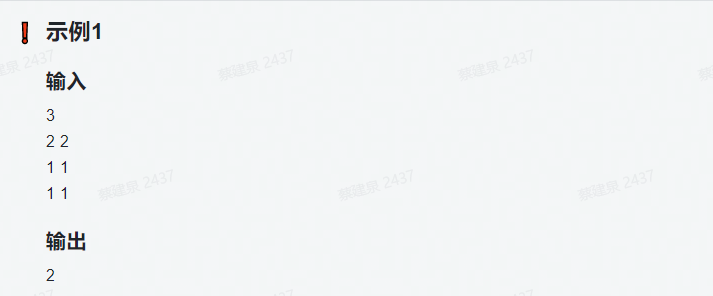

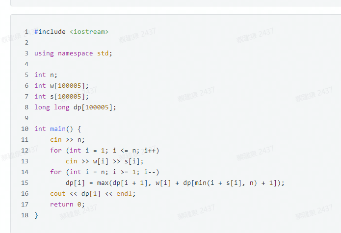

#　每日一题

### [20. 有效的括号](https://leetcode.cn/problems/valid-parentheses/)

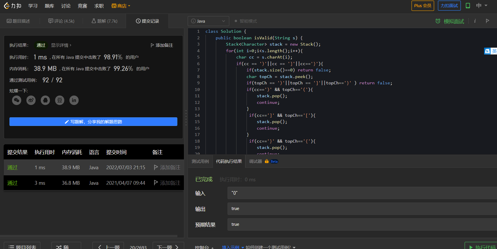


### **[1353. 最多可以参加的会议数目](https://leetcode.cn/problems/maximum-number-of-events-that-can-be-attended/)

- 花了很多时间的一题

  ````text
  给你一个数组 events，其中 events[i] = [startDayi, endDayi] ，表示会议 i 开始于 startDayi ，结束于 endDayi 。
  
  你可以在满足 startDayi <= d <= endDayi 中的任意一天 d 参加会议 i 。注意，一天只能参加一个会议。
  
  请你返回你可以参加的 最大 会议数目。
  
  
  ````

  代码中几个关键：

  - 最外循环 meetIndex 不是每次走一趟就递增的

  - 最外循环两个判断条件 缺一不可

  - 贪心的策略：

    - 出队：

      - 每次选择队列中结束时间最早的事件
      - 过期时间--无法安排

    - 进队：

      - 只需要进队一次，贪心从开始时间早的选择就可以了-通过初始化排序实现

      

      ````java
      package EeacDay;
      
      import java.util.*;
      
      public class M0707 {
          public static void main(String[] args) {
              M0707 so = new M0707();
      //        int[][] events = new int[][]{{1,2},{1,2},{3,3},{1,5},{1,5}};
      //        int[][] events = new int[][]{{1,3},{1,3},{1,3},{3,4}};
              int[][] events = new int[][]{{1,4},{4,4},{2,2},{3,4},{1,1}};
              int ans = so.maxEvents(events);
              System.out.println(ans);
          }
      
          public int maxEvents(int[][] events) {
              int curDay = 1;
              int meetIndex = 0;
              int cou = 0;
              Arrays.sort(events, new Comparator<int[]>() {
                  @Override
                  public int compare(int[] o1, int[] o2) {
                      return o1[0]-o2[0];
                  }
              });
              PriorityQueue<int[]> que = new PriorityQueue<>(new Comparator<int[]>() {
                  @Override
                  public int compare(int[] o1, int[] o2) {
                      return o1[1]-o2[1];
                  }
              });
      
              while(meetIndex<events.length || !que.isEmpty()){ //第2个条件 !que.isEmpty() 也是非常重要的
      
                  while(meetIndex<events.length && events[meetIndex][0]==curDay){
                      que.add(events[meetIndex]);
                      meetIndex++; //** 注意 meetIndex 只有这里自增加
                  }
      
                  //剔除无效会议，结束时间《 curDay的会议，因为有些会议是无法安排的
                  while(!que.isEmpty() && que.peek()[1]<curDay){
                      que.poll();
                  }
                  //选择一个结束时间最早的会议
                  if(!que.isEmpty()){ //if 不是 while...一天只能安排一个
                      que.poll();
                      cou++;
                  }
                  curDay++;
      
              }
              return cou;
          }
      
      }
      ````

       
      

### [134. 加油站](https://leetcode.cn/problems/gas-station/)

两个难点

- 如何思考 O（n）的解法，以及正确性
- 代码中，i 指向 index ，为什么要保证index >i

````java
class Solution {
    public int canCompleteCircuit(int[] gas, int[] cost) {
        
        int n = gas.length;//0,1,2,...,n-1
        int pos = -1;
        boolean find = false;
        for(int i=0; i<gas.length && !find;i++){
            int index = i;
            int oril = gas[index];
            while(oril>=cost[index]){ 
                oril -= cost[index];
                index++;
                index %= n ; 
                oril+=gas[index];
                if(index == i){
                    find = true;
                    pos = i;
                    break;
                }
            }
            //要保证起点i是递增的---挺隐蔽的
            //不然是-1的情况，因为index会求余，程序死循环
            if(index>i){
                i = index;
            }

        }
        return pos;

    }
}
````


### *[440. 字典序的第K小数字](https://leetcode.cn/problems/k-th-smallest-in-lexicographical-order/)(hard)

- 先序遍历第k个数
- 编号 

````text
给定整数 n 和 k，返回  [1, n] 中字典序第 k 小的数字。

 

示例 1:

输入: n = 13, k = 2
输出: 10
解释: 字典序的排列是 [1, 10, 11, 12, 13, 2, 3, 4, 5, 6, 7, 8, 9]，所以第二小的数字是 10。
示例 2:

输入: n = 1, k = 1
输出: 1
 

提示:

1 <= k <= n <= 109

````

````java
class Solution {
    public int findKthNumber(int n, int k) {
        int curr = 1;//从1开始，1是字典序最小的
        k--;//如果k=1，则不进入下面的循环，直接返回1，否则说明1不是目标，找第k-1个小的数
        while (k > 0) {
            int steps = count(curr, n);//steps=当前节点curr下有多少比n小的子节点(包括n)
            if (steps <= k) {//不够，需要去邻近节点找
                curr++;//+1意味着到达了邻近兄弟节点
                k = k - steps;
                //意味着前面的steps个数包含在在curr节点下，接下来进入兄弟节点找第k-steps小的数
            } else {//否则，在curr下
                k--;//减去当前节点
                curr = curr * 10;//从最左侧开始搜寻
            }
        }
        return curr;
    }

        public static int count(int curr, int n) {//计算节点curr下有多少比n小的子节点
        int steps = 0;
        long first = curr;
        long last = curr;
        while (first <= n) {//当前层有符合要求的节点
            steps += Math.min(last, n) - first + 1;//汇入
            first = first * 10;//进入到下一层
            last = last * 10 + 9;//进入到下一层
        }
        return steps;
    }
}
````


### [417. 太平洋大西洋水流问题](https://leetcode.cn/problems/pacific-atlantic-water-flow/)

````java
class Solution {
    public static int[] drow = new int[]{1,0,-1,0};
    public static int[] dcol = new int[]{0,1,0,-1};
    public static int[][] heights;
    public static boolean[][] pacific;//could reach pacific
    public static boolean[][] atlantic;
    public static int m,n;
    public List<List<Integer>> pacificAtlantic(int[][] heights) {
        this.heights = heights;
        m = heights.length;
        n = heights[0].length;
        pacific = new boolean[m][n];
        atlantic = new boolean[m][n];
        for(int i=0;i<m;i++){
            dfs(i,0,pacific);
        }
        for(int j=0;j<n;j++){
            dfs(0,j,pacific);
        }
         for(int i=0;i<m;i++){
            dfs(i,n-1,atlantic);
        }
        for(int j=0;j<n;j++){
            dfs(m-1,j,atlantic);
        }
        List<List<Integer>> ans = new ArrayList<List<Integer>>();
        for(int i=0;i<m;i++){
            for(int j=0;j<n;j++){
                if(pacific[i][j] && atlantic[i][j]){
                    List<Integer> oneAns = new ArrayList();
                    oneAns.add(i);
                    oneAns.add(j);
                    ans.add(oneAns);
                }
            }
        }
        return ans;
    
   
    }
    public void dfs(int row,int col,boolean[][]ocean){
        if(ocean[row][col]) return ;
        ocean[row][col] = true;

        for(int k=0;k<4;k++){
            int nr = row+drow[k];
            int nc = col+dcol[k];
            if(nr>=0 && nr<m && nc>=0 && nc<n && heights[nr][nc]>= heights[row][col]) dfs(nr,nc,ocean);//逆向流动搜索！
        }
           
    }


   
}
````

### *[56. 合并区间](https://leetcode.cn/problems/merge-intervals/)

- 好题
- 做过类似的；一样的味道

这道题，如果题目合并区间，不是要求重叠才可以合并，可以用差分数组

````java
class Solution {
    //区间和:
    //读一个区间，就是区间加1
    //最后区间段不为0的，就是有效区间
    //坑点 要重叠才行，不是数学意义上的合并[1,2][3,4] 不行
    
    public int[][] merge(int[][] intervals) {
        
        int len = 0;
        int min = 0x3f3f3f3f;
        for(int i =0;i<intervals.length;i++){
            if(intervals[i][1]>len) len = intervals[i][1];
            if(intervals[i][0]<min) min = intervals[i][0];
            
        }
        int[] disArr = new int[len+2];
        if(min ==0) disArr[0] = 1;
        else disArr[0] = 0;

        for(int i =0;i<intervals.length;i++){
            int l = intervals[i][0];
            int r = intervals[i][1];
            disArr[l] +=1 ;
            disArr[r+1] -= 1;
        }
        int sum = disArr[0];
        int validL = -1;
        int validR = -1;
        if(sum >0) validL = 0 ; 
        List<int[]> ans = new ArrayList();
        for(int i=1;i<disArr.length;i++){
            sum +=disArr[i]; //sum 是实际当前元素值，大于0说明这是一个采纳的区间
            if(sum >0 && validL == -1){ //记录合理左区间
                validL = i;
            }
            if(sum == 0 && validL >=0){ //记录合理右区间，同时找到一组解
                validR = i-1;
                ans.add(new int[]{validL,validR});
                validL = -1;
            }
        }
        if(validL>=0 && sum >0)  ans.add(new int[]{validL,len});
        int[][] res = new int[ans.size()][2];
        for(int i=0;i<ans.size();i++){
            res[i] = ans.get(i);
        }
        return res;
    }
}
````

本地解法：排序，最关键是理解为什么 第二个元素乱序对结果没有影响

````java
class Solution {
    //区间和:
    //读一个区间，就是区间加1
    //最后区间段不为0的，就是有效区间
    //坑点 要重叠才行，不是数学意义上的合并[1,2][3,4] 不行
    
    public int[][] merge(int[][] intervals) {
       Arrays.sort(intervals,new Comparator<int[]>(){
           public int compare(int[] o1,int[] o2){
               return o1[0]-o2[0];
           }
       });
       
       List<int[]> ans = new ArrayList();
       for(int i = 0;i<intervals.length;i++){
           int L = intervals[i][0];
           int R = intervals[i][1];
           if(ans.size() ==0 || ans.get(ans.size()-1)[1]<L){
               ans.add(new int[]{L,R});
           }else{
               ans.get(ans.size()-1)[1] = Math.max(ans.get(ans.size()-1)[1],R);
           }
       }
       int[][] res =  new int[ans.size()][];
       for(int i =0;i<ans.size();i++) res[i] = ans.get(i);
       return res;
    }
}
````


### [300. 最长递增子序列](https://leetcode.cn/problems/longest-increasing-subsequence/)

- 好题
- $O(nlog n )二分查找的2种实现，见‘算法’.md$


### [135. 分发糖果](https://leetcode.cn/problems/candy/)

````text
n 个孩子站成一排。给你一个整数数组 ratings 表示每个孩子的评分。

你需要按照以下要求，给这些孩子分发糖果：

每个孩子至少分配到 1 个糖果。
相邻两个孩子评分更高的孩子会获得更多的糖果。//小心这个条件
请你给每个孩子分发糖果，计算并返回需要准备的 最少糖果数目 。


````


````java
class Solution {
    //ratings: 3 4 5 5 5 4 3
    //的分配是：1 2 3 1 3 2 1 

     //ratings: 3 4 5 5 5 4 3 2 1
    //的分配是： 1 2 3 1 5 4 3 2 1

    //ratings: 3 4 5 4 3 2 1
    //的分配是：1 2 5 4 3 2 1

    public int candy(int[] ratings) {
      int cou=1;
      int pre = 1;
      int inc = 1;
      int desc = 0;
      for(int i=1;i<ratings.length;i++){
          if(ratings[i]>=ratings[i-1]){
              desc = 0;
             
              pre = ratings[i]==ratings[i-1] ? 1 : pre+1;
              inc = pre;
              cou +=pre;
          }else{
              desc++;
              if(desc == inc){//同时注意当当前的递减序列长度和上一个递增序列等长时，需要把最近的递增序列的最后一个同学也并进递减序列中
                  desc++;
              }
              cou += desc;
              pre = 1;
          }
      }
      return cou;
    }
}
````


## 并查集

### [765. 情侣牵手](https://leetcode.cn/problems/couples-holding-hands/)

````java
class Solution {
    public int minSwapsCouples(int[] row) {
        int n = row.length/2;
        UnionFind uf =  new UnionFind(n);
        for(int i=0;i<row.length;i+=2){
            uf.union(row[i]/2,row[i+1]/2);
        }
        return n - uf.getCount();
       
    }

    class UnionFind{
        int[] parent;
        int count;
        public UnionFind(int n){
            this.count = n;
            parent = new int[n];
            for(int i=0;i<parent.length;i++) parent[i] = i;

        }
        public int getCount(){ return count;}

   
        //也叫find method 
        public int find(int x){
           if(parent[x]!=x){
               int t = find(parent[x]);
               parent[x] = t;
               return t;
           }else return parent[x];
        }

    

        public void union(int x,int y){
            int rx = find(x);
            int ry = find(y);
            if(rx == ry) return;
            else parent[ry] = rx; 
            
            count--;
        }
            
        
    }
}
````


## 动态规划

### [375. 猜数字大小 II](https://leetcode.cn/problems/guess-number-higher-or-lower-ii/)

想不起来可以看下题解视频

````text
我们正在玩一个猜数游戏，游戏规则如下：

我从 1 到 n 之间选择一个数字。
你来猜我选了哪个数字。
如果你猜到正确的数字，就会 赢得游戏 。
如果你猜错了，那么我会告诉你，我选的数字比你的 更大或者更小 ，并且你需要继续猜数。
每当你猜了数字 x 并且猜错了的时候，你需要支付金额为 x 的现金。如果你花光了钱，就会 输掉游戏 。
给你一个特定的数字 n ，返回能够 确保你获胜 的最小现金数，不管我选择那个数字 。


````

````java
class Solution {
  //f[i,j] = min{ x+ max{f[i,x-1] , f[x+1,j]} },最外面
  //ans[i][j] = min{ t+max{ ans[i][t-1]+ans[t][j]}}
  //ans[i][j] = 0 , if i=j
    public int getMoneyAmount(int n) {
        int[][] ans = new int[n+1][n+1];
        //初始化
        for(int i=1;i<=n-1;i++){
                ans[i][i+1] = i;
        }
       
        for(int len=2;len<=n-1;len++){
            for(int i=1;i+len<=n;i++){ //[i,i+len]
                int  c = 0;
                int res = 0x3f3f3f3f;
                for(int j=i+1;j<=i+len-1;j++){
                    c = j+Math.max(ans[i][j-1],ans[j+1][i+len]);
                    if(c<res) res = c;
                }
                ans[i][i+len] = res;
            }
        }
        return ans[1][n];
        
    }
}
````

### [1262. 可被三整除的最大和](https://leetcode.cn/problems/greatest-sum-divisible-by-three/)(线性dp)

````text
给你一个整数数组 nums，请你找出并返回能被三整除的元素最大和。

 

示例 1：

输入：nums = [3,6,5,1,8]
输出：18
解释：选出数字 3, 6, 1 和 8，它们的和是 18（可被 3 整除的最大和）。
示例 2：

输入：nums = [4]
输出：0
解释：4 不能被 3 整除，所以无法选出数字，返回 0。

来源：力扣（LeetCode）
链接：https://leetcode.cn/problems/greatest-sum-divisible-by-three
著作权归领扣网络所有。商业转载请联系官方授权，非商业转载请注明出处。
````


````java
class Solution {
    //%3: 0,1,2
    public int maxSumDivThree(int[] nums) {
        int len = nums.length;
        int[][] dp = new int[len+1][3];
        dp[0][1] = -0x3f3f3f;
        dp[0][2] = -0x3f3f3f;
        for(int i=1;i<=nums.length;i++){
            if(nums[i-1]%3==0){
                dp[i][0] = dp[i-1][0]+nums[i-1];
                dp[i][1] = dp[i-1][1]+nums[i-1];
                dp[i][2] = dp[i-1][2]+nums[i-1];
            }else if(nums[i-1]%3==1){
                dp[i][0] = Math.max(dp[i-1][0],dp[i-1][2]+nums[i-1]);
                dp[i][1] = Math.max(dp[i-1][1],dp[i-1][0]+nums[i-1]);
                dp[i][2] = Math.max(dp[i-1][2],dp[i-1][1]+nums[i-1]);
            }else{
                dp[i][0] = Math.max(dp[i-1][0],dp[i-1][1]+nums[i-1]);
                dp[i][1] = Math.max(dp[i-1][1],dp[i-1][2]+nums[i-1]);
                dp[i][2] = Math.max(dp[i-1][2],dp[i-1][0]+nums[i-1]);
            }
        }
        return dp[len][0];

    }
}
````


## 单调栈/单调队列

### [402. 移掉 K 位数字](https://leetcode.cn/problems/remove-k-digits/)

````java
给你一个以字符串表示的非负整数 num 和一个整数 k ，移除这个数中的 k 位数字，使得剩下的数字最小。请你以字符串形式返回这个最小的数字。

 
示例 1 ：

输入：num = "1432219", k = 3
输出："1219"
解释：移除掉三个数字 4, 3, 和 2 形成一个新的最小的数字 1219 。
示例 2 ：

输入：num = "10200", k = 1
输出："200"
解释：移掉首位的 1 剩下的数字为 200. 注意输出不能有任何前导零。

来源：力扣（LeetCode）
链接：https://leetcode.cn/problems/remove-k-digits
著作权归领扣网络所有。商业转载请联系官方授权，非商业转载请注明出处。
````


````java
class Solution {
    public String removeKdigits(String num, int k) {
        Deque<Character> deque = new LinkedList<Character>();
        int length = num.length();
        for (int i = 0; i < length; ++i) {
            char digit = num.charAt(i);
            while (!deque.isEmpty() && k > 0 && deque.peekLast() > digit) {
                deque.pollLast();
                k--;
            }
            deque.offerLast(digit);
        }
        
        for (int i = 0; i < k; ++i) {
            deque.pollLast();
        }
        
        StringBuilder ret = new StringBuilder();
        boolean leadingZero = true;
        while (!deque.isEmpty()) {
            char digit = deque.pollFirst();
            if (leadingZero && digit == '0') {
                continue;
            }
            leadingZero = false;
            ret.append(digit);
        }
        return ret.length() == 0 ? "0" : ret.toString();
    }
}
````


### *[456. 132 模式](https://leetcode.cn/problems/132-pattern/)

非常有技巧的一道 单调栈 题目。好题

````text
给你一个整数数组 nums ，数组中共有 n 个整数。132 模式的子序列 由三个整数 nums[i]、nums[j] 和 nums[k] 组成，并同时满足：i < j < k 和 nums[i] < nums[k] < nums[j] 。

如果 nums 中存在 132 模式的子序列 ，返回 true ；否则，返回 false 
 

示例 1：

输入：nums = [1,2,3,4]
输出：false
解释：序列中不存在 132 模式的子序列。
示例 2：

输入：nums = [3,1,4,2]
输出：true
解释：序列中有 1 个 132 模式的子序列： [1, 4, 2] 。
示例 3：

输入：nums = [-1,3,2,0]
输出：true
解释：序列中有 3 个 132 模式的的子序列：[-1, 3, 2]、[-1, 3, 0] 和 [-1, 2, 0] 。
 

提示：

n == nums.length
1 <= n <= 2 * 105
-109 <= nums[i] <= 109
````

````java
class Solution {
    public boolean find132pattern(int[] nums) {
        
        Deque<Integer> que = new LinkedList();
        int max2Candidates = Integer.MIN_VALUE;
        que.offer(nums[nums.length-1]);
        //该策略从后往前是枚举1，同时维护2，3可能的取值
        for(int i=nums.length-2;i>=0;i--){
            if(nums[i]<max2Candidates){
                return true;
            }
            while(!que.isEmpty() && nums[i]>que.peekLast()){
                max2Candidates = que.pollLast();
            }
            if(nums[i]>max2Candidates){
                que.offer(nums[i]);//比max大，就入队，意味它可能是 2 候选；因为再往前遇到比它大的元素，它就得从栈滚出来了，正式称为2候选
            }
        }
        return false;

    }
}
````


## 字符串处理

###　[336. 回文对](https://leetcode.cn/problems/palindrome-pairs/)

字符串数目少，字符串长--暴力

字符串数目多，字符串较短--本题方法

分析，一个字符串分为

- [ - - -  | ~ ]
- [ ~ | - - - ]
- [ - - - ] 部分自己是回文
- [ ~ ] 部分 ，存在words[ i ] 的逆字符串和[ ~ ]相等

````text
给定一组 互不相同 的单词， 找出所有 不同 的索引对 (i, j)，使得列表中的两个单词， words[i] + words[j] ，可拼接成回文串。

 

示例 1：

输入：words = ["abcd","dcba","lls","s","sssll"]
输出：[[0,1],[1,0],[3,2],[2,4]] 
解释：可拼接成的回文串为 ["dcbaabcd","abcddcba","slls","llssssll"]
示例 2：

输入：words = ["bat","tab","cat"]
输出：[[0,1],[1,0]] 
解释：可拼接成的回文串为 ["battab","tabbat"]
示例 3：

输入：words = ["a",""]
输出：[[0,1],[1,0]]

来源：力扣（LeetCode）
链接：https://leetcode.cn/problems/palindrome-pairs
著作权归领扣网络所有。商业转载请联系官方授权，非商业转载请注明出处。
````

````java
class Solution {
    public List<List<Integer>> palindromePairs(String[] words) {
        List<List<Integer>> ans = new ArrayList<List<Integer>>();
        HashMap<String,Integer> revMap = new HashMap();
        for(int i=0;i<words.length;i++){
            revMap.put(new StringBuilder(words[i]).reverse().toString(),i);
        }
        for(int i=0;i<words.length;i++){
            String word = words[i];
            int len = word.length();
            if(len == 0) continue;

            for(int j=0;j<=len;j++){
            
                if(isHuiStr(word.substring(j,len))){
                    int rightId = revMap.getOrDefault(word.substring(0,j),-1);
                    if(rightId!=-1 && rightId !=i){
                        ans.add(Arrays.asList(i,rightId));// learned
                    }
                }
                if( j!=0 && isHuiStr(word.substring(0,j))){//j!=0 是必要的,否则可能重复解
                   int leftId = revMap.getOrDefault(word.substring(j,len),-1);
                   if(leftId != -1 && leftId!=i){
                       ans.add(Arrays.asList(leftId,i));
                   }

                }
            }
        }
        return ans;

    }
    public boolean isHuiStr(String str){
        int left = 0;
        int right = str.length()-1;
        while(left<right){
            if(str.charAt(left)!=str.charAt(right)){
                return false;
            }
            left++;
            right--;
        }
        return true;
    }

  
}
````


# 技巧题目

## [剑指 Offer II 010. 和为 k 的子数组O(n)解法](https://leetcode.cn/problems/QTMn0o/)

````text
给定一个整数数组和一个整数 k ，请找到该数组中和为 k 的连续子数组的个数。
示例 1：
输入:nums = [1,1,1], k = 2
输出: 2
解释: 此题 [1,1] 与 [1,1] 为两种不同的情况
示例 2：

输入:nums = [1,2,3], k = 3
输出: 2
 
提示:
1 <= nums.length <= 2 * 104
-1000 <= nums[i] <= 1000
-107 <= k <= 107

````


算法思想：

用 $cou[i]$ 表示以 $nums[i]$结尾的区间和为k的区间的数量。那么整个原问题分解为N个子问题。N是数组长度。

通过数学关系：
$$
\begin{align}
\sum_{j}^{i}nums[t]=k\tag{1} \\
\sum_{0}^{i}nums[t]=preSum\tag{2}\\
\end{align}
$$
可以得到： $ \sum_{0}^{j-1}nums[t] = preSum-k  $  这一关系。  $cou[i] $ 的值表示满足这个关系的前缀和区间的个数。

不难发现，对于preSum-k是确定的，只需要可以 $O(1)$ 求解满足 $\sum_{0}^{j-1}nums[t]$ 的区间个数，那么求解整个问题的时间复杂度为$O(n)$

不难发现，$\sum_{0}^{j-1}nums[t]$  的数学含义即在此元素之前，所求解的过的数组前缀和。我们可以用哈希表记录: Map<区间前缀和，个数>


细节：为什么要初始化$map<0,1>?$

- 当$\sum_{0}^{i}nums[i]=k$ 的时候，当然也是原问题的解。这是一个特殊情况，我们不需要再找前缀和和preSum-k 的数组了。

另外，实际上求解过程中累加$cou[i]$即可，空间复杂度可以优化为 $O(1)$. 代码用 $cou$ 数组只是为了配合题解使表达更加直观。

````java
class Solution {
    public int subarraySum(int[] nums, int k) {
        HashMap<Integer,Integer> map = new HashMap();
        int[] cou = new int[nums.length];
        int ans = 0;
        int preSum = 0;
        map.put(0,1);
        for(int i=0;i<nums.length;i++){
            preSum+=nums[i];
            if(map.containsKey(preSum-k)){
                cou[i] = map.get(preSum-k);
                ans+=cou[i];
            }
            map.put(preSum,map.getOrDefault(preSum,0)+1);
        }
        return ans;

    }
}
````


# 贪心

## 可反悔贪心
### 猫猫选数
给出n个整数，没个数可能是正的也可能是负的。**要求选的过程中**，所选择数的总和>=0。求最多可以选择多少个数。

（字节9月题）

用一个优先队列存储所有选择的负数，并且是小顶堆，用于可反悔贪心。

- 当curNum>==0, sum+=curNum, cou++;

- curNum<0:

  - if sum+curNum >=0: sum+=curNum, cou++, que.offer(curNum) //贪心的加

  - que.peek() < curNum: sum - = que.poll(), sum+=curNum ; cou不变 // 可反悔的贪心

### 徒步

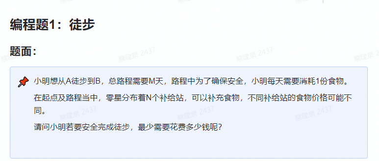

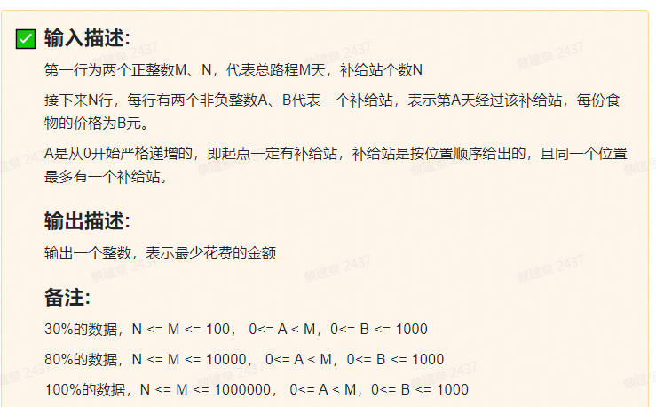

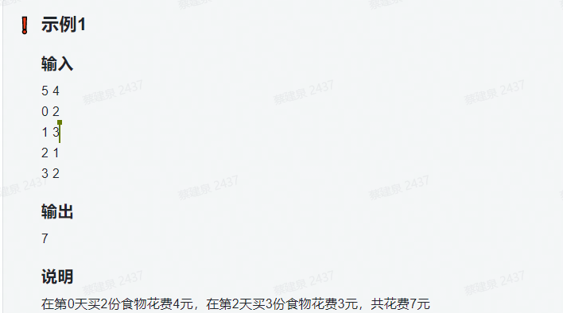

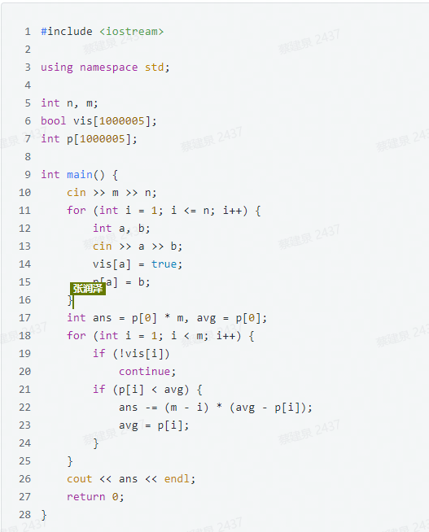

  ### 优惠券专家


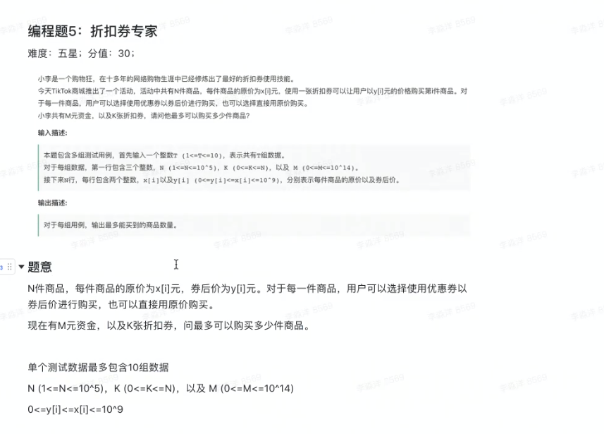

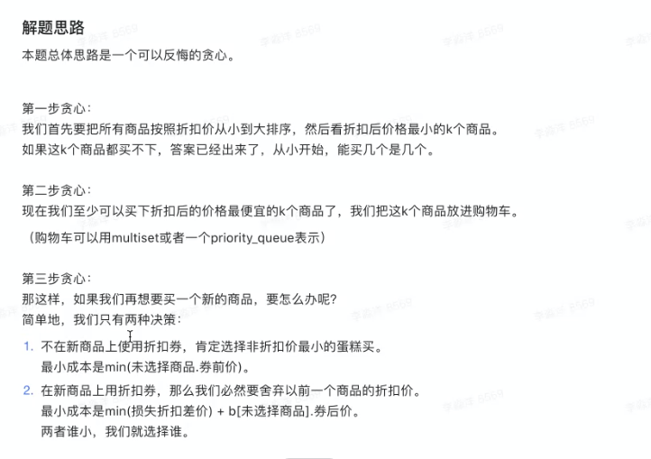

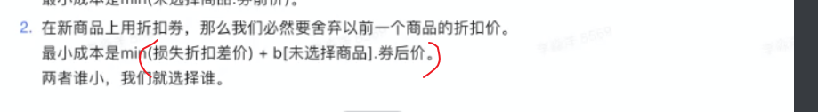


# 二分

##  细节[278. 第一个错误的版本](https://leetcode.cn/problems/first-bad-version/)

用 int mid = left +(right - left)/2 ; 而不用 mid = (left + rigt)/2

可以避免left, right 都是int 类型时可能的溢出

````java
/* The isBadVersion API is defined in the parent class VersionControl.
      boolean isBadVersion(int version); */

public class Solution extends VersionControl {
    //实际上是最优二分 查找的思路 TTTT FFFFF
    public int firstBadVersion(int n) {
        if(n==1) return 1;
        return find(1,n);

    }
    public int find(int left,int right){
       // int mid = (left+right)/2;
        int mid =  left+(right-left)/2;
        if(left == right) return left;
       
        if(!isBadVersion(mid)){//必然往右
            return find(mid+1,right);
        }
        // is bad version (3-T,4-F,5-F)
        return find(left,mid);
       

    }
}
````

