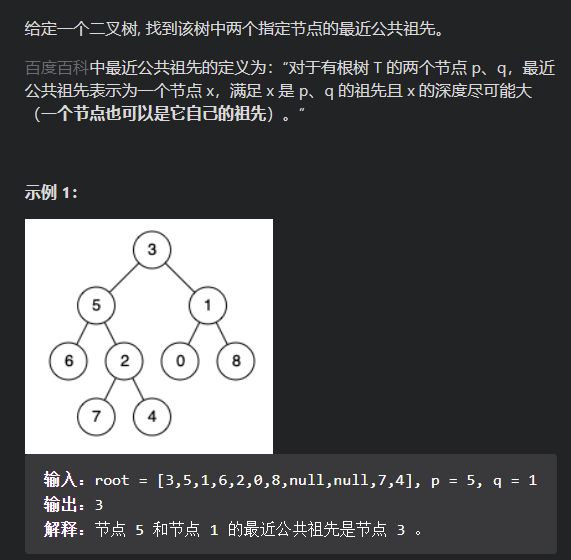
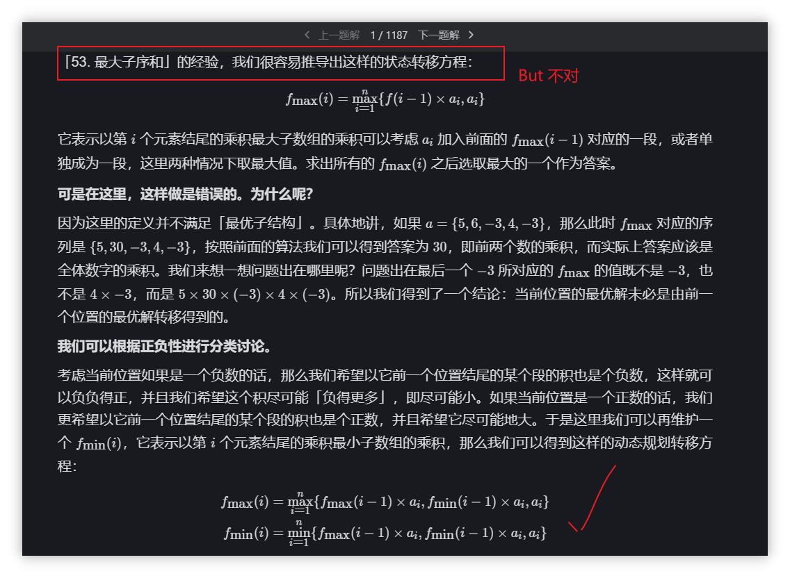

## 分治法

### 1-最大子数组(和)问题

**问题描述**

​		给定一个数组，**求其最大连续子数组的和**

**策略**

​		分治法解,将原问题转化为：比较左子数组的最大子数组、右子数组的最大子数组、跨中间 位置的最大子数组中的最大者，就是原问题的解。通过这样的转化，原问题可以不断划分为小问题

​		关键是求和理解跨中间最大子数组。跨中间最大子数组并非原问题的最大子数组。它必须要跨中间元素，求解该子问题只需要 **O(n)**的时间复杂度

**实现**

```c++
//伪代码
//求跨中间元素的最大子数组
FIND-MAX-CROSSING-SUBARRAY(low,high,mid,A) 
	lest-sum = ∞
	sum=0
	for i=mid down to low
		sum+=A[i]
		if sum>left-sum
			left-sum = sum
			max-left=i
	lest-sum = ∞
	sum=0
	for j=mod up to high
		sum+=A[i]
		if sum>right-sum
			right-sum=sum
			max-right=j
	return(max-left,max-right,left-sum+right-sum)
            
//递归求解问题
	
FIND-MAX-SUBARRAY(low,high,A)
	//递归截止条件
	if(low == high) return(low,high,A[low])
		
	mid= Dint((low+high)/2)
	(left-low,left-high,left-sum)=FIND-MAX-SUBARRAY(low,mid,A)
	(right-low,right-high,right-sum)=FIND-MAX-SUBARRY(mid,right,A)
	(cross-low,cross-right,cross-sum)=FIND-MAX-CROSSIN-SUBARRY(low,high,A)
	
	if(left-sum>=cross-sum&&left-sum>=riht-sum) return(left-low,left-high,left-sum)
	if(right-sum>=cross-sum&&riht-sum>=left-sum) return(right-low,riht-high,right-sum)
	if(cross-sum>=left-sum&&cross-sum>=riht-sum) return(cross-low,cross-high,cross-sum)

```


### 2-两个有序数组的中位数问题

**问题描述**		

​		给定两个大小为 m 和 n 的**有序**数组 A 和 B 。逻辑上归并后的数组为C。请找出C的中位数。要求算法的时间复杂度为 O(log (m+n))


**分析** 

​		要实现这个时间复杂度，用分治法；用最后一步归并方法也可以求解，但时间复杂度是 **O(m+n)**。

​		**一开始的问题：找中位数就是找(归并后)第k个数，k定义如下：**
​		**(len(A)+len(B))为偶**：令k1=(len(A)+len(B))/2 和k2=(len(A)+len(B))/2 +1 个; (C[k]+C[k+1])/2 （#C[k1]+C[k2])/2？）#就是中位数;中位数不一定就要是原来存在的元素，比如元素个数是偶数的时候通过这样求得。
​		**(len(A)+len(B))为奇：**令k=(len(A)+len(B))/2 + 1，C[k]既是
​	

但是,这是两个有序数组，**有更好的解法：**
	还是定义k=(len(A)+len(B))/2
		令 p=k/2-1,q=k/2(=k-p-1), p+q=k-1;//我们要找第k个数，通过数组特征分解第k-1个数来分解问题
		对于A[p]、B[q]的较小者，其所在序列的前面部分，肯定不包含目标值(另个不确定哦-这是理解的关键。另一个数组的前面任意一个数，都有可能是要求的数。考虑一个数组元素完全大于另外一个数组的情况)
		可以抛弃得到子序列！问题规模缩小了！
		我们先看A[p] B[q]这两个数的大小,可以获得如下信息
		if A[p] = B[q] , return A[p] 或者B[q]
		if A[p] < B[q] , 在A[p+1,len(A)] 和 B[0,len(B)]中搜索第k-p个数
		if A[p] > B[q] , 在A[0,len(A)] 和 B[q+1,len(B)]中搜索第k-q个数


**实现**

```C
//代码实现
		Find-Middle-Element(A,B)
			k=(len(A)+len(B))/2
			if((len(A)+len(B))%2==0)
				return (Find-NoK(A,B,0,len(A)-1,0,len(B)-1,k)+Find-NoK(A,B,0,len(A)-1,0,len(B)-1,k+1))/2
			else return Find-NoK(A,B,0,len(A)-1,0,len(B)-1,k+1)
		
		Find-Nok(A,B,Astart,Aend,Bstart,Bend,k)
			
			if((Aend-Astart)>(Bend-Bstart))
				return Find-Nok(B,A,Bstart,Bend,Astart,Aend,k)//保证len1始终最短-简化下面讨论代码
			if((Astart-Aend)==0) return B[k]
			
			if(k==1) return min(A[start],B[start]) //边界之一；
			p = min(k/2,Aend-Asatrt) //最短的是A数组了，前面简化作用体现出来了
			q=k-q
			if(A[Astatrt+p-1]<B[Bstatrt+q-1]) return(A,B,Astart+p,Aend,Bsatrt,Bend,k-p)
			if(A[Astatrt+p-1]>B[Bstatrt+q-1]) return(A,B,Astart,Aend,Bsatrt+q,Bend,k-q)	
			if(()==()) return A[Astatr+p-1] //想等，这两个一个是k-1,一个是 k，就是我们要找的，直接返回
```


## 堆和堆排序

**基本堆操作**

堆相关的3个操作；注意建堆的渐进紧确界是 **O(n)**

```c
//堆化过程
//以A[i]为根，1次自上而下堆化过程
	MAX-HEAPIFY(A,i,n)
		l=LEFT(i)
		r=RIGHT(i)
		if(l>n) return ;
		if(r>n) return ;
		if(A[l]<=A[r]&&A[r]>A[i]) 
			swap(A[i],A[r])
			MAX-HEAPIFY(A,r,n)
		if(A[r]<=A[l]&&A[l]>A[i]) 
			swap(A[i],A[l])
			MAX-HEAPIFY(A,l,n)
			
	//课本版本
	MAX-HEAPIFY(A,i,n)
		l=LEFT(i)
		r=RIGHT(i)
		if(l<=n&&A[l]>A[i])
			largest = l
		else larest = i
		if(r<=n&&A[r]>A[largest])
			largest = r
		if largest!=i
			swap(A[i],A[largest])
			MAX-HEAPIFY(A,largest,n)// 堆化时发生调整，往下递归调整，保证每颗子树都满足堆
            
	//建堆
	BUILD-MAX-HEAP(A,n)
		for i= Dint(n/2) down to 1
			MAX-HEAPIFY(A,i,n)
	
	//堆排序	
	HEAPSORT(A,n) //递归版本
	if n>=1
		BUILD-MAX-HEAP(A,n)
		swap(A[0],A[n])
		HEAPIFY-SORT(A,n-1)
		
	HEAPSORT(A,n) //非递归版本
		BUILD-MAX-HEAP(A,n)
		for i=n downto 1
		swap(A[0],A[i])
		MAX-HEAPIFY(A,0,i-1)
```


### 基于堆排序的最大优先队列

**基于数据结构的操作描述**

​		用最大堆实现一个最大优先队列
​		最大优先队列，队列每个元素有一个权重key;

​		INSERT(S,x):把元素x插入集合S中
​		MAXIMUM(S):返回S中具有最大关键字的元素
​		EXTRACT-MAX(S)：去掉并返回S中具有最大关键字的元素
​		INCERASE-KEY(S,x,k):将元素x的关键字增加到k;k需要比原来key大

​		显然，最大最小堆是根据key大小来建立的

**实现**

```c

	HEAP-EXTRACT-MAX(A,n) //返回key最大的元素，同时删除该元素
	if n<0
		error
	swap(A[0],A[n])
	MAX-HEAPFY(A,n-1)//交换后记得重新堆化
	return A[n]
	
	
	HEAP-INCREASE-KEY(A,i,key)//怎加
		if key<A[i]
			error
		else A[i].key = key
	
		while i>=1 && parent(i).key < A[i].key
			swap(parent(i),A[i])
			i = parent(i)
			
	MAX-HEAP-INSERT(A,key,n) //!*
		n=n+1
		A[n]=-∞
		HEAP-INCREASE-KEY(A,n,key)
		
```


## 回溯法

### 01 八皇后问题

**问题描述**

​		略

**实现**

```c
//先放(所有放法)，再判断能否放；这样逻辑比较清晰
	bool QUEEN::PLACE(int k) // k：第k行
		for(int j=0;j<k-1)
			if(x[j]!=x[k] && abs(x[k]-x[j])!=abs(k-j))
				return true
		
	
	bool QUEEN::BACKTRACE(int t)
		if(t>=n-1) sum++
		for(int i=1;i<=n;i++)
			x[t]=i;
			if(PLACE(t))
				BACKTRACE(t+1)
```


### 02 (目标)子集和问题

**问题描述**

​		给定集合，是否存在其子集，其和为S

**问题分析**

​		每个数有两种状态，故搜索树的结构是二叉树，简单回溯时间复杂度 **$O(2^n)$**

​		如果先求SUM数组，两个for循环可以穷举所有可能，时间复杂度：$O(n^2)$

​		**采用分支限界法**

​		可以选择吗：加这个数是否超过s？超过的情况截枝

​		可以选择，要选择吗？不选择，后续的数全部加起来小于s，这个情况截枝；


### 03装载问题

**问题描述**

​		轮船载货，尽量装载

**分析**

​		类似的？一个问题能不能放，能放是放还是不放，是连个独立思考的问题。-通过界限函数B(x)来判定

**实现**

```c
//r-剩下的装载能力、cw-当前装了多少、x[i]={0,1}第i个物品装还是不装、bestw-当前最优解
	void BACKTRACK(int i)
	{
		if(i>n) // 到达叶
			if cw>bestw  bestw=cw ; bestx[]=x[]//bestw和bestx[]作为全局使用
			return ; 
		
		//更新bestx、bestw、return;
		r-=w[i]；
		if(cw+w[i]<=c){ //放，看是否符合能放的条件，同时也是继续往下搜索的条件
			x[i]=1
			cw+=w[i]
			backtrack(i+1）
			cw-w[i];
			
		}
		if(cw+r>bestw){//不放，需要考虑要不要继续下搜；r在前面已经先减去该物件了
			x[i]=0;
			backtrack(i+1);//搜索右子树
		}
	r+=w[i]
	
	}	
```


### 04 批处理作业调度问题-回溯法

**问题**

​		

​		作业需先由1执行，然后才能由2执行；求最快的作业完成时间

**分析**		

​		**回溯搜索的空间树是一颗排列树**；确定了作业完成的次序-时间也就可以计算；
​		时间怎么计算？总时间就是，每个作业在机器2上完成时间的累加；次序已经被决定
​		需要判定的是：被执行作业在机器2上的完成时间=max(上一个作业在机器2的完成时间，该作业在机器1的完成时间)+该作业在机器2执行所需时间

​		活动选择的动态规划方程
​		**c[i,j]=max{c[i,k]+c[k,j]+1}？** 
​		对于活动选择问题，贪心可以得到最优-选择活动越早结束的活动
​		假定先对所有活动按照活动结束时间的早晚排好序
​		if cf>bestf ，即用时已经超过最优时间，则剪枝-不用递归到下一层了；不管是递归到下一层，还是直接到该层的下一种情况，都需要回溯
​		算法用来穷举排列组合的可能情况的方法比较巧妙，x[]是动态维护的：
​		初始：x[]={1,2,3}; 
​		for:用来穷举该层可选的排列
​		x[t]-当前层的选择，x[t]前面的是确定的；swap(x[t],x[j])-存在自己和自己交换的情况，比如一开始就是swap(x[1],x[1])，这也是刚开始看代码容易混淆x[]的功能的情况
​		

**实现**

```c
//变量和数据结构
//m[j][i] 作业j在机器i上的执行时间
//x[] 当前作业的调度顺序-一种排列情况-动态维护
//f1 机器1完成处理时间 ；f2 机器2完成处理时间
//cf 累计完成时间和
//bestf 记录最优cf
//bestx[] 记录最优作业排列
	
	TRACE-Flowshop(n,m[][])
		TRACE-BACKTRACK(t,n)
			if(t>n)
				if(cf<bestcf) //需要更新
					bestcf = cf
					for i tp n
						bestx[i]=x[i]
			
			for(i=t,i<=n;i++) //探索这层所有作业可能
			{
				f1 = f1+ m[x[i]][1]
				temp = f2
				f2 = max{f1,f2}+m[x[i]][2]
				cf=f2
				if(cf < bestf)
					swap(x[t],x[i]) //可以保障 i》t
					TRACE-BACKTRACK(t+1,n)
					swap(x[t],x[i])//回溯；开始是自己和自己交换
					
				//直接回溯-cf>bestf
				f1-=m[x[i]][1]
				cf-=f2
				f2=tempf
			}		
```

​		

## 贪心问题

### 01 活动选择问题

**问题**

​		给出活动集，包括活动的起始时间和结束时间；可以根据某种贪心原则计算活动全部执行完需要多少时间。

```c
	//贪心非递归实现
	GREEDY-ACTIVITY-SELECTOR(s,f)//活动的开设时间、结束时间数组(按结束时间排好序)
		n = s.length
		A={a1}
		k=1
		for i=2 upto n
			if s[i] >= f[k]
			A=A ∪ A[i]
			k=i
		return A
		
	RECURSIVE-ACTIVITY-SELECTOR(s,f,k,n) //增加虚拟活动a0,结束时间为0；初始调用 RECURSIVE-ACTIVITY-SELECTOR(s,f,0,n)
		
		m=k+1
		while m<=n && s[m]<f[k]
			m++;
		
		if m<=n
			return a[m] ∪ RECURSIVE-ACTIVITY-SELECTOR(s,f,m,n)
		else return 
		
```

### 02 跳跃数组

**题目描述**

给定一个非负整数数组 nums ，你最初位于数组的 第一个下标 。

数组中的每个元素代表你在该位置可以跳跃的最大长度。

判断你是否能够到达最后一个下标。

 

示例 1：

输入：nums = [2,3,1,1,4]
输出：true
解释：可以先跳 1 步，从下标 0 到达下标 1, 然后再从下标 1 跳 3 步到达最后一个下标。
示例 2：

输入：nums = [3,2,1,0,4]
输出：false
解释：无论怎样，总会到达下标为 3 的位置。但该下标的最大跳跃长度是 0 ， 所以永远不可能到达最后一个下标。

**思路**

理解题意，easy

**代码**

- DFS

`````java
private boolean res = false;
    private int[] vis;
    public boolean canJump( int[] nums){
        vis = new int[nums.length];
        dfsJump(0,nums,vis);
        return res;
    }
    private void dfsJump(int ipx ,int[]nums,int[] vis){
        vis[ipx] =1 ;
        if(ipx == nums.length-1 || nums[ipx]+ipx >= nums.length-1){
            res = true;
            return;
        }
        for(int jumpLen = nums[ipx];jumpLen>0;jumpLen--){
            if(vis[ipx+jumpLen] == 0){
                dfsJump(ipx+jumpLen,nums,vis);
            }

        }

    }
`````

- 迭代

````java
public class Solution {
    public boolean canJump(int[] nums) {
        int n = nums.length;
        int rightmost = 0;
        for (int i = 0; i < n; ++i) {
            if (i <= rightmost) {
                rightmost = Math.max(rightmost, i + nums[i]);
                if (rightmost >= n - 1) {
                    return true;
                }
            }
        }
        return false;
    }
}
````


## 动态规划

首先，需要原问题具有最优子结构。

通过一步操作将原问题转化为通过求最优子问题可解的情况。求解原问题时我们先假设最优子问题存在。当问题足够小，可解。

动态规划是一种（逻辑上）“查表”的方法，表中存储了已知的最优子问题。

### 01 切杆问题

r[n]表示长度为k的木杆切割可得的最大收益
p[i]保持长度为i的木杆的收益。假定我刀切在 k 处：r[n]=max{p[k]+r[n-k]}

```c
//递归
	CUT-ROD-AUX(p,n) //n-待切杆的长度；p-木杆价格表
		if n==0 return 0 //* 注意这个边界是0；
		
		q=-∞//q 代表长度n的杆所能获得的最大切割收益
		
		for(int i=1;i<n；i++)
			q=max{(q,p[i]+CUR-ROD(p,n-i))}
	
		return q 
```

```c
//带备忘-记忆的递归，保存所有长度切割的最优解
	MEMORIZED-CUT-ROD(p,n)
		for i=0 upto n
			r[n]=-∞
		
	MEMORIZED-CUT-ROD-AUX(p,n,r)
		if(r[n]!=-∞) return q=r[n]
		if n==0 return q=0 
		
		for(int i=1;i<=n;i++)
			//q=max{(q,p[i]+MEMORIZED-CUT-ROD-AUX(p,n-i,r))} //不带切割路径
			if(p[i]+MEMORIZED-CUT-ROD-AUX(p,n-i,r)>=q) //修改为保存切割路径
				cutin = i;
				q=p[i]+MEMORIZED-CUT-ROD-AUX(p,n-i,r)
			
		
		p[n]=cutin; //长度为n的木杆从cutin处切割可得最优解
		r[n]=q;
		return q；
```

```c
//非递归-自底向上方法
	BOTTOM-UP-CUT-ROD(p,n)
		for(int i=1;i<=n;i++)
			q=-∞
			for(j=1;j<=i/2;j++)
				q=max(q,p[j]+r[i-j])
			r[i]=q
	return r[n]
```


### 02 **背包问题**

**问题描述**

​		关于背包问题有几个问题需要理解清楚。有助于我们得出、理解动态方程。

​		子问题是什么？是更少的物品，还是更少的容量？答案是更少的物品；设想一个小偷去商场偷东西。如过商品很少，那么对他来说，偷的方案很好做；所以我们应该力求让物品减少

​		另外，学习一个动态规划算法，要掌握表的解构，查找方法；如何打印解的求解路径。

```c
//问题定义-动态规划方程
		n物、w[i]、v[i]、c、定义c[i,j]表示前i个物品在容量为j的最优价值和
		c[i,j]=c[i-1,j] // w[i]>j ，不能放
		c[i,j]=max{ //能放
			c[i-1,j-w[i])+v[i] , //放
			c[i-1,j] //不放
		}
		v[0,j]=v[i,0]=0;
```

```c
//背包实现-递归
	0-1 BAG(w,v,n,G,c[][])
			if(n==0) return c[0][c]=0;
			if(Gq
			
			if(G<w[n])//不能放
				c[n][G]=BAG(w,v,n-1,G,c[n-1][G])
			else
				c[n][G]=max{BAG(w,v,n-1,G-w[n],c[n-1][G-w[n]])+v[n],
					BAG(w,v,n-1,G,c[n-1][G])}
	
```

```c
//背包实现-非递归	
//动规的非递归算法，就是从底向上填表的过程；
		BAG(w,v,G,c[][])
		for i=0 upto n //假设重量都是整数
			c[i][0]=0;
		for j=0 upto G
			c[j][0]=0;
		
			for(int i=0;i<=n;i++)
				for(int j=0;j<=G;j++)
					if(w[i]<j)//可以放
						c[i][j]=max(c[i-1][j-w[i]]+v[i],c[i-1][j])
					else
						c[i][j]=c[i-1][j]
```


### 03 矩阵链乘问题

**问题描述**

对同一链乘矩阵，加上扩号不改变运行结果，但计算效率却可能相差巨大。

比较难的是对矩阵链乘问题的抽象；

```c
矩阵Ai的维数是pi-1 * pi
	min[i,j]=min[i,k]+min[k+1,j]+pi-1*pk*pj // (Ai*..Ak)(...Aj)
	m[1...n,1,...n]保存代价
	s[1,...,n-1,2,...,n]记录最优值m[i,j]对应的分割点;对应需要切割的情况的取值范围
	将k记录在s[i][j]=k;
	p是一个序列：p=<p0,p1,...,pn>
```


```c
//自底向上方法
	MATRIX-CHAIN-ORDER(p)
		n=p.length-1 //因为数组从0开始计
		let m[][],s[][] be new array
		for(int i=0;i<=n;i++)
			m[i][j]=0;
		for(l=2;l<=n;l++)	//l表示矩阵链的长度；自底向上，我们先求解最短链的最优解，才能逐步向上求解
			for(int i=0;i<=n-l+1;i++) //i-标识该链的起始点矩阵
				j=i+l-1;	//j-该链的最后一个矩阵下标
				m[i][j]=-∞
				for(int k=i;k<=j;k++)
					q=m[i][k]+m[k+1][j]+pi-1*pk*pj
					if(q<m[i][j])
						m[i][j]=q
						s[i][j]=k
		
		return m,s
```

```c
//构造输出最优解
	PRINT-OPTIMAL-PARENS(s,i,j) //paren:圆括号
	if(i==j) Print "A";
	
	printf("(")
	PRINT-OPTIMAL-PARENS(s,i,s[i][j])
	PRINT-OPTIMAL-PARENS(s,s[i,j]+1,j)
	printf(")")
	
```

```c
//递归方法；不带备忘的做法；递归树中相同的子问题，总是重复分解计算
	MATRIX-CHAIN(p,i,j)//把m[][] ,s[][]作为全局来使用
		if(i==j) return m[i][j]=0
		else
			m[i][j]=∞
			for k=i to j-l
				q=MATRIX-CHAIN(p,i,k)+MATRIX-CHAIN(p,k+l,j)+p_i-1 *p_k *p_j 
				if q<m[i][j]
				m[i][j]=q
				s[i][j]=t+l
			
			return m,s；
```

```c
//带备忘递归-课本分成两个；把m[][]初始化为∞抽出来
	MATRIX-CHAIN(p,i,j)
		if(i==j) return m[i][j]=0 
		
		if m[i][j]！= ∞ 
			return m[i][j] // 假设m[][]初始化为∞
		                       
			for k=i to j-l
				q=MATRIX-CHAIN(p,i,k)+MATRIX-CHAIN(p,k+l,j)+p_i-1 *p_k *p_j 
				if q<m[i][j]8ji8j
				m[i][j]=q
				s[i][j]=t+l
			
			return m,s；
```


### 04 最长公共子序列问题LCS

​	X=<x1,..,xm>
​	Y=<y1,...,yn>
​	Z=<z1,...,zk>
​	**子序列的定义**；

```c
 c[i,j]表示长度为i,j的两个子序列的 LCS 的长度
		 c[i,j]=c[i-1,j-1]+1 ; xm=yn
		 c[i,j]=max{c[i-1,j],c[i,j-1]}
		 c[0,1]=0
		 c[1,0]=0
		 c[0,0]=0
		 
```

```c
//自底向上
	LCS-LENGTH(X,Y)
		for i=0 to m
			c[i,0]=0
		for j=0 to n
			c[0,j]=0
		
		for i=1 to X.length
			for j=1 to Y.length
				if(X[i]==Y[j])
					c[i,j]=c[i-1,j-1]+1
				else
					c[i,j]=max{c[i-1,j],c[i,j-1]}
		
		return c;
```

```c
//自底向上+路径保存
	//自底向上
	LCS-LENGTH(X,Y)
		for i=0 to m
			c[i,0]=0
		for j=0 to n
			c[0,j]=0
		
		for i=1 to X.length
			for j=1 to Y.length
				if(X[i]==Y[j])
					c[i,j]=c[i-1,j-1]+1
					b[i,j]="左上箭头"
				else if c[i-1,j]>c[i,j-1]
					c[i,j]=c[i-1,j]
					b[i,j]="左箭头" //假设表i是表示第i行;j表示第j列；左上是原点[0,0]； 怎么保存打印取决于表
				else 
					c[i,j]=c[i,j-1]
					b[i,j]="上箭头"
		
		return c，b;
```

```c
//递归打印(构造)LCS
	PRINT-LCS(b,X,i,j) //起始调用 PRINT-LCS(b,X,X.length,Y.length); 只需要寻找X的最长子序列轨迹
		if(i=0||j==0) return 0
		
		if(b[i][j]="左上箭头")
			PRINT-LCS(b,X,i-1,j-1)
			//print"左上箭头" //不用打箭头，只打序列
			print x[i]	// 只有这种情况是公共的子序列！需要打印
		else if(b[i][j]="上箭头")
			PRINT-LCS(b,X,i-1,j)
			//printf(x[i])
		else
			PRINT-LCS(b,X,i,j-1)
```

	/*实际上可以不用表b；因为每次可以通过查表c中 c[i-1，j-1]、c[i-1,j]、c[i,j-1]三个值，
	在O(1)判断出在计算c[i,j]时使用了哪一项，等价于查表b
	三者谁大取谁；优先取c[i-1,j-1]
	*/


### 求最小数量平方和构成数

**题目描述**

- 

- 思路1

  - 动态规划方程：$f(i) = 1 + MIN f(i-j^2) , j范围为1到 \sqrt{i}$

  - $f(i)$表示： 最少需要多少个数的平方来表示整数 i

  - 这些数必然落在区间 $[1,\sqrt{n}]$,我们可以枚举这些数

  - 当 $j^2 = i ,时 即i 可被完全平方，f(i)=1$

  - ````java
     public int numSquares(int n) {
            int[] f = new int[n+1];
            f[0] = 0;
      
            for(int i=1;i<=n;i++){
               int min = Integer.MAX_VALUE;
                for(int j=1;j<=Math.sqrt(i);j++){
                   min = Math.min(min ,f[i-j*j]);
               }
               f[i] = min+1;
      
            }
            return f[n];
        }
      
    ````

  - 时间$O(n\sqrt{n})$ , 空间 $O(n)$
  
- 思路2
  
  - 四方平方和定理.


​    

### CSP-美观种树

**题目描述**

X 校最近打算美化一下校园环境。前段时间因为修地铁，X 校大门外种的行道树全部都被移走了。现在 X 校打算重新再种一些树，为校园增添一抹绿意。

X 校大门外的道路是东西走向的，我们可以将其看成一条数轴。在这条数轴上有 n 个障碍物，例如电线杆之类的。虽然障碍物会影响树的生长，但是障碍物不一定能被随便移走，所以 X 校规定在障碍物的位置上**不能**种树。n 个障碍物的坐标都是整数；如果规定向东为正方向，则 n 个障碍物的坐标按照从西到东的顺序分别为 a1,a2,⋯,an。X 校打算在 [a1,an] 之间种一些树，使得这些树看起来比较美观。

X 校希望，在一定范围内，树应该是等间隔的。更具体地说，如果把 [a1,an) 划分成一些区间 [ap1,ap2),⋯,[apm−1,apm)（1=p1<p2<⋯<pm=n），那么每个区间 [api,api+1) 内需要至少种一棵树，且该区间内种的树的坐标连同区间端点 api,api+1 应该构成一个等差数列。不同区间的公差，也就是树的间隔可以不相同。

例如，如果障碍物位于 0,2,6 这三处，那么我们可以选择在 [0,2) 和 [2,6) 分别种树，也可以选择在 [0,6) 等间隔种树。如果是分别在 [0,2) 和 [2,6) 种树，由于每个区间内至少要种一棵树，坐标 1 上必须种树；而 [2,6) 上的树可以按照 1 的间隔种下，也可以按照 2 的间隔种下。下图表示了这两种美观的种树方案，其中橙色的圆表示障碍物，绿色的圆表示需要在这个位置种树，箭头上的数字表示种下这棵树时对应的间隔为多少。


对区间 [0,2) 和 [2,6) 分别以 1 和 2 的间隔种树是美观的


对区间 [0,2) 和 [2,6) 分别以 1 的间隔种树也是美观的

而如果选择在 [0,6) 区间等间隔种树，我们只能以 3 的间隔种树，因为无论是选择间隔 1 或者间隔 2，都需要在坐标 2 上种树，而这个位置已经有障碍物了。下图分别表示了间隔为 3,2,1 时的种树情况，红色箭头表示不能在这里种树。


对区间 [0,6) 以 3 的间隔种树是美观的


对区间 [0,6) 以 2 的间隔种树是不美观的


对区间 [0,6) 以 1 的间隔种树也是不美观的

一般地，给定一个区间 [al,ar)，对于树的坐标的集合 T⊂(al,ar)（T⊂Z），归纳定义 T 在 [al,ar) 上是**美观的**：

1. 如果 T≠∅，T∩{al,al+1,⋯,ar}=∅，并且存在一个公差 d≥1，使得 T∪{al,ar} 中的元素按照从小到大的顺序排序后，可以构成一个公差为 d 的等差数列（显然，这个等差数列的首项为 al，末项为 ar），则 T 在 [al,ar) 上是美观的；
2. 如果 T∩{al,al+1,⋯,ar}=∅，并且存在一个下标 m（l<m<r），使得 T∩(al,am) 在 [al,am) 上是美观的，且 T∩(am,ar) 在 [am,ar) 上是美观的，则 T 在 [al,ar) 上是美观的。

根据这一定义，空集在任意区间上都不是美观的；另外，如果存在下标 i 使得 ai∈T，那么 T 一定不是美观的。

我们称两种种树的方案是**本质不同的**，当且仅当两种方案中，种树的坐标集合不同。请帮助 X 校对 [a1,an) 求出所有本质不同的美观的种树方案。当然，由于方案可能很多，你只需要输出总方案数对 109+7 取模的结果。

 输入格式

输入的第一行包含一个正整数 n，表示障碍物的数量。

输入的第二行包括 n 个非负整数 a1,⋯,an，表示每个障碍物的坐标。

保证对 i=1,2,⋯,n−1，ai<ai+1。

 输出格式

输出一个非负整数，表示本质不同的美观的种树方案的数量对 109+7 取模的结果。

样例输入

```data
3
0 2 6
```

Data

样例输出

```data
3
```

Data

 样例说明

这组样例即为题面描述中提到的那组。

 样例输入

```data
11
0 10 20 30 40 50 60 70 80 90 100
```

Data

 样例输出

```data
256507
```


- 思路

- 状态转移方程为; $f(i)=\sum_{j=0}^{i-1} f(j)*cnt(j,i)$

- 理解如何做到不重不漏

  - 
  - 求解cnt 的方法， cnt 的解的个数一定小于 distance[j ,i] 的约数的个数； 
  - 并且，求cnt(j ,i )时，f(0) ,....,f(i-1)的解都是已求的，故求cnt(j ,i)时，j从i-1 开始枚举
  - 每个distance先用到的约数，后面不用再用了；因为后面用一定会把障碍物加进去
  - 小细节，外面求数的约数表时，是不包含数本身的，记得手动把distance这个约数标记不可用
  - 新的i ，约数使用标记数组要重置；

- ````java
  package CSP;
  
  import org.junit.Test;
  
  import java.util.Arrays;
  import java.util.HashSet;
  import java.util.Scanner;
  
  /**
   * 输入的第一行包含一个正整数 ，表示障碍物的数量。
   * 输入的第二行包括  个非负整数 ，表示每个障碍物的坐标。
   */
  public class Main4 {
      public static void main(String[] args) {
          Scanner scanner = new Scanner(System.in);
          int n = scanner.nextInt();
          int N = (int)1e4+10;
          int[] obstacle = new int[N];//n个障碍物的坐标 a_1 , ..., a_i,...,a_n-1
  
          for (int i = 0; i < n; i++) {
              obstacle[i] = scanner.nextInt();
          }
          int[] f = new int[N];
          f[0] = 1;//0 的话就全是0了
          int M = (int) (1E5) + 100;
          HashSet<Integer>[] factor = new HashSet[M];
  
          //求 小于M 范围内所有数的不包括自己本身的约数 （后面的求解算法需要排除自己本身）
          for (int i = 1; i < M/2 ; i++) { //逐个枚举每个数作为约数
              for (int j = i * 2; j < M; j += i) {// 将i的倍数，添加i作为其约数 ； j从i*2开始，满足求所有数的不包括自己本身的约数
                  if (factor[j] == null) {
                      factor[j] = new HashSet<Integer>();
                  }
                  factor[j].add(i);
  
              }
          }
  
          boolean[] st = new boolean[(int) M];//对于同一个i,枚举j时,前面cnt区间使用的约数后面不能再使用;
  
          for (int i = 1; i < n; i++) {
              Arrays.fill(st,false);//对于同一个i,枚举j时,前面cnt区间使用的约数后面不能再使用;
              for (int j = i - 1; j >= 0; j--) {
                  int distance = obstacle[i]-obstacle[j];
                  long cnt = 0;
  
                  for ( int r: factor[distance]
                       ) {
                      if (st[r] != true) {
                          cnt++;
                          st[r] = true;
                      }
                  }
  
                  st[distance] = true; //还有distance这个约数在下一轮不能使用，需要手动添加
  
                  f[i] =(int) (f[i] + f[j] * cnt) % ((int) 1E9 + 7);
              }
          }
          System.out.println(f[n - 1]);
      }
  
  
      @Test
      public void test(){
          int mod = (int)1E9 + 7;
          System.out.println((1E5) + 100);
      }
  
  }
  
  ````

- ````java
  package CSP;
  
  import org.junit.Test;
  
  import java.util.Arrays;
  import java.util.HashSet;
  import java.util.Scanner;
  import java.util.Set;
  
  /**
   * 输入的第一行包含一个正整数 ，表示障碍物的数量。
   * 输入的第二行包括  个非负整数 ，表示每个障碍物的坐标。
   */
  public class Main3 {
      public static void main(String[] args) {
          Scanner scanner = new Scanner(System.in);
          int n = scanner.nextInt();
          int[] obstacle = new int[n];//n个障碍物的坐标 a_1 , ..., a_i,...,a_n-1
  
          for (int i = 0; i < n; i++) {
              obstacle[i] = scanner.nextInt();
          }
          int[] f = new int[n];
          f[0] = 1;//0 的话就全是0了
          int M = (int) (1E5) + 100;
          HashSet<Integer>[] factor = new HashSet[M];
  
          //求 小于M 范围内所有数的不包括自己本身的约数 （后面的求解算法需要排除自己本身）
          for (int i = 1; i < M / 2; i++) { //逐个枚举每个数作为约数
              for (int j = i * 2; j < M; j += i) {// 将i的倍数，添加i作为其约数 ； j从i*2开始，满足求所有数的不包括自己本身的约数
                  if (factor[j] == null) {
                      factor[j] = new HashSet<Integer>();
                  }
                  factor[j].add(i);
  
              }
          }
  
  
          for (int i = 1; i < n; i++) {
              boolean[] st = new boolean[(int) M];//对于同一个i,枚举j时,前面cnt区间使用的约数后面不能再使用;
              for (int j = i - 1; j >= 0; j--) {
                  f[i] = (f[i] + f[j] * cnt(j, i, obstacle, st, factor)) % ((int) 1E9 + 7);
  
              }
          }
          System.out.println(f[n - 1]);
      }
  
      private static int cnt(int j, int i, int[] obstacle, boolean[] st, HashSet<Integer>[] factor) {
          int distance = obstacle[i] - obstacle[j];
          int cnt = 0;
          for (int r : factor[distance]
          ) {
              if (st[r] != true) {
                  cnt++;
                  st[r] = true;
              }
          }
          st[distance] = true; //还有distance这个约数在下一轮不能使用，需要手动添加
          return cnt;
      }
  
      @Test
      public void test(){
          int mod = (int)1E9 + 7;
          System.out.println(mod);
      }
  
  }
  
  ````

- 

### *最长递增子序列(dp解+贪心解)

**题目描述**

- 给你一个整数数组 nums ，找到其中最长严格递增子序列的长度。

  子序列是由数组派生而来的序列，删除（或不删除）数组中的元素而不改变其余元素的顺序。例如，[3,6,2,7] 是数组 [0,3,1,6,2,2,7] 的子序列。


  示例 1：

  输入：nums = [10,9,2,5,3,7,101,18]
  输出：4
  解释：最长递增子序列是 [2,3,7,101]，因此长度为 4 。
  示例 2：

  输入：nums = [0,1,0,3,2,3]
  输出：4
  示例 3：

  输入：nums = [7,7,7,7,7,7,7]
  输出：1


- 思路

  - **动态规划解**

  - 定义：$dp[i]$ 为 以元素$nums[i]$ 结尾的最长子序列和 ，这样全部dp[ i] 可以做到不重不漏

  - $dp[i] = max(dp[j])+1,where 1<=j<i,and nums[i]>nums[j]$

  - ````java
    public int lengthOfLIS(int[] nums) {
            int[] d = new int[nums.length];
            d[0]=1;
            int maxResult =1;
            for(int i =1;i<nums.length;i++) {
                d[i]=1;
                for(int j=0;j<i;j++){
                   if(nums[i]>nums[j]){
                       d[i] =  Math.max(d[i],d[j]+1);
                   }
                }
                if(d[i]>maxResult) maxResult = d[i];
    
            }
            return maxResult;
    
        }
    ````

  - **贪心解法**

  - 定义：$dp[len]$ 表示子序列长度为len时末尾元素的最小值

  - 性质：$dp[len]$是一个单调递增的序列

  - 如果$nums[i]>dp[len],则dp[len+1]=nums[i]$

  - 如果$nums[i]<=dp[len]$,find 第一个小于nums[i]的dp位置pos, 更新$dp[pos+1] = nums[i] $，由于dp[ ]是单调递增的，这个过程可以用二分查找

  - ````java
    public int lengthOfLIS(int[] nums){
            int [] dp = new int[nums.length+1];
            dp[1] = nums[0];
            int len =1 ;
            for(int i=1;i<nums.length;i++){
    
                if(nums[i]>dp[len]){
                    dp[++len] = nums[i];
                }else{
                    int pos = 0;
                    int l=1;
                    int r=len;
                    //二分查找：寻找第一个小于nums[i] 的dp[]位置pos
                    while(l<=r){
                        int mid = (l+r)>>1;
                        if(dp[mid] < nums[i]){
                            pos = mid;//纪录一个pos , 但可能不是‘第一个’，搜索右区间(dp[]是单调递增的)
                            l = mid+1;
                        }else{
                            r = mid-1;
                        }
                    }
                    dp[pos+1] = nums[i];
                }
    
            }
            return len;
    
        }
    ````

  - 

### 股票买卖-动态规划

附leetcode股票买卖相关问题

**题目描述**

- 前言
  对于力扣平台上的股票类型的题目：

  121. 买卖股票的最佳时机

  122. 买卖股票的最佳时机 II

  123. 买卖股票的最佳时机 III

  188. 买卖股票的最佳时机 IV

  （本题）309. 最佳买卖股票时机含冷冻期

  714. 买卖股票的最佳时机含手续费

  ````TEXT
给定一个整数数组，其中第 i 个元素代表了第 i 天的股票价格 。​
  
  ````

设计一个算法计算出最大利润。在满足以下约束条件下，你可以尽可能地完成更多的交易（多次买卖一支股票）:

你不能同时参与多笔交易（你必须在再次购买前出售掉之前的股票）。
  卖出股票后，你无法在第二天买入股票 (即冷冻期为 1 天)。
示例:

  输入: [1,2,3,0,2]
  输出: 3 
解释: 对应的交易状态为: [买入, 卖出, 冷冻期, 买入, 卖出]

  来源：力扣（LeetCode）
链接：https://leetcode-cn.com/problems/best-time-to-buy-and-sell-stock-with-cooldown
  著作权归领扣网络所有。商业转载请联系官方授权，非商业转载请注明出处。
  ````
  
  
  
  剑指 Offer 63. 股票的最大利润
  
  一种常用的方法是将「买入」和「卖出」分开进行考虑：「买入」为负收益，而「卖出」为正收益。在初入股市时，你只有「买入」的权利，只能获得负收益。而当你「买入」之后，你就有了「卖出」的权利，可以获得正收益。显然，我们需要尽可能地降低负收益而提高正收益，因此我们的目标总是将收益值最大化。因此，我们可以使用动态规划的方法，维护在股市中每一天结束后可以获得的「累计最大收益」，并以此进行状态转移，得到最终的答案。
  
  - 给定一个整数数组，其中第 i 个元素代表了第 i 天的股票价格 。
  
    设计一个算法计算出最大利润。在满足以下约束条件下，你可以尽可能地完成更多的交易（多次买卖一支股票）:
  
    你不能同时参与多笔交易（你必须在再次购买前出售掉之前的股票）。
    卖出股票后，你无法在第二天买入股票 (即冷冻期为 1 天)。
    示例:
  
    输入: [1,2,3,0,2]
    输出: 3 
  
- 思路

- 

- ````java
  
      public int maxProfit(int[] nums) {
          int[][] f = new int[nums.length][3];
          f[0][0] = -nums[0];
          f[0][1] = 0;
          f[0][2] = 0;
  
          for (int i = 1; i < nums.length; i++) {
              f[i][0] = Math.max(f[i - 1][0], f[i - 1][2] - nums[i]);
              f[i][1] = f[i - 1][0] + nums[i];
              f[i][2] = Math.max(f[i - 1][1], f[i - 1][2]);
          }
          return Math.max(f[nums.length-1][1],f[nums.length-1][2]);
  
  
      }
  ````

- 


### 最小硬币数

**题目描述**

- 给你一个整数数组 coins ，表示不同面额的硬币；以及一个整数 amount ，表示总金额。

  计算并返回可以凑成总金额所需的 最少的硬币个数 。如果没有任何一种硬币组合能组成总金额，返回 -1 。

  你可以认为每种硬币的数量是无限的。

   

  示例 1：

  输入：coins = [1, 2, 5], amount = 11
  输出：3 
  解释：11 = 5 + 5 + 1
  示例 2：

  输入：coins = [2], amount = 3
  输出：-1
  示例 3：

  输入：coins = [1], amount = 0
  输出：0
  示例 4：

  输入：coins = [1], amount = 1
  输出：1
  示例 5：

  输入：coins = [1], amount = 2
  输出：2

- 不管是递归自顶向下，还是动态规划自底向上

- 关键是知道本题的动态规划方程

- $dp[i]，表示 amount = i 时的最小硬币数$

- $dp[i] = Min(dp[i-coins[j]]) +1,for j=0,1,...,coins.length-1$

- 边界条件：$dp[0]=0,dp[i]=* ,无解标记$

- ````java
  class Solution {
    public int coinChange(int[] coins,int amount){
          int[] f = new int[amount+1];
         
          Arrays.fill(f,amount+1); //第二个参数只是一个标记，取一个大数即可
           f[0]=0;//f[i] 表示 amount = i 时，最少硬币数
          int bestSubRes = Integer.MAX_VALUE;
          //自底向上
          for(int i=1;i<=amount;i++){
              for(int j=0;j<coins.length;j++){
                  if(i-coins[j]>=0){
                      f[i] = Math.min(f[i], f[i - coins[j]] + 1);
                  }
  
              }
  
          }
          return f[amount] > amount ? -1 : f[amount];
      }
  }
  
  ````

- ````java
  class Solution {
      vector<int>count;
      int dp(vector<int>& coins, int rem) {
          if (rem < 0) return -1;
          if (rem == 0) return 0;
          if (count[rem - 1] != 0) return count[rem - 1];
          int Min = INT_MAX;
          for (int coin:coins) {
              int res = dp(coins, rem - coin);
              if (res >= 0 && res < Min) {
                  Min = res + 1;
              }
          }
          count[rem - 1] = Min == INT_MAX ? -1 : Min;
          return count[rem - 1];
      }
  public:
      int coinChange(vector<int>& coins, int amount) {
          if (amount < 1) return 0;
          count.resize(amount);
          return dp(coins, amount);
      }
  };
  
  ````

- $时间：O（amount*coins.lenth）; 空间：O（amount）$

- 

### 打家劫舍III

**题目描述**

- 在上次打劫完一条街道之后和一圈房屋后，小偷又发现了一个新的可行窃的地区。这个地区只有一个入口，我们称之为“根”。 除了“根”之外，每栋房子有且只有一个“父“房子与之相连。一番侦察之后，聪明的小偷意识到“这个地方的所有房屋的排列类似于一棵二叉树”。 如果两个直接相连的房子在同一天晚上被打劫，房屋将自动报警。

  计算在不触动警报的情况下，小偷一晚能够盗取的最高金额。

  示例 1:

  输入: [3,2,3,null,3,null,1]

       3
      / \
     2   3
      \   \ 
       3   1

  输出: 7 
  解释: 小偷一晚能够盗取的最高金额 = 3 + 3 + 1 = 7.
  示例 2:

  输入: [3,4,5,1,3,null,1]

       3
      / \
     4   5
    / \   \ 
   1   3   1

  输出: 9
  解释: 小偷一晚能够盗取的最高金额 = 4 + 5 = 9.


- 思路

  - $f(o):表示选择节点o时的最佳策略，f(0)=g(l)+g(r)+o.val$
  - $g(o)：表示不选择节点o时的最佳策略，g(o)=max{g(l),f(l)}+max{g(r),f(r)}$
  - $Res=max{f(o),g(o)}$
  - 后续遍历求解即可，用两个哈希映射存储每个节点选择和不选择的最优解

- **代码**

  - 我的(没有统一空节点)-》可以统一操作null节点->类似滚动数组思想，优化空间不使用哈希表

  - ````java
    public int rob(TreeNode root){
            if(root == null) return  0 ;
            //1个哈希表，用节点作为计算Bucket的key，一个bucket 第一个值存选择时的最优解，第二个值存不选择的最优解
            HashMap<TreeNode,Integer> bestSelectSet = new HashMap();
            HashMap<TreeNode,Integer> bestUnselectSet = new HashMap();
    
            traverse(root,bestSelectSet,bestUnselectSet);
            return Math.max(bestSelectSet.getOrDefault(root,0),bestUnselectSet.getOrDefault(root,0));
        }
        private void traverse(TreeNode root,HashMap<TreeNode,Integer> setSe,HashMap<TreeNode,Integer> setUnSe){
            if(root.left !=null){
                traverse(root.left,setSe,setUnSe);
            }
            if(root.right != null){
                traverse(root.right,setSe,setUnSe);
            }
    //        访问结点-处理该节点的逻辑
    //        不需要分是不是叶子，可以统一处理
            //如果这个节点是叶子
            if(root.left == null && root.right == null){
                setSe.put(root,root.val);
                setUnSe.put(root,0);
            }else{
                //不是叶子，动态规划
    //        以该节点为根，选择该节点的最优解;需判空
                int fl =setUnSe.getOrDefault(root.left,0);
                int fr =setUnSe.getOrDefault(root.right,0);
                setSe.put(root,fl+fr+root.val);
    //        以该节点为根，不选择该节点的最优解
                int gl =  Math.max(setSe.getOrDefault(root.left,0),setUnSe.getOrDefault(root.left,0));
                int gr =  Math.max(setSe.getOrDefault(root.right,0),setUnSe.getOrDefault(root.right,0));
    
                setUnSe.put(root,gl+gr);
    
    
    
            }
        }
    //
    class Solution {
        Map<TreeNode, Integer> f = new HashMap<TreeNode, Integer>();
        Map<TreeNode, Integer> g = new HashMap<TreeNode, Integer>();
    
        public int rob(TreeNode root) {
            dfs(root);
            return Math.max(f.getOrDefault(root, 0), g.getOrDefault(root, 0));
        }
    
        public void dfs(TreeNode node) {
            if (node == null) {
                return;
            }
            dfs(node.left);
            dfs(node.right);
            f.put(node, node.val + g.getOrDefault(node.left, 0) + g.getOrDefault(node.right, 0));
            g.put(node, Math.max(f.getOrDefault(node.left, 0), g.getOrDefault(node.left, 0)) + Math.max(f.getOrDefault(node.right, 0), g.getOrDefault(node.right, 0)));
        }
    }
    //
    class Solution {
        public int rob(TreeNode root) {
            int[] rootStatus = dfs(root);
            return Math.max(rootStatus[0], rootStatus[1]);
        }
    
        public int[] dfs(TreeNode node) {
            if (node == null) {
                return new int[]{0, 0};
            }
            int[] l = dfs(node.left);
            int[] r = dfs(node.right);
            int selected = node.val + l[1] + r[1];
            int notSelected = Math.max(l[0], l[1]) + Math.max(r[0], r[1]);
            return new int[]{selected, notSelected};
        }
    }
    
    
    ````

  - 3种代码时间复杂度都是$O(n),n是节点数，我们需要遍历整棵树求解$； 空间复杂度都是:$O(n)，递归遍历栈空间，用哈希表还是优化存储的方法复杂度相同$

### (能否)分割等和子集

- **题目描述**

- 给你一个 只包含正整数 的 非空 数组 nums 。请你判断是否可以将这个数组分割成两个子集，使得两个子集的元素和相等。

   

  示例 1：

  输入：nums = [1,5,11,5]
  输出：true
  解释：数组可以分割成 [1, 5, 5] 和 [11] 

  

- 这是一个NP问题，所以我们的思路是，能否分割等和子集，并没有多项式时间内能求解的方法

- 数组长度小于2，不可；sum 是奇数，不可；sum是偶数，targer = sum/2 ， 转化为背包问题求解

- 动态规划(0-1背包问题变种)：

  - $dp[i][j]$:考虑0~i-1个物品时，是否有解(选择物品之和=target)
  - **转移*
    - 第i个数不能选择$if\  j<nums[i],dp[i][j]=dp[i-1][j]$ 
    - 第i个数可以选择$if\  j>=nums[i]$，那么分选和不选两个情况
      - $dp[i][j]=dp[i-1][j] ||dp[i-1][j-nums[i]]$

- ````java
   public boolean canPartition(int[] nums) {
          if (nums.length < 2) return false;
          int sum = 0, target = 0;
          for (int e :
                  nums) {
              sum+=e;
          }
          if(sum%2!=0) return false;
          else target = sum/2;
    
          boolean[][] dp = new boolean[nums.length][target+1];
          //初始化
          for(int i=0;i<nums.length;i++){
              dp[i][0] = true;
          }
          for(int j=1;j<=target;j++){
              if(nums[0] == j) dp[0][j] = true;
              else dp[0][j] = false;
          }
   ````


          for(int i=1;i<nums.length;i++){
              for(int j=1;j<=target;j++){
                  if(nums[i]>j) dp[i][j] = dp[i-1][j];
                  else{ //j>=nums[i] , nums[i]可选可不选
  //                    选 || 不选
                      dp[i][j] = dp[i-1][j-nums[i]] || dp[i-1][j];

                  }
              }
          }
          return dp[nums.length-1][target];
      }
  ````

- 

- 空间复杂度优化，用一个一纬数组即可;注意第二层循环从大到小求

- ````java
  class Solution {
      public boolean canPartition(int[] nums) {
          int n = nums.length;
          if (n < 2) {
              return false;
          }
          int sum = 0, maxNum = 0;
          for (int num : nums) {
              sum += num;
              maxNum = Math.max(maxNum, num);
          }
          if (sum % 2 != 0) {
              return false;
          }
          int target = sum / 2;
          if (maxNum > target) {
              return false;
          }
          boolean[] dp = new boolean[target + 1];
          dp[0] = true;
          for (int i = 0; i < n; i++) {
              int num = nums[i];
              for (int j = target; j >= num; --j) {
                  dp[j] |= dp[j - num];
              }
          }
          return dp[target];
      }
  }
  
  作者：LeetCode-Solution
  链接：https://leetcode-cn.com/problems/partition-equal-subset-sum/solution/fen-ge-deng-he-zi-ji-by-leetcode-solution/
  来源：力扣（LeetCode）
  著作权归作者所有。商业转载请联系作者获得授权，非商业转载请注明出处。
  ````

- 


### 寻找目标和(与分割等和子集是一类)

**题目描述**

- 给你一个整数数组 nums 和一个整数 target 。

  向数组中的每个整数前添加 '+' 或 '-' ，然后串联起所有整数，可以构造一个 表达式 ：

  例如，nums = [2, 1] ，可以在 2 之前添加 '+' ，在 1 之前添加 '-' ，然后串联起来得到表达式 "+2-1" 。
  返回可以通过上述方法构造的、运算结果等于 target 的不同 表达式 的数目。

   

  示例 1：

  输入：nums = [1,1,1,1,1], target = 3
  输出：5
  解释：一共有 5 种方法让最终目标和为 3 。
  -1 + 1 + 1 + 1 + 1 = 3
  +1 - 1 + 1 + 1 + 1 = 3
  +1 + 1 - 1 + 1 + 1 = 3
  +1 + 1 + 1 - 1 + 1 = 3
  +1 + 1 + 1 + 1 - 1 = 3

**思路**

- 当然一种方法是暴力回溯递归，每个元素有2个状态

- 动态规划，需要先做转化和判断。用 neg 表示 加上 - 号的那些元素的和，有$neg = (sum-target)/2 $

- 问题转化成，在nums[ ]数组中，选择那些元素的和等于neg ， 是不是很熟悉了

- 

- ````java
  package Hot100.Medium.DP;
  /*用动态规划做*/
  
  public class TargetSum02 {
      public int findTargetSumWays(int[] nums,int target){
  
          int neg =0;
          int sum=0;
          for (int e:nums
               ) {
              sum+=e;
          }
          if(sum<target) return 0;
          if((sum-target)%2!=0) return  0 ;
          neg = (sum-target)/2;
  
          int[][] dp = new int[nums.length+1][neg+1];
  
          //初始化
          for(int j=0;j<=neg;j++){
              dp[0][j]= (j==0)? 1 : 0;
          }
  
          for(int i=1;i<=nums.length;i++){
              for(int j = 0 ; j<=neg;j++){
                  if(nums[i-1]>j){
                      dp[i][j] = dp[i-1][j];
                  }else{
                      dp[i][j] = dp[i-1][j]+dp[i-1][j-nums[i-1]];
                  }
              }
          }
      return dp[nums.length][neg];
      }
  }
  ////////////////////////
  package Hot100.Medium.DP;
  
  /*动态规划-滚动数组优化空间*/
  public class TargetSum03 {
      public int findTargetSumWays(int[] nums,int target){
          int sum=0;
          int neg=0;
  
          for (int e:nums
               ) {
              sum+=e;
          }
          if(sum<target)  return  0 ;
          if((sum-target)%2!=0) return 0;
  
          neg = (sum-target)/2;
          int[] dp = new int[neg+1];
          dp[0]=1;//i=0,j=0,解是1，表示不考率任何数，要求的目标是neg为0 时的情况
  
          for(int i=1;i<=nums.length;i++){
              int num = nums[i-1];
              for(int j=neg;j>=0;j--){
                  if(num>j) dp[j] = dp[j];
                  else{
                      dp[j] = dp[j]+dp[j-num];
                  }
              }
          }
          return dp[neg];
  
      }
  }
  
  ````


### *[647. 回文子串](https://leetcode-cn.com/problems/palindromic-substrings/)

**题目描述**

- ````text
  给你一个字符串 s ，请你统计并返回这个字符串中 回文子串 的数目。
  
  回文字符串 是正着读和倒过来读一样的字符串。
  
  子字符串 是字符串中的由连续字符组成的一个序列。
  
  具有不同开始位置或结束位置的子串，即使是由相同的字符组成，也会被视作不同的子串。
  
   
  示例 1：
  
  输入：s = "abc"
  输出：3
  解释：三个回文子串: "a", "b", "c"
  示例 2：
  
  输入：s = "aaa"
  输出：6
  解释：6个回文子串: "a", "a", "a", "aa", "aa", "aaa"
  
  来源：力扣（LeetCode）
  链接：https://leetcode-cn.com/problems/palindromic-substrings
  著作权归领扣网络所有。商业转载请联系官方授权，非商业转载请注明出处。
  ````

- 思路

  - 1中心拓展算法$O(n^2),O(1)$Manacher 算法

  - 统一奇偶，将长度由$l$拓展到$2l-1$,$i \in [0,2L-1)$

  - 每次比较位置的起始$left,right$坐标,$left,right \in [0,L)$与$i$的映射关系:

  - $left = i/2 , right = i/2+i%2$

  - ````java
    class Solution {
        public int countSubstrings(String s){
            int l = s.length();
            int cou=0;
            for(int i=0;i<2*l-1;i++){
                //枚举每个中心（每个中心点的left,right坐标）
                int left = i/2;
                int right = i/2+i%2;
                while(left>=0 && right<l && s.charAt(left)==s.charAt(right)){
                    cou++;
                    left--;
                    right++;
                }
            }
         return cou;   
        }
    }
    ````
````
    
- 
  
  - 2马拉车算法$O(n),O(n)$


### [5. 最长回文子串](https://leetcode-cn.com/problems/longest-palindromic-substring/)

​````java
public String longestPalindrome(String s) {
        int len = s.length();
        if(len<2) return s;

        char[] sChar = s.toCharArray();
        boolean dp[][] = new boolean[len][len];

        //初始化,另外一个边界条件不需要刻意初始化
        for(int i=0;i<len;i++) dp[i][i]=true;

        int maxLen = 1,beginFlag=0;
        for(int sublen=2;sublen<=len;sublen++){//从2开始循环，1已求解
            //枚举所有左端点
            for(int left=0;left<len;left++){//左端点的上限可以宽松
                //左端点确定，长度确定，确定右端点
                int right = left+sublen-1; //记得减一
                if(right >=len) break;

                if(sChar[right] != sChar[left]) dp[left][right]=false;
                else{
                    if(right-left<3){
                        dp[left][right] = true;
                    }else{
                        dp[left][right] = dp[left+1][right-1];
                    }


                }

                if(dp[left][right] && right-left+1 > maxLen){
                    maxLen = right-left+1;
                    beginFlag = left;
                }


            }
        }
        return s.substring(beginFlag,beginFlag+maxLen);
    }
````


## 图= 算法

### DFS 算法

算法导论中，将图的路径抽象为“树边、前向边、反向边，交叉边”等概念，来描述DFS算法的特征和性质。

**边的分类**：DFS时，边第一次执行（u,v）v的颜色决定了边的类型

基本图的DFS算法：由 DFS(G) 和 DFS-VISIT(G,s)

```c
//深度优先搜索;邻接表
	DFS-VISIT(G,s) // G-无向图、s为根 ;从给定根做一次DFS搜索-相当于树的情况
		time+=1;  // *！进来之前，结点一定是white
		s.color = grey;
		s.st = time;
		
		for each v belong adj[s]
			if(v.color == white)
				v.p = s
				BFS(G,v)
			if(v.color == grey) //无向图只有反向边(指向祖先结点) 和 树边 ； 无前向边（指向后代-非树边）
				print"有环" //注意有环判断的时间复杂度0(|V|),这个代码可以实现有环判定，但实际如果要判定无向图是否有环，可以更快；一次DFS-VISIT算法在发现环之前，最多只会遍历|v|条边
		v.color = black;
		time+=1;// *！每次遍历完一个结点的全部邻接结点，回溯时间要+1；从结构看，因为是DFS，越深的结点是先遍历完的
		v.ft = time; 
```

### DFS求连通图个数

```c
//求有多少个连通图
	DFS(G)
		for all v belong G.V
			v.color = white
			v.p = null; //父亲结点
			v.st = 0;
			v.ft = ∞;
		for all v belong G.V
			if(v.color == White)
				num++;
				BFS-VISIT(G,v)
```

### DFS应用

​	01-无限图G是否连通问题？调用一次DFS-VISIT,如果还有结点是WHITE,则不连通	; O(|V|+|E|)
​	02-寻找无向图连通分支？每执行一次DSF-VISIT得到1个连通分支；可以再增加数组为每个结点做标记；在num++处，满足black 且 标记为0，为一个连通；收集并标记为1 ; O(|V|+|E|)
​	03-无向图G是否是1棵树？注意是树，不包括森林；那么看由美亚反向边-成环则不是； 看是不是森林-连通吗； O(|v|)

```c
//深度优先搜索;有向图-邻接表(可能存在前向边-画出图好理解； 交叉边)
	DFS-VISIT(G,s) // G-有向图、s为根 ;从给定根做一次DFS搜索-相当于树的情况
		time+=1;  // *！进来之前，结点一定是white
		s.color = grey;
		s.st = time;
		
		for all v = adj[s]
			if(v.color == white)
				v.p = s
				BFS(G,v)
			if(v.color == grey) //无向图只有反向边(指向祖先结点) 和 树边 ； 无前向边（祖先指向后代-非树边）
				print"有环"
		v.color = black;
		time+=1;// *！每次遍历完一个结点的全部邻接结点，回溯时间要+1；从结构看，因为是DFS，越深的结点是先遍历完的
		v.ft = time; 
	
	//成不成环问题，与无向图的处理方法是一样的
```


### DFS解强连通图问题

求有多少个强连通图（连通性问题）-不能按照无向图的方法了
	强连通图问题：
		**01-做一遍DFS(G)算法；**
		**02-将G转置得GT(V,ET)**
		**根据02，根据|V|中结点v.ft的顺序**
		**在GT(V,ET)中执行 DFS-VISIT算法；每次挑还是白色的结点；**
		**每次DFS-VISIT得到的就是有向图的1个连通图**


### DFS-拓扑排序

```c
//其它应用
	拓扑排序-利用DFS做：
		0a-当一个结点DFS访问结束，添加到链表中，最后返回链表
		0b-对结点按访问结束时间从大到小输出，就是1个拓扑排序
		O(|V|+|E|)
		
```

### BFS算法

广度优先搜索BFS
基本思想：先找距离源点距离为k的结点，再找距离(k+1)的结点

```c
BFS(G) // 以为s为根
			for all v belong |V|
				v.color = white
				v.p = null;
				v.d = ∞;
			
			for(all v belong |V|)
				if v.color = white
					v.d = 0
					BFS-VISIT(G,v)
		
```

```c
			
	BFS-VISIT(G,r) // 以r为根 ; 求s-t距离；直接调用BFS-VISIT(G,s) //然后再对代码做小小修改
			r.color = grey
			Q.ENQUEUE(r)
			
			while Q.isEMPTY==false
				u=Q.DEQUEUE
				visist"u"
				for all v belong to G.adj[u]
					if(v.color == white)
						v.d=u.d+1;
						v.p=u
						v.color = grey
						Q.ENQUEUE(v)
				
				u.color = black
			
			return G
```

通过BFS可以得到：
		从某点出发到其它结点的最短路径
		以s为根的BFS树（前提是不成环、连通，求一个连通子图，有结点被指定为根）
		邻接表存储图，BFS算法时间复杂度为 O(|V|+|E|); 若是邻接矩阵，则为O(|V|^2)

### 最小生成树算法（Kruskal和 Prime）

**思想**

每次从未选边集选不成环的边；(算法结束，是否包括所有点，是则成功)一般对象是连通的（无向图）

01-初始化：每个结点为1个连通分支
02-对于两个连通分支，选择他们的权值最小的边，合并这两个连通分支，重复这一过程
		利用并查集：MAKE-SET(v) 、FIND-SET(v) 、UNION(u,v) 
		输入：加权连通图
		输出ET

```c
MST-KRUSAL(G,w) //w保存了边的权重信息
			for v belong to all G.V
				MAKE-SET(v)
				
			sort the G.E in increasing order using input w 
			
			for each (u,v) belong to G.E
				if FIND-SET(u)!=FIND-SET(v)
					UNION-SET(u,v)  //最高时间复杂度可以达到 O(|lgV|)
					A=A∪{(u,v)} // A保存边集
			
			return A
			
		//时间复杂度：O(|E|lg|V|)
```

**相关算法：并查集**

```c
并查集由一个个不相交（领主不同）的集合构成S={S1,S2,...,Sk}
		具有3个操作
			MAKE-SET(x): Si={x}，S=S∪{x}  //O(1)
			FIND-SET(x)	//O(1)
			UNION(x,y)  //O(n)
		//基于并查集求无向图中所有连通分支-对比DFS方法\BFS方法
		CONNECTED-COMPONENTS(G)
			for each v belong to G.V
				MAKE-SET(v)
			for each edge (u,v) belong to G.E
				if(FIND-SET(u)==FIND-SET(v))
					UNION(u,v)
			count how many SET in S //统计S中有多少个集合就可知有多少个连通图
			
		//实现并查集的数据结构设计，可以用链表实现；
```


### Prime算法

**思想：**

01-创建一颗局部树VA并不断增长
02-每次选一条权值最小的边(选边也是选点)，这条边要连接局部树和未在局部树(V-VA)中的结点

**分析:**

01-使用数据结构"优先队列-Q"来实现（上面已总结）
02-优先队列元素是结点,属于{V-VA}，记为v；局部树{VA}结点记为(u,v)
	  优先队列基于最小堆实现，每个元素(结点)的key值是v到u中所有边中权值最小那条边的权值
03-EXTRACT-MIN(Q) 表示从Q中取出当前key最小的结点

```c
PRIM(G,w,r) //w 保存了每条边的权值
			Q=空集合 // Q用来表示一个最小优先队列
			for each v belong G.V
				v.p = null //指向结点在生成树中的父结点- 用来保存"MST"结构信息的
				v.key = ∞
				Q.insert(v)
			DECREASE-KEY(Q,r,0)	// 选择图中一个节点r,将其key置为0，则r默认为MST-TREE的根 ； 所以r 已知！
			while Q.isEMPTY ==false 
				u = EXTRACT-MIN(Q) // EXTRACT-MIN(Q): 1-取Q中key最小元素(第；2- 将u从Q删除 ； 根据上面，第一次取的是r
				for each v belong to G.Adj[u] //看需不需要修改
					if(v belong to Q && w(v,u)<v.key) //因为u已经加入了VA
						v.p = u //常规的邻接表，是没有v.p这个域的 			//Q1:有些结点的指针p不会修改，对吧？
						DECREASE-KEY(Q,v,w(u,v))
						
			
			//时间复杂度：O(|E|lg|V|)
			//Q2：仅靠当前信息，无法很好的还原MST树
```


# 经典排序算法

## 快速排序

01(不推荐了)

- 思想：每一趟快排确定一个元素的最终位置
- 确定一个哨兵，确定哨兵的位置
- 确定 pos 的过程，可以写一个partition函数，当然也可以不用
- 特殊情况：全有序，有重复元素，元素全相等 

````java
 public void quickSort(int[] nums,int l,int r){
        if(r<=l) return ;
        int i=l,j=r;
        int temp=nums[i];
        while(i<j){
            while(i<j && nums[j]>=temp) j--; //nums[j]>=temp 必须带等号，否则对于有重复数组的情况，可能会死循环。e.g.nums{1,2,5,6,36,7,7,122,34,3},nums[5]=nums[6]=1，会一直停留在i=5,j=6
            nums[i]=nums[j];
            while(i<j && nums[i]<=temp) i++;
            nums[j]=nums[i];
        }
        nums[i]=temp;
        quickSort(nums,l,i-1);
        quickSort(nums,i+1,r);
    }
````

快速排序02


````java

    public void quickSort(int[] nums, int left, int right) {
        if (left < right) {
            int pos = partition(nums, left, right);
            quickSort(nums, 0, pos-1);
            quickSort(nums, pos + 1, right);
        }
    }

    /**
     * quickSort 和
     * partition 均接受的的是nums 有效下标
     */
    private int partition(int[] nums, int left, int right) {

        int scanLeft = left - 1;
        int x = nums[right];
        for (int scanRight = left; scanRight < right; scanRight++) {
            if (nums[scanRight] <= x) {
                scanLeft++;
                swap(nums, scanLeft, scanRight);
            }
        }
        swap(nums, scanLeft + 1, right);

        return scanLeft + 1;
    }

    private void swap(int[] nums, int a, int b) {
        int temp = nums[b];
        nums[b] = nums[a];
        nums[a] = temp;
    }
/****带随机化的快速排序/

    public void quickSort(int[] nums, int left, int right) {
        if (left < right) {
            int pos = partition(nums, left, right);
            quickSort(nums, 0, pos-1);
            quickSort(nums, pos + 1, right);
        }
    }

    /**
     * quickSort 和
     * partition 均接受的的是nums 有效下标
     */
    private int partition(int[] nums, int left, int right) {

        int scanLeft = left - 1;

        //随机化选择
        Random random = new Random();
        int randomPos = left+random.nextInt(right-left+1);
        int x = nums[randomPos];
        swap(nums,x,nums[right]);

        for (int scanRight = left; scanRight < right; scanRight++) {
            if (nums[scanRight] <= x) {
                scanLeft++;
                swap(nums, scanLeft, scanRight);
            }
        }
        swap(nums, scanLeft + 1, right);

        return scanLeft + 1;
    }

    private void swap(int[] nums, int a, int b) {
        int temp = nums[b];
        nums[b] = nums[a];
        nums[a] = temp;
    }

````


### 寻找数组第k大元素（第k小元素）-快速选择算法

 [215. 数组中的第K个最大元素](https://leetcode-cn.com/problems/kth-largest-element-in-an-array/)

````text
给定整数数组 nums 和整数 k，请返回数组中第 k 个最大的元素。

请注意，你需要找的是数组排序后的第 k 个最大的元素，而不是第 k 个不同的元素。

 

示例 1:

输入: [3,2,1,5,6,4] 和 k = 2
输出: 5


````


````java
public int findKthLargest(int[] nums, int k) {
        return quickSelect(nums, 0, nums.length - 1, k);
    }

    /**
     * find -pos;
     */
    public int quickSelect(int[] nums, int left, int right, int k) {
        if(left == right) return nums[left];

            int pos = partition(nums, left, right);

            if (pos == nums.length - k)
                return nums[pos];
            else if(pos<nums.length-k) return quickSelect(nums,pos+1,right,k);
            else return quickSelect(nums,0,pos-1,k);
    }

    /**
     * quickSort 和
     * partition 均接受的的是nums 有效下标
     */
    private int partition(int[] nums, int left, int right) {

        int scanLeft = left - 1;
        Random random = new Random();
//      int x = nums[right];
        int xRandom = left + random.nextInt(right - left + 1);
        swap(nums, xRandom, right);
        int x = nums[right];

        for (int scanRight = left; scanRight < right; scanRight++) {
            if (nums[scanRight] <= x) {
                scanLeft++;
                swap(nums, scanLeft, scanRight);
            }
        }
        swap(nums, scanLeft + 1, right);

        return scanLeft + 1;
    }

    private void swap(int[] nums, int a, int b) {
        int temp = nums[b];
        nums[b] = nums[a];
        nums[a] = temp;
    }

````

- 使用了快排中的 partition 来获得划分位置；我们不需要对整个数组排序，只需进行判断，每次划分的位置元素是否是所求解，不是只需往一个子数组继续求解即可
- O（n）时间复杂度 空间：O（log n）递归调用栈的深度

- 堆排序：

- ````java
  package Hot100.Medium.Sort;
  
  import com.sun.javaws.security.AppContextUtil;
  import org.junit.Test;
  
  import java.util.Random;
  
  /**
   * 堆排序寻找第k大元素
   * 基本版本
   */
  public class FindKeleSo2 {
      public int findKthLargest(int[] nums, int k) {
          Heap heap = new Heap(nums, nums.length-1);
          heap.heapify();
          int ele=-1;
          for (int i = 0; i < k; i++) {
              ele = heap.maxElement();
          }
          return ele;
      }
  
  
      /*[3,2,1,5,6,4]*/
      @Test
      public void test() {
  
          int[] nums = new int[]{3, 2, 1, 5, 6, 4};
          int ele = findKthLargest(nums, 2);
          System.out.println(ele);
  
      }
  
      class Heap {
          int[] nums;
          int maxPos;
  
          public Heap(int[] nums, int len) {
              this.nums = nums;
              this.maxPos = len;
          }
  
          public void heapify() {
  
              for (int i = (maxPos - 1) / 2; i >= 0; i--) {
                  int left = i * 2 + 1 <= maxPos ? i * 2 + 1 : -1;
                  int right = i * 2 + 2 <= maxPos ? i * 2 + 2 : -1;
  
                  if (left != -1 && nums[left] > nums[i]) {
                      exchange(left, i);
                  }
                  if (right != -1 && nums[right] > nums[i]) {
                      exchange(right, i);
                  }
  
              }
          }
  
          public int maxElement() {
              int ele = nums[0];
              exchange(0, maxPos);
              maxPos--;
              heapify();
              return ele;
  
          }
  
          private void exchange(int a, int b) {
              int temp = nums[b];
              nums[b] = nums[a];
              nums[a] = temp;
          }
      }
  }
  
  ````

- 

- 

### [前 K 个高频元素](https://leetcode-cn.com/problems/top-k-frequent-elements/)

````text
给你一个整数数组 nums 和一个整数 k ，请你返回其中出现频率前 k 高的元素。你可以按 任意顺序 返回答案。

 
示例 1:

输入: nums = [1,1,1,2,2,3], k = 2
输出: [1,2]
示例 2:

输入: nums = [1], k = 1
输出: [1]
 

提示：

1 <= nums.length <= 105
k 的取值范围是 [1, 数组中不相同的元素的个数]
题目数据保证答案唯一，换句话说，数组中前 k 个高频元素的集合是唯一的
 

进阶：你所设计算法的时间复杂度 必须 优于 O(n log n) ，其中 n 是数组大小。

来源：力扣（LeetCode）
链接：https://leetcode-cn.com/problems/top-k-frequent-elements
著作权归领扣网络所有。商业转载请联系官方授权，非商业转载请注明出处。
````

**思路**

- 通过哈希表统计每个元素及其出现频率
- 遍历哈希表，同时从0开始维持一个最终大小不超过k的小顶堆
- 遍历哈希表最速，大小为k的小顶堆就是所求
- 数据结构
  - 小顶堆用 PriorityQueue实现（Java内置PriorityQueue就是一个堆），堆元素 int[ num, count]

**代码**

````java

public class topKFrequentSo {
    public int[] topKFrequent(int[] nums, int k) {

        Map<Integer, Integer> map = new HashMap<>();
        for (int e : nums) {
            map.put(e, map.getOrDefault(e, 0) + 1);
        }

        Queue<int[]> countHeap = new PriorityQueue<int[]>(new Comparator<int[]>() {
            /**
             * priorityQueue 内部是数组维护的Heap
             * 小顶堆，数组【0】最小，compare 方法 a-b >0 */
            @Override
            public int compare(int[] o1, int[] o2) { //要小顶堆
                return o1[1] - o2[1];//这样定义比较器是升序
            }
        });

        for (Map.Entry<Integer, Integer> entry : map.entrySet()) {
            int num = entry.getKey();
            int count = entry.getValue();


            if (countHeap.size() == k) {
                if (countHeap.peek()[1] >= count) ;
                else {
                    countHeap.poll();
                    countHeap.offer(new int[]{num, count});
                }

            }
            if (countHeap.size() < k) {
                countHeap.add(new int[]{num, count});
            }
        }
        int res[] = new int[k];

        for (int i = k - 1; i >= 0; i--) {
            res[i] = countHeap.poll()[0];
        }
        return res;

    }
}
````


# 经典算法实现

## LRU

**题目描述**

- 运用你所掌握的数据结构，设计和实现一个  LRU (最近最少使用) 缓存机制 。
  实现 LRUCache 类：

  LRUCache(int capacity) 以正整数作为容量 capacity 初始化 LRU 缓存
  int get(int key) 如果关键字 key 存在于缓存中，则返回关键字的值，否则返回 -1 。
  void put(int key, int value) 如果关键字已经存在，则变更其数据值；如果关键字不存在，则插入该组「关键字-值」。当缓存容量达到上限时，它应该在写入新数据之前删除最久未使用的数据值，从而为新的数据值留出空间。


  进阶：你是否可以在 O(1) 时间复杂度内完成这两种操作？


**思路**

- LRU使用哈希表+链表可以实现
- 思路一可以用JAVA 的LinkedHashMap（， ， true）
- 思路二自己实现哈希表+链表
- 基本思想：按访问顺序，将最近访问的节点移动到链表头；当超出容量时，删除链表最后结点；
- 添加一个Head 和 Tail虚拟结点，避免链表操作时需要判断前后是否为空；

**代码**

- ````java
  public class LRUEasyVersion extends LinkedHashMap<Integer, Integer> {
      private int capacity;
  
      public  LRUEasyVersion (int capacity) {
         super(capacity,0.75F,true);
         this.capacity = capacity;
  
      }
  
      public int get(int key) {
        return super.getOrDefault(key,-1);//用这个方法就用不先使用contains方法判断是否存在
  
      }
  
      public void put(int key, int value) {
          super.put(key,value);
  
      }
      @Override
      /**
       * 每个put都会利用这个方法来判断是否需要更新
       * */
      protected  boolean removeEldestEntry(Map.Entry<Integer,Integer> eldest){
          return size()>capacity;
      }
  
  }
  
  
  ````

- ````java
  public class LRUCache {
      class DLinkedNode {
          int value;
          int key;
          DLinkedNode prev;
          DLinkedNode next;
  
  
          public DLinkedNode() {
          }
  
  
  
          public DLinkedNode(int key, int value) {
              this.key = key;
              this.value = value;
          }
  
      }
  
      private int capacity;
      private HashMap<Integer, DLinkedNode> map;
      private DLinkedNode head = new DLinkedNode();
      private DLinkedNode tail = new DLinkedNode();
  
  
      public LRUCache(int capacity) {
          this.capacity = capacity;
          map = new HashMap<Integer, DLinkedNode>(capacity, 0.75F);
          head.next = tail;
          tail.prev = head;
  
      }
  
      public int get(int key) {
          if(map.containsKey(key)){
              DLinkedNode node =  map.get(key);
              moveToHead(node);
              return node.value;
          }else return -1;
  
      }
  
      public void put(int key, int value) {
          if(map.containsKey(key)){
              DLinkedNode node = map.get(key);
              node.value = value;
              moveToHead(node);
          }else{
              DLinkedNode node = new DLinkedNode(key,value);
              map.put(key,node);
              addHead(node);
  
          }
  
  
      }
      private void delete(DLinkedNode node){
          node.prev.next = node.next;
          node.next.prev = node.prev;
  
      }
      private void addHead(DLinkedNode node){
          node.prev = head;
          node.next = head.next;
          head.next = node;
          node.next.prev = node;
          if(map.size()>capacity){
              DLinkedNode nodeDel = tail.prev;
              map.remove(nodeDel.key);
              delete(nodeDel);
  
          }
  
      }
      private void moveToHead(DLinkedNode node){
          node.prev.next = node.next;
          node.next.prev = node.prev;
  
          node.next = head.next;
          node.prev = head;
          head.next = node;
          node.next.prev = node;
  
      }
  
  
  }
  ````


## 并查集

#### [. 除法求值](https://leetcode-cn.com/problems/evaluate-division/) --（~~埋个坑2021-10-17~~）

**题目描述**

````text
给你一个变量对数组 equations 和一个实数值数组 values 作为已知条件，其中 equations[i] = [Ai, Bi] 和 values[i] 共同表示等式 Ai / Bi = values[i] 。每个 Ai 或 Bi 是一个表示单个变量的字符串。

另有一些以数组 queries 表示的问题，其中 queries[j] = [Cj, Dj] 表示第 j 个问题，请你根据已知条件找出 Cj / Dj = ? 的结果作为答案。

返回 所有问题的答案 。如果存在某个无法确定的答案，则用 -1.0 替代这个答案。如果问题中出现了给定的已知条件中没有出现的字符串，也需要用 -1.0 替代这个答案。

注意：输入总是有效的。你可以假设除法运算中不会出现除数为 0 的情况，且不存在任何矛盾的结果。

 

示例 1：

输入：equations = [["a","b"],["b","c"]], values = [2.0,3.0], queries = [["a","c"],["b","a"],["a","e"],["a","a"],["x","x"]]
输出：[6.00000,0.50000,-1.00000,1.00000,-1.00000]
解释：
条件：a / b = 2.0, b / c = 3.0
问题：a / c = ?, b / a = ?, a / e = ?, a / a = ?, x / x = ?
结果：[6.0, 0.5, -1.0, 1.0, -1.0 ]
````

**解析**

- 为了底层使用数组，建立字符和id(idex)映射
- 定义a/b = value ，的关系 b是头，a到b的边的权是value
- 递归思想的运用
- 带路径压缩并查集


- 一个容易忽略的细节
  - https://leetcode-cn.com/problems/evaluate-division/solution/399-chu-fa-qiu-zhi-nan-du-zhong-deng-286-w45d/
    - 一边查询一边修改结点指向是并查集的特色。合并后产生高度为3的树，不会影响结果的正确性。
  - 有些人可能有一个误解，以为路径压缩优化后，并查集始终都是一个**菊花图**（只有两层的树的俗称）。但其实，由于路径压缩只在查询时进行，也只压缩一条路径，所以并查集最终的结构仍然可能是比较复杂的。**为了把简单的树往复杂的树合并，引入秩**
    - 无论将秩定义成子树高上界，还是子树节点数，按秩合并都是尝试合出最矮的树，并不保证一定最矮
- $O(n1+n2)logA$,空间$O(A)$


## 字典树/前缀树Tire

**题目**


**数据结构介绍**

- Trie树，即字典树，又称单词查找树或键树，是一种树形结构，是一种哈希树的变种。典型应用是用于统计和排序大量的字符串（但不仅限于字符串），所以经常被搜索引擎系统用于文本词频统计。它的优点是：最大限度地减少无谓的字符串比较
- Trie的核心思想是空间换时间。利用字符串的公共前缀来降低查询时间的开销以达到提高效率的目的。
- 3个基本性质
  - ***根节点不包含字符，除根节点外每一个节点都只包含一个字符***。//理解
  - 从根节点到某一节点，路径上经过的字符连接起来，为该节点对应的字符串。
  - 每个节点的所有子节点包含的字符都不相同
- TireNode 数据结构
  - Tire[ ] Children = new Tire[26]
  - boolean isEnd
  - int count
  - int numPrefix
- 主要应用
  - 1、维护字符串集合（即**字典**）。
  - 2、向字符串集合中插入字符串（即**建树**）。
  - 3、查询字符串集合中是否有某个字符串（即**查询**）。
  - 4、统计字符串在集合中出现的个数（即**统计**）。
  - 5、将字符串集合按字典序排序（即**字典序排序**）。
  - 6、求集合内两个字符串的LCP（Longest Common Prefix，最长公共前缀）（即**求最长公共前缀**）


实现代码

- ````java
  public class Trie {
  
      Trie[] children = new Trie[26];
      boolean isEnd;
      int count; //以当前单词结尾的 单词数量
      int numPrefix;//以该结点之前的字符串为前缀的单词的数量
  
      public Trie(){
          count = 0;
          numPrefix =0 ;
      }
  
      /**
       *
       * */
      public void insert(String word){
          if(word ==null || word.length()==0) return;
          Trie node = this;
          for(int i=0;i<word.length();i++){
              char ch = word.charAt(i);
              int index = ch-'a';
              if(node.children[index]==null){
                  node.children[index] = new Trie();
  
              }
              node = node.children[index];
              node.numPrefix++; //位置
          }
          node.isEnd = true;
          node.count++;//位置
  
      }
      public boolean search(String word){
          Trie node = searchPrefix(word);
          return node!=null && node.isEnd;
      }
      public boolean startsWith(String prefix){
          return  searchPrefix(prefix)!=null;
      }
      public Trie searchPrefix(String prefix){
          Trie node = this;
          for(int i =0; i<prefix.length();i++){
              char ch = prefix.charAt(i);
              int index = ch-'a';
              if(node.children[index]==null){
                  return null;
              }else{
                  node = node.children[index];
              }
          }
          return node;
      }
  
  }
  
  ````

- 时间复杂度：初始化O（1），其余操作O（S），S是每次插入或者查询的字符串长度

- 空间复杂度：O（T*E），T是所有插入字符窜的长度之和，E是字符集的长度


## 栈

[84. 柱状图中最大的矩形](https://leetcode-cn.com/problems/largest-rectangle-in-histogram/)

[42. 接雨水](https://leetcode-cn.com/problems/trapping-rain-water/)

“判别是否需要使用单调栈，如果需要找到左边或者右边第一个比当前位置的数大或者小，则可以考虑使用单调栈；单调栈的题目如矩形米面积等等”

### 每日温度

**题目描述**

- ````text
  请根据每日 气温 列表 temperatures ，请计算在每一天需要等几天才会有更高的温度。如果气温在这之后都不会升高，请在该位置用 0 来代替。
  
  示例 1:
  
  输入: temperatures = [73,74,75,71,69,72,76,73]
  输出: [1,1,4,2,1,1,0,0]
  示例 2:
  
  输入: temperatures = [30,40,50,60]
  输出: [1,1,1,0]
  ````

- 思路

  - 栈内，从栈底到栈顶的存储的id对应的温度从大到小
  - 操作-记栈顶的值为index，遍历 temperatures[i]
    - 栈空，直接入栈
    - 非空，取栈顶，比栈顶大，弹栈并修改 res[index] = i-index
      - 直到栈空或者栈顶元素大于 temperatures[i]
      - 入栈i

- O(n)  ,  O(n)

**代码**

`````java
package Hot100.Medium.DataStruct;

import sun.awt.image.ImageWatched;

import java.util.ArrayList;
import java.util.Deque;
import java.util.LinkedList;

public class DailyTemperaturesSo {
    public int[] dailyTemperatures(int[] temperatures) {

        int[] res = new int[temperatures.length];
        Deque<Integer> stack = new LinkedList<Integer>();
        for (int i = 0; i < temperatures.length; i++) {
            if (stack.isEmpty()) {
                stack.push(i);
            } else {
                while (!stack.isEmpty()) {
                    int index = stack.peek();
                    if (temperatures[index] < temperatures[i]) {
                        res[index] = i - index;
                        stack.pop();
                    } else {
                        break;
                    }
                }
                stack.push(i);

            }
        }
        return res;

    }
}

`````


### 实现一个最小栈

**题目描述**

实现一个栈，但有getMin方法，能够返回栈的最小值

**思路**

- 精髓在于引入一个 辅助栈 ，其栈顶一直是当前真的栈中剩下元素的最小值
- 原栈push时，辅助栈也push, 但push的值是原栈push的值和辅助栈栈顶的最小值
- 原栈pop时，辅助栈pop

````java
package Hot100.Easy;

import java.util.Deque;
import java.util.LinkedList;
import java.util.List;

/**会超时，所有操作不全是O（1）
 * */
public class MinStackSo2 {
    private Deque<Integer> stack;
    private Deque<Integer> supportStack;


    public MinStackSo2() {
        stack = new LinkedList<Integer>();
        supportStack = new LinkedList<>();

    }

    public void push(int val) {
        stack.push(val);
        if(supportStack.size()==0) supportStack.push(val);
        else{
            int curMin =  supportStack.peek();
            if(val < curMin )supportStack.push(val) ;
            else supportStack.push(curMin);
        }

    }

    public void pop() {
        stack.pop();
        supportStack.pop();
    }

    public int top() {
        return stack.peek();
    }

    public int getMin() {
        return supportStack.peek();
    }

/**
 * Your MinStack object will be instantiated and called as such:
 * MinStack obj = new MinStack();
 * obj.push(val);
 * obj.pop();
 * int param_3 = obj.top();
 * int param_4 = obj.getMin();
 */
}

````


## 数组

### 将数组的0元素移动到最后

题目：

给定一个数组 nums，编写一个函数将所有 0 移动到数组的末尾，同时保持非零元素的相对顺序。

示例:

输入: [0,1,0,3,12]
输出: [1,3,12,0,0]
说明:

必须在原数组上操作，不能拷贝额外的数组。
尽量减少操作次数。

我的解法：

````java
class Solution {
    public void moveZeroes(int[] nums) {
       
        int f,length=0;
        for(int i=0;i<nums.length;i++){

            if(nums[i]!=0 && length!=0){
                int temp = nums[i];
                nums[i] = nums[i-length];
                nums[i-length] = temp;
                f = i;
                continue;
            }

            if(nums[i]==0){
                length++;
                f =i;
                continue;
            }
        }
        
    }
}
````

更好一点的解法，即只需要考虑一直一交换与不交换就好·

````java
class Solution {
    public void moveZeroes(int[] nums) {
        int n = nums.length, left = 0, right = 0;
        while (right < n) {
            if (nums[right] != 0) {
                swap(nums, left, right);
                left++;
            }
            right++;
        }
    }

    public void swap(int[] nums, int left, int right) {
        int temp = nums[left];
        nums[left] = nums[right];
        nums[right] = temp;
    }
}

作者：LeetCode-Solution
链接：https://leetcode-cn.com/problems/move-zeroes/solution/yi-dong-ling-by-leetcode-solution/
来源：力扣（LeetCode）
著作权归作者所有。商业转载请联系作者获得授权，非商业转载请注明出处。
````


### 求股票的最佳卖出时机I-III

I-题目描述：


给定一个数组 `prices` ，它的第 `i` 个元素 `prices[i]` 表示一支给定股票第 `i` 天的价格。

你只能选择 **某一天** 买入这只股票，并选择在 **未来的某一个不同的日子** 卖出该股票。设计一个算法来计算你所能获取的最大利润。

返回你可以从这笔交易中获取的最大利润。如果你不能获取任何利润，返回 `0` 。

 

**示例 1：**

```
输入：[7,1,5,3,6,4]
输出：5
解释：在第 2 天（股票价格 = 1）的时候买入，在第 5 天（股票价格 = 6）的时候卖出，最大利润 = 6-1 = 5 。
     注意利润不能是 7-1 = 6, 因为卖出价格需要大于买入价格；同时，你不能在买入前卖出股票。
```

**示例 2：**

```
输入：prices = [7,6,4,3,1]
输出：0
解释：在这种情况下, 没有交易完成, 所以最大利润为 0。
```

题解一：求出最大最小值，递归划分数组

`````java
/**
时间复杂度：O(nlg(n))
空间复杂度：O(nlg(n))

*/
class Solution {
    public int maxProfit(int[] prices) {
        return calmaxProfit(prices,0,prices.length-1);

    }
    public int calmaxProfit(int[] prices,int start ,int end){
        if(start >= end) return 0; 
       
        int maxIndex =start , minIndex =end;
        for(int i=start ; i<=end ; i++){
            if(prices[i]>=prices[maxIndex]){
                maxIndex = i;
            }
            if(prices[i]<prices[minIndex]){// 注意，这一 < 是为了最小值尽可能取左边元素
                minIndex = i;
            }  
        }

        if(minIndex<maxIndex) return prices[maxIndex]-prices[minIndex];

        //分割原来数组[start,maxIndex][maxIndex,minIndex][minIndex,end]
        int tMin =Integer.MAX_VALUE;
        int profitT1 = 0;
        for(int i=start ; i<=maxIndex ;i++){
            if(prices[i] <= tMin) tMin = prices[i];
        }
        profitT1 = prices[maxIndex]-tMin;

        int profitT2 = calmaxProfit(prices,maxIndex+1 ,minIndex-1);
        
        int tMax =Integer.MIN_VALUE;
        int profitT3 = 0;
        for(int i=minIndex ; i<=end ;i++){
            if(prices[i] >= tMax) tMax = prices[i];
        }
        profitT3 = tMax-prices[minIndex];

        int maxProfit = profitT1 >= profitT2 ? (profitT1 >= profitT3 ? profitT1: profitT3) : (profitT2 >= profitT3 ? profitT2 : profitT3);
        return maxProfit;
    }
           
}
`````

题解2： **最好的解法**: 求最小值------->假设是在历史最低点买入


```` java
public class Solution {
    public int maxProfit(int prices[]) {
        int minprice = Integer.MAX_VALUE;
        int maxprofit = 0;
        for (int i = 0; i < prices.length; i++) {
            if (prices[i] < minprice) {
                minprice = prices[i];
            } else if (prices[i] - minprice > maxprofit) {
                maxprofit = prices[i] - minprice;
            }
        }
        return maxprofit;
    }
}


````

II-题目描述

给定一个数组 prices ，其中 prices[i] 是一支给定股票第 i 天的价格。

设计一个算法来计算你所能获取的最大利润。你可以尽可能地完成更多的交易（多次买卖一支股票）。

注意：你不能同时参与多笔交易（你必须在再次购买前出售掉之前的股票）。

 

示例 1:

输入: prices = [7,1,5,3,6,4]
输出: 7
解释: 在第 2 天（股票价格 = 1）的时候买入，在第 3 天（股票价格 = 5）的时候卖出, 这笔交易所能获得利润 = 5-1 = 4 。
     随后，在第 4 天（股票价格 = 3）的时候买入，在第 5 天（股票价格 = 6）的时候卖出, 这笔交易所能获得利润 = 6-3 = 3 。

`````java
/**
原问题等价于：
对于股票prices[]对应的折线图，寻找全部的单调递增子区间，在每个单调递增子区间起始点买入，最高点卖出
*/

class Solution {
    public int maxProfit(int[] prices) {
        int profit=0;
        int upStart=0;
        int upEnd = 0;
        for(int i=1 ; i<prices.length ;i++){
            if(prices[i]>=prices[i-1]){
                upEnd = i;
                if(i == prices.length -1) profit += (prices[upEnd] - prices[upStart]);
                else continue;
            }else{
                profit += (prices[upEnd] - prices[upStart]);
                upStart = i;
                upEnd = i;
            }
        }
        return profit;

    }
}
`````

`````java
//贪心的把每一段上升加起来就好 ； 更简洁
class Solution {
    public int maxProfit(int[] prices) {
        int ans = 0;
        int n = prices.length;
        for (int i = 1; i < n; ++i) {
            ans += Math.max(0, prices[i] - prices[i - 1]);
        }
        return ans;
    }


`````


### 双指针思想-三数之和

**题目描述**：给你一个包含 n 个整数的数组 nums，判断 nums 中是否存在三个元素 a，b，c ，使得 a + b + c = 0 ？请你找出所有和为 0 且不重复的三元组。注意：答案中不可以包含重复的三元组。

**关键思想**：

- 由于要求不重复，是枚举，想到先排序
- **双指针思想**：虽然是3重循环，但第二重和第三重是并列的。$$对 a+b+c=0 ; 固定a，寻找b和c时，对于满足条件的b，c；因为b'>b，所以一定有c'<c$$，由均摊关系可知，第二，第三重循环之际上只有O(n)的时间复杂度

**复杂度**

- $O(n^2)$ , $O(N)-排序$

**代码**

`````java
class Solution {
    public List<List<Integer>> threeSum(int[] nums) {
        int n = nums.length;
        Arrays.sort(nums);
        List<List<Integer>> ans = new ArrayList<List<Integer>>();
        // 枚举 a
        for (int first = 0; first < n; ++first) {
            // 需要和上一次枚举的数不相同
            if (first > 0 && nums[first] == nums[first - 1]) {
                continue;
            }
            // c 对应的指针初始指向数组的最右端
            int third = n - 1;
            int target = -nums[first];
            // 枚举 b
            for (int second = first + 1; second < n; ++second) {
                // 需要和上一次枚举的数不相同
                if (second > first + 1 && nums[second] == nums[second - 1]) {
                    continue;
                }
                // 需要保证 b 的指针在 c 的指针的左侧
                while (second < third && nums[second] + nums[third] > target) {
                    --third;
                }
                // 如果指针重合，随着 b 后续的增加
                // 就不会有满足 a+b+c=0 并且 b<c 的 c 了，可以退出循环
                if (second == third) {
                    break;
                }
                if (nums[second] + nums[third] == target) {
                    List<Integer> list = new ArrayList<Integer>();
                    list.add(nums[first]);
                    list.add(nums[second]);
                    list.add(nums[third]);
                    ans.add(list);
                }
            }
        }
        return ans;
    }
}

`````

````java
public List<List<Integer>> threeSum(int[] nums) {
        List<List<Integer>> resList = new ArrayList<>();
        quickSort(nums,0,nums.length-1);
        System.out.println("sorted:"+Arrays.toString(nums));
      //  Arrays.sort(nums);

        for(int i=0;i<nums.length-2;i++){
            int resSum= 0 - nums[i];
            int indexC = nums.length-1;
            for(int j=i+1;j<indexC;j++){ //细节1
                //确定indexC,初始为
              //  if(nums[indexC]+nums[j]< resSum && indexC>j) continue;
                while(nums[indexC]+nums[j]>resSum && indexC>j)  indexC--;
                if(nums[indexC]+nums[j] == resSum && indexC>j){ //细节2：注意判断 indexC>j ;从循环出来，一定要注意可能的取值
                    List<Integer> list = new ArrayList<>();
                    list.add(nums[i]);
                    list.add(nums[j]);
                    list.add(nums[indexC]);
                    if(!resList.contains(list)){
                        resList.add(list);
                    }

                }
            }
        }
        return resList;

    }
    //复习一下快排，顺便和使用Arrays.sort()的性能对比一下，嘿嘿
    public void quickSort(int[] nums,int l,int r){
        if(r<=l) return ;
        int i=l,j=r;
        int temp=nums[i];
        while(i<j){
            while(i<j && nums[j]>=temp) j--; //nums[j]>=temp 必须带等号，否则对于有重复数组的情况，可能会死循环。e.g.nums{1,2,5,6,36,7,7,122,34,3},nums[5]=nums[6]=1，会一直停留在i=5,j=6
            nums[i]=nums[j];
            while(i<j && nums[i]<=temp) i++;
            nums[j]=nums[i];
        }
        nums[i]=temp;
        quickSort(nums,l,i-1);
        quickSort(nums,i+1,r);
    }
````


### 双指针思想-三数之和接近某个值

**题目描述**

给定一个包括 n 个整数的数组 nums 和 一个目标值 target。找出 nums 中的三个整数，使得它们的和与 target 最接近。返回这三个数的和。假定每组输入只存在唯一答案。

输入：nums = [-1,2,1,-4], target = 1
输出：2
解释：与 target 最接近的和是 2 (-1 + 2 + 1 = 2) 。

**思路与三数之和为0对比**

```
/*不同于三数之和的题目，a+b+c=0 ,在第二个for循环里面，b从最小开始增大，c从最大开始减少，固定b，找到一个c时，
* 由于下一个值b‘>b，要使得和为0，c'一定小于c
* 在本题中，是求最接近的值，且题目说了唯一；
* 那么找到a+b+c=0，直接return j
* 对于一对b,c值，通过判定是否更接近target，来觉得是否采纳这对b和c;
* 不管接纳与否，如何寻找下一对b和c是这样的（本题双指针的移动逻辑）：
* a+b+c > target ,c减少(indexC--) ;增加b无意义
* a+b+c < target ,b增加
* 每次移动b和c,都要做这样的判定；
* 同样，这样的时间复杂度是o(n^2)；
* */
```

我的题解

````java
public int threeSumClosest(int[] nums, int target) {
        Arrays.sort(nums);
        //System.out.println(Arrays.toString(nums));
        int minAbsDiffer = Integer.MAX_VALUE;
        int res=0;
        for(int i=0;i<nums.length-2;i++){
            if( i>0 && i<nums.length-2 && nums[i]==nums[i-1]) continue; //寻找不重复元素
            int remainSum = target - nums[i];
            int indexThird = nums.length-1;
            int j = i+1;
            while(j<indexThird){
                if(Math.abs(nums[j]+nums[indexThird]-remainSum)< minAbsDiffer){
                    res = nums[j]+nums[indexThird] +nums[i];
                    minAbsDiffer = Math.abs(res- target);
                }
            
                if(nums[i]+nums[j]+nums[indexThird]>target){
                    indexThird--;
                }else{
                    j++;
                }

            }
        }
        return res;
    }
````

参考题解

````java
class Solution {
    public int threeSumClosest(int[] nums, int target) {
        Arrays.sort(nums);
        int n = nums.length;
        int best = 10000000;

        // 枚举 a
        for (int i = 0; i < n; ++i) {
            // 保证和上一次枚举的元素不相等
            if (i > 0 && nums[i] == nums[i - 1]) {
                continue;
            }
            // 使用双指针枚举 b 和 c
            int j = i + 1, k = n - 1;
            while (j < k) {
                int sum = nums[i] + nums[j] + nums[k];
                // 如果和为 target 直接返回答案
                if (sum == target) {
                    return target;
                }
                // 根据差值的绝对值来更新答案
                if (Math.abs(sum - target) < Math.abs(best - target)) {
                    best = sum;
                }
                if (sum > target) {
                    // 如果和大于 target，移动 c 对应的指针
                    int k0 = k - 1;
                    // 移动到下一个不相等的元素
                    while (j < k0 && nums[k0] == nums[k]) {
                        --k0;
                    }
                    k = k0;
                } else {
                    // 如果和小于 target，移动 b 对应的指针
                    int j0 = j + 1;
                    // 移动到下一个不相等的元素
                    while (j0 < k && nums[j0] == nums[j]) {
                        ++j0;
                    }
                    j = j0;
                }
            }
        }
        return best;
    }
}

````


### *双指针思想-四数之和

题目描述

给定一个包含 n 个整数的数组 nums 和一个目标值 target，判断 nums 中是否存在四个元素 a，b，c 和 d ，使得 a + b + c + d 的值与 target 相等？找出所有满足条件且不重复的四元组。

注意：答案中不可以包含重复的四元组。


示例 1：

输入：nums = [1,0,-1,0,-2,2], target = 0
输出：[[-2,-1,1,2],[-2,0,0,2],[-1,0,0,1]]
示例 2：

输入：nums = [], target = 0
输出：[]


代码

题解

````JAVA
class Solution {
    public List<List<Integer>> fourSum(int[] nums, int target) {
        List<List<Integer>> quadruplets = new ArrayList<List<Integer>>();
        if (nums == null || nums.length < 4) {
            return quadruplets;
        }
        Arrays.sort(nums);
        int length = nums.length;
        for (int i = 0; i < length - 3; i++) {
            if (i > 0 && nums[i] == nums[i - 1]) { //枚举不一样的第一个数,用if...continue 好过用 while
                continue;
            }
            //考虑两种情况，可以加速寻找
            if (nums[i] + nums[i + 1] + nums[i + 2] + nums[i + 3] > target) {
                break;
            }
            if (nums[i] + nums[length - 3] + nums[length - 2] + nums[length - 1] < target) {
                continue;
            }
            
            for (int j = i + 1; j < length - 2; j++) {
                if (j > i + 1 && nums[j] == nums[j - 1]) {//枚举不一样的第二个数,用if...continue 好过用 while
                    continue;
                }
                 //考虑两种情况，可以加速寻找
                if (nums[i] + nums[j] + nums[j + 1] + nums[j + 2] > target) {
                    break;
                }
                if (nums[i] + nums[j] + nums[length - 2] + nums[length - 1] < target) {
                    continue;
                }
                //双指针将两重循环合并为一重
                int left = j + 1, right = length - 1;
                while (left < right) {
                    int sum = nums[i] + nums[j] + nums[left] + nums[right];
                    if (sum == target) {
                        quadruplets.add(Arrays.asList(nums[i], nums[j], nums[left], nums[right]));
                        while (left < right && nums[left] == nums[left + 1]) {
                            left++;
                        }
                        left++;
                        while (left < right && nums[right] == nums[right - 1]) {
                            right--;
                        }
                        right--;
                    } else if (sum < target) {
                        left++;
                    } else {
                        right--;
                    }
                }
            }
        }
        return quadruplets;
    }
}
````


我的

`````java
public List<List<Integer>> fourSum(int[] nums, int target) {
        Arrays.sort(nums);
        List<List<Integer>> ansList = new ArrayList<>();
        for (int i = 0; i < nums.length - 3; i++) {
            //寻找不一样的i
            while (i > 0 && i<nums.length - 3 && nums[i] == nums[i - 1]) i++; // && i<nums.length - 3 为了数组元素都一样时，判定时数组下标越界
            for (int j = i + 1; j < nums.length - 2; j++) {
                //寻找不一样的j
                while (j > i + 1 && j<nums.length-2 && nums[j] == nums[j - 1]) j++; //&& j<nums.length-3 为了数组元素都一样时，判定时数组下标越界

                int index_t = nums.length - 1;
                for (int k = j + 1; k < index_t; k++) {
                    //寻找不一样的K
                    while (k > j + 1 && k<index_t &&  nums[k] == nums[k - 1]) k++;

                    int z = index_t;
                    while( z>k){
                        if (nums[i] + nums[j] + nums[k] + nums[z] == target) {
                            List<Integer> ans = new ArrayList<>();
                            ans.add(nums[i]);
                            ans.add(nums[j]);
                            ans.add(nums[k]);
                            ans.add(nums[z]);
                            ansList.add(ans);
                            index_t = z-1;
                            break;
                        }
                        z--;
                    }

                }
            }
        }
        return ansList;
    }
`````


### *二分查找搜索旋转数组

**题目描述**

整数数组 nums 按升序排列，数组中的值 互不相同 。

在传递给函数之前，nums 在预先未知的某个下标 k（0 <= k < nums.length）上进行了 旋转，使数组变为 [nums[k], nums[k+1], ..., nums[n-1], nums[0], nums[1], ..., nums[k-1]]（下标 从 0 开始 计数）。例如， [0,1,2,4,5,6,7] 在下标 3 处经旋转后可能变为 [4,5,6,7,0,1,2] 

给你 旋转后 的数组 nums 和一个整数 target ，如果 nums 中存在这个目标值 target ，则返回它的下标，否则返回 -1 。

````txt
示例 1：
输入：nums = [4,5,6,7,0,1,2], target = 0
输出：4
示例 2：
输入：nums = [4,5,6,7,0,1,2], target = 3
输出：-1
示例 3：
输入：nums = [1], target = 0
输出：-1
````

**思路分析**

- 目的能够实现 $O(log(n))$的时间复杂度
- **利用**：在不断二分数组时，总有一半数组是有序的 这个性质，缩小检索范围，接下来就是不断二分查找的过程
- **因为总有一半是有序的，只要数组有序，我们就能确定target是否在这个区间**
- 利用有序的部分，来判断应该如何改变二分查找的上下界
- 代码中while(l<=r) , 必须带 = ，否则结果只能是 找不到

**另一种思路**

- 二分找到最小值的位置； 再二分。时间复杂度：$O(logn)+O(logn)$也是$O(log n)$
- 


**代码**

````java
package Hot100.Medium;

public class SoSearchReverseArray13 {
    public int search(int[] nums,int target){
        int r = nums.length-1;
        int l = 0;

        if(r == -1) return -1;
        if(r ==0 ){
            return nums[r] == target ? 0:  -1;
        }

        while(l<=r){ //l<=r , 如果存在target ，二分到最后就是 l=r 的情况
            int mid = (l+r)/2;
            if(nums[mid] == target) return mid;
            if(nums[l]<=nums[mid]){ // 确定[l,mid) 有序
                if(nums[l]<=target && target <nums[mid] ){ // target 在 [l,mid]中
                    r = mid -1 ; 
                }else{ // target 不在 [l,mid]中
                    l = mid + 1;
                }

            }else{ //确定(mid,r) 有序
                if(nums[r]>=target && target>nums[mid]){ // target 在 [mid,r]中
                    l = mid +1;
                }else{  // target 不在 [mid,r]中
                    r = mid -1;
                }
            }
        }
        return -1;

    }
}
````


**复杂度**

- $O(log(n))，O(1)$


### *二分查找搜索旋转数组 II

**题目描述**

已知存在一个按非降序排列的整数数组 nums ，数组中的值不必互不相同。

在传递给函数之前，nums 在预先未知的某个下标 k（0 <= k < nums.length）上进行了 旋转 ，使数组变为 [nums[k], nums[k+1], ..., nums[n-1], nums[0], nums[1], ..., nums[k-1]]（下标 从 0 开始 计数）。例如， [0,1,2,4,4,4,5,6,6,7] 在下标 5 处经旋转后可能变为 [4,5,6,6,7,0,1,2,4,4] 。

给你 旋转后 的数组 nums 和一个整数 target ，请你编写一个函数来判断给定的目标值是否存在于数组中。如果 nums 中存在这个目标值 target ，则返回 true ，否则返回 false 。

 

示例 1：

输入：nums = [2,5,6,0,0,1,2], target = 0
输出：true
示例 2：

输入：nums = [2,5,6,0,0,1,2], target = 3
输出：false

**思路**

- 基于 二分搜索旋转数组I 的思路

- 对于数组中有重复元素的情况，二分时可能有$a[l] = a[mid] = a[r]$ ， 此时无法判断区间$[l,mid]和[mid+1,r]$哪个是有序的

-  例如 nums =[3,1,2,3,3,3,3]，target=2，首次二分时无法判断区间 [0,3][0,3] 和区间 [4,6][4,6] 哪个是有序的。

  对于这种情况，我们只能将当前二分区间的左边界加一，右边界减一，然后在新区间上继续二分查找

  
  
  

**代码**

- 其它细节在代码注释中

- ````java
  public boolean search(int[] nums, int target) {
          if (nums.length == 0) return false;
          if (nums.length == 1 && target != nums[0]) return false;
  
          int left = 0, right = nums.length - 1;
          while (left <= right) {
              int mid = (left + right) / 2;
              if (nums[mid] == target) return true;
              else if (nums[mid] == nums[left] && nums[mid] == nums[right]) {
                  /*对于有重复元素，可能有nums[l]=nums[mid]=nums[r],这种情况下，下面利用
                  “有序旋转数组二分时必有一半是有序区间”的性质来缩小二分查找区间无法直接观察出来，解决小段是缩小l 和 r  */
                  left++;
                  right--;
              } else if (nums[left] <= nums[mid]) {
                  //说明区间 [left , mid]有序，利用有序区间，确定下一个二分查找区间;这个地方必须带等号，如果左半部分是有序的区间，那么一定是包含nums[mid]的
                  if (target >= nums[left] && target <= nums[mid]) { //target 在区间内
                      right = mid - 1; //为什么动right ,因为left 已经是有序区间的界了呀
                  } else {
                      left = mid + 1;
                  }
              } else { // 说明区间[mid,right]有序； 对于旋转区间，总有一半区间是有序的
                  if (target >= nums[mid] && target <= nums[right]) {
                      left = mid + 1;
                  } else {
                      right = mid - 1;
                  }
  
              }
          }
          return false;
      }
  ````

- 


### 二分查找专项

题目：给定一个数组，查找target 在nums[ ]的下标。

知识点：

- 普通二分查找

  - while(left <= right) ：出循环时: [left,right] ,left>right
  - while(left < right) : 出循环时： [left,left)，要多检查nums[left]这个值

- 寻找目标值最左index的二分查找

  - ```java
    ...
    while(left < right){ //用不等的条件，我们不想一找到target就返回
        ...
        int mid = (left + right) / 2;
    	...
    	if (target == nums[mid]) {
                    right = mid;//这里right肯定会缩小
                    left = left; //缩小区间继续找[left不变-包括左边可能有的元素, right缩小到mid-保证至少有解]
                } 
     
        ...   
    }    
    
    ```

    

- 寻找目标值最右index的二分查找

  - ```java
    ...
    while (left < right) {
         ...
    	int mid = (left + right) / 2 +1; 
    	// 相比较于寻找最左Index,这里要向右取整，否则会死循环, e.g. L=3,R=4 ,nums[L]=nums[R]=target  情况
    	...
    	if (target == nums[mid]) {
                    left = mid;
                    right = right; //思想和左区间类似   
    	...
    }
    ```
    
  - ````java
    ...搜索最右元素，对比下上面的，感觉这样更好
    while (left < right) {
         ...
    	int mid = (left + right) / 2; 
    	// 相比较于寻找最左Index,这里要向右取整，否则会死循环, e.g. L=3,R=4 ,nums[L]=nums[R]=target  情况
    	...
    	if (target == nums[mid]) {
                    left = mid+1; //这里加1，保证left一定会增大
                    right = right; //思想和左区间类似   
    	...
    }
    ````
  
  - 

完整代码：

````java
class Solution {
    public int[] searchRange(int[] nums, int target) {
        if(nums.length == 0) return new int[]{-1,-1};

        int leftIndex = binaryLeftSearch(nums,target);
        int rightIndex = binaryRightSearch(nums,target);
        return new int[]{leftIndex,rightIndex};

    }
    private int binaryLeftSearch(int[] nums, int target) {
        int left = 0;
        int right = nums.length - 1;

        while (left < right) { //[left,left),出循环时left = right
            int mid = (left + right) / 2;

            if (target == nums[mid]) {
                right = mid;
                left = left; //缩小区间继续找[left不变包括左边可能有的元素, right缩小到mid至少有解]
            } else if (target < nums[mid]) {
                right = mid - 1;
            } else {
                left = mid + 1;
            }

        }
        if (nums[left] == target) return left;
        else return -1;

    }

    private int binaryRightSearch(int[] nums, int target) {
        int left = 0;
        int right = nums.length - 1;

        while (left < right) { //[left,left),出循环时left = right
            int mid = (left + right) / 2 +1; // 相比较于寻找最左Index,这里要向右取整，否则会死循环, e.g. L=3,R=4 ,nums[L]=nums[R]=target  情况

            if (target == nums[mid]) {
                left = mid;
                right = right; //缩小区间继续找[left不变包括左边可能有的元素, right缩小到mid至少有解]
            } else if (target < nums[mid]) {
                right = mid - 1;
            } else {
                left = mid + 1;
            }

        }
        if (nums[right] == target) return right;
        else return -1;
    }

}
````


结果


### 在二维数组上做二分查找I

**题目**

- 

- **思路**

  - 先二分确定行，再在这个行上二分确定列。$O(logm+logn)=log(mn)$
  - 看作一纬的数组直接二分，要求是规范的二维数组(没行元素一样)。$O(logmn)$

- **代码**

  - ````java
    public boolean searchMatrix(int[][] matrix,int target){
            int m = matrix.length;
            int n = matrix[0].length;
            int low =0;
            int high = m*n-1;
            while(low<=high){
    
                int mid = (low+high) /2 ;
    
                if(matrix[mid/n][mid%n] == target){
                    return true;
                }else if(matrix[mid/n][mid%n] < target){
                    low = mid +1 ;
                }else high = mid-1;
    
            }
            return false;
    
        }
    ````

  - 


在二维数组上做二分查找

**题目描述**

````text
编写一个高效的算法来搜索 m x n 矩阵 matrix 中的一个目标值 target 。该矩阵具有以下特性：

每行的元素从左到右升序排列。
每列的元素从上到下升序排列。
 

````

**分析**

- 递归查找-线性探测分割点方法
- 递归查找-二分确定分割点方法
- 最优解-二叉排序树思想求解


````java
public class searchMatrixIISo {
    public boolean searchMatrix(int[][] matrix, int target) {
        if (matrix == null || matrix.length == 0) return false;
        int m = matrix.length;
        int n = matrix[0].length;

        int i=m-1,j=0;
        while (i>=0&&j<n) {
            if (matrix[i][j] == target) return true;
            else if (matrix[i][j] < target) { //二分查找往右
                j+=1;
            }else i-=1; //二分查找往上
        }
        return false;

    }
}

````


### 数组合并

**题目描述**

以数组 intervals 表示若干个区间的集合，其中单个区间为 intervals[i] = [starti, endi] 。请你合并所有重叠的区间，并返回一个不重叠的区间数组，该数组需恰好覆盖输入中的所有区间。

 

示例 1：

输入：intervals = [[1,3],[2,6],[8,10],[15,18]]
输出：[[1,6],[8,10],[15,18]]
解释：区间 [1,3] 和 [2,6] 重叠, 将它们合并为 [1,6].
示例 2：

输入：intervals = [[1,4],[4,5]]
输出：[[1,5]]
解释：区间 [1,4] 和 [4,5] 可被视为重叠区间。


提示：

1 <= intervals.length <= 104
intervals[i].length == 2
0 <= starti <= endi <= 104

**思路 **

- 要想最快合并，利用贪心的思想只遍历一遍数组。这么做需要先对每个区间排序，按照区间左端点升序排序。题目并没有说区间都是有序的

- 排序实现：自定义一个比较器即可

- 在区间按照左端点升序的基础下，合并思路：

  - 维护两个值，当前扫过的区间的左右界，leftMost 和 rightMost

  - 从左往右，当间区间能否合并到前面区间的条件是：$$rightMost >= intervals[i][0]$$ 是否成立

  - 成立则能合并，更新rightMost:$$rightMost= intervals[i][1]>rightMost ? intervals[i][1]: rightMost $$

    - 做这个判断是因为要合并区间的右端点不一定就比前面的区间的右端点值大

  - 不成立则不能合并，建立一个区间解$[leftMost, rightMost]$并更新左右界的值

    - ````java
      int[] oneRange = new int[2];
                      oneRange[0]= leftMost;
                      oneRange[1]= rightMost;
                      ans.add(oneRange);
                      leftMost = intervals[i][0];
                      rightMost = intervals[i][1];
      ````


**代码**

````java
public int[][] merge(int[][] intervals){
        Arrays.sort(intervals,new ArrayComparator());
        List<int[]> ans = new ArrayList<>();

        int leftMost=intervals[0][0],rightMost = intervals[0][1];
        int i;
        for(i=0;i<intervals.length;i++){
            if(rightMost >= intervals[i][0]){
                rightMost= intervals[i][1]>rightMost ? intervals[i][1]: rightMost ;
                //易忽略情况[[1,6],[2,4],[7,9]] ->[1,6] [7,9] 而非 [1,4] [7,9]
                continue;
            }else{ //
                int[] oneRange = new int[2];
                oneRange[0]= leftMost;
                oneRange[1]= rightMost;
                ans.add(oneRange);
                leftMost = intervals[i][0];
                rightMost = intervals[i][1];

            }

        }
        int[] oneRange = new int[2];
        oneRange[0] = leftMost;
        oneRange[1] = rightMost;
        ans.add(oneRange);

        int[][] ansArr = new int[ans.size()][];
        return ans.toArray(ansArr);
    }
````


### [插入区间](https://leetcode-cn.com/problems/insert-interval/)

**题目描述**

给你一个 无重叠的 ，按照区间起始端点排序的区间列表。

在列表中插入一个新的区间，你需要确保列表中的区间仍然有序且不重叠（如果有必要的话，可以合并区间）。

 

示例 1：

输入：intervals = [[1,3],[6,9]], newInterval = [2,5]
输出：[[1,5],[6,9]]
示例 2：

输入：intervals = [[1,2],[3,5],[6,7],[8,10],[12,16]], newInterval = [4,8]
输出：[[1,2],[3,10],[12,16]]
解释：这是因为新的区间 [4,8] 与 [3,5],[6,7],[8,10] 重叠。
示例 3：

输入：intervals = [], newInterval = [5,7]
输出：[[5,7]]
示例 4：

**思路**

- 区间有交集的条件是什么？
- 
- 


**代码**（巧）

````java
public int[][] insert(int[][] intervals, int[] newInterval) {
        int left = newInterval[0];
        int right = newInterval[1];
        boolean place = false;
        List<int[]> ans = new ArrayList<>();
        for(int[] interval : intervals){
            if(right < interval[0]){
                //在插入区间的右侧且无交集
                if(!place){
                    ans.add(new int[]{left,right});
                    place = true;
                }
                ans.add(interval);

            }else if(interval[1] < left){
                //在插入区间的左边
                ans.add(interval); //这里这样处理就可以，只插入正常区间，插入区间的处理 归约在另外2种情况处理中
            }else{
                // 与插入区间有交集，计算他们的并集
                left = Math.min(left,interval[0]);
                right = Math.max(right,interval[1]);
            }
        }

        if(!place){ //只剩一种情况
            ans.add(new int[]{left,right});
        }
        int [][]Arr = new int[ans.size()][];
        return ans.toArray(Arr);


    }
````

### *快慢指针-[删除有序数组中的重复项 II](https://leetcode-cn.com/problems/remove-duplicates-from-sorted-array-ii/)

**题目描述**

- 给你一个有序数组 nums ，请你 原地 删除重复出现的元素，使每个元素 最多出现两次 ，返回删除后数组的新长度。

  不要使用额外的数组空间，你必须在 原地 修改输入数组 并在使用 O(1) 额外空间的条件下完成。

   

  说明：

  为什么返回数值是整数，但输出的答案是数组呢？

  请注意，输入数组是以「引用」方式传递的，这意味着在函数里修改输入数组对于调用者是可见的。

  你可以想象内部操作如下:

  // nums 是以“引用”方式传递的。也就是说，不对实参做任何拷贝
  int len = removeDuplicates(nums);

  // 在函数里修改输入数组对于调用者是可见的。
  // 根据你的函数返回的长度, 它会打印出数组中 该长度范围内 的所有元素。
  for (int i = 0; i < len; i++) {
      print(nums[i]);
  }


**思路**

- 
  - slow 表示处理出的数组长度
  - fast 表示已经处理过的数组长度
  - num[fast] 为待检查的第一个元素
  - num[slow-1]为上一个应该被保留的元素所移动到的指定位置
  - 本题要求相同元素最多出现2次而非1次，所以要检查 nums[slow-2]是否和当前待检查元素 Num[fast] 相同
- 我的题解差不多，但没这么清晰

代码

- ```java
  public int removeDuplicates(int[] nums){
      int i=1,j=1,count=1;//i:下一个被采纳元素应放置的位置。
      for(j=1;j<nums.length;j++){
          if(nums[j]!=nums[j-1]){ //新的不同元素
              count=1;
              nums[i] = nums[j];
              i++;
          }else  if(nums[j]==nums[j-1] && count<2){ //采纳第二个重复元素
              count++;
              nums[i]=nums[j];
              i++;
          }else if(nums[j] == nums[j-1] && count>=2){
              count++;
          }
      }
      return i;
  }
  ```


### *快慢指针寻找数组重复数


**题目**

````text
给定一个包含 n + 1 个整数的数组 nums ，其数字都在 1 到 n 之间（包括 1 和 n），可知至少存在一个重复的整数。

假设 nums 只有 一个重复的整数 ，找出 这个重复的数 。

你设计的解决方案必须不修改数组 nums 且只用常量级 O(1) 的额外空间。

示例 1：

输入：nums = [1,3,4,2,2]
输出：2
示例 2：

输入：nums = [3,1,3,4,2]
输出：3
````

**思路**

- 在数组中查找重复元素，如何和环形链表联系起来？

- 首先是数组的特征,nums[i]的值在1到n之间，nums[ ]长度是n+1;(关键是取值范围)

- 输入如何看作抽象的链表？

- 我们将数组的index (不重)看作每个链表结点的表示，将 nums[index] 看做next 域；由于nums[i] 有重复元素，所以必有至少2个结点指向同一个结点，即成环

- 从结点（index=0）出发，由于nums[]取值是1-n,故第一个结点（index=0）必在环外。不存在恰好形成‘不包含重复数字的’环；剩下的index恰好是1...n

- 

- ````java
  public int findDuplicate(int[] nums) {
          int slow =0,fast=0;
          do {
              slow = nums[slow];
              fast = nums[nums[fast]];
          }while(slow != fast); //index 才是 结点的标识
  
          slow=0;
          while(slow!=fast){
              slow = nums[slow];
              fast = nums[fast];
          }
          return slow;// 注意：是slow 不是 nums[slow]
  
      }
  //O(n)O(1)
  ````

- 这种方法不改变原来数组的元素；如果可以改变元素，方法很多；


### 最长连续序列

**题n**

给定一个未排序的整数数组 nums ，找出数字连续的最长序列（不要求序列元素在原数组中连续）的长度。

请你设计并实现时间复杂度为 O(n) 的算法解决此问题。

**思路**

- 一：用nums[i]做为key , 构建HashMap, 获得keySet ， 通过KeySet 构造 LIst ， 利用List 排序

- ````java
   public int longestConsecutive(int[] nums){
          if(nums==null|| nums.length ==0) return 0;
          HashMap<Integer,Integer> map = new HashMap<>();
          for (int i=0;i<nums.length;i++){
              map.put(nums[i],i);// i 是不重要的; 同一个桶/key-nums[i],有多个指，只是说明有重复元素而已
          }
          Set<Integer> keySet = map.keySet();
          List<Integer> keyList = new ArrayList<>(keySet);
          keyList.sort((a,b)->a-b);
          int count = 1;
          int countMax = count;
          for(int i=0;i<keyList.size()-1;i++){
              int next = keyList.get(i+1);
              if(keyList.get(i)+1==next){
                  count++;
              }else{
                  if(count>countMax){
                      countMax = count;
    
                  }
                  count=1;
              }
    
          }
          if(count>countMax){
              countMax = count;
    
          }
    
          return  countMax;
   ````

  

      }
  ````

- O（n）O(n)

- 

- 二、用TreeSet； 元素插入后，在迭代时会按自动排序的顺序输出

- ````java
  class Solution {
       public int longestConsecutive(int[] nums) {
          if (nums == null || nums.length == 0) return 0;
          TreeSet<Integer> tSet = new TreeSet<>();
          for (int i = 0; i < nums.length; i++) {
              tSet.add(nums[i]);// i 是不重要的; 同一个桶/key-nums[i],有多个指，只是说明有重复元素而已
          }
  
          Iterator<Integer> it = tSet.iterator();
          int pre = it.next();
          int count = 1;
          int countMax = count;
          while (it.hasNext()) {
              int cur = it.next();
              if (pre+1 == cur) {
                  count++;
              } else {
  
                  if (count > countMax) countMax = count;
                  count = 1;
              }
              pre = cur;
          }
          if(count>countMax) countMax = count;
          return countMax;
  
      }
  }
  ````

- 

- 

- 官方的题解：如果已知有一个 x, x+1, x+2, \cdots, x+yx,x+1,x+2,⋯,x+y 的连续序列，而我们却重新从 x+1x+1，x+2x+2 或者是 x+yx+y 处开始尝试匹配，那么得到的结果肯定不会优于枚举 xx 为起点的答案，因此我们在外层循环的时候碰到这种情况跳过即可

- 那么怎么判断是否跳过呢？由于我们要枚举的数 xx 一定是在数组中不存在前驱数 x-1x−1 的，不然按照上面的分析我们会从 x-1x−1 开始尝试匹配，因此我们每次在哈希表中检查是否存在 x-1x−1 即能判断是否需要跳过了。

  

- ````java
  
  class Solution {
      public int longestConsecutive(int[] nums) {
          Set<Integer> num_set = new HashSet<Integer>();
          for (int num : nums) {
              num_set.add(num);
          }
  
          int longestStreak = 0;
  
          for (int num : num_set) {
              if (!num_set.contains(num - 1)) {
                  int currentNum = num;
                  int currentStreak = 1;
  
                  while (num_set.contains(currentNum + 1)) {
                      currentNum += 1;
                      currentStreak += 1;
                  }
  
                  longestStreak = Math.max(longestStreak, currentStreak);
              }
          }
  
          return longestStreak;
      }
  }
  
  
  ````

- 

### 和为k的连续子数组个数

**题目**

````text
给你一个整数数组 nums 和一个整数 k ，请你统计并返回该数组中和为 k 的连续子数组的个数。

示例 1：

输入：nums = [1,1,1], k = 2
输出：2
示例 2：

输入：nums = [1,2,3], k = 3
输出：2

提示：

1 <= nums.length <= 2 * 104
-1000 <= nums[i] <= 1000
-107 <= k <= 107

````

````java
package Hot100.Medium.Arrays;

import java.util.HashMap;

public class SubarraySo2 {
    public int subarraySum(int[] nums, int k) {

        HashMap<Integer, Integer> map = new HashMap<>();//map<sum02i,cont>, 显然sum02i可能是重复的

        int sum02i = 0;
        int res = 0;
        for (int i = 0; i < nums.length; i++) {
            sum02i += nums[i];
            if(sum02i == k) res++;//[0,i]恰好是 k 的情况
            /*此时map的累加和考虑的范围是[0，i-1]*/
            res += map.getOrDefault(sum02i - k,0);
            map.put(sum02i, map.getOrDefault(sum02i, 0) + 1);
        }
        return res;
    }
}


package Hot100.Medium.Arrays;

public class SubarraySumSo1 {
    /**我的解
     * 这种解的思路， 可以优化到空间复杂度为 O(1)
     * 如果我们知道 [j,i]子数组的和，就能 O(1)推出 [j-1,i]的思想*/
   /* public int subarraySum(int[] nums, int k) {
        int[] sum = new int[nums.length];
        sum[0] = nums[0];
        int res = nums[0]==k? 1 :0;

        for(int i=1;i<nums.length;i++){
            sum[i]=sum[i-1]+nums[i];
            if(sum[i] == k) res++;
        }

        for(int i=0;i<nums.length-1;i++){
            for(int j=i+1;j<nums.length;j++){
                if(sum[j]-sum[i]==k) res++;
            }
        }

        return res;
    }*/
    /**优化空间*/
    public int subarraySum(int[] nums, int k) {

       int res = 0;
        for(int i=0;i<nums.length;i++){
            int sumi2j = 0;
            for(int j=i;j<nums.length;j++){
                sumi2j += nums[j];
                if(sumi2j == k) res++;
            }

        }
        return res;
    }

}

````


### [最短无序连续子数组](https://leetcode-cn.com/problems/shortest-unsorted-continuous-subarray/)

**题目**

````text
给你一个整数数组 nums ，你需要找出一个 连续子数组 ，如果对这个子数组进行升序排序，那么整个数组都会变为升序排序。

请你找出符合题意的 最短 子数组，并输出它的长度。

 

示例 1：

输入：nums = [2,6,4,8,10,9,15]
输出：5
解释：你只需要对 [6, 4, 8, 10, 9] 进行升序排序，那么整个表都会变为升序排序。
示例 2：

输入：nums = [1,2,3,4]
输出：0
示例 3：

输入：nums = [1]
输出：0

````

**思路**

- 一：复制数组，排序；对比，前缀，后缀

- 二：从左往右，找到比左边最大值还小(不允许的情况)的最右下标；从右往左，找到比右边最小值还大（不允许情况）的最左下标；

- ````java
  package Hot100.Medium.Arrays;
  
  public class findUnsortedSubarraySo {
      public int findUnsortedSubarray(int[] nums) {
  
          int right = -1;
          int left = -1;
          int max = Integer.MIN_VALUE;
          int min = Integer.MAX_VALUE;
          int n = nums.length;
  
          for (int i = 0; i < nums.length; i++) {
  
              /*在扫描的过程中，大于当前i后面的情况是未知的
              * 所求的，是当前已扫描的[0，i]中，right的值
              * 发现cur元素比前面扫描数组的最大值小，肯定要修改right，否则前面部分排序后，+上小的cur，就不是有序了；更新right的值（变大），是一个‘宽容’的过程
              * 发现cur元素比前面扫描数组的最大值大，那么前面确定好的right不用修改，right 确定的边界前面之前的元素排序后，最大值都小于right边界之后的元素
              * */
              if (nums[i] >= max) {
                  max = nums[i];
              } else { //当前左边的元素最大值，比nums[i]小，
                  right = i;
              }
  
              if (min >= nums[n - i - 1]) {
                  min = nums[n - i - 1];
              } else {
                  left = n - i - 1;
              }
  
          }
          return right == -1 ? 0 : right - left + 1;
      }
  }
  
  ````

- 后记。

  - 我一开始就想到，对原数组分为3部分A-B-C。则A元素全部小于BC元素。C元素全部大于AB元素。藉此想分别求left, right。 解法一实际上便是基于数组可以分为A-B-C这一思想来解的。但做法是比较排序后数组的前后缀。
  - 实际上，我的思路解起来不方便的症结在于。想通过A元素全部小于BC元素来确定left，从左往右求解时，BC的情况是未知的，需要和前面的最大值元素做比较。比较和控制的逻辑就麻烦了，时间复杂度也高。而题解的思路，从左往右，找到比左边最大值还小(不允许的情况)的最右下标,确定right；从右往左，找到比右边最小值还大（不允许情况）的最左下标,确定left. 这种做法更巧妙。


## 字符串

### *[394. 字符串解码](https://leetcode-cn.com/problems/decode-string/)

**题目描述**

给定一个经过编码的字符串，返回它解码后的字符串。

编码规则为: k[encoded_string]，表示其中方括号内部的 encoded_string 正好重复 k 次。注意 k 保证为正整数。

你可以认为输入字符串总是有效的；输入字符串中没有额外的空格，且输入的方括号总是符合格式要求的。

此外，你可以认为原始数据不包含数字，所有的数字只表示重复的次数 k ，例如不会出现像 3a 或 2[4] 的输入。

分析

- 考虑各种情况：ac3[ab]20[a2[bc]] - - - 

- 记解码后的字符串长度为S，时间$O(S+|s|)$，O（S）的解法

- ````java
  package Hot100.Medium;
  
  import javafx.beans.binding.When;
  import org.junit.Test;
  
  import javax.swing.*;
  import java.util.Calendar;
  import java.util.LinkedList;
  import java.util.Stack;
  
  public class DecodeStringSo {
  
      String s;
  
      public String decodeString(String str) {
          s = str;
          return decode(0, s.length());
  
      }
  
      private String decode(int start, int end) { //s[start,end);
          int scan = start;
          StringBuilder res = new StringBuilder();
          int plusNum = 1;
          while (scan < end) {
              if (Character.isDigit(s.charAt(scan))) {//是数字，求出数字，注意数字可能不值一位
                  int len = 1;
                  while (Character.isDigit(s.charAt(scan + len))) len++;
                  plusNum = str2Num(scan, scan + len);
  
                  scan += len;
              } else if (Character.isLetter(s.charAt(scan))) { //普通字符字节插入
                  res.append(s.charAt(scan));
                 /* else {
                      while (plusNum > 0) {
                          res.append(s.charAt(scan));
                          plusNum--;
                      }
                      plusNum = 1;
                  }*/
                  scan++;
              } else if(s.charAt(scan) == '['){ // 遇到左括号，直接寻找其对应的右括号
                  int count = 1;
                  int len = 1;
                  while (!(count == 1 && s.charAt(scan + len) == ']')) {
                      if (s.charAt(scan + len) == '[') count++;
                      if (s.charAt(scan + len) == ']') count--;
                      len++;
                  }
                  String subStr = decode(scan+1, scan + len);
                  //数字
  
                  if (plusNum == 1) res.append(subStr);
                  else {
                      while (plusNum > 0) {
                          res.append(subStr);
                          plusNum--;
                      }
                      plusNum = 1;
                  }
                  scan = scan+len;
              }else{
                  scan++;
              }
  
          }
          return res.toString();
      }
  
      private int str2Num(int start, int end) {
          int num = 0;
          while (start < end) {
              num = num * 10 + s.charAt(start)-'0';
              start++;
          }
          return num;
      }
  
  
      @Test
      public void test() {
          String s = "ac3[ab]2[a2[bc]]";
          String res = decodeString(s);
          System.out.println(res);
      }
  }
  
  ````

- 

- 官方题解：用栈做也要掌握


### [438. 找到字符串中所有字母异位词](https://leetcode-cn.com/problems/find-all-anagrams-in-a-string/)

**题目描述**

````text
给定两个字符串 s 和 p，找到 s 中所有 p 的 异位词 的子串，返回这些子串的起始索引。不考虑答案输出的顺序。

异位词 指由相同字母重排列形成的字符串（包括相同的字符串）。

 

示例 1:

输入: s = "cbaebabacd", p = "abc"
输出: [0,6]
解释:
起始索引等于 0 的子串是 "cba", 它是 "abc" 的异位词。
起始索引等于 6 的子串是 "bac", 它是 "abc" 的异位词。

````


**思路**

- 都需小写字符，用26数组统计字符数量
- 方法一：滑动窗口+数组
- 方法二：滑动窗口+快慢指针

**时间复杂度**

- O（n）,O(1)


## 树

### 两棵树合并

思路：

可以使用深度优先搜索合并两个二叉树。从根节点开始同时遍历两个二叉树，并将对应的节点进行合并。

两个二叉树的对应节点可能存在以下三种情况，对于每种情况使用不同的合并方式。

如果两个二叉树的对应节点都为空，则合并后的二叉树的对应节点也为空；

如果两个二叉树的对应节点只有一个为空，则合并后的二叉树的对应节点为其中的非空节点；

如果两个二叉树的对应节点都不为空，则合并后的二叉树的对应节点的值为两个二叉树的对应节点的值之和，此时需要显性合并两个节点。

对一个节点进行合并之后，还要对该节点的左右子树分别进行合并。这是一个递归的过

```` java
class Solution {
    public TreeNode mergeTrees(TreeNode t1, TreeNode t2) {
        if (t1 == null) {
            return t2;
        }
        if (t2 == null) {
            return t1;
        }
        TreeNode merged = new TreeNode(t1.val + t2.val);
        merged.left = mergeTrees(t1.left, t2.left);
        merged.right = mergeTrees(t1.right, t2.right);
        return merged;
    }
}
````


### 将有序数组转换为平衡二叉搜索树

题目：给你一个整数数组 nums ，其中元素已经按 升序 排列，请你将其转换为一棵 高度平衡 二叉搜索树。高度平衡 二叉树是一棵满足「每个节点的左右两个子树的高度差的绝对值不超过 1 」的二叉树。


分析：

1.相关性质熟悉。二叉搜索树，左小右大；平衡树的相关概念

2.二叉搜索树的中序遍历是递增的；所以 升序 的nums数组，是要构建的树的中序遍历；

3.给定一棵树的中序遍历，无法唯一确定一棵树。同样，再加上一个限制条件，平衡的二叉搜索树，同样该树是不唯一的，所以答案有多种；

4.以下面的策略，便可构造题目要求的树：从nums数组取出根结点。nums.length 是奇数，呢么根结点是确定，否则，构建的树情况有多种，取决于根结点的选择；eg.[1,3,5,7] 可以选择3为根，也可以选择5为根

5.由于数组是升序的，二叉搜索树左小右大的性质，选出根结点后，便可以递归的构造目标树。

```` java
/**
 * Definition for a binary tree node.
 * public class TreeNode {
 *     int val;
 *     TreeNode left;
 *     TreeNode right;
 *     TreeNode() {}
 *     TreeNode(int val) { this.val = val; }
 *     TreeNode(int val, TreeNode left, TreeNode right) {
 *         this.val = val;
 *         this.left = left;
 *         this.right = right;
 *     }
 * }
 */
//我的题解：
//空间复杂度：会传建子数组，子数组个数2*log(n) ,每个长度O(n)； 所以空间复杂度O（nlog(n)）
//时间复杂度：O(n)； nums数组每个元素被取为root一次

class Solution {
    public TreeNode sortedArrayToBST(int[] nums) {
        //递归终止条件
        if(nums.length == 1) {
            TreeNode leaf = new TreeNode(nums[0]);
            return leaf; 
        } 
        if(nums.length == 0)  return null;

        int rootNum = nums[nums.length/2];
        TreeNode root = new TreeNode(rootNum);
        int[] lNums = Arrays.copyOfRange(nums,0,nums.length/2); //[start,end) , 所以不用-1
        int[] rNums = Arrays.copyOfRange(nums,nums.length/2+1,nums.length); 
        root.left = sortedArrayToBST(lNums);
        root.right = sortedArrayToBST(rNums);

        return root;

    }
}
//参考题解
class Solution {
    public TreeNode sortedArrayToBST(int[] nums) {
        return helper(nums, 0, nums.length - 1);
    }

    public TreeNode helper(int[] nums, int left, int right) {
        if (left > right) {
            return null;
        }

        // 总是选择中间位置左边的数字作为根节点
        int mid = (left + right) / 2;

        TreeNode root = new TreeNode(nums[mid]);
        root.left = helper(nums, left, mid - 1);
        root.right = helper(nums, mid + 1, right);
        return root;
    }
}

//时间复杂度：O(n)，其中 n 是数组的长度。每个数字只访问一次。

//空间复杂度：O(\log n)，其中 n是数组的长度。空间复杂度不考虑返回值，因此空间复杂度主要取决于递归栈的深度，递归栈的深度是 //O(\log n)。

````


### *对称二叉树判定

题目描述：给两棵树，判断它们是不是镜像对称的。

解题思路：

**1-错误思路**：通过LNR和RNL遍历，判断遍历序列是不是相同。存在某种树，LNR和RNL结果一样，但部署镜象树

$eg：[1,2,2,2,null,2]$

2-递归解法：用两个指针指向两颗树，镜像移动，判断指针所指结点是否有相同的值。

````java
/**
 * Definition for a binary tree node.
 * public class TreeNode {
 *     int val;
 *     TreeNode left;
 *     TreeNode right;
 *     TreeNode() {}
 *     TreeNode(int val) { this.val = val; }
 *     TreeNode(int val, TreeNode left, TreeNode right) {
 *         this.val = val;
 *         this.left = left;
 *         this.right = right;
 *     }
 * }
 */

class Solution {
    public boolean isSymmetric(TreeNode root) {
        return check(root,root);
    }

    public boolean check(TreeNode p1 , TreeNode p2){
        if(p1 == null && p2 == null) return true;

        if(p1 == null || p2 == null) return false;

        return p1.val == p2.val && check(p1.left,p2.right) && check(p1.right,p2.left);
    } 
}
````

$O(n) , O(n)$

因为遍历这棵树，树有n个结点，所以渐进时间复杂度是O(n)

空间复杂度和递归使用栈空间大小有关，这里递归层树不超过n（即使是单支树），每层只需要单位时间复杂度，故总空间复杂度是O(n)

3-非递归解法-迭代解法

我们用递归的方法实现了对称性的判断，那么如何用迭代的方法实现呢？

**基于层次遍历算法实现。对于镜象树，如果是用层次遍历，层次遍历时从左到右，或者从右到左的应该是一样的。**

**利用这一点，对同一棵树，同时进行从左到右，从右到左的层次遍历，保存在 一个队列中，这样每次出队的两个元素，应该相同的。**

// 不能用不同时的方法。比如先从左到右层次遍历，保存遍历结点序列，再从右到左来一遍。这样会陷入错误解法1中的问题。解法3本质是和递归解法一样的，通过同时镜像遍历达到准确校验目的

初试时，根结点入队两次。

首先我们引入一个队列，这是把递归程序改写成迭代程序的常用方法。初始化时我们把根节点入队两次。

````java
/**
 * Definition for a binary tree node.
 * public class TreeNode {
 *     int val;
 *     TreeNode left;
 *     TreeNode right;
 *     TreeNode() {}
 *     TreeNode(int val) { this.val = val; }
 *     TreeNode(int val, TreeNode left, TreeNode right) {
 *         this.val = val;
 *         this.left = left;
 *         this.right = right;
 *     }
 * }
 */
 //用中序遍历的两种形式 LNR 和 RNL ，对称则结果是一样的
 //难点：递归过程如何保存，用什么数据结构？
 //用数组保存显然不如ARRAY LIST 方便；只需要一直add 就可以了
class Solution {
    public boolean isSymmetric(TreeNode root){

        return check(root , root);

    }
    public boolean check(TreeNode l , TreeNode r){
        Queue<TreeNode> q = new LinkedList<TreeNode>();
        q.offer(l);
        q.offer(r);
              
        while(!q.isEmpty()){
            l = q.poll();
            r = q.poll();

            if(l==null && r==null) continue;
            if(l==null || r==null || l.val != r.val) return false;
           
            q.offer(l.left);
            q.offer(r.right);

            q.offer(l.right);
            q.offer(r.left);
        }  
        return true;   

    }
    
}
````


###  *二叉树直径

题目描述：

给定一棵二叉树，你需要计算它的直径长度。一棵二叉树的直径长度是任意两个结点路径长度中的最大值。这条路径可能穿过也可能不穿过根结点。

 

示例 :
给定二叉树

          1
         / \
        2   3
       / \     
      4   5    
返回 3, 它的长度是路径 [4,2,1,3] 或者 [5,2,1,3]

基本思路：求每个结点的直径，取其中最大值。每个结点直径 = 左子树深度+右子树深度

````java
public class solution7 {
    private List<Integer> diameterOfNodeList = new ArrayList<>();

    public int diameterOfBinaryTree(TreeNode root) {
        traverseOfTree(root);
        int maxDia = Integer.MIN_VALUE;
        for (int i = 0; i < diameterOfNodeList.size(); i++) {
            if (diameterOfNodeList.get(i) >= maxDia) maxDia = diameterOfNodeList.get(i);
        }
        return maxDia;
    }

    public int traverseOfTree(TreeNode root) {
        if (root == null) return 0;

        int rDepth = 0;
        int lDepth = 0;

        if (root.left != null) {
            rDepth = traverseOfTree(root.left) + 1;
        }
        if (root.right != null) {
            lDepth = traverseOfTree(root.right) + 1;
        }
        diameterOfNodeList.add(rDepth + lDepth ); //记录直径
        return rDepth >= lDepth ? rDepth : lDepth; //求树深度
    }
}
````

代码简化

```java
class Solution {
    int ans;//定义在这里，全局使用
    public int diameterOfBinaryTree(TreeNode root) {
        ans = 1;
        depth(root);
        return ans - 1;
    }
    public int depth(TreeNode node) {
        if (node == null) {
            return 0; // 访问到空节点了，返回0
        }
        int L = depth(node.left); // 左儿子为根的子树的深度
        int R = depth(node.right); // 右儿子为根的子树的深度
        ans = Math.max(ans, L+R+1); // 计算d_node即L+R+1 并更新ans
        return Math.max(L, R) + 1; // 返回该节点为根的子树的深度
    }
}

```


****


### 二叉搜索树的个数

**题目**

- 给你一个整数 `n` ，求恰由 `n` 个节点组成且节点值从 `1` 到 `n` 互不相同的 **二叉搜索树** 有多少种？返回满足题意的二叉搜索树的种数。

```
输入：n = 3
输出：5
```

**示例 2：**

```
输入：n = 1
输出：1
```

 **思路**

- 动态规划解的思路：
- 长度为n 的升序序列的二叉搜索树的数目，等于分别以每个结点为根的二叉树搜索树的数目；根不同保证了解的不同
- $G(n)=\sum F(i,n)，i =1,...n$
- 而  $F(i,n) = G(i-1)G(n-i)$ // 与内容无关，**只取决与序列的长度**
- 上面两式结合可得
- 组合数学解的思路：卡特兰数


### 验证搜素二叉树

**题目** 判断一颗树是不是BST

**思路**

- 一、递归函数 helper(root, lower, upper) 来递归判断，函数表示考虑以 root 为根的子树，判断子树中所有节点的值是否都在 (l,r)(l,r) 的范围内（注意是开区间）；在递归调用左子树时，我们需要把上界 upper 改为 root.val，即调用 helper(root.left, lower, root.val)，因为左子树里所有节点的值均小于它的根节点的值。同理递归调用右子树时，我们需要把下界 lower 改为 root.val，即调用 helper(root.right, root.val, upper)

  

- 二、中序遍历来做。中序遍历过程需要纪录 pre 值(前一个访问结点)来比较是否是升序。可以用栈存储访问过程的结点，也可以用一个全局变量来实现 


**代码**

````JAVA
//我的解，不够好
List<Integer> inOrder = new ArrayList();

    public boolean isValidBST(TreeNode root) {
        inOrderTraverse(root);
        int pre = inOrder.get(0);
        for(int i=1;i<inOrder.size() ;i++){
            if(pre>=inOrder.get(i)) return false;
            pre = inOrder.get(i);
        }
        return true;
    }

    private void inOrderTraverse(TreeNode root) {
        if(root.left!=null) inOrderTraverse(root.left);
        inOrder.add(root.val);
        if(root.right!=null) inOrderTraverse(root.right);
    }
// 中序解用栈
class Solution {
    public boolean isValidBST(TreeNode root) {
        return isValidBST(root, Long.MIN_VALUE, Long.MAX_VALUE);
    }

    public boolean isValidBST(TreeNode node, long lower, long upper) {
        if (node == null) {
            return true;
        }
        if (node.val <= lower || node.val >= upper) {
            return false;
        }
        return isValidBST(node.left, lower, node.val) && isValidBST(node.right, node.val, upper);
    }
}
// 中序解用一个全局变量
class Solution {
    long pre = Long.MIN_VALUE; // 记录上一个节点的值，初始值为Long的最小值

    public boolean isValidBST(TreeNode root) {
        return inorder(root);
    }

    // 中序遍历
    private boolean inorder(TreeNode node) {
        if(node == null) return true;
        boolean l = inorder(node.left); // 进一步搜索优化：boolean l = inorder(node.left); 可以判断下l是否为false，为false就直接返回false，这样就不用执行inorder(node.right);了
        if(node.val <= pre) return false;
        pre = node.val;
        boolean r = inorder(node.right);
        return l && r;
    }
}

// 中序解用递归函数，传递一个上下界
class Solution {
    public boolean isValidBST(TreeNode root) {
        return isValidBST(root, Long.MIN_VALUE, Long.MAX_VALUE);
    }

    public boolean isValidBST(TreeNode node, long lower, long upper) {
        if (node == null) {
            return true;
        }
        if (node.val <= lower || node.val >= upper) {
            return false;
        }
        return isValidBST(node.left, lower, node.val) && isValidBST(node.right, node.val, upper);
    }
}

````


### 二叉树展开为链表

**题目描述**

- 给你二叉树的根结点 root ，请你将它展开为一个单链表：

  展开后的单链表应该同样使用 TreeNode ，其中 right 子指针指向链表中下一个结点，而左子指针始终为 null 。
  展开后的单链表应该与二叉树 先序遍历 顺序相同。

  

  

**思路1及代码**

- 使用递归；使用一个栈保存右孩子；分析清楚每种情况时如何处理就好了

- ````java
  class Solution {
      Stack<TreeNode> rChild = new Stack<>();
      public void flatten(TreeNode root){
          if(root == null) return ;
          change(root,rChild);
  
  
      }
      public void change(TreeNode root, Stack<TreeNode> rChildStack){
          if(root.left == null && root.right!=null) change(root.right,rChildStack);
          if(root.left != null && root.right==null) {
              root.right = root.left;
              root.left = null;
              change(root.right,rChildStack);
          }
          if(root.left == null && root.right ==null){
              if(rChildStack.empty()){
                  return ;
              }else{
                  TreeNode rChild = rChildStack.pop();
                  root.right = rChild;
                   change(root.right,rChildStack);
              }
          }
          if(root.left != null && root.right !=null){
              TreeNode temp = root.right;
              rChildStack.push(temp);
              root.right = root.left;
              root.left = null;
              change(root.right,rChildStack);
          }
          return ;
  
      }
  }
  ````


### *求二叉树中两个结点的最近公共祖先

**题目**

- 

- 思路一：一种巧妙解，利用一个性质

- ````java
   /**
       * 两个结点有最近公共祖先，两个结点必定在这个最近公共祖先结点的左右分支中
       * */
      public TreeNode lowestCommonAncestor(TreeNode root, TreeNode p, TreeNode q) {
          if(root ==null) return null; //空树返回null
    
          if(root == p || root == q) return root; //往下的过程 找到p 或 q
          else{//从当前节点开始，往下找p,q（分别从当前左分支，和右分支往下）
    
              TreeNode lNode = lowestCommonAncestor(root.left,p,q);// 往左分支
              TreeNode rNode = lowestCommonAncestor(root.right,p,q);//往右分支
    
              if(lNode != null && rNode !=null){ //两边不空，说明当前节点必定是最近祖先
                  return root;
              }else if(lNode !=null){
                  return lNode; //在左分支支，递归所得解
              }else{
                  return rNode;//在右分支支，递归所得解
              }
          }
    
      }
  ````

- 思路二：递归遍历树，用hashmap保存全部结点的父亲指针。访问p及父亲至root,依次添加道hashset中。对q重复这一操作，发现hashset已有该结点，即该结点已经被访问过时，则说明该结点是最近公共祖先。

### 路径总和III（前缀和）

**题目描述**

- 给定一个二叉树的根节点 root ，和一个整数 targetSum ，求该二叉树里节点值之和等于 targetSum 的 路径 的数目。

  路径 不需要从根节点开始，也不需要在叶子节点结束，但是路径方向必须是向下的（只能从父节点到子节点）。

  

  思路及代码

  `````java
  package Hot100.Medium.BinaryTree;
  
  import Hot100.Medium.TreeNode;
  import sun.reflect.generics.tree.Tree;
  
  import java.util.HashMap;
  import java.util.Map;
  
  /**
   * ---算法思路分析
   *要求符合的路径的数目，很显然，需要考虑到所有路径的情况(遍历树)
   * 深度遍历树，每访问一个结点，求出根到当前结点的路径节点值之和 cur；(也就是该节点的前缀和，节点前缀和包括自己)
   * 此时，HashMap已经纪录了 到该结点之前 的所有结点的前缀和（HashMap<前缀和，数量>）
   * 通过查找 cur-targetSum，就知道了 以当前结点结束的解的数量；(遍历树的过程，统计以每个访问节点为路径结尾的解的数量，这样就求得了全部解)
   * HahsMap.put(cur ，HashMap.get(当前前缀和)+1)
   * HashMap 弹出发生在，当前节点递归返回时
   * ---算法结构设计
   *
   * 对每个结点
   *      往下遍历时，先更新HashMap
   *      递归返回时，更新（还原）HashMap
   *      求解当前节点解
  
   * */
  
  public class SoPathSum {
      int res=0;
      Map<Integer,Integer> map = new HashMap<>();
      public int pathSum(TreeNode root,int targetSum){
          map.put(0,1);//每个结点自身值=targetSum 的情况
         traverse(root,0,targetSum);
  
          return res;
  
      }
      private void traverse(TreeNode node,int cur,int targetSum){
          if(node == null){
              return ;
          }
          cur+=node.val;
          map.put(cur,map.getOrDefault(cur,0)+1);
          traverse(node.left,cur,targetSum);
          traverse(node.right,cur,targetSum);
          map.put(cur,map.get(cur)-1);
  
          //处理当前结点
          res+= map.getOrDefault(cur-targetSum,0);
  
      }
  }
  
  `````

  


### 遍历

### 总结贴：https://leetcode-cn.com/problems/convert-bst-to-greater-tree/solution/yi-tao-quan-fa-shua-diao-nge-bian-li-shu-de-wen-5/

#### 层序遍历-分层输出

**题目描述**

给你一个二叉树，请你返回其按 **层序遍历** 得到的节点值。 （即逐层地，从左到右访问所有节点）


**思路及代码**

- 层序遍历其实很简单了

- 关键是要分层；我的方法是使用两个变量来实现: 纪录一层多少个节点，下一层多少个结点

- ````java
  /**
   * Definition for a binary tree node.
   * public class TreeNode {
   *     int val;
   *     TreeNode left;
   *     TreeNode right;
   *     TreeNode() {}
   *     TreeNode(int val) { this.val = val; }
   *     TreeNode(int val, TreeNode left, TreeNode right) {
   *         this.val = val;
   *         this.left = left;
   *         this.right = right;
   *     }
   * }
   */
  class Solution {
     public List<List<Integer>> levelOrder(TreeNode root) {
          List<List<Integer>> ans = new ArrayList<>();
          if(root == null) return  ans;
          
          List<Integer> oneAns = new ArrayList<>();
          Queue<TreeNode> levelQueue = new LinkedList<>();
          levelQueue.add(root);
          int thisLevelCount = 1;
          int nextLevelCount = 0;
          
  
          while (!levelQueue.isEmpty()) {
              TreeNode cur = levelQueue.poll();
              oneAns.add(cur.val);
              thisLevelCount--;
  
              if (cur.left != null) {
                  levelQueue.add(cur.left);
                  nextLevelCount++;
              }
              if (cur.right != null) {
                  levelQueue.add(cur.right);
                  nextLevelCount++;
              }
  
              if (thisLevelCount == 0) {
                  ans.add(new ArrayList<>(oneAns));
                  oneAns.clear();
                  thisLevelCount = nextLevelCount;
                  nextLevelCount = 0;
              }
          }
          return ans;
  
      }
  }
  ````

- 

- 题解思路

- 

- ````java
  class Solution {
      public List<List<Integer>> levelOrder(TreeNode root) {
          List<List<Integer>> ret = new ArrayList<List<Integer>>();
          if (root == null) {
              return ret;
          }
  
          Queue<TreeNode> queue = new LinkedList<TreeNode>();
          queue.offer(root);
          while (!queue.isEmpty()) {
              List<Integer> level = new ArrayList<Integer>();
              int currentLevelSize = queue.size();
              for (int i = 1; i <= currentLevelSize; ++i) {
                  TreeNode node = queue.poll();
                  level.add(node.val);
                  if (node.left != null) {
                      queue.offer(node.left);
                  }
                  if (node.right != null) {
                      queue.offer(node.right);
                  }
              }
              ret.add(level);
          }
          
          return ret;
      }
  }
  
  ````


#### 前序遍历和中序遍历构造树

**题目描述**

-  给定一棵树的前序遍历 `preorder` 与中序遍历 `inorder`。请构造二叉树并返回其根节点。Input: preorder = [3,9,20,15,7], inorder = [9,3,15,20,7]
  Output: [3,9,20,null,null,15,7]
  示例 2:

  Input: preorder = [-1], inorder = [-1]
  Output: [-1]

  

  

**思路和代码**

- 递归解法。没什么好说的；注意递归终止条件有两种情况，返回Null 的 情况和返回 一个结点的情况；

- ````java
  public TreeNode buildTree(int[] preorder, int[] inorder) {
          return buildTreeRecur(preorder, inorder, 0, preorder.length - 1, 0, inorder.length - 1);
  
  
      }
  
      public TreeNode buildTreeRecur(int[] preorder, int[] inorder, int preL, int preR, int inL, int inR) {
          if(preL>preR || inL>inR)return null;
          if(preL == preR && inL==inR) return new TreeNode(preorder[preL]);
  
          TreeNode head = new TreeNode(preorder[preL]);//找到根节点
          int count = 0;
          for (int i = inL; i <= inR; i++) {
              count++;
              if (inorder[i] == preorder[preL]) {
                  break;
              }
          }
          head.left = buildTreeRecur(preorder, inorder, preL + 1, preL + count - 1, inL, inL + count - 2);
          head.right = buildTreeRecur(preorder, inorder, preL+count,preR,inL+count,inR);
  
          return head;
      }
  ````


**复杂度分析**

- 一：时间：  空间: 
- 
- 二：一的基础上的改进，用哈希表来保证inorder数组中的元素和位置的映射。这样，在寻找元素在Inorder数组中的位置时，只需要$o(1)$的时间。
- 这样时间和空间复杂度也很好计算了：
  - 时间O(n)，遍历树种结点一边；因为在寻找根的时候，是$O(1)$
  - 空间：O(n)--哈希map: O(h)-（h是树的高度）的空间表示递归时栈空间，h<n； O(n)空间返回答案； 所以是O(n)。
  - 
- 三：

  


### 遍历二叉搜索树求累加和

**题目描述**

- ````text
  538. 把二叉搜索树转换为累加树
  给出二叉 搜索 树的根节点，该树的节点值各不相同，请你将其转换为累加树（Greater Sum Tree），使每个节点 node 的新值等于原树中大于或等于 node.val 的值之和。
  
  提醒一下，二叉搜索树满足下列约束条件：
  
  节点的左子树仅包含键 小于 节点键的节点。
  节点的右子树仅包含键 大于 节点键的节点。
  左右子树也必须是二叉搜索树。
  ````

- 


**思路**

- 二叉搜索树的反中序遍历，结点的访问顺序，恰好是符合题意的求解结点值的顺序
- 所以只需要反中序遍历树即可，纪录当前累加值


**代码**

````java

public class ConvertBSTSo {
    int curSum=0;
    public TreeNode convertBST(TreeNode root) {
        if(root == null) return root;

        if(root.right!=null) convertBST(root.right);
        root.val = curSum+root.val;
        curSum = root.val;
        if(root.left!=null) convertBST(root.left);

        return root;
    }
}
````

**空间复杂度：平均O（logn）,最坏O（n）, 树是链状时**


## 链表

### 反转链表

边界条件的处理


### 合并两个升序链表

**方法一： 暴力合并**

无言。- 。 - 

```` java

class Solution {
    public ListNode mergeTwoLists(ListNode l1, ListNode l2) {
        ListNode preHead = new ListNode(-1);
        ListNode pre = preHead;

        while(l1 != null && l2 != null){
            if(l1.val <= l2.val){
                pre.next = l1;
                pre = l1;
                l1 = l1.next;
            }else{
                pre.next =l2;
                pre = l2 ;
                l2 = l2.next;
            }
        }
        pre.next = l1==null ? l2:l1;
        return preHead.next;
    }
}
````

**方法二: 递归合并**

````java
class Solution {
    public ListNode mergeTwoLists(ListNode l1, ListNode l2) {
        if(l1 ==null && l2 ==null) return null;
        if(l1 == null && l2 !=null ) return l2;
        if(l1 != null && l2 == null) return l1;
        
        if(l1.val<=l2.val){
            l1.next = mergeTwoLists(l1.next,l2);
        }else{
            l2.next = mergeTwoLists(l1,l2.next);
        }
        
        return l1.val<=l2.val ? l1 : l2 ;

      
    }
}
````


### 寻找交叉链表的公共结点

题目描述：编写一个程序，找到两个单链表相交的起始节点。

````` java
/**
 * Definition for singly-linked list.
 * public class ListNode {
 *     int val;
 *     ListNode next;
 *     ListNode(int x) {
 *         val = x;
 *         next = null;
 *     }
 * }
 */
 
public class Solution{

    public ListNode getIntersectionNode(ListNode headA,ListNode headB){
        if(headA == null || headB == null) return null;

        ListNode scan1 = headA;
        ListNode scan2 = headB;
        int l1=0,l2=0;
        while(scan1 != null){
            l1++;
            scan1 = scan1.next;
        }
        while(scan2 != null){
            l2++;
            scan2 = scan2.next;
        }
        int distance = l1>=l2?(l1-l2):(l2-l1);
        //重置扫描指针
        scan1 = headA;
        scan2 = headB;

        //长度长的链表的扫描指针，先走distance距离
        if(l1>=l2){
            while(distance > 0){
                scan1 = scan1.next;
                distance--;
            }
        }else{
            while(distance > 0 ){
                scan2 = scan2.next;
                distance--;
            }
        }
        while(!scan1.equals(scan2) ){ //避免空指针调用方法的异常 
            scan1 = scan1.next;
            scan2 = scan2.next;
            if(scan2 == null || scan1 == null) break; //避免空指针；正常情况，如果找不到，scan1 和 scan2是同时为null的
        }
        
        return scan1 == null? null : scan1;  
    }   
}


`````

$O(n),O(1)$


### * 环形链表I-判定链表是否有环

题目描述：给定一个链表，判断链表中是否有环。

如果链表中有某个节点，可以通过连续跟踪 next 指针再次到达，则链表中存在环。 为了表示给定链表中的环，我们使用整数 pos 来表示链表尾连接到链表中的位置（索引从 0 开始）。 如果 pos 是 -1，则在该链表中没有环。注意：pos 不作为参数进行传递，仅仅是为了标识链表的实际情况。

如果链表中存在环，则返回 true 。 否则，返回 false 


解法一：使用哈希表；使用哈希表，将**ListNode**作为key

````java
/**
 * Definition for singly-linked list.
 * class ListNode {
 *     int val;
 *     ListNode next;
 *     ListNode(int x) {
 *         val = x;
 *         next = null;
 *     }
 * }
 */
 //题目中的pos没有实际意味，只是为了解释这个题目
 
public class Solution {
    public boolean hasCycle(ListNode head) {
        Set<ListNode> seen = new HashSet<ListNode>();
        while(head!=null){
            if(!seen.add(head)){
                return true;
            }
            head = head.next;
        }
        return false;
    }
}
````


解法二：快慢指针：

理解该算法理解的（包括时间复杂度分析）一个关键点：

因为指针有快慢，所以进入圈后，快追上慢最多只需要多走N个结点（头尾成环），时间复杂度是$O(n)$

**边界判定**：

本题的边界很有意思。在链表中移动指针一定要注意先注意空指针异常的判定。仔细体会

````java
/**
 * Definition for singly-linked list.
 * class ListNode {
 *     int val;
 *     ListNode next;
 *     ListNode(int x) {
 *         val = x;
 *         next = null;
 *     }
 * }
 */
 //题目中的pos没有实际意味，只是为了解释这个题目
 
public class Solution {
    public boolean hasCycle(ListNode head) {

        if(head == null || head.next == null) return false;
        //要先上面判定，下面才能赋值

        ListNode slow = head;
        ListNode fast = head.next;
        
        //一样的道理，指针移动前要避免空指针异常
        while(fast != slow ){
            //成环，不能有后继Null
            if(fast == null || fast.next == null) return false; // fast 走得快，只要判断fast就

            slow = slow.next;
            fast = fast.next.next;  //新的fast可能是个null
        }

        return true;
        
    }
}
````


### 环形链表II-判断成环基础+返回入环节点

**题目描述**

给定一个链表，返回链表开始入环的第一个节点。 如果链表无环，则返回 null。

为了表示给定链表中的环，我们使用整数 pos 来表示链表尾连接到链表中的位置（索引从 0 开始）。 如果 pos 是 -1，则在该链表中没有环。注意，pos 仅仅是用于标识环的情况，并不会作为参数传递到函数中。

说明：不允许修改给定的链表。

进阶：

你是否可以使用 O(1) 空间解决此题？


示例 1：


输入：head = [3,2,0,-4], pos = 1
输出：返回索引为 1 的链表节点
解释：链表中有一个环，其尾部连接到第二个节点。
示例 2：


输入：head = [1,2], pos = 0
输出：返回索引为 0 的链表节点
解释：链表中有一个环，其尾部连接到第一个节点。
示例 3：


输入：head = [1], pos = -1
输出：返回 null
解释：链表中没有环。

**思路**

- 用哈希表存储节点需要O(N)的空间复杂度

- 要实现O(1)空间复杂度，需要抓住一些数学关系

  - 1：slow 入环后，总是走不到一圈会和fast相遇
  - 2：数学关系
  - 代码

  ````java
  public ListNode detectCycle(ListNode head) {
          if (head == null) return null;
          if (head.next == null) return null;
  
  
          ListNode fast, slow;
          //  fast = head.next.next;//这里先走2步，下面基于数学的关系的判断就出错了
          fast = head;
          slow = head;
          while ( fast != null && fast.next != null) { //fast.next!=null 为了避免空指针异常
              fast = fast.next.next;
              slow = slow.next;
              if(slow == fast) break;
  
          }
  
          if (fast == null || fast.next == null) return null;//fast.next!=null 为了避免空指针异常
          else { //fast == slow
              ListNode countPos = head;
              while (countPos != slow) {
                  slow = slow.next;
                  countPos = countPos.next;
              }
              return countPos;
          }
  
      }
  ````

  

  - 时间复杂度：时间复杂度：O(N)，其中 NN 为链表中节点的数目。在最初判断快慢指针是否相遇时，slow 指针走过的距离不会超过链表的总长度；随后寻找入环点时，走过的距离也不会超过链表的总长度。因此，总的执行时间为 O(N)+O(N)=O(N)


### *回文链的判定

题目描述：

请判断一个链表是否为回文链表。

示例 1:

输入: 1->2
输出: false
示例 2:

输入: 1->2->2->1
输出: true
进阶：
你能否用 O(n) 时间复杂度和 O(1) 空间复杂度解决此题？

1-用递归解

- 基本思路，利用递归的性质，先递归到最后结点然后开始比较
- 要实现这个算法，需要一个从前到后的“全局指针”，递归到最后一个结点后，开始比较。很简单，定义一个类字段就好了。
- 那么剩下的难点就在于，如何构造递归代码了；递归，其实是符合人的思维逻辑的
- $O(n),O(n)$

````java
private ListNode frontPoint = new ListNode();//递归之外的一个指针，作为类的字段来出现（类似-全局变量，对类而言）

    public boolean recursivelyCheck(ListNode currentNode){
        if(currentNode != null){
            if(!recursivelyCheck(currentNode.next)){ //首先要递归到最后，才能开始判断
                return false;
            }
            //不在往下递归，既本层，本结点的判定，与frontPoint所指的Node应该一样
            if(currentNode.val != frontPoint.val){
                return false;
            }
            frontPoint = frontPoint.next;

        }
        return true;
    }

    public boolean isPalindrome(ListNode head){
        frontPoint = head;
        return recursivelyCheck(head);
    }
````


解法2- 非递归解

- 基本思路:逆转后半部分-》比较-》恢复原链表。缺点是，这样的算法不适合并发程序。
- 先找到后半部分的头节点，我们定义前半部分长度》=后半部分。这样设计一个求前半部分最后一个的函数，更便捷。（恢复链表时）
- 使用到了原地反转单链表

````java
 public boolean isPalindrome(ListNode head){
        ListNode firstHalfNode = endOfFirstHalf(head);
        ListNode reverseSecondHalfHead = reverseList(firstHalfNode.next);


        //开始比较
        ListNode p1 = head;
        ListNode p2 = reverseSecondHalfHead;

        while(p2!=null){ //*该算法后面半部分的链表总是比较短的*
            if(p2.val != p1.val){
                return false;
            }
            p2 = p2.next;
            p1 = p1.next;
        }
        //恢复原来的链表
        firstHalfNode.next=reverseList(reverseSecondHalfHead);
        return true;

    }

    //通过快慢指针，可以确定后半部分的链表。不管是偶数长度还是奇数长度，我们都可以找到 后半部分的链表的头节点
    public ListNode endOfFirstHalf(ListNode head){
        ListNode fast = head;
        ListNode slow = head;

        while(fast.next!=null && fast.next.next!=null){ //链表-移动前先判空
            fast = fast.next.next;
            slow = slow.next;
        }
        return slow ;
    }

    public ListNode reverseList(ListNode head){

        ListNode pre = null;
        ListNode currentNode = head;
        while(currentNode!=null){
            ListNode next = currentNode.next;
            currentNode.next = pre;
            pre = currentNode;
            currentNode = next;

        }
        return pre;
    }

````

### *两两交换链表的结点

**题目描述**

给定一个链表，两两交换其中相邻的节点，并返回交换后的链表。

你不能只是单纯的改变节点内部的值，而是需要实际的进行节点交换。

 

示例 1：


输入：head = [1,2,3,4]
输出：[2,1,4,3]
示例 2：

输入：head = []
输出：[]
示例 3：

输入：head = [1]
输出：[1]

**思路1-迭代解(引入哑结点)**：

一直在想怎么统一各种情况...

统一的处理形式：

- 每次需要交换 `temp` 后面的两个节点。如果 `temp` 的后面没有节点或者只有一个节点，则没有更多的节点需要交换

- 实际上就是统一处理队头的情况

- 交换

  ````java
  temp.next = node1.next;
  node1.next = node2.next;
  node2.next = node1;
  ````

  

为此，才引入哑结点

**代码-1**

````java
//非递归解
    public ListNode swapPairs(ListNode head){
        ListNode dumpHead = new ListNode();
        dumpHead.next = head;
        ListNode temp = dumpHead;
        while(temp.next != null && temp.next.next != null){
            ListNode node1 = temp.next;
            ListNode node2 = temp.next.next;

            temp.next = node2;
            node1.next = node2.next;
            node2.next = node1;
            temp = node1;
        }
        return dumpHead.next;

    }
````


**思路2-递归**

如果只有一个结点，或者没有结点，则递归终止，无法交换

其它情况：交换后第一个结点变为第二个，第二个变成了head

**代码-2**

````java
public class SoExchangeTwoLinkNode12 {
    //非递归解
    //递归
    public ListNode swapPairs(ListNode head){
        if(head == null || head.next ==null){ // 如果链表为空，或者只有一个结点，那么递归终止
            return head;
        }
        /*否则交换两个结点，交换结束后，第一个结点变为第二个，第二个变为第一个*/
        ListNode newHead = head.next;
        head.next = swapPairs(newHead.next);
        newHead.next = head;
        return  newHead;

    }
}
````

### *删除排序链表中的重复元素II

**题目描述**

	存在一个按升序排列的链表，给你这个链表的头节点 head ，请你删除链表中所有存在数字重复情况的节点，只保留原始链表中 没有重复出现 的数字。

返回同样按升序排列的结果链表。


**思路**

- 链表的题通常需要注意两点：

  1. 舍得用变量，千万别想着节省变量，否则容易被逻辑绕晕
  2. head 有可能需要改动时，先增加一个 假head，返回的时候直接取 假head.next，这样就不需要为修改 head 增加一大堆逻辑了。

  

- cur.next = cur.next.next  删除的是cur.next 这个结点； 实际上只用到了cur 这个指针

**代码**

`````java
public ListNode deleteDuplicates(ListNode head) {

        ListNode dumb = new ListNode(0, head);
        if (head == null) return null;

        ListNode cur = dumb; //实际上，只有2个额外的指针； cur.next cur.next.next 都是一个指针在维护的

        while ( cur.next != null && cur.next.next != null) { //只有头节点的情况也满足

            if (cur.next.val == cur.next.next.val) {
                int x = cur.next.val;
                while (cur.next != null && cur.next.val == x) { //值是x的结点均不予保留
                    cur.next = cur.next.next; // 原来的cur.next 被删除；cur.next.next自动更新 ; cur 总是指向一个无重复(被接纳)节点
                }

            } else {
                cur = cur.next;
            }

        }
        return dumb.next;
    }

`````


  ### *分隔链表

**题目描述**

- 给你一个链表的头节点 head 和一个特定值 x ，请你对链表进行分隔，使得所有 小于 x 的节点都出现在 大于或等于 x 的节点之前。

  你应当 保留 两个分区中每个节点的初始相对位置

  

**思路**

- 理解题意
- 要求是$O(n),O(1)$
- 在一遍遍历的过程中，我们生成 small 链表， large 链表。在遍历结束后，破解即可。
- 有魔力的是，在原来链表基础上生成2个新的链表，只需要O(1)空间复杂度。
- 链表；有头，有尾。实际上有头就可以了。尾，便于修改；
- 因为有两个虚拟头结点，此题中哑巴结点初始化不用都指向head,避免最后成环。

**代码**

````java
 public ListNode partition(ListNode head, int x) {

     /*   ListNode largeHead = new ListNode(0);
        ListNode smallHead = new ListNode(0);*/
        ListNode largeHead = new ListNode(0);
        ListNode smallHead = new ListNode(0);
        // 虚拟节点不需要一定指向head;
        // 如果两个虚拟节点都指向head,下面代码在最后可能会成环；又要复杂的逻辑控制
        ListNode small = smallHead, large = largeHead;

        while (head != null) {
            if (head.val < x) {
                small.next = head;
                small = head;
            } else if (head.val >= x) {
                large.next = head;
                large = head;
            }
            head = head.next;

        }

        small.next = largeHead.next;
        large.next = null; //否则可能成环
        return smallHead.next;
    }
````


### 排序链表

**题目描述**

- *将一个链表排序

**思路分析**

- 最快的方法是采用归并排序，可以达到$O(nlogn)$的时间复杂度；采用自底向上的的方法，还可以实现$O(1)$的空间复杂度；采用自顶向下方式，空间复杂度是$O(log n)$

- 自定向上的归并代码4的

  - self-contained ：每一趟归并排序后，链表的结构是完整的(1条链)

  - `````java
      public ListNode sortList(ListNode head) {
            ListNode dumbHead = new ListNode(0, head);
            ListNode scan = dumbHead.next;
            int length = 0;
            while (scan != null) {
                length++;
                scan = scan.next;
            }
      
            int subLen = 1;
            for (; subLen < length; subLen <<= 1) { //note <<=1 ; 退出循环条件是 subLen < length , subLen = length/2 是还需要做最后一次合并的，subLen每次*2
                ListNode cur = dumbHead.next;//要求：每一趟归并回来，所有结点还是一条完好的链表；cur:纪录每次拆分链表的位置
                ListNode pre = dumbHead;//
                pre.next = null;
      
                while (cur != null) { //对每一个subLen,需要将链表从头到尾进行拆分；cur == null 说明一趟拆分结束
                    ListNode head1 = cur;
                    for (int i = 1; i < subLen && cur.next != null; i++) { //纪录(每一对要合并)第一个子链表的头
                        cur = cur.next;
                    }
                    //拆分得到第一个子链表
                    ListNode head2 = cur.next;
                    cur.next = null;
                    cur = head2;
                    //寻找第二个子链表需要拆分的位置
                    for (int i = 1; i < subLen && cur != null && cur.next != null; i++) {
                        cur = cur.next;
                    }
                    ListNode next = null; //next 纪录下一对拆分的起始结点
                    if (cur != null) {
                        next = cur.next;
                        cur.next = null;
                    }
      
                    ListNode mergeHead = mergeTwoLists(head1, head2);
                    while (pre.next != null) { //初始时pre = dumbHead,这样对于第一对合并的子链表，自动就接到了dumbHead后面
                        pre = pre.next;
                    }
                    pre.next = mergeHead;
                    cur = next;
      
                }
            }
            return dumbHead.next;
        }
      `````
  
  
        private ListNode mergeTwoLists(ListNode l1, ListNode l2) {
            if(l1 == null && l2 == null) return null;
            if(l1==null || l2 ==null) return l1 == null? l2 :l1;
        
            ListNode dumbHead = new ListNode(), cur=dumbHead, scan1 = l1, scan2 = l2;
            while(scan1 != null && scan2 !=null){
                if(scan1.val<=scan2.val){
                    cur.next = scan1;
                    cur = cur.next;
                    scan1 = scan1.next;
                }else{
                    cur.next = scan2;
                    cur = cur.next;
                    scan2 = scan2.next;
                }
            }
            if(scan1 == null) cur.next = scan2;
            else cur.next = scan1;
        
            return dumbHead.next;
        }
  
  `````
  
  `````
  
- 自顶向下方法：关键是找到mid，清楚递归的结束条件和处理，并且理解tail是做为结束的标志存在而不是参与排序的tail结点
  
  - ````java
    public ListNode sortList(ListNode head) {
            return sortList(head, null);
    
        }
    
        public ListNode sortList(ListNode head, ListNode tail) {
            if (head == null) return null; //传入空链时的情况
            if (head.next == tail) {
                head.next = null;
                return head; //递归结束条件 [head，tail）;tail并不是需排序子链表的结点，其作用的tail flag;观察开始的递归调用mergeList(head,null)，null 显然不是要排序结点
    
            }
    
    
            //找到链表的中点
            ListNode fast = head, slow = head;
            while (fast != tail) {   //这里不需要判断fast !=null
                fast = fast.next;
                slow = slow.next;
                if (fast == tail) break;//fast == tail 而不是 fast == null
                else fast = fast.next;
    
            }
            ListNode mid = slow;
            ListNode sortFirstHalf = sortList(head, slow);
            ListNode sortSecondHalf = sortList(slow, tail);
    
            //得到2个有序链表，用merge方法合并
            return mergeTwoLists(sortFirstHalf, sortSecondHalf);
    
        }
    
        private ListNode mergeTwoLists(ListNode l1, ListNode l2) {
            if (l1 == null && l2 == null) return null;
            if (l1 == null || l2 == null) return l1 == null ? l2 : l1;
    
            ListNode dumbHead = new ListNode(), cur = dumbHead, scan1 = l1, scan2 = l2;
            while (scan1 != null && scan2 != null) {
                if (scan1.val <= scan2.val) {
                    cur.next = scan1;
                    cur = cur.next;
                    scan1 = scan1.next;
                } else {
                    cur.next = scan2;
                    cur = cur.next;
                    scan2 = scan2.next;
                }
            }
            if (scan1 == null) cur.next = scan2;
            else cur.next = scan1;
    
            return dumbHead.next;
        }
    
    ````
````
  
- 
  
  


  

## 字符串

### 求最长无重复字串的长度

题目描述

​```` md
给定一个字符串，请你找出其中不含有重复字符的 最长子串 的长度。

示例 1:

输入: s = "abcabcbb"
输出: 3 
解释: 因为无重复字符的最长子串是 "abc"，所以其长度为 3。
示例 2:

输入: s = "bbbbb"
输出: 1
解释: 因为无重复字符的最长子串是 "b"，所以其长度为 1。
示例 3:

输入: s = "pwwkew"
输出: 3
解释: 因为无重复字符的最长子串是 "wke"，所以其长度为 3。
     请注意，你的答案必须是 子串 的长度，"pwke" 是一个子序列，不是子串。

来源：力扣（LeetCode）
链接：https://leetcode-cn.com/problems/longest-substring-without-repeating-characters
著作权归领扣网络所有。商业转载请联系官方授权，非商业转载请注明出处。
````

思路

```` java
* 求每个字符开头的最长不重复字串的长度，记录最大值
* 高效的方式是滑动窗口。有两个指针，均不回溯
* 判断当前窗口内有无重复字符，采用 HashSet 作为数据结构
````

````java
class Solution {
    public int lengthOfLongestSubstring(String s){
        int start =0 , end=0, len=0,res=0;
        Set<Character> window = new HashSet<>();
        while(start<s.length()&&end<s.length()){
            if(window.contains(s.charAt(end))){
                window.remove(s.charAt(start));//逐个移动start
                start+=1;
            }else{
                window.add(s.charAt(end));
                len = end-start+1;
                if(len > res) res = len;
                end+=1;
            }
        }
        return res;
    }
}
````

$O(s.length)$

$O(字符集大小)：HashSet 的可能最大值$


### [5. 最长回文子串](https://leetcode-cn.com/problems/longest-palindromic-substring/)

题目描述

`````
给你一个字符串 s，找到 s 中最长的回文子串。
示例 1：

输入：s = "babad"
输出："bab"
解释："aba" 同样是符合题意的答案。
示例 2：

输入：s = "cbbd"
输出："bb"

`````

**我的解**-思路及注意事项 

- 可以对全部回文串分成两类：一类字符个数有奇数个，对称轴是某个元素；一类字符个数偶数个，对称轴是两元素之间
- 遍历一遍字符串，求以每个元素为“中心”（该元素是对称轴，或者对称轴在其后面）时两种情况的最长字串，记录最大值
- 遍历结束，得到答案

复杂度

- 时间：理论上是$O(n) - O(n^2)$，可以做优化 
- 空间：$O(1)$
- 

代码

````java
class Solution {
    public String longestPalindrome(String s) {
        String ans = "";
        int len=0,j=0;
        
        for(int i=0; i<s.length();i++){
            len=0;
            j=0;
            //以s.charAt(i)为对称轴
            while(i-j>=0 && i+j<s.length() &&s.charAt(i-j)==s.charAt(i+j) ){
                    len = 2*j+1;
                    if(len>ans.length()){
                        ans = s.substring(i-j,i+j+1);
                    }
                    j = j+1;
            }
            //对称轴在s.charAt(i)后面
            len=0;
            j=1;
            while(i-j+1>=0&&i-j+1<=i && i+j<s.length()&&s.charAt(i-j+1)==s.charAt(i+j)){
                len = 2*j;
                if(len>ans.length()){
                        ans = s.substring(i-j+1,i+j+1);
                    }
                j = j+1;
            }
        }
       
    return ans;
    }
}
````

**动态规划解法**

- 动态规划思路：利用动态规划的思想，每一个回文串都是由更短的回文串组成的。（原问题可以通过一步操作，变成规模更小的子问题来解决）。
- 符号和数学定义：
  - s[i,j] 表示s的一个字串，从i开始，j结束
  - $P(i,j)表示s[i,j]是否是回文串，P(i,j)={true,false)$
- 转移方程：$P(i,j)=P(i+1,j-1)^(S_i == S_j)$
- 边界条件：$P(i,i)=true ; P(i,i+1)=(S_i == S_{i+1})$
- 注意：动态规划本质是查表法，程序执行过程不断填表，既从短串到长串的过程；

````java

public class SoHuiWengCuan {
        public String longestPalindrome(String s) {
            int strlen = s.length();
            if (strlen < 2) {
                return s;
            }

            int maxLen = 1;
            int begin = 0;
            // dp[i][j] 表示 s[i..j] 是否是回文串
            boolean[][] dp = new boolean[strlen][strlen];
            // 初始化：所有长度为 1 的子串都是回文串
            for (int i = 0; i < strlen; i++) {
                dp[i][i] = true;
            }

            char[] charArray = s.toCharArray();
            // 递推开始
            // 先枚举子串长度
            for (int subL = 2; subL <= strlen; subL++) {
                // 枚举左边界，左边界的上限设置可以宽松一些
                for (int i = 0; i < strlen; i++) {
                    // 由 L 和 i 可以确定右边界，即 j - i + 1 = L 得
                    int j = subL + i - 1;
                    // 如果右边界越界，就可以退出当前循环
                    if (j >= strlen) {
                        break;
                    }

                    if (charArray[i] != charArray[j]) {
                        dp[i][j] = false;
                    } else {
                         // 相等的情况下
                   		 // 边界情况：“考虑头尾去掉以后(2个字符)”没有字符剩余，或者剩下一个字符的时候，肯定是回文串
                         //{空，一个字符}的情况
                        if (j - i < 3) { 
                            dp[i][j] = true;
                        } else {
                            dp[i][j] = dp[i + 1][j - 1];
                        }
                    }

                    // 只要 dp[i][L] == true 成立，就表示子串 s[i..L] 是回文，此时记录回文长度和起始位置
                    if (dp[i][j] && j - i + 1 > maxLen) {
                        maxLen = j - i + 1;
                        begin = i;
                    }
                }
            }
            return s.substring(begin, begin + maxLen);
        }
}
````

复杂度

- 时间复杂度：$O(n^2)$;动态规划状态总数$O(n^2)$ , 求解每一个状态%$O(1)$时间

- 空间复杂度：$O(n^2)$

  

**中心扩展算法**

$public int expandAroundCenter(String s, int left, int right)$ 这个函数设计不错，统一了两种情况

`````java
class Solution {
    public String longestPalindrome(String s) {
        if (s == null || s.length() < 1) {
            return "";
        }
        int start = 0, end = 0;
        for (int i = 0; i < s.length(); i++) {
            int len1 = expandAroundCenter(s, i, i);
            int len2 = expandAroundCenter(s, i, i + 1);
            int len = Math.max(len1, len2);
            if (len > end - start) {
                start = i - (len - 1) / 2;
                end = i + len / 2;
            }
        }
        return s.substring(start, end + 1);
    }

    public int expandAroundCenter(String s, int left, int right) {
        while (left >= 0 && right < s.length() && s.charAt(left) == s.charAt(right)) {
            --left;
            ++right;
        }
        return right - left - 1;
    }
}

`````

### 字符串Z形转换（*巧妙解）

题目描述：
将一个给定字符串 s 根据给定的行数 numRows ，以从上往下、从左到右进行 Z 字形排列。

比如输入字符串为 "PAYPALISHIRING" 行数为 3 时，排列如下：

P   A   H   N
A P L S I I G
Y   I   R
之后，你的输出需要从左往右逐行读取，产生出一个新的字符串，比如："PAHNAPLSIIGYIR"。

请你实现这个将字符串进行指定行数变换的函数：

解一

````java
package Hot100.Medium;

public class SoZString03 {

    public String convert(String s, int numRows) {
        if(numRows == 1) return s;
        //由s，numRows 确定需要开辟的数组空间
        int p =  (int)Math.ceil((double)s.length()/(double)(2*numRows-2));//输入 numRows =2 ，p=0；肯定是不行的；数组列维度>=1;
        //照成这个的原因：s.length()/(2*numRows-2)的结果已经是0，0再向上取整还是0；ceil的输入需要是double类型
        char [][] arr = new char[numRows][numRows*p];

        int count=0;
        int i=0;
        int j=0;
        while(count < s.length()){
            //垂直方向填充
            while(i<numRows && count < s.length()){
                arr[i][j] = s.charAt(count);
                count++;
                i++;
            }
            i = i-2;
            j = j+1;

            //斜右上方向填充
            while(i>=0 && j<numRows*p && count < s.length()){
                arr[i][j] = s.charAt(count);
                count++;
                i--;
                j++;
            }
            i = i+2;
            j = j-1;
        }

        StringBuilder sb = new StringBuilder();
        for(int r = 0;r<numRows;r++){
            for(int c=0;c<numRows*p;c++){
                if(arr[r][c]!='\u0000') sb.append(arr[r][c]);
            }
        }
        return sb.toString();

    }

}

````

解二：

````java
public class STDSoZString03 {

    public String convert(String s, int numRows) {

        if (numRows == 1) return s;

        List<StringBuilder> rows = new ArrayList<>();
        for (int i = 0; i < Math.min(numRows, s.length()); i++)
            rows.add(new StringBuilder());

        int curRow = 0;
        boolean goingDown = false;

        for (char c : s.toCharArray()) {
            rows.get(curRow).append(c);
            if (curRow == 0 || curRow == numRows - 1) goingDown = !goingDown;
            curRow += goingDown ? 1 : -1;
        }

        StringBuilder ret = new StringBuilder();
        for (StringBuilder row : rows) ret.append(row);
        return ret.toString();
    }

}
````

小结：注意使用ceil时，先对入参转double 

### *字符串转数字(aiot)

**题目描述**

请你来实现一个 myAtoi(string s) 函数，使其能将字符串转换成一个 32 位有符号整数（类似 C/C++ 中的 atoi 函数）。

函数 myAtoi(string s) 的算法如下：

读入字符串并丢弃无用的前导空格
检查下一个字符（假设还未到字符末尾）为正还是负号，读取该字符（如果有）。 确定最终结果是负数还是正数。 如果两者都不存在，则假定结果为正。
读入下一个字符，直到到达下一个非数字字符或到达输入的结尾。字符串的其余部分将被忽略。
将前面步骤读入的这些数字转换为整数（即，"123" -> 123， "0032" -> 32）。如果没有读入数字，则整数为 0 。必要时更改符号（从步骤 2 开始）。
如果整数数超过 32 位有符号整数范围 [−231,  231 − 1] ，需要截断这个整数，使其保持在这个范围内。具体来说，小于 −231 的整数应该被固定为 −231 ，大于 231 − 1 的整数应该被固定为 231 − 1 。
返回整数作为最终结果。
注意：

本题中的空白字符只包括空格字符 ' ' 。
除前导空格或数字后的其余字符串外，请勿忽略 任何其他字符


**最佳思路解**

确定有限状态机（deterministic finite automaton, DFA）。


````java
class Solution {
    public int myAtoi(String str) {
        Automaton automaton = new Automaton();
        int length = str.length();
        for (int i = 0; i < length; ++i) {
            automaton.get(str.charAt(i));
        }
        return (int) (automaton.sign * automaton.ans);
    }
}

class Automaton {
    public int sign = 1;
    public long ans = 0;
    private String state = "start";
    private Map<String, String[]> table = new HashMap<String, String[]>() {{
        put("start", new String[]{"start", "signed", "in_number", "end"});
        put("signed", new String[]{"end", "end", "in_number", "end"});
        put("in_number", new String[]{"end", "end", "in_number", "end"});
        put("end", new String[]{"end", "end", "end", "end"});
    }};

    public void get(char c) {
        state = table.get(state)[get_col(c)];
        if ("in_number".equals(state)) {
            ans = ans * 10 + c - '0';
            ans = sign == 1 ? Math.min(ans, (long) Integer.MAX_VALUE) : Math.min(ans, -(long) Integer.MIN_VALUE);
        } else if ("signed".equals(state)) {
            sign = c == '+' ? 1 : -1;
        }
    }

    private int get_col(char c) {
        if (c == ' ') {
            return 0;
        }
        if (c == '+' || c == '-') {
            return 1;
        }
        if (Character.isDigit(c)) {
            return 2;
        }
        return 3;
    }
}

````


**我的思路**

1-截去开头的空格

2-读取第一个非空字符。如果是“+”"-"号则记录符号

3-读取下一个字符。如果不是数字返回0.如果是数字，记录位置，连续读取至非数字字符，记录位置，返回数字结果。


**坑点**

- $Objects.equals（）$
- 字符串转数字范围
- $parseLong() 和valueOf()$的区别。最大区别是返回值


**我的代码**

```` java
package Hot100.Medium;

import java.util.Objects;

public class SoAoitFunction04 {
    public int myAtoi(String s) {


        if(Objects.equals("",s)) return 0;

        int strLen = s.length();
        int p=0,start=0,end=0;
        char currChar = s.charAt(0);
        boolean sign = true; //默认值是 true , 不存在时默认为+

        while(Objects.equals(currChar,' ')){
            p++;
            if(p>strLen-1) return 0;
            currChar = s.charAt(p);
        }

//符号处理
        if(Objects.equals('+',currChar)){
            sign = true;
            p++;
        }
        if(Objects.equals('-',currChar)){
            sign = false;
            p++;
        }

        if(p>strLen-1) return 0;
        currChar = s.charAt(p);

//处理 '0' 的情况
        while(Objects.equals('0',currChar)){
            p++;
            if(p>strLen-1) return 0;
            currChar = s.charAt(p);
        }

        if(currChar < '1' || currChar > '9'){
            return 0;
        }

        start = p;
        end = p+1; //[,)
        while(currChar >= '0' && currChar <= '9'){ //排除开头是0的情况，后面需要包括0
            p++;
            if(p>strLen-1) break;
            currChar = s.charAt(p);
        }
        end = p;

        String resStr = s.substring(start,end);
        if(resStr.length()>10){ //肯定超出表示整型表示范围内,提前处理；且避免Long.parseLong(resStr)出现错误(比如上百个字符长度数字)
            return sign == true ? Integer.MAX_VALUE : Integer.MIN_VALUE;
        }

        long ansL = Long.parseLong(resStr);
        if(sign == true && ansL > Integer.MAX_VALUE){
            return Integer.MAX_VALUE;
        }else if(sign == false && (-1)*ansL < Integer.MIN_VALUE){
            return Integer.MIN_VALUE;

        }
        int ans = (int)ansL;
        return sign == true ? ans : (-1)*ans;

    }
}

````


### [ 字母异位词分组](https://leetcode-cn.com/problems/group-anagrams/)

**题目描述**


给定一个字符串数组，将字母异位词组合在一起。字母异位词指字母相同，但排列不同的字符串。

**示例:**

```
输入: ["eat", "tea", "tan", "ate", "nat", "bat"]
输出:
[
  ["ate","eat","tea"],
  ["nat","tan"],
  ["bat"]
]
```

**说明：**

- 所有输入均为小写字母。
- 不考虑答案输出的顺序。

通过次数206,834

提交次数312

**思路**

- 我的思路：自定义一个是否符合"字母异位字符"的比较函数
  - 先比较长度
  - 用HahsMap存, KEY表示字符，Values 表示这个KEY出现的次数
  - O(n^2), O(n)
- 题解思路
  - 一、计数方法，统计一个字符串中字符的出现次数，用“字符+次数” 作为HashMap的键
  - 复杂度分析
  - 
  - 二、排序方法：对字符排序后，符合“字母异位词分组”的字符串，一定是相同的，可以作为HashMap的Key
    - 

### [ 简化路径](https://leetcode-cn.com/problems/simplify-path/)

**题目**

- 给你一个字符串 path ，表示指向某一文件或目录的 Unix 风格 绝对路径 （以 '/' 开头），请你将其转化为更加简洁的规范路径。

  在 Unix 风格的文件系统中，一个点（.）表示当前目录本身；此外，两个点 （..） 表示将目录切换到上一级（指向父目录）；两者都可以是复杂相对路径的组成部分。任意多个连续的斜杠（即，'//'）都被视为单个斜杠 '/' 。 对于此问题，任何其他格式的点（例如，'...'）均被视为文件/目录名称。

  请注意，返回的 规范路径 必须遵循下述格式：

  始终以斜杠 '/' 开头。
  两个目录名之间必须只有一个斜杠 '/' 。
  最后一个目录名（如果存在）不能 以 '/' 结尾。
  此外，路径仅包含从根目录到目标文件或目录的路径上的目录（即，不含 '.' 或 '..'）。
  返回简化后得到的 规范路径 。


**思路**

- 

**代码**

- ````java
  class Solution {
      public String simplifyPath(String path) {
          Deque<String> pathQue = new LinkedList<>();
          String[] pathArr = path.split("/");
  
  
          for (String e : pathArr) {
              if (e.equals("") || e.equals(".")) continue;
              else if (e.equals("..")) {
                  if (!pathQue.isEmpty()) {
                      pathQue.pollLast();
                  }
              } else pathQue.offer(e);
          }
  
          return "/" + String.join("/", pathQue);
      }
  }
  ````

  

### 重复DNA序列


反省为什么第一次没想到..很easy的题

时间复杂度空间复杂度 O（NL），O(NL) ； L=10

通过哈希表+位运算+滑动窗口可以优化为 O（N）O（N），因为DNA序列有4个字符，可以用两个bit表示4个字符；1个长为 10 的字符串就可以用 20个比特表示，而一个 int 整数有 32个比特，足够容纳该字符串，因此我们可以将 s的每个长为 10的子串用一个 int 整数表示（只用低 20位）


## 递归

### 爬楼梯

题目描述：假设你正在爬楼梯。需要 *n* 阶你才能到达楼顶。

每次你可以爬 1 或 2 个台阶。你有多少种不同的方法可以爬到楼顶呢？

**注意：**给定 *n* 是一个正整数。


方法1：普通递归，速度慢

`````java
class Solution {
    public int climbStairs(int n) {
       int sum = climb(n);
        return sum;
    }
    public int climb(int step){
        if(step == 2) return 2;
        if(step == 1) return 1;
        return (climb(step-1)+climb(step-2));
    }
}
`````

方法2：带路径保存的递归

速度的提升在于： 避免了重复子问题的求解

````java
class Solution {
    public int climbStairs(int n) {
       int [] ans = new int[n+1]; 
    
       int sum = climb(n,ans);
       return sum;
    }
    public int climb(int step,int[] ans){
        if(ans[step]!=0) return ans[step];

        if(step == 2) return 2;
        if(step == 1) return 1;
        ans[step]=climb(step-1,ans)+climb(step-2,ans);

        return ans[step];
    }
}
````

方法3：循环-自底向上求解

````java
class Solution {
    public int climbStairs(int n) {
       int [] ans = new int[n+1]; 
       
       for(int i=1; i<=n;i++ ){
           if(i ==1 ) ans[i] =1;
           if(i ==2 ) ans[i] =2;
           if(ans[i]==0){
               ans[i] = ans[i-1]+ans[i-2];
           } 
       }
       return ans[n];   
    }
}
````


## 回溯法

### 生成括号

**题目描述**

数字 n 代表生成括号的对数，请你设计一个函数，用于能够生成所有可能的并且 有效的 括号组合。

示例 1：

输入：n = 3
输出：["((()))","(()())","(())()","()(())","()()()"]
示例 2：

输入：n = 1
输出：["()"]


提示：

1 <= n <= 8

**思路一：**

```
/*回溯法
* 递归过程中的截止条件
* 左括号数量还小于n，可以添加左括号
* 右括号数量小于左括号，可以添加右括号
* 利用这两性质，判定-截止；与回溯-搜索所有可能的解
* 复习：想想，什么是回溯？从某个状态出发，往下一个状态时，有多种可能，在递归构造状态树的过程中，一次枚举所有状态，每次假设一种状态之后，需要回溯，再前进到另一种状态
* */
```

**代码**

````java
public class SoGeneParenthesis10 {
    public List<String> SoGenerateParenthesis(int n){
        List<String> ansList = new ArrayList<>();
        backTrackGen(n,new StringBuilder(),0,0,ansList);
        return ansList;

    }
    private void backTrackGen(int max,StringBuilder strBuilder,int leftPa , int rightPa , List<String> ansList){
        if( leftPa==max && rightPa ==max ){
            ansList.add(strBuilder.toString());
        }
        if(leftPa<max){
            strBuilder.append("(");
            backTrackGen(max,strBuilder,leftPa+1,rightPa,ansList);
            strBuilder.deleteCharAt (strBuilder.length()-1);
        }
        if(rightPa<leftPa){
            strBuilder.append(")");
            backTrackGen(max,strBuilder,leftPa,rightPa+1,ansList);
            strBuilder.deleteCharAt(strBuilder.length()-1);
        }
    }
}
````

**时间复杂度**

我们的复杂度分析依赖于理解 generateParenthesis(n) 中有多少个元素。这个分析超出了本文的范畴，但事实证明这是第 n 个卡特兰数 $$\dfrac{1}{n+1}\dbinom{2n}{n}( n2n	 )$$，这是由 $$\dfrac{4^n}{n\sqrt{n}}$$渐进界定的

- 时间复杂度：$$O( \dfrac{4^n}{\sqrt{n}})$$ ，在回溯过程中，每个答案需要 O(n) 的时间复制到答案数组中。

- 空间复杂度：O(n)，除了答案数组之外，我们所需要的空间取决于递归栈的深度，每一层递归函数需要 O(1)的空间，最多递归 2n层，因此空间复杂度为 O(n)


**思路二，动态规划法**

- 具备最优子结构 (a)b :任何一个括号序列都一定是由 `(` 开头，并且第一个 `(` 一定有一个唯一与之对应的 `)`。这样一来，每一个括号序列可以用 `(a)b` 来表示。(a)b 这个形式中，假设有n个括号，拿掉（），就得到剩下的n-1个括号序列 ab, 这就将原问题装换为子问题

- 用dp[i]表示 n=i 时个括号序列有效组合，那么递推公式就是$dp[i] = "("+dp[m]+")"+dp[k]$

  - $dp[m]就是最优子结构中a部分表示的有效括号序列，dp[k]就是最优子结构中b部分表示的有效括号序列$

- 所有可能解的情况可由枚举 m 和 k 的所有值得到

  - m 和 k具有关系 ： $m+k = i-1$

- 边界条件 dp[0]=""

- 动态规划代码一，自底向上版本

- ````java
  /*
  数据结构：ArrayList<String>[] dp;
      dp[i] 表示 i 个括号的所有可能解
      dp[i] = dp[m]+dp[k]
      m+k=i-1
      构造解："("+dp[m]+")"+dp[k]; 具体构造时，又需要2个for循环
  */
  
  public List<String> SoGenerateParenthesisDp(int n) {
          List<String>[] dp = new ArrayList[n + 1];
          //动态规划表的边界
          List<String> dp0 = new ArrayList<>();
          dp0.add("");
          dp[0] = dp0;
          //开始填表，同时也是求解过程
          for (int i = 1; i <= n; i++) {
              List<String> cur = new ArrayList<>();
              for (int m = 0; m <= i - 1; m++) {
                  int k = i - 1 - m;
                  List<String> dpm = dp[m];
                  List<String> dpk = dp[k];
                  //构造 i 个括号组合的解。也即使动态规划方程（动态规划思想），原问题的解可由最优子问题来求得
  
                  for (String str1 : dpm) {
                      for (String str2 : dpk) {
                          cur.add("(" + str1 + ")" + str2);
                      }
                  }
              }
              dp[i] = cur;
          }
          return dp[n];
      }
  }
  ````

  

- 动态规划代码二，递归版本

- ````java
  public List<String> DpRecur(int n) {
          if (n == 0) {
              List<String> dp0 = new ArrayList<>();
              dp0.add("");
              return dp0;
          }
          List<String> dpn = new ArrayList<>();
          for (int m = 0; m < n; m++) { //求解所有解
              int k = n - m - 1;
              List<String> dpm = DpRecur(m);
              List<String> dpk = DpRecur(k);
              //构造解并添加
              for (String str1 : dpm) {
                  for (String str2 : dpk) {
                      dpn.add("(" + str1 + ")" + str2);
                  }
              }
          }
          return dpn;
      }
  ````

- 

### 单词搜索

**题目描述**

- 给定一个 m x n 二维字符网格 board 和一个字符串单词 word 。如果 word 存在于网格中，返回 true ；否则，返回 false 。

  单词必须按照字母顺序，通过相邻的单元格内的字母构成，其中“相邻”单元格是那些水平相邻或垂直相邻的单元格。同一个单元格内的字母不允许被重复使用。

  

**思路与收获**

- 在表格中找到第一个字母，作为入点开始搜索
- 确定这个格子 = 当前字符串中字符，向4个方向搜索。
- 用时1h, 主要在递归结构上花了比较多时间。递归的结构是很清晰的，截止条件？其他情况的归约
- 函数调用基本类型的值传递；引用类型也是值，这个值是内存值表现为操作的是同一个对象。但基本类型就只是传递值，操作的是新变量。
- 复杂度分析

**代码**

- ````java
  public boolean exist(char[][] board, String word) {
          int[][] vis = new int[board.length][board[0].length];
  
          char startLetter = word.charAt(0);
          boolean res = false;
          for (int i = 0; i < board.length; i++) {
              for (int j = 0; j < board[0].length; j++) {
                  if (board[i][j] == startLetter && res == false) {
                      res = dfs(i, j, board, vis, 0, word);
                  }
              }
          }
          return res;
  
      }
  
      private boolean dfs(int x, int y, char[][] board, int[][] vis, int k, String word) {
  
          if (k==word.length()) { //记录找到答案结果，此路返回
              return true;
          }
  
          if (x < 0 || x > board.length - 1 || y < 0 || y > board[0].length - 1 || board[x][y] != word.charAt(k) || vis[x][y] == 1)
              return false; //该空格不可以走
          else {//该空格可以走
              vis[x][y] = 1;
  
              //尝试往4个方向走
              if (dfs(x - 1, y, board, vis, k + 1, word)) return true;
              else if (dfs(x, y - 1, board, vis, k + 1, word)) return true;
              else if (dfs(x + 1, y, board, vis, k + 1, word)) return true;
              else if(dfs(x, y + 1, board, vis, k + 1, word)) return true;
              else {
  
                  vis[x][y]=0;
  
              }
  
  
          }
  
      return false;
      }
  ````

**复杂度分析**

- 


## 广度优先遍历BFS

课程表(canFinish)-拓扑排序


## 深度优先搜索DFS

### 电话号码字母组合

给定一个仅包含数字 2-9 的字符串，返回所有它能表示的字母组合。答案可以按 任意顺序 返回。

给出数字到字母的映射如下（与电话按键相同）。注意 1 不对应任何字母。

 	

例 

```
输入：digits = "23"
输出：["ad","ae","af","bd","be","bf","cd","ce","cf"]

输入：digits = ""
输出：[]

输入：digits = "2"
输出：["a","b","c"]
```

**参考代码**

````java
class Solution {
    public List<String> letterCombinations(String digits) {
        List<String> combinations = new ArrayList<String>();
        if (digits.length() == 0) {
            return combinations;
        }
        Map<Character, String> phoneMap = new HashMap<Character, String>() {{
            put('2', "abc");
            put('3', "def");
            put('4', "ghi");
            put('5', "jkl");
            put('6', "mno");
            put('7', "pqrs");
            put('8', "tuv");
            put('9', "wxyz");
        }};
        backtrack(combinations, phoneMap, digits, 0, new StringBuffer());
        return combinations;
    }

    public void backtrack(List<String> combinations, Map<Character, String> phoneMap, String digits, int index, StringBuffer combination) {
        if (index == digits.length()) {
            combinations.add(combination.toString());
        } else {
            char digit = digits.charAt(index);
            String letters = phoneMap.get(digit);
            int lettersCount = letters.length();
            for (int i = 0; i < lettersCount; i++) {
                combination.append(letters.charAt(i));
                backtrack(combinations, phoneMap, digits, index + 1, combination);
                combination.deleteCharAt(index);
            }
        }
    }
}
````


**我的题解**

````java
//对比参考代码，可以改进的点
//用 Map<Character, String> phoneMap = new HashMap<Character, String>() {{...不是更香吗？初始化更简单put('2', "abc");...
//既然已经使用了Map数据结构，就不用再搞个 List<List<Character>> selectButton = new ArrayList<>(); 存储了

public List<String> letterCombinations(String digits) {
        if(Objects.equals(digits,"")){
            List<String> ans = new ArrayList<>();
            return ans;
        }

        Map<Character,List<Character>> table = new HashMap(8);

        List<Character> num2 = new ArrayList<>();
        num2.add('a');
        num2.add('b');
        num2.add('c');
        table.put('2',num2);

        List<Character> num3 = new ArrayList<>();
        num3.add('d');
        num3.add('e');
        num3.add('f');
        table.put('3',num3);

        List<Character> num4 = new ArrayList<>();
        num4.add('g');
        num4.add('h');
        num4.add('i');
        table.put('4',num4);

        List<Character> num5 = new ArrayList<>();
        num5.add('j');
        num5.add('k');
        num5.add('l');
        table.put('5',num5);

        List<Character> num6 = new ArrayList<>();
        num6.add('m');
        num6.add('n');
        num6.add('o');
        table.put('6',num6);

        List<Character> num7 = new ArrayList<>();
        num7.add('p');
        num7.add('q');
        num7.add('r');
        num7.add('s');
        table.put('7',num7);

        List<Character> num8 = new ArrayList<>();
        num8.add('t');
        num8.add('u');
        num8.add('v');
        table.put('8',num8);

        List<Character> num9 = new ArrayList<>();
        num9.add('w');
        num9.add('x');
        num9.add('y');
        num9.add('z');
        table.put('9',num9);

        //获取每次按键选择的字符列表
        List<List<Character>> selectButton = new ArrayList<>();
        for(int i=0;i<digits.length();i++){
            char c = digits.charAt(i);
            List<Character> temp = table.get(c);
            selectButton.add(temp);
        }

        //输出组合数;遍历每个元素一次，在这个过程保留所有组合的结果
        //递归，深度优先遍历
        /*List<String> ans = new ArrayList<>();
        StringBuilder strBuilder = new StringBuilder();
        for (List<Character> e:selectButton) {
            selectButton.add(e
            for(Character c : e){

            }
        }*/
        int deep = selectButton.size();
        List<String> ans = new ArrayList<>();
        StringBuilder strBd = new StringBuilder();
        getAns(selectButton,0,deep-1,strBd,ans);
        return ans;

    }
    private void getAns(List<List<Character>> selectButton,int step,int deep,StringBuilder strBd,List<String> ans){
        if(step>deep){
            ans.add(strBd.toString());

            return;
        }
        List<Character> thisL = new ArrayList<>();
        thisL = selectButton.get(step);

        for (Character c: thisL
             ) {
            strBd.append(c);
            getAns(selectButton,step+1,deep,strBd,ans);
            strBd.deleteCharAt(step);//回溯
        }

    }
````

### 生成所有组合解

**题目描述**

- 给定一个无重复元素的数组 candidates 和一个目标数 target ，找出 candidates 中所有可以使数字和为 target 的组合。

  candidates 中的数字可以无限制重复被选取。

  **说明：**

  - 所有数字（包括 `target`）都是正整数。
  - 解集不能包含重复的组合。 

  **示例 1：**

  ```
  输入：candidates = [2,3,6,7], target = 7,
  所求解集为：
  [
    [7],
    [2,2,3]
  ]
  ```

  **示例 2：**

  ```
  输入：candidates = [2,3,5], target = 8,
  所求解集为：
  [
    [2,2,2,2],
    [2,3,3],
    [3,5]
  ]
  ```

**思路**

- 基于DNF搜索全部解，记录符合的解。可以剪枝加快速度

- 此题关键：

  ```
  当一个数，用candidate[dix]表示，可以被选择的时候：有两种选择：
  选 和 不选；注意由于每个数可以选无限制次，所以选择了加入时，“dix” 不增加
  ```

**代码**

- ```java
  package Hot100.Medium;
  
  import Hot100.Easy.ListNode;
  
  import java.util.ArrayList;
  import java.util.Arrays;
  import java.util.List;
  
  public class SoCombinedNumofTarget16 {
      public List<List<Integer>> combinationSum(int[] candidates, int target){
              //  对candidate 做升序，方便回溯和截枝
          Arrays.sort(candidates);
          System.out.println(Arrays.toString(candidates));
          List<List<Integer>> ans = new ArrayList<>();
          List<Integer> combine = new ArrayList<>();
          soSearch(0, candidates,ans,combine,target);
          return  ans;
  
      }
      private void soSearch(int dix,int[]candidate , List<List<Integer>> ans, List<Integer>combine, int target){
  
          if(target == 0){
              ans.add(new ArrayList<Integer>(combine) );
              return;
          }
          if(dix >= candidate.length || candidate[dix] > target ){
              return ;
          }
          if(candidate[dix] <= target){
             //有两种选择，选择 和 不选择；注意由于每个数可以选无限制次，所以选择了的，dix 不增加
              // 选择candidate[dix]
              combine.add(candidate[dix]);
              soSearch(dix,candidate,ans,combine,target-candidate[dix]);
  
  
              //不选择
             // boolean f = combine.remove(Object(candidate[dix])); //先回溯
              combine.remove(new Integer(candidate[dix]));
              /*本意是传入删除元素并删除，但remove方法删除元素需要是Object类型；恰巧是int[]数组，传入int 元素变成了调用删除指定index
              位置处的元素， candidate[1]=3, 编译器理解成删除 List中Index=3的元素，所以报ArrayList 越界错误
              另外一个知识点： List 删除某一个元素后，index 会自动重排
              */
                soSearch(dix+1,candidate,ans,combine,target);
  
          }
  
  
      }
  }
  ```

**补充**

-  ArrayList<>

  - remove方法有两个形式

    ```
    E remove(int index)
    boolean remove(Object x)    
    ```

    如果List中的元素是int 型，e.g.使用 remove(3) 并不表示删除元素3而是删除Index=3的元素，想删除元素3得用 remove(new Integer(3))

  - ans.add(new ArrayList<Integer>(combine) ); 如果只是 ans.add(combine ), 只是添加了一个combine的引用变量；
  
  

### 生成全部排列

**题目描述**

给定一个不含重复数字的数组 nums ，返回其 所有可能的全排列 。你可以 按任意顺序 返回答案。

 

示例 1：

输入：nums = [1,2,3]
输出：[[1,2,3],[1,3,2],[2,1,3],[2,3,1],[3,1,2],[3,2,1]]

**代码**

```java
package Hot100.Medium;

import java.util.ArrayList;
import java.util.List;

public class soFullPermutation17 {
    public List<List<Integer>> permute(int[] nums){
       List<List<Integer>> ans = new ArrayList<>();
       List<Integer> oneRes = new ArrayList<>();
       int[] vs = new int[nums.length];
       for(int i=0;i<vs.length;i++) vs[i]=0;
       dfs(nums,vs, oneRes, ans);
       return ans;

    }
    private void dfs(int[] nums , int[] vs, List<Integer> oneRes ,List<List<Integer>> ans){
        if(oneRes.size() == nums.length){
            ans.add(new ArrayList<Integer>(oneRes));
            return ;
        }
        for(int i =0;i<nums.length;i++){
            if(vs[i] == 0){
                vs[i] = 1;
                oneRes.add(nums[i]);
                dfs(nums,vs,oneRes,ans);
                vs[i]=0;
                oneRes.remove(oneRes.size()-1);
            }
        }
        return ;

    }
}
```


### 生成全部排列(有重复元素) II

**题目描述**

给定一个可包含重复数字的序列 nums ，按任意顺序 返回所有不重复的全排列。

 

示例 1：

输入：nums = [1,1,2]
输出：
[[1,1,2],
 [1,2,1],
 [2,1,1]]

**思路1**

用常规dfs的方式求解，添加进解之前，在判断里面是否有一样的解

缺点太慢了：O(n!(n))

**思路2**

先做排序；

要解决重复问题，我们只要设定一个规则，保证在填第$ \textit{idx}$ 个数的时候**重复数字只会被填入一次即可**

```` java
if (i > 0 && nums[i] == nums[i - 1] && !vis[i - 1]) {    continue; }
````


### 生成组合

**题目描述**

给定两个整数 `n` 和 `k`，返回范围 `[1, n]` 中所有可能的 `k` 个数的组合。

你可以按 **任何顺序** 返回答案。

 **思路**

dfs+截枝 

**代码**

````java
class Solution {
    List<List<Integer>> ans = new ArrayList<>();
    List<Integer> oneAns = new ArrayList();
    int count =0;
    public List<List<Integer>> combine(int n, int k){
        cutDfs(1,n,k);
        return ans;
    }
    private void cutDfs(int step,int n, int k ){

        if(count == k){
            ans.add(new ArrayList<>(oneAns));
            return;
        }else if( count+(n-step+1) < k  ) return ;

        oneAns.add(step);
        count+=1;
        cutDfs(step+1,n,k);
        oneAns.remove(oneAns.size()-1);
        count-=1;

        cutDfs(step+1,n,k);

    }
}
````

**复杂度**

- 时间：$O(c_(n,k)*k)$ 每次记录答案用时k
- 空间：$O(n+k)$: 栈空间和oneAns 代价

### 生成子集

**题目**

- 给你一个整数数组 `nums` ，数组中的元素 **互不相同** 。返回该数组所有可能的子集（幂集）。

  解集 **不能** 包含重复的子集。你可以按 **任意顺序** 返回解集。 

  示例 1：

  输入：nums = [1,2,3]
  输出：[[],[1],[2],[1,2],[3],[1,3],[2,3],[1,2,3]]
  示例 2：

  输入：nums = [0]
  输出：[[],[0]]


**思路1**

- (n,k) 枚举k 
- 对于每一个确定k的情况，求全部组合的解，方法同上一题
- 递归，每个数都考虑纳入和不纳入两种情况
- 递归结束条件，当前解集元素数量==k；数组已经没有元素了
- 截肢条件：当前元素个数+剩下元素的个数<k

**思路2**

- 可用 0/1 序列来对应解集

**代码**

1. 

````java
List<List<Integer>> ans = new ArrayList<>();

    public List<List<Integer>> subsets(int[] nums) {

        for (int i = 0; i <= nums.length; i++) {
            List<Integer> oneAns = new ArrayList<>();
            if (i == 0) ans.add(new ArrayList<>(oneAns)); //空子集
            else if (i == nums.length) { //最大子集合
                for(int j=0;j<nums.length;j++) oneAns.add(nums[j]);

                ans.add(new ArrayList<>(oneAns));
            }else{
                //（n,k） k>=1 & k<n
                dfsWithCut(oneAns,ans,0,i,nums);

            }
        }
        return ans;

    }
    void dfsWithCut(List<Integer> oneAns,List<List<Integer>> ans,int step,int k,int[] nums){
        if(oneAns.size() == k ){
            ans.add(new ArrayList<>(oneAns));
            return;
        }
        if(step == nums.length) return ;
        if(oneAns.size()+nums.length-step<k) return; //截肢

        oneAns.add(nums[step]);
        dfsWithCut(oneAns,ans,step+1,k,nums);
        oneAns.remove(oneAns.size()-1);
        dfsWithCut(oneAns,ans,step+1,k,nums);

    }
````

2.

````java
class Solution {
    List<Integer> t = new ArrayList<Integer>();
    List<List<Integer>> ans = new ArrayList<List<Integer>>();

    public List<List<Integer>> subsets(int[] nums) {
        int n = nums.length;
        for (int mask = 0; mask < (1 << n); ++mask) {
            t.clear();
            for (int i = 0; i < n; ++i) {
                if ((mask & (1 << i)) != 0) { //！= 0
                    t.add(nums[i]);
                }
            }
            ans.add(new ArrayList<Integer>(t));
        }
        return ans;
    }
}

````


**复杂度**

- 时间复杂度: $0(n*2^n)$ 一共$2^n$个状态，每种状态需要$O(n)$时间来构造子集
- 空间复杂度：O(n+k)?；栈递归空间+临时存储oneAns的开销


### 岛屿数量-求连通图的个数

**题目描述**

- #### [200. 岛屿数量](https://leetcode-cn.com/problems/number-of-islands/)

- ````text
  给你一个由 '1'（陆地）和 '0'（水）组成的的二维网格，请你计算网格中岛屿的数量。
  
  岛屿总是被水包围，并且每座岛屿只能由水平方向和/或竖直方向上相邻的陆地连接形成。
  
  此外，你可以假设该网格的四条边均被水包围。
  
  示例 1：
  
  输入：grid = [
    ["1","1","1","1","0"],
    ["1","1","0","1","0"],
    ["1","1","0","0","0"],
    ["0","0","0","0","0"]
  ]
  输出：1
  示例 2：
  
  输入：grid = [
    ["1","1","0","0","0"],
    ["1","1","0","0","0"],
    ["0","0","1","0","0"],
    ["0","0","0","1","1"]
  ]
  输出：3
  
  ````

**思路**

- 采用深度优先遍历，遍历一个陆地时，把它从1标记为0. 深度优先遍历的次数就是岛屿的数量
- 这样的正确性在于，Grid四周是被水包围的；每一次能够开始一次深度优先遍历，那么一定能够形成一个岛屿

**代码**

- ````java
  public int numIslands(char[][] grid) {
          int m = grid.length;
          int n = grid[0].length;
          int res=0;
          for(int i=0;i<m;i++){
              for(int j=0;j<n;j++){
                  if(grid[i][j]=='1'){
                      res++;
                      dfsGrid(grid,i,j,m,n);
                  }
              }
          }
          return res;
      }
      public void dfsGrid(char[][] grid,int x,int y,int m , int n){
          if(x==m || y==n) return;
          if(x==-1 || y==-1) return;
  
          if(grid[x][y]=='1'){
              grid[x][y]='0';
              dfsGrid(grid,x+1,y,m,n);
              dfsGrid(grid,x,y+1,m,n);
              dfsGrid(grid,x-1,y,m,n);
              dfsGrid(grid,x,y-1,m,n);
          }else return;
      }
  ````

- 时间$O(mn)$，空间 $O(mn)-全是陆地时，递归栈空间最大是Mn$

  

### 课程表(canFinish)-拓扑排序

**题目描述**：[207. 课程表](https://leetcode-cn.com/problems/course-schedule/)

- ````text
  你这个学期必须选修 numCourses 门课程，记为 0 到 numCourses - 1 。
  
  在选修某些课程之前需要一些先修课程。 先修课程按数组 prerequisites 给出，其中 prerequisites[i] = [ai, bi] ，表示如果要学习课程 ai 则 必须 先学习课程  bi 。
  
  例如，先修课程对 [0, 1] 表示：想要学习课程 0 ，你需要先完成课程 1 。
  请你判断是否可能完成所有课程的学习？如果可以，返回 true ；否则，返回 false 。
  
  示例 1：
  
  输入：numCourses = 2, prerequisites = [[1,0]]
  输出：true
  解释：总共有 2 门课程。学习课程 1 之前，你需要完成课程 0 。这是可能的。
  示例 2：
  
  输入：numCourses = 2, prerequisites = [[1,0],[0,1]]
  输出：false
  解释：总共有 2 门课程。学习课程 1 之前，你需要先完成​课程 0 ；并且学习课程 0 之前，你还应先完成课程 1 。这是不可能的。
  
  ````

**思路**

- DFS-拓扑排序；算法实现细节，关键还是理解代码，在代码中有标注
- 构建出边表
- 标记数组
- DFS如何以及为什么能够应用到拓扑排序；本质: 访问时间结束越晚的节点(可见算法导论的解释)，越晚压栈，也就是拓扑排序中越前面的节点。
-  U是第一个取的，没关系~~

````java
boolean valid  = true;
    int[] visited;
    public boolean canFinish(int numCourses, int[][] prerequisites) {
        visited = new int[numCourses];//0 - 未来访问 1-访问中 2-访问完毕

        Stack<Integer> stack = new Stack<>();

        /*建立存储图的数据结构，出边表*/
        /*用List<List>存储，节点num 就是 第一个List的index, 每个节点的出边存在第二个list中*/
        List<List<Integer>> edges = new ArrayList<>();
        for (int i = 0; i < numCourses; i++) edges.add(new ArrayList<>());//初始化

        for (int[] info : prerequisites) {
            edges.get(info[1]).add(info[0]); //point
        }

        for (int i=0;i<numCourses && valid;i++){
            if(visited[i] == 0){
                dfs(i,edges);
            }
        }

        return valid;
    }
    public void dfs(int s,List<List<Integer>> edges){
        visited[s]=1;
        for(int e: edges.get(s)){
            if(visited[e] == 0){
                dfs(e,edges);
                if(!valid) return;

            }else if(visited[e]==1){ // point:形成环
                valid = false;
                return ;
            }

        }
        visited[s] = 2;//压栈，如果要输出拓扑序列的顺序的话
    }
````

- 时间$O(n+m)$，n 为课程数， m 为先修课程数， 其实就是对图深度优先搜索的时间复杂度
- 空间 $O(n+m)$：题目中是以列表形式给出的先修课程关系，为了对图进行深度优先搜索，我们需要存储成邻接表的形式，空间复杂度为 $O(n+m)$。在深度优先搜索的过程中，我们需要最多$O(n)$的栈空间（递归）进行深度优先搜索，因此总空间复杂度为$O(n+m)$
- **广度优先搜索解法**：

- 邻接表还是用出边表，队列来表示当前入读为0的节点集合
- 用一个数组统计每个节点的入度；
- 代码的关键，出队时，动态的维持即更新 入度统计数组以及入读为0队列

````JAVA
package Hot100.Medium.BFS;

import java.lang.reflect.Array;
import java.util.*;


public class canFinish {

    public boolean canFinish(int numCourses, int[][] prerequisites) {

        int[] edgesCou = new int[numCourses];
        List<List<Integer>> edges = new ArrayList<>();

        for (int i = 0; i < numCourses; i++) {
            edges.add(new ArrayList<Integer>());
        }
        for (int[] info : prerequisites
        ) {
            //
            edges.get(info[1]).add(info[0]);
            edgesCou[info[0]]++;
        }

        Queue<Integer> que = new LinkedList<>();//？
        for (int i = 0; i < numCourses; i++) {
            if (edgesCou[i] == 0) que.offer(i);
        }

        int visited = 0;
        while (!que.isEmpty()) {
            int out = que.poll();
            ++visited;
            for (int e : edges.get(out)) {
                edgesCou[e]--;
                if (edgesCou[e] == 0) que.offer(e);
            }
        }

        return visited == numCourses;
    }

}

````


## 动态规划

### 最大子序列和

题目描述:

给定一个整数数组 nums ，找到一个具有最大和的连续子数组（子数组最少包含一个元素），返回其最大和。

 

示例 1：

输入：nums = [-2,1,-3,4,-1,2,1,-5,4]
输出：6
解释：连续子数组 [4,-1,2,1] 的和最大，为 6 。
示例 2：

输入：nums = [1]
输出：1

1-动态规划解：

用$f(i)$表示 **以num[i]结尾** 的最长序列和

**动态规划方程** $f(i)=max{f(i-1)+nums[i],nums[i]}$

````java
class Solution {
    public int maxSubArray(int[] nums) {
        int pre = 0, maxAns = nums[0];
        for (int x : nums) {
            pre = Math.max(pre + x, x);
            maxAns = Math.max(maxAns, pre);
        }
        return maxAns;
    }
}

````


2-我的解法 $O(n^2),O(n)$

`````java
class Solution {
    public int maxSubArray(int[] nums) {
        int [] sumArr = new int[nums.length+1];
        sumArr[0] = 0;
        for(int i=1;i<sumArr.length;i++){
            
            sumArr[i] = sumArr[i-1]+nums[i-1];
        }
        int maxSum= Integer.MIN_VALUE;
        for(int i=0;i<sumArr.length;i++){
            for(int j=i+1;j<sumArr.length;j++){
                if(sumArr[j]-sumArr[i] > maxSum) maxSum = sumArr[j] - sumArr[i];
            }
        }
        return maxSum ;

    }
}
`````

3-递归线段树解法，可以求解任意区间，且保存起来。只需要$O(log n)$的时间复杂度可以查询修改

### *乘积最大子数组

**题目描述**

- 给你一个整数数组 `nums` ，请你找出数组中乘积最大的连续子数组（该子数组中至少包含一个数字），并返回该子数组所对应的乘积
- 

  

**思路和算法**

- 本题一看是用动态规划求解；思考解的结构（填表）时，开始陷入了二维结构的误区
- 实际上这类问题一维空间就可以求解，关键是想到怎么定义最优解:用$f_{max}(i)$表示以$num[i]$结尾的子数组的乘机最大子数组的解
- **以"$num[i]$结尾"，这样就包括了全部的解状态空间**
- 另外，很重要的一点是，此题和求”最大子序和“的不同点，就是"最优子结构"要更复杂一点
  - 


### [不同路径](https://leetcode-cn.com/problems/unique-paths/)

一个机器人位于一个 m x n 网格的左上角 （起始点在下图中标记为 “Start” ）。

机器人每次只能向下或者向右移动一步。机器人试图达到网格的右下角（在下图中标记为 “Finish” ）。

问总共有多少条不同的路径？ 


**思路**

- $ans[i][j]=ans[i+1][j]+ans[i][j+1]$
- 子问题，边界条件
- 符号的定义，比如： $ans[i][j] 表示从 Grid[i][j]走到Grid[m-1][n-1]的方法数， 和 表示Grid[i][j]从左上角走到Grid[i][j]的方法数，实现起来就不一样$

**代码**

- `````java
  package Hot100.Medium;
  
  public class So26DiffPath {
  
      private int[][] ans;
      //ans[i][j] 表示从 Grid[i][j] 走到 Grid[m-1][n-1] 的路径数；（只能往下或者往右走）
      //边界条件ans[m-1][*] = 1 Grid[*][n-1] = 1
      //填表
  
  
      public int uniquePaths(int m, int n) {
          ans = new int[m][n];
          for (int i = 0; i < m; i++) ans[i][n - 1] = 1;
          for (int j = 0; j < n; j++) ans[m - 1][j] = 1;
  
          //递归动态规划解法
          // return dps(0, 0);
  
          //循环动态规划
          for(int i = m-2;i>=0;i--){
              for(int j = n-2 ; j>=0 ; j--){
                  ans[i][j] = ans[i+1][j]+ans[i][j+1];
              }
          }
          return ans[0][0];
  
      }
  /*
  
      int dps(int x, int y) {
          if (ans[x][y] != 0) return ans[x][y];
  
          ans[x][y] = dps(x + 1, y) + dps(x, y + 1);
          return ans[x][y];
      }
  */
  
  
  }
  
  `````

- 

- $O(mn),O(mn)$

- **最快的是组数数学方法** $O(m),O（1）$


### [63. 不同路径 II](https://leetcode-cn.com/problems/unique-paths-ii/)

**题目描述**

网格中有数量不定的障碍物

**思路1**

- 依旧是dps填表

- 注意边界条件

  

  

  

- 状态转移方程也做相应调整

**代码**

````java
public int uniquePathsWithObstacles(int[][] obstacleGrid){
        if(obstacleGrid==null||obstacleGrid.length==0) return 0;

        int xBoundary = obstacleGrid.length;
        int yBoundary = obstacleGrid[0].length;
        int [][] dpsGrid = new int[xBoundary][yBoundary];
        //dpsGrid[i][j] means the num of ways from (i,j) to (xBoundary,yBoundary)

        for(int i = xBoundary-1; i>=0;i--){
           if(obstacleGrid[i][yBoundary-1] == 1) break;
           else dpsGrid[i][yBoundary-1] = 1;
        }

        for(int j = yBoundary-1; j>=0;j--){
            if(obstacleGrid[xBoundary-1][j] == 1) break;
            else dpsGrid[xBoundary-1][j] = 1;
        }

        for(int i = xBoundary-2;i>=0;i--){
            for(int j=yBoundary-2;j>=0;j--){
                if(obstacleGrid[i][j]==1) continue;//障碍物不填,为0
                else{
                    dpsGrid[i][j]= (obstacleGrid[i+1][j]==1 ? 0: dpsGrid[i+1][j]) + (obstacleGrid[i][j+1]==1 ? 0 : dpsGrid[i][j+1]);
                }

            }
        }
        return dpsGrid[0][0];
    }
````


效率

- 时间O(m*n)
- 空间O(m*n)

**思路2-利用滚动数组优化空间复杂度**

- 

### *单词拆分

**题目描述**

 

**思路**

- dp[i] 表示s.subString(0，..i-1) 是否可以单词差分
- 

````java
package Hot100.Medium;

import java.util.*;
/*
 * 基本思路，递归(分解问题)+贪心(快速得到答案)
 * */

public class So48WordSplit {
    //方法一 基本思路，递归(分解问题)+贪心(快速得到答案)-但还是慢！重复求解子问题
    /*public boolean wordBreak(String s, List<String> wordDict){
        if(s.equals("") ) return true;// == 是内存比较；
        boolean ok = false;
        for (String e:wordDict
             ) {

            if(s.contains(e)){ //分割
                int pos = s.indexOf(e);//note+:lastIndexOf(int ch);
                String preStr = s.substring(0,pos);
                String rearStr = s.substring(pos+e.length());//second param s.length is redundant
                ok = wordBreak(preStr,wordDict) && wordBreak(rearStr,wordDict);
                if(ok == true) return true;

            }

        }
        return false;


    }*/
    //方法二 递归动态规划算法
    /*
     * d[i,j] 表示s的子串s[i,j]是否可以拆分, 0<=i<len-1,0<=j<=len-1,; 动态规划最后求解 d[0,len-1]是否可以拆分
     * 转移方程：如果s(i,k) 可以匹配，则 d[i,k] =1;  s[i,j] = s[i,k]+s[k,j], 只需递归查找s[k，j]
     * 要匹配，必须头部可以匹配
     *
     * 每次进入递归，先查表s(i,k) 如果没有则查找
     *
     *
     *
     *

    public boolean wordBreak(String s, List<String> wordDict) {
        int[][] resArr = new int[s.length()][s.length() ];
        return dfsWordSplit(s, 0, s.length() - 1, wordDict, resArr);

    }


    public boolean dfsWordSplit(String s, int i, int j, List<String> wordDict, int[][] resArr) {
        if (i > j) return true;
        if (resArr[i][j] == 1) return true;

        boolean flag = false;
        for (int k = i; k <= j; k++) {

            if (wordDict.contains(s.substring(i, k + 1))) { //要全部单词匹配必须头部匹配能匹配；即使先找到中间子串匹配也没啥意义；关键：可行解(拆分)可根据头部子串构造
                resArr[i][k] = 1;
                //分割继续
                flag = dfsWordSplit(s, k + 1, s.length() - 1, wordDict, resArr);
                if (flag == true) return true;
            }
        }
        return false;

    }
*/
    //和方法一一样还是会超时;为什么呢？虽然 用resArr标记s的子串s(i,j)但这个加速效果是有局限的；避免重复的要求太严格了，是完全相同位置取出的子串；而不是基于子串内容；可以用哈希表来实现

    //方法三 动态规划，hashSet
    //dp[i]:表示 s的[0，i）子串是否可以被单词拆分

    public boolean wordBreak(String s, List<String> wordDict) {
        Set<String> wordDictSet = new HashSet<>(wordDict);//根据wordDict 创建hashSet，为了实现下面O(1)的查找
        boolean[] dp = new boolean[s.length() + 1];//dp[0]表示true 做为边界条件，dp[i]表示 s[0,i]子串能否匹配
        dp[0] = true;
        for (int i = 1; i <= s.length(); i++) {
            for (int j = 0; j < i; j++) { // s(0,i)分 s(0,j) s(j,i)
                if (dp[j] && wordDictSet.contains(s.substring(j, i ))) {
                    dp[i] = true;
                    break;
                }
            }
        }
    return dp[s.length()];

    }


//main 测试函数
/*

    public static void main(String[] args) {
        String s = "catsandog";
        String[] arr = new String[]{"dog", "sand", "and", "cat"};
        List<String> wordDict = new ArrayList<>();
        wordDict.add("dog");
        wordDict.add("sand");
        wordDict.add("and");
        wordDict.add("cat");

        So48WordSplit wd = new So48WordSplit();
        boolean res = wd.wordBreak(s, wordDict);
        System.out.println(res);
    }
*/


}
````


### 小偷最佳偷家策略（打家劫舍）

**题目描述**

小偷偷家，不能偷相邻的两家。传入一个nums数组，值是每一家的财产，均大于零，求最佳的偷家结果

**更进一步，要求保家策略怎么做**?

**思路**

- 还是如何定义最优函数，分析最优子结构，如何转换以及动态规划方程

- ```
  //maxM[i] 表示搜索第i个房间，前 1~i个房间(对应数组下标0~ i-1)时的最佳偷窃解-->这样得到的似乎不是全部解；
  //maxM[i] 表示考虑 前 1~i个房间时最佳搜索策略得到的解；但我不知道i-1房间是有没有被搜，怎么写DP方程?可以写！
  /*
  * maxM[i] = max(maxM[i-1],maxM[i-2]+nums[i],maxM[i-3]); 
  * */
  ```

- **分析：**房间 i 搜索时最优解优由$maxM[i-2]+nums[i],maxM[i-3]+nums[i-1]$的大者得到，不搜索时最优解由$maxM[i-1]$得到，两者取最大为考虑该房间(可搜也可以不搜)的最优解

- ````java
  public int rob(int nums[]){
          int[] maxM = new int[nums.length];
          if (nums.length == 1) return nums[0];
          if(nums.length ==2) return Math.max(nums[0],nums[1]);
          if(nums.length ==3) return Math.max(nums[0]+nums[2],nums[1]);
  
          maxM[0]= nums[0];
          maxM[1] =Math.max(nums[0],nums[1]);
          maxM[2] = Math.max(nums[0]+nums[2],nums[1]);
          for(int i = 3;i<nums.length;i++){
              maxM[i] = Math.max(Math.max(maxM[i-2]+nums[i],maxM[i-3]+nums[i]),maxM[i-1] );
          }
          return maxM[nums.length-1];
      }
  ````

- 

  - 但自己还是想复杂了点，不需要考虑更前面的状态

- 


### 最大正方形面积

**题目描述**

- 在一个由 `'0'` 和 `'1'` 组成的二维矩阵内，找到只包含 `'1'` 的最大正方形，并返回其面积。

   

  **思路**

- 动态规划，用$dp[i][j]$表示以 $[i][j]$ 为正方形右下顶点时，可形成的最大正方形的边长

- $dp(i,j) = min(dp(i-1,j),dp(i-1,j-1),dp(i,j-1))+1$

- 我的状态转移方程和标准的不太一样，使用了两个前面状态$dp(i-1,j),dp(i,j-1)$，所以多了一些逻辑判断

- ````java
  public int maximalSquare(char[][] matrix) {
          int[][] dp = new int[matrix.length][matrix[0].length];
  
          //初始化
          for (int i = 0; i < matrix.length; i++) {
              dp[i][0] = matrix[i][0] == '0' ? 0 : 1;
          }
          for (int j = 0; j < matrix[0].length; j++) {
              dp[0][j] = matrix[0][j] == '0' ? 0 : 1;
          }
  
  
          //求解 dp[][]
          for (int i = 1; i < matrix.length; i++) {
              for (int j = 1; j < matrix[0].length; j++) {
                  if(matrix[i][j] == '0'){
                      dp[i][j] = 0 ;
                      continue;
                  }
                  int subLen;
                  if (dp[i - 1][j] == dp[i][j - 1]) {
                      subLen = dp[i - 1][j];
                      if (matrix[i - subLen][j - subLen] == '1') {
                          dp[i][j] = subLen + 1;
                      } else {
                          dp[i][j] = subLen;
                      }
                  } else {
                      subLen = Math.min(dp[i - 1][j], dp[i][j - 1]);
                      dp[i][j] = subLen + 1;
                  }
  
              }
          }
          int res = Integer.MIN_VALUE;
          for (int i = 0; i < matrix.length; i++) {
              for (int j = 0; j < matrix[0].length; j++) {
                  if (dp[i][j] > res) res = dp[i][j];
              }
          }
          return res * res;
  
      }
  
  ````

- $O(mn)$, $O(mn)$


**比特操作**

- 常规：x=x&(x-1)  至 x=0 的次数，是原来x中有多少个1的个数

- 题目描述

  - ````text
    给你一个整数 n ，对于 0 <= i <= n 中的每个 i ，计算其二进制表示中 1 的个数 ，返回一个长度为 n + 1 的数组 ans 作为答案。
    示例 1：
    输入：n = 2
    输出：[0,1,1]
    解释：
    0 --> 0
    1 --> 1
    2 --> 10
    ````

  - O（n），O（1）解法

  - 动态规划：bitCou[i] = bitCou[i-比i小的最大2的整数次幂] + bitCou[比i小的最大2的整数次幂] = bitCou[i-比i小的最大2的整数次幂] + 1

  - ```
    算法正确性依赖于：当x = y+z , 且 z是2的整数次幂，bit[x] = bit[y]+bit[z], 易证。
    ```

  ````java
  package Hot100.Easy;
  
  import org.junit.Test;
  
  public class BitsCountFastSo {
      /**该方法的思想：
       * 动态规划：bitCou[i] = bitCou[i-比i小的最大2的整数次幂] + bitCou[比i小的最大2的整数次幂]
       *                   = bitCou[i-比i小的最大2的整数次幂] + 1
       *
       *动态更新 i-比i小的最大2的整数次幂的数，查表即可              */
  
      public int[] countBits(int n) {
          int[] bitCou = new int[n + 1];
          int higBit = 0;
          for(int i =1;i<=n;i++){ //i必须从0开始，i=0时，算法不满足
              if((i&(i-1))==0){ //这个地方一定要用括号包裹：(i&(i-1)) ，否则报错，有点不解，期待大佬解答
                  higBit = i; //i是2^整数次方,更新当前的最高有效位
              }
              bitCou[i] = bitCou[i-higBit]+1;
          }
          return bitCou;
      }
  
      @Test
      public void test(){
          int i=5;
          int x = i & (i-1);
          System.out.println(x);
          int y = (i & (i-1));
          System.out.println(y);
      }
  }
  
  ````

  


## 技巧题

### 寻找数组中只出现一次的数

题目描述：一个数组中 $2m+1$ 个数，m=0，1，2，... ；m个数各出现两次，有一个数只出现1次，求这个数；要求$O(1),O(1)$

**技巧：利用异或计算的性质**

$ a \oplus 0 =a$

$a \oplus a =0$ 

**异或运算有交换律和结合律**


### 多数元素

题目描述：给定一个大小为 n 的数组，找到其中的多数元素。多数元素是指在数组中出现次数 大于 ⌊ n/2 ⌋ 的元素。

你可以假设数组是非空的，并且给定的数组总是存在多数元素

题解算法：

````java
//投票算法
class Solution {
    public int majorityElement(int[] nums) {
        int candidate = nums[0];
        int count=0;
        for(int i=0;i<nums.length;i++){
            if(count == 0){
                candidate =nums[i];
                count++;
            }else{
                if(candidate == nums[i]){
                    count++;
                }else{
                    count--;
                }
            }
        }
        return candidate;

    }
}
//算法正确性证明：https://leetcode-cn.com/problems/majority-element/
//O(1),O(1)
````


### 寻找数组中消失的数

题目描述：给定一个范围在  1 ≤ a[i] ≤ n ( n = 数组大小 ) 的 整型数组，数组中的元素一些出现了两次，另一些只出现一次。

找到所有在 [1, n] 范围之间没有出现在数组中的数字。

您能在不使用额外空间且时间复杂度为O(n)的情况下完成这个任务吗? 你可以假定返回的数组不算在额外空间内。

示例:

输入:
[4,3,2,7,8,2,3,1]

输出:
[5,6]

分析题目：

有限制条件，数组的元素取值为[1,n]，而数组大小为n ；有些元素出现0，1，2 次（实际上此题可扩展为出现任意次）；注意，如果限制条件是出现 {1，2}次, 则可以用异或性质了.

最简单的，我们可以用一个哈希表来记录范围在[1，n]之间的元素是否出现，需要的哈希表长度是n。 这里我们发现，数组长度也是n，那么最好使用数组来充当哈希表。通过一些方法，在便利的过程中，对出现的元素进行标记。

解题思路一：

假设 **元素是** nums[i] 应该映射到 **下标是** nums[i] -1  的位置上；

标记方法：对遍历过程出现元素，对其映射位置的当前值加上数字n ，说明元素出现过至少一次，加n可以方便还原。 注意 ，这里"**哈希结构**"中的key 是 数组下标

```` java
class Solution {
    public List<Integer> findDisappearedNumbers(int[] nums) {
        int n = nums.length;
        int x;//元素应该映射到的哈希表的 key 
        
        for(int i =0 ;i<nums.length;i++){
            x = (nums[i]-1)%n; //x 是数nums[i] 该去的位置，逻辑上这里求余实际是没必要的，但不求余通过不了编译
            nums[x] = nums[x]+n ;//+n 的目的，为了标记该数出现，也方便还原数组
        }

        List<Integer> vanishNum = new ArrayList<>();
        for(int i=0;i<nums.length;i++){
            if(nums[i]<=n) vanishNum.add(i+1);
            else nums[i] %= n; //还原nums[]
        }
        return vanishNum;

    }
}
````


解题思路二：

与一 大体一致，只是标记方法不同。

对于key: x = (nums[i]-1)%n 

将$nums[x]* (-1)$ 表示已经出现过

```` java
class Solution {
    public List<Integer> findDisappearedNumbers(int[] nums) {
        int n = nums.length;
        int x;//元素应该映射到的哈希表的 key 
        
        for(int i =0 ;i<nums.length;i++){
            x = (Math.abs(nums[i])-1)%n; 
            if(nums[x]>=0)  nums[x] = nums[x]*(-1) ;
           
        }

        List<Integer> vanishNum = new ArrayList<>();
        for(int i=0;i<nums.length;i++){
            if(nums[i] >=0 ) vanishNum.add(i+1);
            else nums[i] *= (-1); //还原nums[]
        }
        return vanishNum;

    }
}
````

**总结**

一与二的本质是相同的 , 利用原来数组充当哈希表，只是标记方式的不同


### 最大盛水容量（双指针法)

**题目描述**

给你 n 个非负整数 a1，a2，...，an，每个数代表坐标中的一个点 (i, ai) 。在坐标内画 n 条垂直线，垂直线 i 的两个端点分别为 (i, ai) 和 (i, 0) 。找出其中的两条线，使得它们与 x 轴共同构成的容器可以容纳最多的水。

说明：你不能倾斜容器。


**思路**

两个指针指示一前一尾。每次往里面移动height较小的那个指针。因为水的容量是由高度较低那个决定的。这样我们就缩小了问题的规模。如果我们移动数字较大的那个指针，那么前者「两个指针指向的数字中较小值」不会增加，后者「指针之间的距离」会减小，那么这个乘积只会减小。因此，我们移动数字较大的那个指针是不合理的。因此，我们移动 数字较小的那个指针


````java
class Solution {
    public int maxArea(int[] height) {
    
        int maxVal = 0;
        for(int j=0;j<height.length-1;j++){
            for(int i=j+1;i<height.length;i++){
            if((i-j)*minNum(height[j],height[i]) > maxVal){
                maxVal = (i-j)*minNum(height[j],height[i]);
            }
        }
        }
        return maxVal;

    }

    public int minNum(int a ,int b){
        return a>=b ? b : a;
    }
}
````


### nextPermutatuion

题目描述：给定一个数组，生成下一个排列；如果数据已经降序，下一个排列是升序（即重新开始）

，算法需要将给定数字序列重新排列成字典序中下一个更大的排列。

如果不存在下一个更大的排列，则将数字重新排列成最小的排列（即升序排列）。

必须 原地 修改，只允许使用额外常数空间。

 示例 1：

输入：nums = [1,2,3]
输出：[1,3,2]
示例 2：

输入：nums = [3,2,1]
输出：[1,2,3]
示例 3：

输入：nums = [1,1,5]
输出：[1,5,1]
示例 4：

输入：nums = [1]
输出：[1]


思路分析：


代码

```java
package Hot100.Medium;

/*
 * 1 从后往前寻找第一个非降序的数，记为a[i]；找不到是整个排列降序的情况
 * 2 从后往前寻找第一个比a[i]大的数,记为a[j]
 * 3.交换a[i] 和 a[j]
 * 4.并重排[j,...]之后的元素为升序，由于num[j,...] 这部分元素一定是降序，所以直接用双指针交换实现
 * */
public class SolutionNextPermutation11 {
    public void nextPermutation(int[] nums) {
        int i = nums.length - 1;
        while (i > 0) {
            if (nums[i] <= nums[i - 1]) i--;
            else {
                break;
            }
        }

        if (i == 0) {
            reSort(nums,i,nums.length-1);
        } else { //原排列必定不是降序的
            int j = nums.length - 1;
            i--;
            while (j > 0) {
                if (nums[j] <= nums[i]) j--;
                else break;
            }
            swap(nums,i,j);
            reSort(nums,i+1,nums.length-1);
        }

    }
    private void swap(int nums[],int index_i,int index_j){
        int temp = nums[index_i];
        nums[index_i] = nums[index_j];
        nums[index_j] = temp;
    }
    private void reSort(int[] nums, int start , int end){
        while(end>start){
            swap(nums,start,end);
            start++;
            end--;
        }
    }
}

```

更漂亮的代码

````java

class Solution {
    public void nextPermutation(int[] nums) {
        int i = nums.length - 2;
        while (i >= 0 && nums[i] >= nums[i + 1]) {
            i--;
        }
        if (i >= 0) {
            int j = nums.length - 1;
            while (j >= 0 && nums[i] >= nums[j]) {
                j--;
            }
            swap(nums, i, j);
        }
        reverse(nums, i + 1);
    }

    public void swap(int[] nums, int i, int j) {
        int temp = nums[i];
        nums[i] = nums[j];
        nums[j] = temp;
    }

    public void reverse(int[] nums, int start) {
        int left = start, right = nums.length - 1;
        while (left < right) {
            swap(nums, left, right);
            left++;
            right--;
        }
    }
}

````

复杂度：

$O(N),O(1)$


### 旋转图像

**题目描述**

**思路及代码**

- 关键：对于矩阵中第i行的第j个元素，在旋转后，它出现在倒数第i列的第j 个位置

- 

- 翻译成代码：matrix_new [col] [n-row-1] = matrix [row] [ col]

- 一：使用辅助数组

- 二：原地旋转

- **需要枚举多少元素？**

- 

- ````java
  class Solution {
      public void rotate(int[][] matrix) {
          int n = matrix.length;
          for (int i = 0; i < n / 2; ++i) {
              for (int j = 0; j < (n + 1) / 2; ++j) { // for循环的边界参照 图2 确定
                  int temp = matrix[i][j];
                  matrix[i][j] = matrix[n - j - 1][i];
                  matrix[n - j - 1][i] = matrix[n - i - 1][n - j - 1];
                  matrix[n - i - 1][n - j - 1] = matrix[j][n - i - 1];
                  matrix[j][n - i - 1] = temp;
              }
          }
      }
  }
  
  
  ````

- 三、用翻转代替旋转

- ````java
  class Solution {
      public void rotate(int[][] matrix) {
          int n = matrix.length;
          // 水平翻转
          for (int i = 0; i < n / 2; ++i) {
              for (int j = 0; j < n; ++j) {
                  int temp = matrix[i][j];
                  matrix[i][j] = matrix[n - i - 1][j];
                  matrix[n - i - 1][j] = temp;
              }
          }
          // 主对角线翻转
          for (int i = 0; i < n; ++i) {
              for (int j = 0; j < i; ++j) {
                  int temp = matrix[i][j];
                  matrix[i][j] = matrix[j][i];
                  matrix[j][i] = temp;
              }
          }
      }
  }
  ````

  

### 实现pow(x,n)函数

**题目描述**

实现 pow(x, n) ，即计算 x 的 n 次幂函数（即，xn）

示例 1：

输入：x = 2.00000, n = 10
输出：1024.00000
示例 2：

输入：x = 2.10000, n = 3
输出：9.26100
示例 3：

输入：x = 2.00000, n = -2
输出：0.25000
解释：2-2 = 1/22 = 1/4 = 0.25


提示：


**思路**

- 1 暴力解是超时的
- 2 主要思想的快速幂乘
- 3 幂乘递归 OlogN） O(log N)
- 4 幂乘迭代 OlogN） O(1）

**代码**

- ```java
  package Hot100.Medium;
  
  public class So20PowFunction {
      public double myPow(double x, int n) {
          long N = n;
          //if (N == 0) return 1.0; //其实没必要，可注释
          return N > 0 ? recurMul(x, N) : 1 / recurMul(x, -N);
  
      }
  
      private double recurMul(double x, long n) {
          if(n == 0 ) return 1.0;
          double y = recurMul(x,n/2);
          return n%2==0? y*y : y*y*x;
      }
      /*public double myPow(double x , int n){
          long N = n;
          if(N ==0 ) return 1.0; //其实没必要，可注释
  
          return N>0? quickMul(x,N) : 1/quickMul(x,-N);
  
      }*/
      //快速幂乘迭代方法1
      /*private double quickMul(double x ,int n){
          double x_contributor = x;
          double res=1.0;
          String nBinaryStr = Integer.toBinaryString(n);
  
          for(int i=nBinaryStr.length()-1 ; i>=0 ; i--){
              char makeSense = nBinaryStr.charAt(i);
              if(makeSense == '1'){
                  res = res*x_contributor;
              }
              x_contributor *= x_contributor;
          }
          return res;
      }*/
      //快速幂乘迭代方法2
     /* private double quickMul(double x ,long n){
          double res =1.0;
          double x_contributor = x;
          while(n>0){
              if(n%2 == 1 ){
                  res = res*x_contributor;
              }
              x_contributor *= x_contributor;
              n /= 2;
          }
      return res;
      }*/
  }
  ```


### 顺时针输出数组元素

**题目描述**

给你一个 `m` 行 `n` 列的矩阵 `matrix` ，请按照 **顺时针螺旋顺序** ，返回矩阵中的所有元素。

**思路**

i,j 遍历数组， 用iMin, iMax , jMin , jMax 控制上下界

**代码**

````java
public class So21SpiralOrder {
    public List<Integer> spiralOrder(int[][] matrix){
        if( matrix.length == 0 || Objects.isNull(matrix) ) return null;
        int totalElem = matrix.length * matrix[0].length;
        int iMax = matrix.length;
        int jMax = matrix[0].length;
        int iMin = 0;
        int jMin = 0;
        int i=0,j=0;
        List<Integer> res = new ArrayList<>();

        while(totalElem>0){ //维持 (i , j)
            //从左往右
            while(j<jMax && totalElem>0){
                res.add(matrix[i][j]);
                totalElem--;
                j++;
            }
            j--;//回溯
            iMin++;
            i++;//改变方向
            //从上往下
            while(i<iMax && totalElem>0){
                res.add(matrix[i][j]);
                totalElem--;
                i++;
            }
            i--;//回溯
            jMax--;
            j--;//改变方向
            //从右往左
            while(j>=jMin && totalElem>0){
                res.add(matrix[i][j]);
                totalElem--;
                j--;
            }
            j++;//回溯
            iMax--;
            i--;//改变方向
            //从下往上
            while(i>=iMin && totalElem>0){
                res.add(matrix[i][j]);
                totalElem--;
                i--;
            }
            i++;//回溯
            jMin++;
            j++;//改变方向
        }
    return res;
    }
}
````


````java
//Python 巧妙解不过也得有这种函数，另外复杂度是个问题, 内部如何实现不名
def spiralOrder(self, matrix: List[List[int]]) -> List[int]:
        res = []
        while matrix:
            # 削头（第一层）
            res += matrix.pop(0)
            # 将剩下的逆时针转九十度，等待下次被削
            matrix = list(zip(*matrix))[::-1]
        return res

````


**复杂度**： O(m*n) ，O（1）


### [59. 螺旋矩阵 II](https://leetcode-cn.com/problems/spiral-matrix-ii/)

**题解的模拟思路可以再看看**

我的解：


### [旋转链表](https://leetcode-cn.com/problems/rotate-list/)

**题目描述**：

- 给你一个链表的头节点 `head` ，旋转链表，将链表每个节点向右移动 `k` 个位置。
- 

**思路**

- 找到 newHead ，位于位于原链表（listLen - k ）位置处；注意：做 k = k% listLen 处理 
- 从newHead走到尾，从尾部连接到oldHead
- 从 oldHead 走到 newHead 前，将newHead前面结点的next 改为Null
- return newHead

**题解思路**

- 思路及算法

  记给定链表的长度为 nn，注意到当向右移动的次数 k \geq nk≥n 时，我们仅需要向右移动 k \bmod nkmodn 次即可。因为每 nn 次移动都会让链表变为原状。这样我们可以知道，新链表的最后一个节点为原链表的第 (n - 1) - (k \bmod n)(n−1)−(kmodn) 个节点（从 00 开始计数）。

  这样，我们可以先将给定的链表连接成环，然后将指定位置断开。

  具体代码中，我们首先计算出链表的长度 nn，并找到该链表的末尾节点，将其与头节点相连。这样就得到了闭合为环的链表。然后我们找到新链表的最后一个节点（即原链表的第 (n - 1) - (k \bmod n)(n−1)−(kmodn) 个节点），将当前闭合为环的链表断开，即可得到我们所需要的结果

  

**代码**

- ````java
   public ListNode rotateRight(ListNode head, int k){
          if(head == null|| k==0) return head;
          int listLen=0;
          ListNode scan = head;
          while(scan != null){
              listLen++;
              scan = scan.next;
          }
          k = k%listLen;
          if(k==0) return head;
    
          ListNode newHead = head;
          int newHeadLoc = listLen - k;
          for(int i =0;i<newHeadLoc;i++){
              newHead = newHead.next;
          }
          scan = newHead;
          while(scan.next != null){
              scan = scan.next;
          }
          scan.next = head ;
          while(scan.next != newHead){
              scan = scan.next;
          }
          scan.next = null;
          return newHead;
      }
  ````

- 

### 矩阵置0

**题目描述**

给定一个 `*m* x *n*` 的矩阵，如果一个元素为 **0** ，则将其所在行和列的所有元素都设为 **0** 。请使用 **[原地](http://baike.baidu.com/item/原地算法)** 算法**。**


**思路**

- 先扫描第一列第一行，用两个变量记录是否有0； 随后，这第一行第一列就可以用来做标记数组，标记该行，该列上是否有0；
- 当然更极致，可以只用一个变量记录第一列是否有0；用（0，0）记录第一行是否有0；这样的话，在将矩阵置0时，从最下面开始（倒序开始）

**代码**

- ````java
  public  void setZeros(int[][] matrix) {
          int m = matrix.length;
          int n = matrix[0].length;
          boolean row = false;
          boolean column = false;
          for (int i = 0; i < m; i++) {
              if (matrix[i][0] == 0) {
                  column = true;
                  break;
              }
          }
          for (int j = 0; j < n; j++) {
              if (matrix[0][j] == 0) {
                  row = true;
                  break;
              }
          }
          for (int i = 0; i < m; i++) {
              for(int j =0;j<n;j++){
                  if(matrix[i][j]==0){
                      matrix[0][j] = 0;
                      matrix[i][0] = 0;
                  }
              }
          }
          for(int i=1;i<m;i++){
              for(int j=1;j<n;j++){
                  if(matrix[0][j]==0 || matrix[i][0] == 0)
                      matrix[i][j]=0;
              }
          }
          if(row == true){
              for (int j = 0; j < n; j++) {
                  matrix[0][j] =0;
              }
  
          }
          if(column == true){
              for (int i = 0; i < m; i++) {
                  matrix[i][0] =0;
              }
  
          }
  
      }
  ````

- 

### Gray 码

**题目描述**

- 格雷编码是一个二进制数字系统，在该系统中，两个连续的数值仅有一个位数的差异。

  给定一个代表编码总位数的非负整数 n，打印其格雷编码序列。即使有多个不同答案，你也只需要返回其中一种。

  格雷编码序列必须以 0 开头。

  示例 1:

  输入: 2
  输出: [0,1,3,2]
  解释:
  00 - 0
  01 - 1
  11 - 3
  10 - 2

  对于给定的 n，其格雷编码序列并不唯一。
  例如，[0,2,3,1] 也是一个有效的格雷编码序列。

  00 - 0
  10 - 2
  11 - 3
  01 - 1

**思路**

- 

  

**代码**

````java
public List<Integer> grayCode(int n){
        List<String> grayCode =  dfsGrayCodeBuilder(n);
        List<Integer> res = new ArrayList<>();
        for(int i =0;i<grayCode.size();i++){
            res.add(Integer.parseInt(grayCode.get(i),2));
        }
        return res;
        
        }
        return res;

    }
    List<String> dfsGrayCodeBuilder(int n){
        List<String> ans;
        if(n == 1){
            ans = new ArrayList<>();
            ans.add("0");
            ans.add("1");
        }else{
            ans = dfsGrayCodeBuilder(n - 1);
            int oldSize = ans.size();
            String[] x = new String[oldSize];
            String temp;
            for(int i=0;i<oldSize;i++){
                x[i] = ans.get(i);
                temp ="0"+ ans.get(i);
                ans.set(i,temp);
            }
            for(int i=oldSize-1;i>=0;i--){
                ans.add("1"+x[i]);
            }
        }
        return  ans;

    }
// 2
public List<Integer> grayCode(int n){
    List<Integer> res = new ArrayList<Integer>(){
                {add(0);}
            };// 初始化 0
            int head = 1 ;
            for(int i=0;i<n;i++){ // n位gray码需要镜像构造n次
                for(int j=res.size()-1;j>=0;j--)
                    res.add(head+res.get(j)); // G‘(n) 由G（n）前面加0得到，结果值相同无需构造；每次只需通过G（n）的逆序R(n),在前面+1构造R('n)

                head<<=1; //head = head>>1; 每次head后面多加个0: 1, 10 , 100 , 1000 ,....
}
````


### 赛马问题

**题目描述**

- 64匹马，8个跑道，问最少比赛多少场，可以选出跑得最快的4匹马 ；Assumptions：每场比赛每个跑道只允许一匹马，且不存在并列情形

- Anyway: 9场，可以到的如下表格
- 
- 可以进一步排除D2-D4，C3-C4,B4 ,确定A1； 所以9场，选出1匹，剩下9匹
- 

- 9匹中，选8匹，可以是以下任意2种情况
  - A1-A4+B1-B3+C1-C2
  - A1-A4+B1-B3+C1-D1
- 进行第10场比赛，**关注C1成绩**，
  - 由于C1<B1，C1排名区间可能【2，7】
  - C1>C2, C1>D1
  - if C1 排名位于[3，~]，直接挑选top3+A1, 10场比赛挑选最快4匹马
  - if C1 排名第二，第一肯定是B1，选出B1 C2，剩下7匹马再比一轮，共11场选出4匹马


### [ 除自身以外数组的乘积](https://leetcode-cn.com/problems/product-of-array-except-self/)

````text
给你一个长度为 n 的整数数组 nums，其中 n > 1，返回输出数组 output ，其中 output[i] 等于 nums 中除 nums[i] 之外其余各元素的乘积。
示例:

输入: [1,2,3,4]
输出: [24,12,8,6]
 
提示：题目数据保证数组之中任意元素的全部前缀元素和后缀（甚至是整个数组）的乘积都在 32 位整数范围内。

说明: 请不要使用除法，且在 O(n) 时间复杂度内完成此题。

进阶：
你可以在常数空间复杂度内完成这个题目吗？（ 出于对空间复杂度分析的目的，输出数组不被视为额外空间。）

````

- 分析
  - 不使用除法：answer[I]  = i左边的乘积 * i 右边的乘积
  - 常数空间：注意输出数组不当作使用的空间；利用answer先存letf [i] ，动态计算R(i) ，再覆盖answer[i] 即可


 


### 根据身高重新排序

**题目描述**[406. 根据身高重建队列](https://leetcode-cn.com/problems/queue-reconstruction-by-height/)

````text
假设有打乱顺序的一群人站成一个队列，数组 people 表示队列中一些人的属性（不一定按顺序）。每个 people[i] = [hi, ki] 表示第 i 个人的身高为 hi ，前面 正好 有 ki 个身高大于或等于 hi 的人。

请你重新构造并返回输入数组 people 所表示的队列。返回的队列应该格式化为数组 queue ，其中 queue[j] = [hj, kj] 是队列中第 j 个人的属性（queue[0] 是排在队列前面的人）。

 

示例 1：

输入：people = [[7,0],[4,4],[7,1],[5,0],[6,1],[5,2]]
输出：[[5,0],[7,0],[5,2],[6,1],[4,4],[7,1]]
解释：
编号为 0 的人身高为 5 ，没有身高更高或者相同的人排在他前面。
编号为 1 的人身高为 7 ，没有身高更高或者相同的人排在他前面。
编号为 2 的人身高为 5 ，有 2 个身高更高或者相同的人排在他前面，即编号为 0 和 1 的人。
编号为 3 的人身高为 6 ，有 1 个身高更高或者相同的人排在他前面，即编号为 1 的人。
编号为 4 的人身高为 4 ，有 4 个身高更高或者相同的人排在他前面，即编号为 0、1、2、3 的人。
编号为 5 的人身高为 7 ，有 1 个身高更高或者相同的人排在他前面，即编号为 1 的人。
因此 [[5,0],[7,0],[5,2],[6,1],[4,4],[7,1]] 是重新构造后的队列。
示例 2：

输入：people = [[6,0],[5,0],[4,0],[3,2],[2,2],[1,4]]
输出：[[4,0],[5,0],[2,2],[3,2],[1,4],[6,0]]
 

提示：

1 <= people.length <= 2000
0 <= hi <= 106
0 <= ki < people.length
题目数据确保队列可以被重建

````

**思路**

- pre: Java中要排序或比较，（1）元素实现了Comparable接口，（2）实现并传入比较器 Compator,重写compare方法

  - **return 元素1-元素2 是升序**

- 方法，创建一个包含n个空位置的队列

  - 对数组要身高升序排序，kth 降序排序
  - 对排序后的数组，从小到大取元素，根据其kth值，在队列剩下的空位置中，寻找第kth+1个空位置，就是其位置

- 该算法正确性理解

  - 思考，如果全部人身高都不一样，那么对全部人升高排序后，根据上面的算法，**一定是正确的**
    - 因为后面的人一定比前面的人高，前面的人填完后不影响后面的人
    - 对当前的人，只需要根据其kth值 ，在前面留Kth个空位给后面比他高的人即可，所以它在kth+1位置处
  - 那么：当身高可能相同时
    - 两个身高相同的人，kth大的肯定在后面，这就是为什么将Kth作为第二关键字降序排序的原因。
    - 可以保证上述算法依旧正确
  - $O(n^2),O(log n)$ 排序时需要 O（log n）的栈空间

- ````java
  package Hot100.Medium;
  
  import org.junit.Test;
  
  import java.util.*;
  
  public class ReconstructQueueSo {
      public int[][] reconstructQueue(int[][] people) {
          Arrays.sort(people, new Comparator<int[]>() {
              @Override
              public int compare(int[] o1, int[] o2) {
                  if (o1[0] == o2[0]) {
                      return o2[1] - o1[1];
                  } else {
                      return o1[0] - o2[0];
                  }
  
              }
          });
  
          int[][] res = new int[people.length][];
          for (int i = 0; i < people.length; i++) {
              int kth = people[i][1];
              int cou = -1;
              for (int j = 0; j < res.length; j++) {
                  if (res[j] == null) cou++;
                  if (cou == kth) {
                      res[j] = people[i];
                      break;
                  }
              }
  
          }
          return res;
      }
  
      @Test
      public void test() {
  //        int[][] nums = new int[][]{{7,0},{4,4},{7,1},{5,0},{6,1},{5,2}};
  
          int[][] nums = new int[][]{{7, 0}, {4, 4}, {7, 1}, {5, 0}, {6, 1}, {5, 2}};
          int[][] res = reconstructQueue(nums);
          for (int[] e :
                  res) {
              System.out.print(Arrays.toString(e)+"  ");
          }
      }
  }
  
  ````

- 


### [621. 任务调度器](https://leetcode-cn.com/problems/task-scheduler/)

**题目描述**

- ````text
  给你一个用字符数组 tasks 表示的 CPU 需要执行的任务列表。其中每个字母表示一种不同种类的任务。任务可以以任意顺序执行，并且每个任务都可以在 1 个单位时间内执行完。在任何一个单位时间，CPU 可以完成一个任务，或者处于待命状态。
  
  然而，两个 相同种类 的任务之间必须有长度为整数 n 的冷却时间，因此至少有连续 n 个单位时间内 CPU 在执行不同的任务，或者在待命状态。
  
  你需要计算完成所有任务所需要的 最短时间 。
  
   
  
  示例 1：
  
  输入：tasks = ["A","A","A","B","B","B"], n = 2
  输出：8
  解释：A -> B -> (待命) -> A -> B -> (待命) -> A -> B
       在本示例中，两个相同类型任务之间必须间隔长度为 n = 2 的冷却时间，而执行一个任务只需要一个单位时间，所以中间出现了（待命）状态。 
  
  ````

**思路**

- 首先，这道题目每个任务执行需要用时是固定的，1个时间片
- 思路：按照时间顺序，依次为每个时间片分配任务
- 建立两个List, Rest（taskid,value）,NextValidTime( taskid,value); //先通过Hashmap建立映射，taskid缺省，REST和NextValidTime用ArrayList就可以
- 每次救出最小的minNextTime, 同时令 Time = Max( Time,minNextTime) 优化程序
- 所以满足可执行的任务Type, 优先选择待执行任务数最多的任务类型。(谁的nextValicTime更小不重要，只要都小于当前Time即可)（可证明，思想就是让每次待执行的任务尽可能多，避免空等待）

**时间复杂度**

$O(task*\sum),\sum 表示任务种类数$


## 组合数学方法


#  JAVA细节

```` java
  String.charAt(index)//
````


## Object 类 和 Objects 类

- 一个是所有类的父类。一个是工具类，提供$Objects.equals( a ,b) $方法

##  数值范围表示

- 
- INT_MAX是2147483647到-2147483648,-(-2147483648)会超出INT_MAX  (: 2021.7.15

## 字符串转数值方法

- 题目需要用到字符串转数值的时候。对整个数字字符串进行parsexxx操作，很可能会发生$**java.lang.NumberFormatException:** $错误。 字符串可以是上百个字符。注意这一点。

## HashMap

````java
List<String> list = map.getOrDefault(key,new ArrayList<String>());
list.add(str);
map.put(key,list);
//知识点1
//map.getOrDefault(key,new ArrayList<String>());方法，如果map中无该键，返回指定默认值
 // key 的映射存在于 HashMap 中
        // Not Found - 如果 HashMap 中没有该 key，则返回默认值
        String value1 = sites.getOrDefault(1, "Not Found");
        System.out.println("Value for key 1:  " + value1);

        // key 的映射不存在于 HashMap 中
        // Not Found - 如果 HashMap 中没有该 key，则返回默认值
        String value2 = sites.getOrDefault(4, "Not Found");
        System.out.println("Value for key 4: " + value2);
		//输出结果：
		Value for key 1:  Google
		Value for key 4: Not Found
            
//知识点2
     map.put(key,list);
	//更新Key对应的value

````

## String 的比较

- 内容的比较一定要用 equals() 方法

- == 是基于内存地址的比较。但是有时候有迷惑性

  - ````java
    String s1 = "abs";
    String s2 = "abs";
    s1 == s2 是true;这是因为java首先会在缓冲区查找是否有"String"这个常量对象，有就直接将其地址赋给s2，没有就创建一个"String"
    String s3 = new String("abs")
    s1 == s3 就是 false 了    
    ````


# 算法学习资源

- 所以学习算法要视情况而定，如果想走算法岗，那么**《算法第4版》、《算法导论》、《数学之美》、《编程珠玑》、《剑指offer》**这些书都要耐着性子啃一啃。

  如果想进大厂，或者对算法有着强烈的兴趣，可以到 GitHub 上看一看 labuladong 的算法小抄，这个仓库我也看了，总共 60 多篇原创文章，都是基于 LeetCode 的题目，涵盖了所有题型和技巧，而且做到了举一反三、通俗易懂，绝不是简单的代码堆砌。