# 面试实战题

## 微软暑期实习笔试

###  题2. 棋子最小移动数

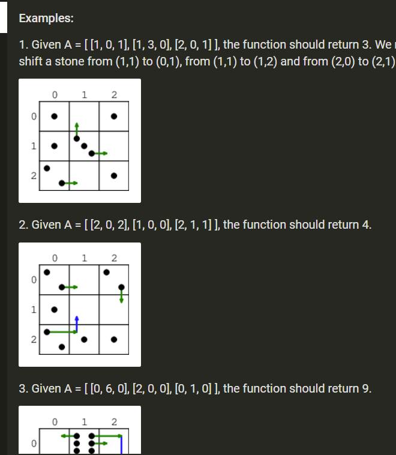


### 第三题：给一个数N，求最小的大于N的数

给一个数N，求最小的大于N的数，这个数没有两个连续相同的数字；

\-    应该提前开辟为高位进位做准备的

n 其实最后，我定义一个全局指针就可以。

n 全部使用全局指针不就可以了吗？哎。。


## 字节跳动

### 会议室预定

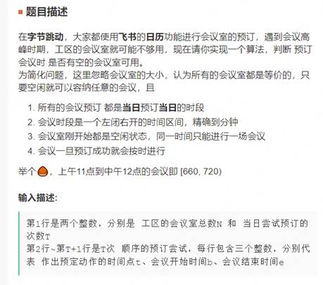 

优先队列，以开始为key

- 并不对；不适合用优先队列；优先队列不能按key遍历；
- 用ArrayList.sort(Comparator)

插入一个会议室满足条件

- 对于一个链表的 curBook
- initial preNode{start = 0,end=0}
  - 单独判断第一个：inset.end < first.start ; return
  - while(nextBook!=null)
    - if inset.start > cur Book.end && insert.edn < nextBoot.start
    - curBook = nextBook, nextBook = nextBook
  - 单独判断最后一个：inset.start>cur.end ; inset

````text
input:
3  8
30 500
700 1000
400 600
800 1200
500 800
450 600
1300 1200
0 350
outpit:
t
t
t
t
t
x
t
t

````


````java
package ACMmodel;

import java.util.ArrayList;
import java.util.Iterator;
import java.util.List;
import java.util.Scanner;

/**
 *会议室：用一个容器表示，提供预定功能（方法）
 * 定义一个数据结构: 会议
 */

public class BD01Meetingroom {
    public static void main(String[] args) {
        Scanner in = new Scanner(System.in);
        int N = in.nextInt();
        int T = in.nextInt();
        in.nextLine();
        int[][] books =  new int[T][3];
        MeetingRoom[] rooms = new MeetingRoom[N];
        //对象数组必须 显示实例化，只有基本数据类型才会默认实例化
        for(int j=0;j<N;j++){
            rooms[j] = new MeetingRoom();
        }
        boolean[] ans = new boolean[T];
        for(int i=0;i<T;i++){
            books[i][0] = in.nextInt();
            books[i][1] = in.nextInt();
            books[i][2] = in.nextInt();
            in.nextLine();
        }
        //开始预定，对于每个book 任务，生成一个 bookingTask,在全部N分room中尝试，由一个成功则记录 YES
        for(int i=0;i<T;i++){
            Meeting task = new Meeting(books[i][1],books[i][2]);
            for(int j=0;j<N;j++){
                if(rooms[j].book(task,books[i][0])){
                    ans[i] = true;
                    break;
                }
            }
        }
        for(boolean e:ans){
            if(e) System.out.println("YES");
            else System.out.println("NO");
        }


    }

    static class Meeting{
        public int begin;
        public int end;
        public Meeting(int begin,int end){
            this.begin = begin;
            this.end = end;
        }
    }
    static class MeetingRoom{


        public List<Meeting> arrange = new ArrayList<>();

        public boolean book(Meeting meeting,int curT){
            boolean res = true;
            Iterator<Meeting> iterator = arrange.iterator();

            //初始为0的情况
            if(arrange.size() == 0){
                arrange.add(meeting);
                return true;
            }

            int i=0;
            while(iterator.hasNext()){
                Meeting itMeeting = iterator.next();
                if(meeting.end<= itMeeting.begin){
                    arrange.add(i,meeting);
                    return true;
                }
                if(meeting.begin < itMeeting.end) return false;
                i++;

            }

            return true;
        }
    }
}

````


### 智能补全 N-GRAM算法

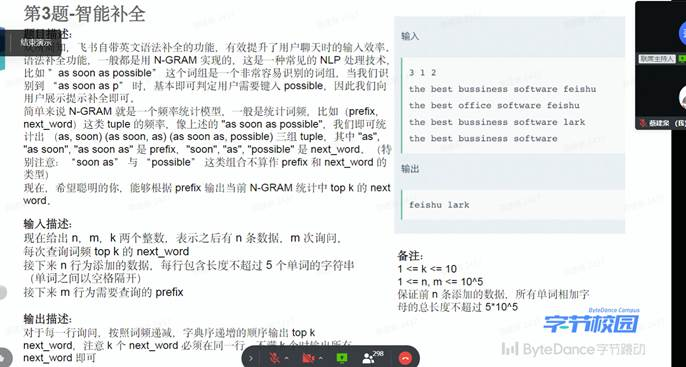

````java
package ACMmodel;


import java.util.Arrays;
import java.util.HashMap;
import java.util.Scanner;

public class BD02InteligentAddWord {
    public static void main(String[] args){
        int n,m,k;
        Scanner in = new Scanner(System.in);
        n = in.nextInt();
        m = in.nextInt();
        k = in.nextInt();
        in.nextLine();
        HashMap<String,HashMap<String,Integer>> tupleMap = new HashMap<>();

        for(int i=0;i<n;i++){
            String curLine = in.nextLine();
            String[] curStr = curLine.split(" ");
            String prefix ="";
            for(int j=0;j<curStr.length-1;j++){
                prefix += curStr[j];
                String nextWord = curStr[j+1];
                HashMap<String,Integer> nextWordList = tupleMap.getOrDefault(prefix,new HashMap<String,Integer>());
                nextWordList.put(nextWord,nextWordList.getOrDefault(nextWord,0)+1);
                tupleMap.put(prefix,nextWordList);
            }
        }
        for(int i=0;i<m;i++){
            String prefix = in.nextLine();
            System.out.println("search prefix: "+prefix);//得去空格才是标准的prefix
            String standardPrefix = "";
            String[] temp = prefix.split(" ");
            for(String e:temp){
                standardPrefix+=e;
            }
            HashMap<String,Integer> storeNextWordList = tupleMap.getOrDefault(standardPrefix,null);
            if(storeNextWordList == null) System.out.println("error");

            NextWord[] words = new NextWord[storeNextWordList.size()];
            int j =0;
            for(String e:storeNextWordList.keySet()){
                int cou = storeNextWordList.get(e);
                words[j++] = new NextWord(e,cou);
            }
            Arrays.sort(words,(a,b)->a.count-b.count);
            for(int t=0;t<k;t++){
                System.out.println(words[t].nextWord);
            }


        }

    }
    static class NextWord{
        String nextWord;
        int count;
        public  NextWord(String nextWord,int count){
            this.nextWord = nextWord;
            this.count = count;
        }
    }


}

````


### 文字转千言

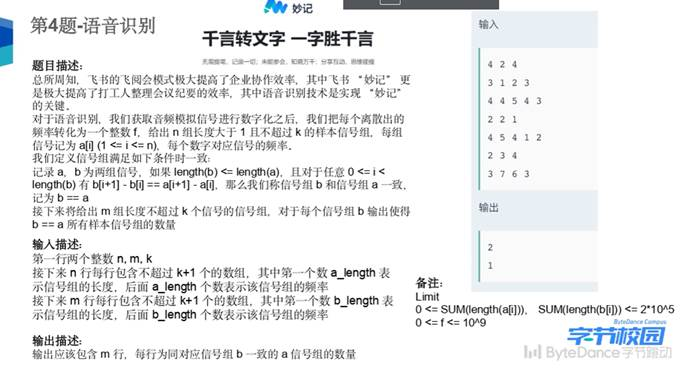

理解题意就很简单

逐个比较diff 数据 是$O(n^2)$时间复杂度

最快的是用 Trie() 树

````text
in:
4 2 4
3 1 2 3
4 4 5 4 3
2 2 1
4 5 4 1 2
2 3 4
3 7 6 3
out：
2 
1
````


````java
package ACMmodel;

import java.util.ArrayList;
import java.util.HashMap;
import java.util.List;
import java.util.Scanner;

/**千言转文字*/
public class BD03WordtoWord {
    public static void main(String[] args){
        int n,m,k;
        Scanner in = new Scanner(System.in);
        n = in.nextInt();
        m = in.nextInt();
        k = in.nextInt();
        in.nextLine();

        List<int[]> diifAList =  new ArrayList<>();
        for(int i=0;i<n;i++){
            int len = in.nextInt();
            int [] eachAArr = new int[len];
            int [] eachDiffA = new int[len-1];
            for(int j=0;j<len;j++){
                eachAArr[j] = in.nextInt();
                if(j!=0){
                    eachDiffA[j-1] = eachAArr[j]-eachAArr[j-1];
                }
            }
            diifAList.add(eachDiffA);
            in.nextLine();
        }

        List<int[]> diffBList = new ArrayList<>();
        for(int i=0;i<m;i++){
            int len = in.nextInt();
            int[] eachBArr = new int[len];
            int[] eachDiffB = new int[len-1];
            for(int j=0;j<len;j++){
                eachBArr[j] = in.nextInt();
                if(j!=0){
                    eachDiffB[j-1] = eachBArr[j]-eachBArr[j-1];
                }
            }
            diffBList.add(eachDiffB);
            in.nextLine();
        }
        Trie trieTree = new Trie();
        //对于diffAList 执行Inset
        for(int[] e : diifAList){
            trieTree.insert(e);
        }

        //对于diffBList 执行查询
        for(int[] e:diffBList){
            int res = trieTree.searchPrefix(e);
            System.out.println(res);
        }

    }
    static class Trie{
        HashMap<Integer,Trie> map;
        int countPath; //统计以该trie结点之前 diff 路径，并到此结束的数量
        int countPrefix; //统计以该trie结点)之前 diff 路径为前缀的数量

        //初始化
        public Trie(){
            map = new HashMap<Integer,Trie>();
            countPath =0;
            countPrefix =0;
        }

        public void insert(int[] diff) {
            Trie cur = this;
            for(int i=0;i<diff.length;i++){
                if(!cur.map.containsKey(diff[i])){
                    cur.map.put(diff[i],new Trie());
                }
                cur = cur.map.get(diff[i]);
                cur.countPrefix++;
            }
            cur.countPath++;

        }
        public int search(int[] diff){
            Trie cur = this;
            for(int i=0;i<diff.length;i++){
                if(cur.map.containsKey(diff[i])){
                    cur = cur.map.get(diff[i]);
                }else{
                    return -1;
                }
            }
            return cur.countPath;
        }
        /** @ return: -1 无该前缀*/
        public int searchPrefix(int[] diff){
            Trie cur = this;
            for(int i=0;i<diff.length;i++){
                if(cur.map.containsKey(diff[i])){
                    cur = cur.map.get(diff[i]);
                }else{
                    return -1;
                }
            }
            return cur.countPrefix;
        }
    }
}

````

//trie 树 第二次做，直接done，代码也简洁一些

````java
package ACMmodel.ByteDance.re;

import java.util.Arrays;
import java.util.HashMap;
import java.util.Scanner;

public class WordToWordTrie {
    public static void main(String[] args) {
        Scanner sc = new Scanner(System.in);
        int n = sc.nextInt();
        int m = sc.nextInt();
        int k = sc.nextInt();
        sc.nextLine();
        Trie trieTree = new Trie();
        for(int i=0;i<n;i++){
            int len = sc.nextInt();
            int[] signalArr = new int[len];
            for(int j=0;j<len;j++){
                signalArr[j] = sc.nextInt();
            }
            trieTree.inserSignal(signalArr);
            sc.nextLine();
        }
        int[] ans = new int[m];
        for(int j=0;j<m;j++){
            int len = sc.nextInt();
            int[] signalArr = new int[len];
            for(int t=0;t<len;t++){
                signalArr[t] = sc.nextInt();
            }
            ans[j] = trieTree.getPrefixCou(signalArr);
        }
        System.out.println(Arrays.toString(ans));

    }
}

class Trie {
    public HashMap<Integer,Trie> map = new HashMap<>();
    boolean isEnd;
    int prefixCou;

    public boolean inserSignal(int[] arr){
        Trie cur = this;
        for(int i=1;i<arr.length;i++){
            if(cur.map.containsKey(arr[i]-arr[i-1])){
                cur = cur.map.get(arr[i]-arr[i-1]);
                cur.prefixCou++;
                continue;
            }
            cur.map.put(arr[i]-arr[i-1],new Trie());
            cur = cur.map.get(arr[i]-arr[i-1]);
            cur.prefixCou++;
        }
        return true;

    }
    public int getPrefixCou(int[] arr){
        Trie  cur = this;
        for(int i=1;i<arr.length;i++){
            cur  = cur.map.get(arr[i]-arr[i-1]);
        }
        return cur.prefixCou;

    }
}

````

## 

### 匹配关键词


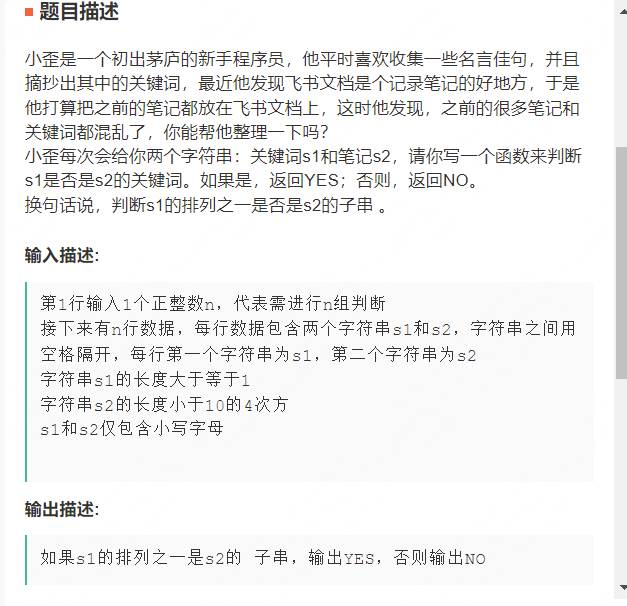

s1 中可能有重复字符

s2 中可能有重复字符

明确是子串的判定条件：j-i == s.1length() ; s2（i）-S2(j) 均属于s1；这样够吗？  不行，比如，~aab~,~abb~

先考虑时间复杂度较大的做法，说不定没有更快的做法；

-  set 来保存定长的字符集，满足下面条件：
  - set集长度等于目标子串set长度;  时间空间均O(1)
  - 再判断字符的个数，用数组或者HashMap; 空间O(1)，时间O（len）；总时间复杂度O（len(s1)*len(s2)）
- 如果不满足 set集长度等于目标子串set长度
  - 往后扫描

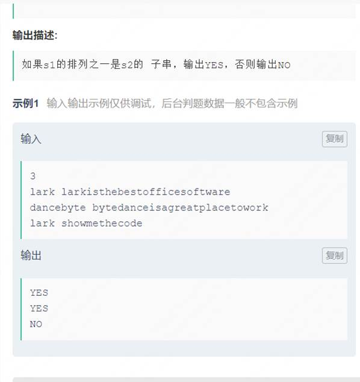

 ````text
3
lark larkisthebestofficesoftware
dancebyte bytedanceisagreatplacework
lark showmethecode
 ````


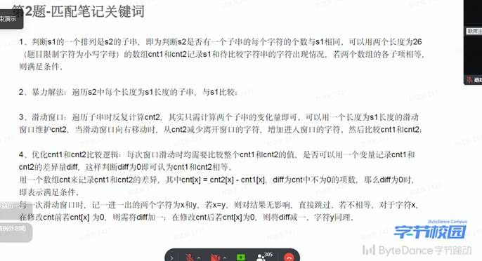

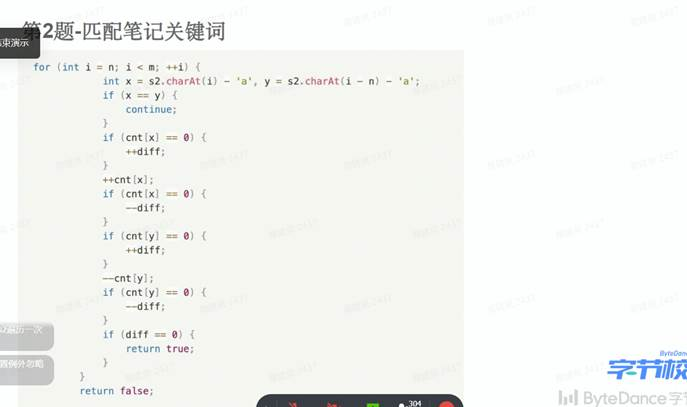


### rand()5 生成rand()7

一、

已经有rand5()，如何生成rand7()

要产生一个randA 函数，关键是要**等概率生成**[1,A]或者 [1, N*A] 直接的数

假设已经有randB

如果A<B, 直接生成；反之

正确做法是用rand B拓展 ：rand $B^{2}$= B*（randB-1）+randB ，直到 $B^{K}>A$

二、

面试官提示了一种把rand5生成的数字当作字符串的做法

````java
package ACMmodel.ByteDance.Andro;

import java.util.Random;

public class Rand5to7 {
    public static void main(String[] args) {

    }
    public int rand7(){
        //第一部分等概率生成：0 5 10 15 20
        //加上第二部分，整体等概率的生成：[1,25]
        int ans =0x3f3f3f3f;
        //优化前
       /* if(ans >7){
            ans = 5*(rand5()-1)+rand5();
        }
        return ans;*/
        //优化后
        if(ans >21){ //可以取最接近25的7的倍数
            ans = 5*(rand5()-1)+rand5();
        }
        return ans%7;

    }
    /**return [1,5]*/
    public int rand5(){
        Random random = new Random();
        return random.nextInt(5)+1;
    }
}

````


## 腾讯22暑期实习

### 打印竖列的数

- 一次遗憾、糟糕的笔试
- 给n个数字字符串，每个字符串长度为m，然后从上到下对齐，从上到下构建数字，[排序](https://www.nowcoder.com/jump/super-jump/word?word=排序)输出。

第一题，没有什么特殊解；但看看你写的，垃圾代码

输入 n ，表示下面输入n行字符串，等长

输出：n个排序后的数

垃圾代码

````java
package ACMmodel.TenCent;

import java.util.ArrayList;
import java.util.Arrays;
import java.util.HashSet;
import java.util.Scanner;

public class Main12 {
    public static void main(String[] args) {
        Scanner sc = new Scanner(System.in);
        int n = sc.nextInt();
        sc.nextLine();
        String[] srr = new String[n];
        for(int i=0;i<n;i++){
            srr[i] = sc.nextLine();
        }
        char[][] crr = new char[n][];
        for(int i=0;i<n;i++){
            crr[i] = srr[i].toCharArray();
        }
//        HashSet<Integer> set = new HashSet<>();
        ArrayList<Integer> list = new ArrayList<>();
        int slen = srr[0].length();
        for(int i=0;i<slen;i++){
            String sb = "";
            boolean preZ = true;
            for(int j=0;j<n;j++){
                if( preZ && crr[j][i]!='0'){ //
                    preZ = false;
                }
                if(preZ==false){
                    sb+=crr[j][i];
                }
            }


            int curNum = Integer.parseInt(sb);
            list.add(curNum);
        }
        int[] nums = new int[list.size()];
        int index = 0;
        for(int e:list){
            nums[index] = e;
            index++;
        }
        Arrays.sort(nums);
        for(int i=0;i<nums.length;i++){
            System.out.print(nums[i]);
            if(i!=nums.length-1) System.out.print(" ");
        }
        return;

    }
}

````

别人的oc 代码

给n个数字字符串，每个字符串长度为m，然后从上到下对齐，从上到下构建数字，[排序](https://www.nowcoder.com/jump/super-jump/word?word=排序)输出。

````java
import java.io.BufferedInputStream;
import java.util.ArrayList;
import java.util.Arrays;
import java.util.List;
import java.util.Scanner;

public class Q1 {
    public static void main(String[] args) {
        Scanner sc = new Scanner(new BufferedInputStream(System.in));
        int n = sc.nextInt();
        String strs[] = new String[n];
        sc.nextLine();
        for (int i = 0; i < n; i++) {
            strs[i] = sc.nextLine();
        }

        int m = strs[0].length();
        List<Integer> nums = new ArrayList();
        for (int i = 0; i < m; i++) {
            int num = 0;
            for (int j = 0; j < n; j++) {
                num = num * 10 + (strs[j].charAt(i)-'0');
            }
            nums.add(num);
        }
        nums.sort((o1,o2)->{return o1-o2;});
        for (int i = 0; i < nums.size(); i++) {
            System.out.print(nums.get(i)+" ");
        }

    }
}

````

### 素数相关

给一个数组，下标从1-n，每次淘汰下标非质数的数字，然后重新组成数组，问最后剩下的数字为何数？

函数模式

```java
package ACMmodel.TenCent;

/*给一个数组，下标从1-n，每次淘汰下标非质数的数字，然后重新组成数组，问最后剩下的数字为何数*/
/*生成素数筛，直接模拟就好*/

import java.util.ArrayList;
import java.util.Arrays;

public class MainRedo2 {
    static int[] primTable = new int[(int) 1e5];

    public static void main(String[] args) {
        Arrays.fill(primTable,1);
        //默认都是素数，需要挑出不是素数的数； 默认都不是素数，则需要挑出是素数的数； 根据算法，我们选择初始化为1 默认都是素数
       primTable[1] = 0;

        int a[] = new int[]{3,1,1,4,5,6};
        MainRedo2 main = new MainRedo2();
        main.buildPrimTable();
        System.out.println(main.getNumber(a));
    }

    public int getNumber(int[] nums) {
        int cou = nums.length;
        int[] tARR = new int[nums.length];
        while(cou>1){
            int k=0;
            for(int i=1;i<=cou;i++){
                if(primTable[i] == 1){
                    tARR[k++] = nums[i-1];
                }
            }
            nums = tARR;
            cou = k;
        }
        return tARR[0];
    }

    public void buildPrimTable() {
        for (int i = 2; i < 1e5; i++) {
            if (primTable[i]==1) {
                int c = 2;
                while (i*c < 1e5) { //假设数最大范围是1e5
                    primTable[i * c] = 0;
                    c++;
                }
            }
        }
    }

    //无用函数
    public boolean isPrime(int x) {
        if (x == 1) return false;
        if (x == 2) return true;
        if (x == 3) return true;
        for (int i = 2; i <= x / 2; i++) {
            if (x % i == 0) {
                return false;
            }
        }
        return true;

    }

}

```

### 攻击防守

- do

### *环形链表

给一个[链表](https://www.nowcoder.com/jump/super-jump/word?word=链表)数组，数组中的每个[链表](https://www.nowcoder.com/jump/super-jump/word?word=链表)是一个循环[链表](https://www.nowcoder.com/jump/super-jump/word?word=链表)中的破碎的部分，且每个[链表](https://www.nowcoder.com/jump/super-jump/word?word=链表)结点的值唯一且为数值类型，求将这个循环[链表](https://www.nowcoder.com/jump/super-jump/word?word=链表)复原以后，从[链表](https://www.nowcoder.com/jump/super-jump/word?word=链表)中任意一个结点正序或逆序遍历 字典序 最小的那个[链表](https://www.nowcoder.com/jump/super-jump/word?word=链表)，并返回。

````text
输入:
[{1,2,3},{2,3,4},{4,1}]
输出:
{1,2,3,4}
输入:
[{3,7,4},{7,4,5,1,10,3}]
输出:
{1,5,4,7,3,10}
````


https://www.nowcoder.com/discuss/940859?page=1

https://www.nowcoder.com/discuss/940915

你的垃圾代码

````java
package ACMmodel.TenCent;


import java.util.HashMap;

class ListNode {
    int val;
    ListNode next = null;

    public ListNode(int val) {
        this.val = val;
    }
}

//初步写完未测试
public class MainRedo4 {
    public static void main(String[] args) {


    }

    public ListNode solve(ListNode[] a) {
        HashMap<Integer, ListNode> preMap = new HashMap<>();
        HashMap<Integer, ListNode> nextMap = new HashMap<>();
        HashMap<Integer, ListNode> nodeMap = new HashMap<>();
        int min = 0x3f3f3f3f;
        for (int i = 0; i < a.length; i++) {
            ListNode cur = a[i];
            nodeMap.put(cur.val, cur);
            if (!preMap.containsKey(cur.val)) {
                preMap.put(cur.val, null);
            }

            if (cur.val < min) min = cur.val;
            while (cur.next != null) {
                nextMap.put(cur.val, cur.next);
                ListNode pre = cur;
                cur = cur.next;
                preMap.put(cur.val, pre);
                nodeMap.put(cur.val, cur);//重复没关系
                if (cur.val < min) min = cur.val;
            }
            if (!nextMap.containsKey(cur.val)) {
                nextMap.put(cur.val, null);
            }
        }
        ListNode t1 = null, t2 = null;
        for (int e : preMap.keySet()
        ) {
            if (preMap.get(e) == null) {
                t1 = nodeMap.get(e);
            }
        }
        for (int e : nextMap.keySet()) {
            if (nextMap.get(e) == null) {
                t2 = nodeMap.get(e);
            }
        }
        if (t1 != null && t2 != null) {
            preMap.put(t1.val, t2);
            nextMap.put(t2.val, t1);
        }
        //看看是正序还是逆序
        int direction = 0;
        int s1 = min, s2 = min;
        while (s1 == s2) {
            s1 = preMap.get(s1).val;
            s2 = nextMap.get(s2).val;
        }
        if (s1 < s2) direction = -1;
        else direction = -2;

        ListNode head = new ListNode(0);
        ListNode scanNode = nodeMap.get(min);
        head.next = scanNode;
        //逆序遍历
        int scan = min;
        if (direction <= 0 && scanNode.next != head.next) {
            scanNode.next = preMap.get(scan);
            scanNode = scanNode.next;
            scan = scanNode.val;
        }
        if (direction <= 0 && scanNode.next != head.next) {
            {//正向遍历
                scanNode.next = nextMap.get(scan);
                scanNode = scanNode.next;
                scan = scanNode.val;
            }

        }
        return head.next;
    }
}

````

好看的代码

````java
import java.util.*;


class ListNode {
    int val;
    ListNode next = null;

    public ListNode(int val) {
        this.val = val;
    }
}

public class Solution {
    /**
     * 代码中的类名、方法名、参数名已经指定，请勿修改，直接返回方法规定的值即可
     *
     * @param a ListNode类一维数组 指向每段碎片的开头
     * @return ListNode类
     */
    public ListNode solve(ListNode[] a) {
        // write code here
        HashMap<Integer, ListNode> nodeMap = new HashMap<>();
        HashMap<Integer, Integer> preMap = new HashMap<>();
        HashMap<Integer, Integer> nextMap = new HashMap<>();
        HashMap<Integer, Boolean> visitedMap = new HashMap<>();
        int min = Integer.MAX_VALUE;
        for (int i = 0; i < a.length; i++) {
            printList(a[i]);
            for (ListNode p = a[i]; p != null; p = p.next) {
                nodeMap.put(p.val, p);
                if (p.next != null) {
                    preMap.put(p.next.val, p.val);
                    nextMap.put(p.val, p.next.val);
                }
                min = Math.min(min, p.val);
            }
        }
        ListNode head = new ListNode(0);
        head.next = null;
        ListNode rear = head;
        rear.next = nodeMap.get(min);
        rear = rear.next;
        rear.next = null;
        visitedMap.put(min, true);
        if (preMap.get(min) < nextMap.get(min)) {
            //前驱小 从前驱走
            while (!visitedMap.getOrDefault(preMap.get(min), false)) {
                min = preMap.get(min);
                rear.next = nodeMap.get(min);
                rear = rear.next;
                rear.next = null;
                visitedMap.put(min, true);
            }

        } else {
            //后继小 从后继走
            //前驱小 从前驱走
            while (!visitedMap.getOrDefault(nextMap.get(min), false)) {
                min = nextMap.get(min);
                rear.next = nodeMap.get(min);
                rear = rear.next;
                rear.next = null;
                visitedMap.put(min, true);
            }
        }
        printList(head);
        return head.next;
    }

    public void printList(ListNode head) {
        System.out.print("链表->{");
        for (ListNode p = head; p != null; p = p.next) {
            System.out.print(p.val+" ");
        }
        System.out.println("}");
    }
}
````

### *股票问题

````text

股票问题，一开始有初始资金m，和一个长度为n的股票价格数组，每天可以进行买入股票或者卖出股票其中的一种操作，或不操作。可以同时持有多个股票，问最后一天的最大总资产是多少？（最大总资产为持有现金+持有的股票价格）

输入：n , m 
6 2
2 3 1 1 1 2
输出:
6
````

买一只股票，花了x, 不涨不跌，总资本还是 m-x+x

买股时直接减，第j天总资产是 此时的现金+当天股价*持有的数量

每天可以买股票，现金够就可以买

每天可以卖股票，只要持有股票


**思路：动态规划，设dp[i] [j]为第i天持有j个股票能拥有的最大现金额度，dp[i] [j]  = Math.min(dp[i-1] [j] , dp[i] [j+1] +prices[i] , dp[i] [j-1]-prices[i])**


坑

- 极易错点：除了dp[0] [0] ：一定要初始化为负无穷

- ```
  //初始化为0其实从背包定义本身没有错；但由于最后的收益计算是 ： 剩下的现金 + price[n]*j；使得初始化为0导致错误
  //0：无法区分是刚刚好现金为0，还是一个无法到达的非法状态，所以要显式初始化为 负无穷
  ```

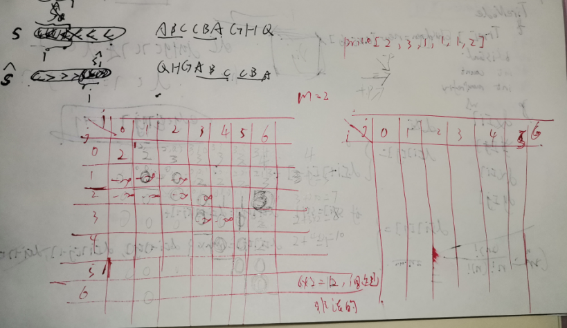

````java
package ACMmodel.TenCent.re;

import java.util.Scanner;
/**
 * 输入：n , m
 * 6 2
 * 2 3 1 1 1 2
 * 输出:
 * 6
 * */
public class Main5 {
    public static void main(String[] args) {

        Scanner sc = new Scanner(System.in);
        int n = sc.nextInt();
        int  m =sc.nextInt();
        int[] price = new int[n+1];
        for(int i=1;i<=n;i++){
            price[i] = sc.nextInt();
        }
        int[][] dp = new int[n+10][n+10];

        //初始化为0其实从背包定义本身没有错；但由于最后的收益计算是 ： 剩下的现金 + price[n]*j；使得初始化为0导致错误
        //0：无法区分是刚刚好现金为0，还是一个无法到达的非法状态，所以要显式初始化为 负无穷
        for (int i = 0; i <= n+1; i++) {
            for (int j = 0; j <= n+1; j++) {
                dp[i][j] = -0x3f3f3f3f;
            }
        }

        dp[0][0] = m; //第i天持有j支股票的最大现金
        for(int i=1;i<=n;i++){
            for(int j=0;j<=i;j++){
                dp[i][j] = dp[i-1][j];

                //买入一只股票
                if(j-1>=0 && dp[i-1][j-1]>=price[i]){   //&& 忽视了后面这个条件
                  dp[i][j] = Math.max(dp[i][j],dp[i-1][j-1]-price[i]) ;
                }
                //卖出一只股票
                if(j+1<=i-1){
                   dp[i][j] = Math.max(dp[i][j], dp[i-1][j+1]+price[i]);
                }
            }
        }
        int maxProfit = Integer.MIN_VALUE;
        for(int j=0;j<=n;j++){
            int cur = dp[n][j] + price[n]*j;
            if(cur>maxProfit) maxProfit = cur;
        }
        System.out.println(maxProfit);

    }
}

````


## 腾讯真题

### [任务机器匹配](https://www.nowcoder.com/question/next?pid=10611931&qid=161631&tid=56714657)

腾讯2018春，第五题

**思路**

````java
package ACMmodel.TenCentOld.spring2018;

import java.util.Arrays;
import java.util.Comparator;
import java.util.Scanner;

/*
* 题目要求在第一天：尽可能完成任务数量最大

/**
 * 此题有争议，看收益函数：200 * 任务时间 + 3 * 等级
 * 题解是默认把最大收益相关于任务时间； 因为是贪心的匹配最接近等级的机器；这符合常识和直觉，但不能通过极端的特例；所以先暂时忽略这一点；
 * 题目的代码贪心代码还是有学习的地方的
 */
public class Main5 {
    public static void main(String[] args) {
        Scanner sc = new Scanner(System.in);
        int m = sc.nextInt(); //机器数
        int n = sc.nextInt();//任务数
        sc.nextLine();
        Node[] tasks = new Node[n];
        Node[] machs = new Node[m];
        for(int i=0;i<m;i++){
            machs[i] = new Node(sc.nextInt(), sc.nextInt());
            sc.nextLine();
        }
        for(int i=0;i<n;i++){
            tasks[i] = new Node(sc.nextInt(), sc.nextInt());
            sc.nextLine();
        }

        Comparator<Node> comp  = new Comparator<Node>() {
            @Override
            public int compare(Node o1, Node o2) {
                if(o1.time == o2.time){
                    return o2.level - o1.level;
                }else{
                    return o2.time - o1.time;
                }
            }
        };
        Arrays.sort(tasks,comp);
        Arrays.sort(machs,comp);

        long sum=0;
        int ansCou = 0;
        int j=0;
        int[] cntFitMacLev = new int[105];
        //贪心：先处理时间长的任务；一个时间长的任务处理时，选择一个和它等级最接近的
        //多个相同等级但最大工作时间不同的的机器，但都能处理一个任务时，任意选一个机器就行了；
        //因为没被选择的机器一定可以满足后续的任务（任务按时间降序的），而收益是按任务时间计算的，对结果没有影响
        for(int i=0;i<tasks.length;i++){
            while(j<m && machs[j].time>=tasks[i].time){
                cntFitMacLev[machs[j].level]++;
                j++;
            }
            for(int level = tasks[i].level;level<=100;level++ ){
                if(cntFitMacLev[level]>0){
                    sum += 200*tasks[i].time + 3*tasks[i].level;//不是level
                    ansCou++;
                    cntFitMacLev[level]--;//不是cntFitMacLev[tasks[i].level]--
                    break;
                }
            }

        }
        System.out.println(ansCou+" "+sum);
    }

}
class Node{
    int time;
    int level;
    public Node(int time,int level){
        this.time = time;
        this.level = level;
    }
}

````


### 画家小Q

````text
家小Q又开始他的艺术创作。小Q拿出了一块有NxM像素格的画板, 画板初始状态是空白的,用'X'表示。
小Q有他独特的绘画技巧,每次小Q会选择一条斜线, 如果斜线的方向形如'/',即斜率为1,小Q会选择这条斜线中的一段格子,都涂画为蓝色,用'B'表示;如果对角线的方向形如'\',即斜率为-1,小Q会选择这条斜线中的一段格子,都涂画为黄色,用'Y'表示。
如果一个格子既被蓝色涂画过又被黄色涂画过,那么这个格子就会变成绿色,用'G'表示。
小Q已经有想画出的作品的样子, 请你帮他计算一下他最少需要多少次操作完成这幅画。

输入描述:
每个输入包含一个测试用例。
每个测试用例的第一行包含两个正整数N和M(1 <= N, M <= 50), 表示画板的长宽。
接下来的N行包含N个长度为M的字符串, 其中包含字符'B','Y','G','X',分别表示蓝色,黄色,绿色,空白。整个表示小Q要完成的作品。

输出描述:
输出一个正整数, 表示小Q最少需要多少次操作完成绘画。

输入例子1:
4 4
YXXB
XYGX
XBYY
BXXY

输出例子1:
3

例子说明1:
XXXX
XXXX
XXXX
XXXX
->
YXXX
XYXX
XXYX
XXXY
->
YXXB
XYBX
XBYX
BXXY
->
YXXB
XYGX
XBYY
BXXY
````

**思路**

- 划线总是只能画斜率正负1的线
- 4种颜色X Y B G，问题等价于还原为全是X的操作
- 遍历每格，当前格是
  - Y，划-1线
  - B，划1线
  - G，先画-1变B，在画1变X
  - X，跳过
  - 其他细节见注释

````java
package ACMmodel.TenCentOld.spring2018;

import java.util.Scanner;


public class Main6 {
    public static void main(String[] args) {
        Scanner sc = new Scanner(System.in);
        int n = sc.nextInt();
        int m = sc.nextInt();
        sc.nextLine();
        char[][] color = new char[n][m];
        for (int i = 0; i < n; i++) {
            String line = sc.nextLine();
            for (int j = 0; j < line.length(); j++) {
                color[i][j] = line.charAt(j);
            }
        }
        getMinStep(n, m, color);

    }

    public static void getMinStep(int n, int m, char[][] color) {
        int step = 0;
        for (int i = 0; i < n; i++) {
            for (int j = 0; j < m; j++) {
                //划'\' 斜率 45 度
                if (color[i][j] == 'Y') {
                    step++;
                    dfs_y(n, m, i, j, color);
                } else if (color[i][j] == 'B') {
                    step++;
                    dfs_b(n, m, i, j, color);
                } else if (color[i][j] == 'G') {
                    step++;
                    dfs_y(n, m, i, j, color);
                    step++;
                    dfs_b(n, m, i, j, color);
                }
            }
        }
        System.out.println(step);
    }

    public static void dfs_y(int n, int m, int x, int y, char[][] color) {
        if (x >= 0 && y >= 0 && x < n && y < m && (color[x][y] == 'Y' || color[x][y] == 'G')) {
            if (color[x][y] == 'G') {
                color[x][y] = 'B';// 如果当前位置要求画的是G,那么画了Y之后下一次只能画B
            } else {
                color[x][y] = 'X';
            }
            dfs_y(n, m, x + 1, y + 1, color);
            dfs_y(n, m, x - 1, y - 1, color);
        }
    }

    public static void dfs_b(int n, int m, int x, int y, char[][] color) {
        if (x >= 0 && y >= 0 && x < n && y < m && (color[x][y] == 'B' || color[x][y] == 'G')) {
            if (color[x][y] == 'G') {
                color[x][y] = 'Y';// 如果当前位置要求画的是G,那么画了B之后下一次只能画Y
            } else {
                color[x][y] = 'X';
            }
            dfs_b(n, m, x - 1, y + 1, color);
            dfs_b(n, m, x + 1, y - 1, color);
        }
    }
}

````


## 美团

### 蚂蚁上树（树状DP）

1. 

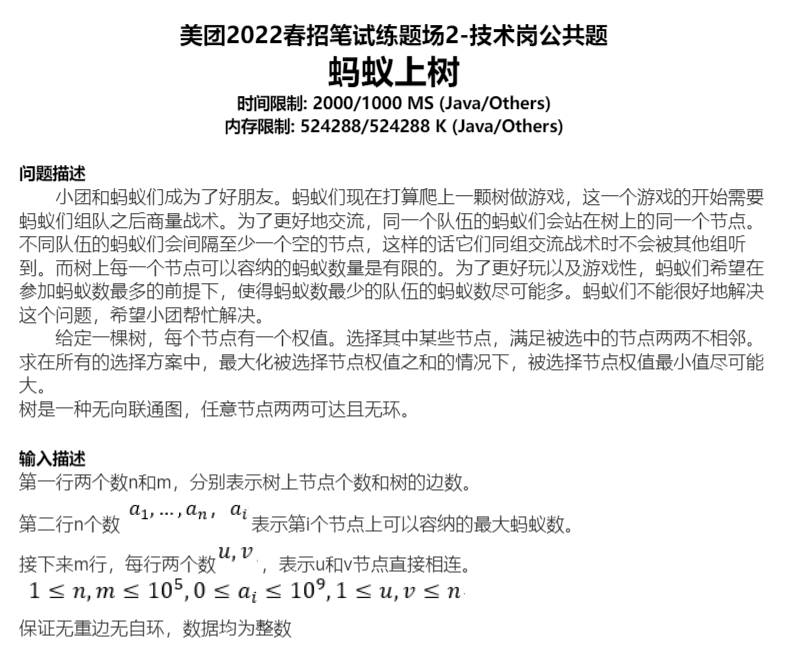

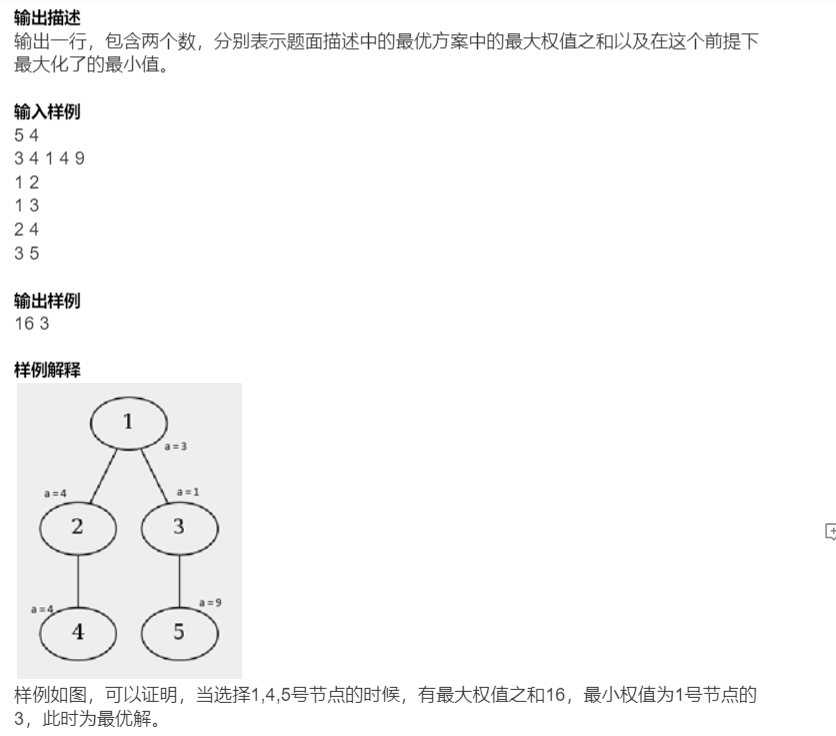

**思路:**

https://www.nowcoder.com/discuss/855037?type=post&order=hot&pos=&page=1&ncTraceId=&channel=-1&source_id=search_post_nctrack

https://blog.csdn.net/qq_21922801/article/details/115354470


````text
in:
5 4
3 4 1 4 9
1 2
1 3
2 4
3 5
out:
16 3
````

````java
package ACMmodel.Meituan.re;

import java.util.ArrayList;
import java.util.Scanner;

/**
 * 树状dp
 */
public class AntGame {
    static int[] val;
    static ArrayList<Integer>[] edge;

    public static void main(String[] args) {
        Scanner sc = new Scanner(System.in);
        int n = sc.nextInt();
        int m = sc.nextInt();
        int[][] dp = new int[n + 10][2];
        int[][] min = new int[n + 10][2];//取得dp状态解时，全部节点的最大的最小值； 存的是一个状态的节点最小值
        sc.nextLine();
        val = new int[n + 10];
        for (int i = 1; i <= n; i++) {
            val[i] = sc.nextInt();
        }
        sc.nextLine();
        edge = new ArrayList[m + 10];
        for(int i=0;i<m+10;i++) edge[i] = new ArrayList<>();
        for (int i = 1; i <= m; i++) {
            int x = sc.nextInt();
            int y = sc.nextInt();
            edge[x].add(y);
//            edge[y].add(x);
            sc.nextLine();
        }
        //父节点是0，表示cur 是树根节点
        dfs(1, 0, dp, min);

        //输出
        long ans1= 0, ans2 = 0;
        for(int i=1;i<=n;i++){
            ans1 = Math.max(ans1,Math.max(dp[i][0],dp[i][1]));
        }
        System.out.print(ans1+" ");
        for(int i=1;i<=n;i++){
            if(ans1 == dp[i][0]) ans2 = Math.max(ans2,min[i][0]);
            if(ans1 == dp[i][1]) ans2 = Math.max(ans2,min[i][1]);
        }
        System.out.println(ans2);

    }

    public static void dfs(int cur, int father, int[][] dp, int[][] min) {
        //dp过程允许的一个初始化状态
        dp[cur][1] = val[cur];
        min[cur][1] = val[cur];
        dp[cur][0] = 0;
        min[cur][0] = 0x3f3f3f;//或者在外面统一初始化
        if(edge[cur].size()==0) return;
        //遍历当前层全部子节点
        for (int son :edge[cur]){
//            if(son == father) continue;// ？
            dfs(son,cur,dp,min);
            //选
            dp[cur][1] +=dp[son][0];
            min[cur][1] = Math.min(min[cur][1] , min[son][0]);
            //不选
            dp[cur][0] = Math.max(dp[son][1],dp[son][0]);
            if(dp[son][1]>dp[son][0]){
                min[cur][0] = Math.min(min[son][1],min[cur][0]);
            }else if(dp[son][1]<dp[son][0]){
                min[cur][0] = Math.min(min[son][0],min[cur][0]);
            }else{
                //min[][]需要初始化为很大；
                min[cur][0] = Math.min(min[cur][0],Math.max(min[son][0],min[son][1]));//为什么里面是max,根据提议我们想要最大的最小值
            }
        }
    }
}

````


### 字符串中寻找数字

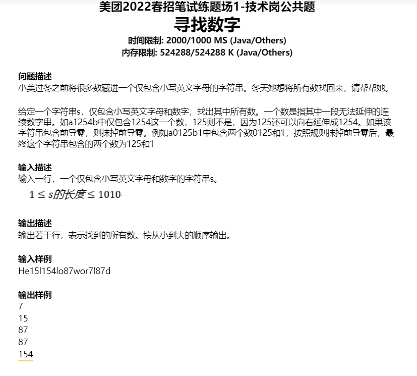

简单题

````java
import java.util.ArrayList;
import java.util.List;
import java.util.Scanner;

/**
 * He15l154lo87wor7l87d
 * */
public class NumCou {
    public static void main(String[] args) {
        Scanner sc = new Scanner(System.in);
        String s = sc.nextLine();
        List<Integer> ans = new ArrayList<>();
        int x=0;
        for(int i=0;i<s.length();i++ ){
            if(s.charAt(i)<'0'||s.charAt(i)>'9'){
                if(x!=0){
                    ans.add(x);
                    x = 0;
                }
            }
            else{
                x = x*10+(s.charAt(i) - '0');
            }
        }
        //数字在最后的情况，加进去
        if(x!=0) ans.add(x);
        System.out.println(ans);

    }
}
````


### 分离进制组合的数

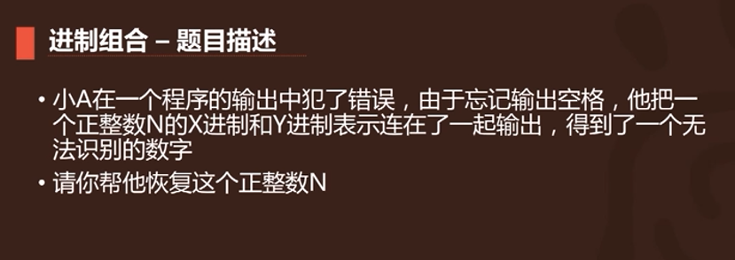

- 这道题关键在于考核你对数的进制理解是否深刻
- 给出N进制的一个数，不管是正序遍历还是倒数遍历，都有办法一遍转成十进制的数
- 因此，一遍双指针就可以解，记得边界

````java
package ACMmodel.NetEase.re;

import java.util.Scanner;

public class XYnum {
    /**此题收获：
     * 一个N进制数，不管是从头读还是从后读，都是可还原的*/
    /*
    in:
    5 2
    113221101000101
    out:
    837
    * */
    public static void main(String[] args) {
        Scanner sc = new Scanner(System.in);
        int X = sc.nextInt();
        int Y = sc.nextInt();
        sc.nextLine();
        String str = sc.nextLine();
        int p1 = 0;
        int p2 = str.length()-1;
        int c = 0;
        int numX=0;
        int numY=0;
        numX = numX*X+str.charAt(p1)-'0';
        numY = (int) ((str.charAt(p2)-'0')*Math.pow(Y,c))+numY;

        while(p1<p2){
            if(numX<numY){
                p1++;
                if(p1 == p2) break;
                numX = numX*X+str.charAt(p1)-'0';
            }else{
                p2--;
                if(p1 == p2) break;
                c++;
                numY = (int) ((str.charAt(p2)-'0')*Math.pow(Y,c))+numY;
            }
        }
        if(numX == numY){
            System.out.println(numX);
        }else{
            System.out.println("wrong");
        }
    }
}
````


### QIU.第一题，礼品盒分配

````text
小美做饼干，有AB两种，做成礼盒卖，每个礼盒三个饼干，且至少包含一个A 和 一个B。现在给你A和B的数量，问最多可以做多少礼盒？
````

解法一：

分析了一下，礼盒的数量为（A，B，（A+B）/3）三者的最小值。$O(样例数)$

````java
//https://www.nowcoder.com/discuss/1006408?type=2&channel=-1&source_id=discuss_terminal_discuss_hot_nctrack
import java.util.Scanner;

public class Q1 {
    public static void main(String[] args) {
        Scanner sc = new Scanner(System.in);
        int N = sc.nextInt();
        for (int i = 0; i < N; i++) {
            int x = sc.nextInt();
            int y = sc.nextInt();
            System.out.println(getCount(x,y));
        }
    }

    public static int getCount(int A,int B){
        //假设能做x盒，那么 x<=A x<=B 且 3x<=A+B
        int x = (A+B)/3;
        x = Math.min(x,A);
        x = Math.min(x,B);
        return x;
    }
}
````

解法二：

解题思路：分情况进行讨论，礼盒数取决于 A B 最小值 和 A B 间的差值。$O(样例数)$

- 可以看做，先在每个礼盒中放入 一个 A 和 一个 B
- max - min，就是在每个盒子中放入 1 A 和 1 B 后剩余的 sub
- 如果 sub >= min，那么所有礼盒都可以满足 3 个礼品
- 否则，不能将第一步中所有礼盒装满，直接返回 ( A + B) / 3即可

````java
//https://www.nowcoder.com/discuss/1006454?type=2&channel=-1&source_id=discuss_terminal_discuss_hot_nctrack
public class Main {
public static void main(String[] args) {
  Scanner input = new Scanner(System.in);
  int T = input.nextInt();
  while (T-- > 0){
      int num1 = input.nextInt();
      int num2 = input.nextInt();
      System.out.println(getAns(num1, num2));
  }
}
public static int getAns(int x, int y){
  int min = Math.min(x, y), max = Math.max(x, y), sub = max - min;
  if(sub >= min) return min;
  else return (max + min) / 3;
}
}
````

我的解法，通过$82\%$ ,$O(样例数*lNum)$

````java
package Qiu.MEIT;


import java.util.Scanner;

public class Main2 {
    public static void main(String[] args) {
        Scanner sc = new Scanner(System.in);
        int T = sc.nextInt();
        sc.nextLine();
        for (int i = 0; i < T; i++) {
            int a = sc.nextInt();
            int b = sc.nextInt();
            sc.nextLine();
            if (a + b < 3) System.out.println(0);
            else {
                int ans = cal(a, b);
                System.out.println(ans);
            }

        }
    }

    public static int cal(int aNum, int bNum) {
        if (aNum + bNum < 3) return 0;

        long maxBox = 0;
        long lNum = Math.min(aNum, bNum);
        long mNum = Math.max(aNum, bNum);

        long j = lNum;
        long adder = 0;
        for (long i = lNum; i >= 1 && j >= 1; i--) {
            if (j * 2 + adder <= mNum) {
                maxBox = i;
                break;
            }
            j -= 2;
            adder++;
        }
        return (int) maxBox;

    }
}

````


### QIU.第五题

初始字符串为MeiTuan，每次对字符串做 str = str + str.reverse() + "wow"的操作，无限循环。后面给你一个k，问你位置k的字符为什么。

````text
作者：小镇做题家-感谢信收割机版
链接：https://www.nowcoder.com/discuss/1006454?type=2&channel=-1&source_id=discuss_terminal_discuss_hot_nctrack
来源：牛客网

字符串的表示为 [source][rever][wow]，三个部分
解题思路：使用字符串模拟，估计不是内存溢出，就是时间超时

采用 index，和 len 去模拟字符串，根据 index 和 len 的关系，不断去缩小范围知道 index 在MeiTuannauTieMwow 这个字符串长度内

如果 len - index < 3，那么刚坐标处于 "wow"结尾中

如果 index > (len - 3) /2 ，那么index 处于 rever 这个范围中

如果 index < (len - 3) / 2，那么index 处于 source这个返回中

如果 index < "MeiTuannauTieMwow".length，那么直接返回

````

- 模拟长度和下标的关系，这一个思想要学习
- 而是找规律。其中index 落再 [s] [revs] [wow] 的revs中的部分，利用revS本身对称的特点，比较巧妙和难以发现


````java
package Qiu.MEIT;


import java.util.Scanner;

/*
* in:
* 4
* 25
* 35
* 15
* 3
* out should be:
* u
* w
* w
* i
* */

//初始字符串为MetTuan，每次对字符串做 str = str + str.reverse() + "wow"的操作，无限循环。后面给你一个k，问你位置k的字符为什么。
public class Main5 {
    public static String baseStr = new String("MeiTuannauTieMwow");
    public static int baseLen = baseStr.length();
    public static void main(String[] args) {
        Scanner sc = new Scanner(System.in);
        int T = sc.nextInt();
        sc.nextLine();
        for(int i=0;i<T;i++){
            int k = sc.nextInt();
            System.out.println(cal(k));
        }

    }
    public static char cal(int k){
        int len = baseLen;
        while(len<k){
            len = len*2+3;
        }
        //模拟所求字符下标，字符串长度len;当前字符串长度len,可以分为 [S][revS][wow]，分四种情况处理
        int index = k;
        while(true){
            if(len-index<3){ //0 1 2
                return new String("wow").charAt(len-index);
            }else if(index < baseLen){
                return baseStr.charAt(index-1);//减一，最后取字符，字符串下标是从0开始
            }else if(index < (len-3)/2){
                len = (len-3)/2;
            }else{
                index = len - 3 - index +1;//是个规律，revS部分自己也是对称的
            }
        }

    }


}

````


## 微软0813笔试

第二题：题意理解错了真不应该

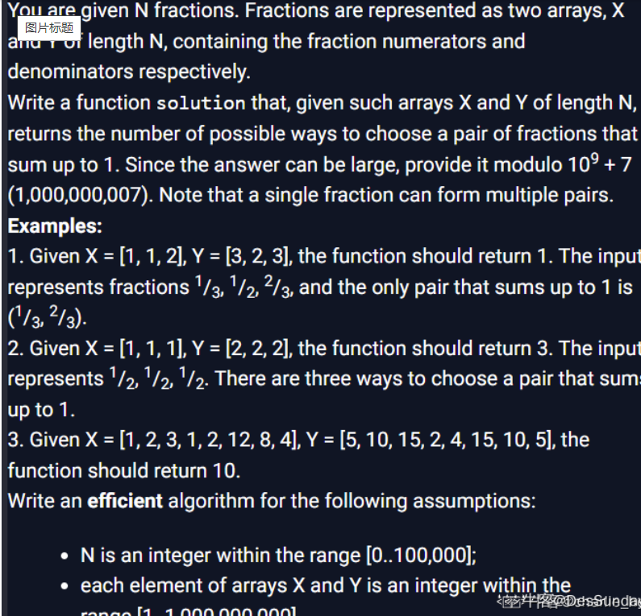


````java
作者：DesSunday
链接：https://www.nowcoder.com/discuss/1013687?type=all&order=recall&pos=&page=1&ncTraceId=&channel=-1&source_id=search_all_nctrack
来源：牛客网

public int solution(int[] X, int[] Y) {
    // write your code in Java 8 (Java SE 8)
    int mod = (int) (1e9 + 7);
    int n = X.length;
    long res = 0;
    Map<Integer, Map<Integer, Integer>> map = new HashMap<>();
    for (int i = 0; i < n; i++) {
        int gcg = gcd(X[i], Y[i]);
        int up = X[i] / gcg;
        int down = Y[i] / gcg;
        Map<Integer, Integer> curMap = map.computeIfAbsent(down, k -> new HashMap<>());
        //hashmap.computeIfAbsent(K key, Function remappingFunction)
        //如果 key 对应的 value 不存在，则使用获取 remappingFunction 重新计算后的值，并保存为该 key 的 value，否则返回 value。
        res = (res + curMap.getOrDefault(down - up, 0)) % mod;
        curMap.put(up, curMap.getOrDefault(up, 0) + 1);
    }
    return (int) res;
}
 
public int gcd(int a, int b) {
    if (b == 0) return a;
    return gcd(b, a % b);
}
````

分析

1. 约分的作用；**两个**能相**加为1的数**，约分后分母相同~ 自己举几个例子，不明显说实话
2. Map<Integer, Integer> curMap = map.computeIfAbsent(down, k -> new HashMap<>());
   1. 为每个分母创建一个map，如果尚未创建

## 网易伏羲雷火

总结一下：不是太好

网易雷火伏羲

第一题，ak了，但是花了太多时间

第二题，输入n ， 求(0,n] 中含有25的数的个数

- 暴力能过 80%！
- https://www.nowcoder.com/discuss/1014542?type=post&order=create&pos=&page=1&ncTraceId=&channel=-1&source_id=search_post_nctrack

第三题打表就3个case！

- - 但你没时间看
